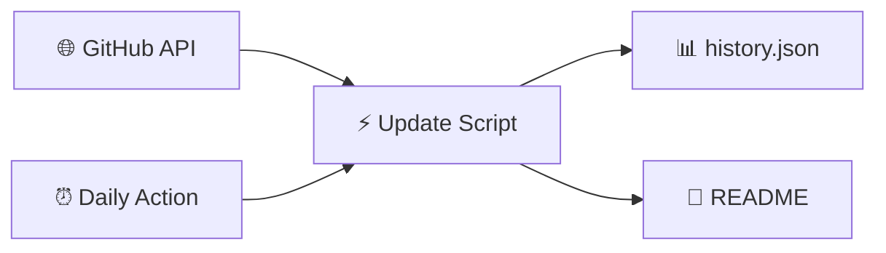

<!-- Static README shell — ranking tables are injected by Update-ParadiseFeed.ps1 -->

<div align="center">

<!-- Banner: committed PNG (reliable on GitHub — no external CDN) -->


<br/>

[](https://github.com/btstevens1984az/powershell-paradise/actions/workflows/daily-update.yml)
[](https://learn.microsoft.com/powershell/)
[](https://github.com/btstevens1984az/powershell-paradise/actions)
[](LICENSE)

<br/><br/>

<!-- PARADISE:STATS:START -->
<table align="center">
<tr>
<td align="center" width="25%">
<br/>
<h3>📅 Today</h3>
<h2>15</h2>
<sub>trending movers</sub>
<br/><br/>
</td>
<td align="center" width="25%">
<br/>
<h3>📆 This Week</h3>
<h2>15</h2>
<sub>new repos</sub>
<br/><br/>
</td>
<td align="center" width="25%">
<br/>
<h3>🗓️ This Month</h3>
<h2>15</h2>
<sub>new repos</sub>
<br/><br/>
</td>
<td align="center" width="25%">
<br/>
<h3>📈 This Year</h3>
<h2>15</h2>
<sub>new repos</sub>
<br/><br/>
</td>
</tr>
</table>
<!-- PARADISE:STATS:END -->

<br/>

<!-- PARADISE:META:START -->
[](https://github.com/btstevens1984az/powershell-paradise)
&nbsp;
[](https://github.com/btstevens1984az/powershell-paradise/actions)
&nbsp;
[](https://github.com/btstevens1984az/powershell-paradise)
&nbsp;
[](https://github.com/btstevens1984az/powershell-paradise)
<!-- PARADISE:META:END -->

</div>

---

## 📡 Welcome to the Paradise

> **PowerShell Paradise** is your cozy corner of GitHub for staying current — a living leaderboard that refreshes every morning with the hottest PowerShell projects, modules, and tools the community is starring right now.

<table>
<tr>
<td width="50%" valign="top">

### 🌊 What you'll find

| Window | The vibe |
|:------:|:---------|
| 🔥 **Today** | Star velocity — what's climbing *right now* |
| 📆 **Week** | Fresh repos from the last 7 days |
| 🗓️ **Month** | Standouts from the last 30 days |
| 📈 **Year** | The year's best new PowerShell repos |

</td>
<td width="50%" valign="top">

### 🧭 Jump around

| Go to | Section |
|:-----:|:--------|
| 🔥 | [Today's Top Movers](#-todays-top-movers) |
| 📆 | [This Week](#-this-weeks-top-repositories) |
| 🗓️ | [This Month](#️-this-months-top-repositories) |
| 📈 | [This Year](#-this-years-top-repositories) |
| ⚙️ | [How It Works](#️-how-it-works) |

</td>
</tr>
</table>

---

## 🔥 Today's Top Movers

[](https://github.com/btstevens1984az/powershell-paradise#-todays-top-movers)

> Repos with the biggest **star gains** since the last refresh. First run shows recently active repos instead.

<!-- PARADISE:TODAY:START -->
| # | Project | ⭐ Stars | 🍴 Forks | About | 🕐 Updated |
|:-:|---------|----------:|----------:|-------|------------|
| 🥇 |  &nbsp;**[Extras](https://github.com/ScoopInstaller/Extras)**<br/><sub><code>ScoopInstaller/Extras</code></sub> | **2.1k** | 1.7k | 📦 The Extras bucket for Scoop.<br/> `hacktoberfest`  `scoop` | 33m ago |
| 🥈 |  &nbsp;**[Main](https://github.com/ScoopInstaller/Main)**<br/><sub><code>ScoopInstaller/Main</code></sub> | **1.9k** | 1.2k | 📦 The default bucket for Scoop.<br/> `scoop`  `scoop-apps` | 34m ago |
| 🥉 |  &nbsp;**[RedXFreeSteamInstaller](https://github.com/Scriptez1/RedXFreeSteamInstaller)**<br/><sub><code>Scriptez1/RedXFreeSteamInstaller</code></sub> | **1.4k** | 17 | It allows you to automatically add all free and paid games and DLCs to your Steam accou…<br/> `bedavasteam`  `dokuman-tv` | 5m ago |
| **4** |  &nbsp;**[dorado](https://github.com/chawyehsu/dorado)**<br/><sub><code>chawyehsu/dorado</code></sub> | **1.2k** | 109 | 🐟 Yet Another bucket for lovely Scoop<br/> `blockchain`  `devtools` | 1h ago |
| **5** |  &nbsp;**[MicrosoftTeams-msinternal](https://github.com/ItzLevvie/MicrosoftTeams-msinternal)**<br/><sub><code>ItzLevvie/MicrosoftTeams-msinternal</code></sub> | **539** | 34 | This project was created from PowerShell which allows people to download the latest int…<br/> `edge`  `electron` | 30m ago |
| **6** |  &nbsp;**[power-platform](https://github.com/MicrosoftDocs/power-platform)**<br/><sub><code>MicrosoftDocs/power-platform</code></sub> | **503** | 689 | Documentation for Microsoft Power Platform | 34m ago |
| **7** |  &nbsp;**[chocolatey-packages](https://github.com/chocolatey-community/chocolatey-packages)**<br/><sub><code>chocolatey-community/chocolatey-packages</code></sub> | **477** | 398 | Chocolatey Community Maintainers Team Packages - packages that are managed and maintain…<br/> `hacktoberfest` | 1h ago |
| **8** |  &nbsp;**[AdBlock_Rule_For_Clash](https://github.com/REIJI007/AdBlock_Rule_For_Clash)**<br/><sub><code>REIJI007/AdBlock_Rule_For_Clash</code></sub> | **349** | 14 | 适用于Clash（premium核心与mihomo核心）的广告域名拦截RULE-SET规则集，每20分钟更新一次<br/> `adblock`  `clash` | 1h ago |
| **9** |  &nbsp;**[Sampler](https://github.com/gaelcolas/Sampler)**<br/><sub><code>gaelcolas/Sampler</code></sub> | **237** | 47 | Module template with build pipeline and examples, including DSC elements.<br/> `automation`  `continuous-delivery` | 33m ago |
| **10** |  &nbsp;**[microsoft-graph-docs-contrib](https://github.com/microsoftgraph/microsoft-graph-docs-contrib)**<br/><sub><code>microsoftgraph/microsoft-graph-docs-contrib</code></sub> | **142** | 513 | Documentation for the Microsoft Graph REST API | 1m ago |
| **11** |  &nbsp;**[AdBlock_Rule_For_Sing-box](https://github.com/REIJI007/AdBlock_Rule_For_Sing-box)**<br/><sub><code>REIJI007/AdBlock_Rule_For_Sing-box</code></sub> | **142** | 20 | 适用于Sing-box的广告域名拦截RULE-SET规则集，每20分钟更新一次<br/> `adblock`  `route` | 25m ago |
| **12** |  &nbsp;**[Blue_Team_Hunting_Field_Notes](https://github.com/bitbug0x55AA/Blue_Team_Hunting_Field_Notes)**<br/><sub><code>bitbug0x55AA/Blue_Team_Hunting_Field_Notes</code></sub> | **101** | 19 | My external brain for cyber defense (WIP).  A practical collection of field notes on hu… | 25m ago |
| **13** |  &nbsp;**[Universal-Intel-WiFi-BT-Updater](https://github.com/FirstEverTech/Universal-Intel-WiFi-BT-Updater)**<br/><sub><code>FirstEverTech/Universal-Intel-WiFi-BT-Updater</code></sub> | **92** | 3 | Security-focused tool for automatic Intel Wi-Fi & Bluetooth driver detection and instal…<br/> `automation`  `bluetooth` | 10m ago |
| **14** |  &nbsp;**[Office16](https://github.com/ItzLevvie/Office16)**<br/><sub><code>ItzLevvie/Office16</code></sub> | **68** | 6 | This project was created from PowerShell which shows internal and external branches of …<br/> `microsoft`  `microsoft-office` | 28m ago |
| **15** |  &nbsp;**[BT_BAN](https://github.com/Oniicyan/BT_BAN)**<br/><sub><code>Oniicyan/BT_BAN</code></sub> | **57** | 0 | — | 16m ago |
<!-- PARADISE:TODAY:END -->

---

## 📆 This Week's Top Repositories

[](https://github.com/btstevens1984az/powershell-paradise#-this-weeks-top-repositories)

> PowerShell repos **created in the last 7 days**, ranked by total stars.

<!-- PARADISE:WEEK:START -->
| # | Project | ⭐ Stars | 🍴 Forks | About | 🕐 Updated |
|:-:|---------|----------:|----------:|-------|------------|
| 🥇 |  &nbsp;**[ritual-agent-deployment](https://github.com/zunmax/ritual-agent-deployment)**<br/><sub><code>zunmax/ritual-agent-deployment</code></sub> | **71** | 49 | Deploy a recurring, self-funding sovereign AI agent on Ritual testnet with one command.<br/> `ai-agent`  `ritual-testnet` | 4d ago |
| 🥈 |  &nbsp;**[fluencer-predict-track](https://github.com/wzj998/fluencer-predict-track)**<br/><sub><code>wzj998/fluencer-predict-track</code></sub> | **24** | 9 | 投资大V合订本：追踪投资大V历史预测，并用公开数据验证准确性<br/> `chrome-cdp`  `codex-skill` | 4d ago |
| 🥉 |  &nbsp;**[cc-unlock](https://github.com/JacksonTai2007/cc-unlock)**<br/><sub><code>JacksonTai2007/cc-unlock</code></sub> | **16** | 0 | — | 2d ago |
| **4** |  &nbsp;**[SecretoBoot-Enterprise](https://github.com/mohamedlalah/SecretoBoot-Enterprise)**<br/><sub><code>mohamedlalah/SecretoBoot-Enterprise</code></sub> | **11** | 0 | Professional Dual Boot Manager for Windows 11 and Google TV powered by rEFInd.<br/> `bootloader`  `dualboot` | 5d ago |
| **5** |  &nbsp;**[SpicetifyManager](https://github.com/Isralechee/SpicetifyManager)**<br/><sub><code>Isralechee/SpicetifyManager</code></sub> | **9** | 0 | PowerShell menu-driven manager for Spicetify + Spotify — one-click auto apply, full res…<br/> `batch`  `cli` | 2d ago |
| **6** |  &nbsp;**[latex-paper-writer-skill](https://github.com/xu0106/latex-paper-writer-skill)**<br/><sub><code>xu0106/latex-paper-writer-skill</code></sub> | **9** | 1 | — | 6d ago |
| **7** |  &nbsp;**[Agent-AND](https://github.com/adlptv/Agent-AND)**<br/><sub><code>adlptv/Agent-AND</code></sub> | **9** | 1 | — | 2d ago |
| **8** |  &nbsp;**[ai-notify](https://github.com/Helias/ai-notify)**<br/><sub><code>Helias/ai-notify</code></sub> | **8** | 0 | — | 5d ago |
| **9** |  &nbsp;**[osint-agent-skills](https://github.com/frangelbarrera/osint-agent-skills)**<br/><sub><code>frangelbarrera/osint-agent-skills</code></sub> | **8** | 2 | OSINT knowledge base + MCP server for autonomous AI agents — Claude Code, Cursor, recon…<br/> `ai-agent`  `autonomous-agents` | 1d ago |
| **10** |  &nbsp;**[Splitter](https://github.com/steviecoaster/Splitter)**<br/><sub><code>steviecoaster/Splitter</code></sub> | **7** | 2 | Split a Windows Operating System ISO into smaller, edition-specific ISO files. | 1d ago |
| **11** |  &nbsp;**[PSDiaryAI](https://github.com/dfinke/PSDiaryAI)**<br/><sub><code>dfinke/PSDiaryAI</code></sub> | **6** | 3 | Capture timestamped Markdown diary notes from PowerShell, then use AI to connect, searc…<br/> `ai`  `diary` | 6d ago |
| **12** |  &nbsp;**[foxit-skills](https://github.com/qiaohuaruan/foxit-skills)**<br/><sub><code>qiaohuaruan/foxit-skills</code></sub> | **6** | 0 | Model Context Protocol (MCP) framework for enterprise desktop skills. | 2d ago |
| **13** |  &nbsp;**[codex-lark-deliver](https://github.com/derrickgong87/codex-lark-deliver)**<br/><sub><code>derrickgong87/codex-lark-deliver</code></sub> | **6** | 1 | Codex Skill for Feishu/Lark completion notices and file-body delivery. | 3d ago |
| **14** |  &nbsp;**[opencode-draw-free](https://github.com/mathruffian-dot/opencode-draw-free)**<br/><sub><code>mathruffian-dot/opencode-draw-free</code></sub> | **6** | 0 | 免費 AI 生圖技能 for OpenCode/Claude Code — 零 API Key、零 Python、零 GPU，只要 Windows PowerShell + … | 5d ago |
| **15** |  &nbsp;**[open-wepig-skills](https://github.com/wepigcn/open-wepig-skills)**<br/><sub><code>wepigcn/open-wepig-skills</code></sub> | **6** | 0 | wepig saas open skills | 3d ago |
<!-- PARADISE:WEEK:END -->

---

## 🗓️ This Month's Top Repositories

[](https://github.com/btstevens1984az/powershell-paradise#%EF%B8%8F-this-months-top-repositories)

> PowerShell repos **created in the last 30 days**, ranked by total stars.

<!-- PARADISE:MONTH:START -->
| # | Project | ⭐ Stars | 🍴 Forks | About | 🕐 Updated |
|:-:|---------|----------:|----------:|-------|------------|
| 🥇 |  &nbsp;**[EasySSDTester](https://github.com/CWS6206/EasySSDTester)**<br/><sub><code>CWS6206/EasySSDTester</code></sub> | **142** | 36 | Easy SSD Tester - Portable Windows 11 utility for checking SSD health, SMART data and s… | 13d ago |
| 🥈 |  &nbsp;**[lceda-operation-notes](https://github.com/TigerBruce/lceda-operation-notes)**<br/><sub><code>TigerBruce/lceda-operation-notes</code></sub> | **128** | 20 | — | 26d ago |
| 🥉 |  &nbsp;**[ralph](https://github.com/SantanderAI/ralph)**<br/><sub><code>SantanderAI/ralph</code></sub> | **81** | 23 | A configurable Bash/PowerShell loop that runs an AI coding CLI with a fresh session eac…<br/> `agent`  `agentic` | 2d ago |
| **4** |  &nbsp;**[ritual-agent-deployment](https://github.com/zunmax/ritual-agent-deployment)**<br/><sub><code>zunmax/ritual-agent-deployment</code></sub> | **71** | 49 | Deploy a recurring, self-funding sovereign AI agent on Ritual testnet with one command.<br/> `ai-agent`  `ritual-testnet` | 4d ago |
| **5** |  &nbsp;**[ios27-beta-indexing-progress-windows](https://github.com/CZJ0219/ios27-beta-indexing-progress-windows)**<br/><sub><code>CZJ0219/ios27-beta-indexing-progress-windows</code></sub> | **63** | 3 | iOS 27 Beta Indexing Progress Percentage Checker for Windows | 6d ago |
| **6** |  &nbsp;**[claude-code-desktop-offline](https://github.com/xqnode/claude-code-desktop-offline)**<br/><sub><code>xqnode/claude-code-desktop-offline</code></sub> | **59** | 0 | Claude Code 桌面版离线安装包 | 28d ago |
| **7** |  &nbsp;**[HumanAI](https://github.com/MADEVAL/HumanAI)**<br/><sub><code>MADEVAL/HumanAI</code></sub> | **53** | 18 | AI skill for rewriting machine-generated text to sound human-written across 9 languages…<br/> `ai`  `anti-ai` | 2d ago |
| **8** |  &nbsp;**[BraveControl](https://github.com/xdoofy92/BraveControl)**<br/><sub><code>xdoofy92/BraveControl</code></sub> | **45** | 0 | BraveControl desactiva funciones innecesarias de Brave para ofrecer una experiencia lig… | 16d ago |
| **9** |  &nbsp;**[soplint](https://github.com/zaxardery8011-design/soplint)**<br/><sub><code>zaxardery8011-design/soplint</code></sub> | **43** | 11 | —<br/> `agent-reliability`  `ai-agents` | 22d ago |
| **10** |  &nbsp;**[ctf-codex](https://github.com/ypyik0669/ctf-codex)**<br/><sub><code>ypyik0669/ctf-codex</code></sub> | **43** | 15 | 面向 Codex 的社区安全审计 Skill：用于授权 CTF、上线前安全检查、项目加固和 AI 安全报告整理 | 19d ago |
| **11** |  &nbsp;**[EDRUnChoker](https://github.com/sbousseaden/EDRUnChoker)**<br/><sub><code>sbousseaden/EDRUnChoker</code></sub> | **42** | 3 | EDRUnChoker - fileless WMI defense that removes EDRChoker QoS throttling policies | 24d ago |
| **12** |  &nbsp;**[Terminal-GIF-Player](https://github.com/VanillaNahida/Terminal-GIF-Player)**<br/><sub><code>VanillaNahida/Terminal-GIF-Player</code></sub> | **41** | 3 | Play GIF animations in Windows terminal, with background music, lyric synchronization, …<br/> `animation`  `powershell` | 25d ago |
| **13** |  &nbsp;**[Visio-copy](https://github.com/zwj276765037-lab/Visio-copy)**<br/><sub><code>zwj276765037-lab/Visio-copy</code></sub> | **37** | 5 | — | 18d ago |
| **14** |  &nbsp;**[codex-windows-bundled-plugin-repair](https://github.com/Gyratingice-blip/codex-windows-bundled-plugin-repair)**<br/><sub><code>Gyratingice-blip/codex-windows-bundled-plugin-repair</code></sub> | **36** | 2 | Repair Codex Desktop bundled Chrome and Computer Use plugins on Windows. | 12d ago |
| **15** |  &nbsp;**[codex-desktop-doctor-skill](https://github.com/navi118/codex-desktop-doctor-skill)**<br/><sub><code>navi118/codex-desktop-doctor-skill</code></sub> | **36** | 0 | Codex Skill for diagnosing Chrome and Computer Use failures in Codex Desktop on Windows. | 3d ago |
<!-- PARADISE:MONTH:END -->

---

## 📈 This Year's Top Repositories

[](https://github.com/btstevens1984az/powershell-paradise#-this-years-top-repositories)

> PowerShell repos **created since January 1**, ranked by total stars.

<!-- PARADISE:YEAR:START -->
| # | Project | ⭐ Stars | 🍴 Forks | About | 🕐 Updated |
|:-:|---------|----------:|----------:|-------|------------|
| 🥇 |  &nbsp;**[reverse-skill](https://github.com/zhaoxuya520/reverse-skill)**<br/><sub><code>zhaoxuya520/reverse-skill</code></sub> | **7.2k** | 1.1k | Reverse Engineering / Authorized Penetration Testing / Security Research Skill Router P… | 4d ago |
| 🥈 |  &nbsp;**[claude-desktop-zh-cn](https://github.com/javaht/claude-desktop-zh-cn)**<br/><sub><code>javaht/claude-desktop-zh-cn</code></sub> | **4.4k** | 223 | Claude Desktop Chinese Patch (macOS & Windows) | 13h ago |
| 🥉 |  &nbsp;**[CodexGuide](https://github.com/freestylefly/CodexGuide)**<br/><sub><code>freestylefly/CodexGuide</code></sub> | **2.4k** | 239 | CodexGuide：面向全球初学者、创作者、开发者与团队的 Codex 实践指南 | 14h ago |
| **4** |  &nbsp;**[WindowsDeveloperConfig](https://github.com/microsoft/WindowsDeveloperConfig)**<br/><sub><code>microsoft/WindowsDeveloperConfig</code></sub> | **1.7k** | 131 | Automate the setup and configuration of your Windows development environment. | 13d ago |
| **5** |  &nbsp;**[selfware.md](https://github.com/floatboatai/selfware.md)**<br/><sub><code>floatboatai/selfware.md</code></sub> | **1.1k** | 95 | — | 117d ago |
| **6** |  &nbsp;**[work-iq](https://github.com/microsoft/work-iq)**<br/><sub><code>microsoft/work-iq</code></sub> | **921** | 102 | MCP Server and CLI for accessing Work IQ | 2d ago |
| **7** |  &nbsp;**[get-shit-done-for-antigravity](https://github.com/toonight/get-shit-done-for-antigravity)**<br/><sub><code>toonight/get-shit-done-for-antigravity</code></sub> | **896** | 140 | — | 92d ago |
| **8** |  &nbsp;**[commands](https://github.com/GuDaStudio/commands)**<br/><sub><code>GuDaStudio/commands</code></sub> | **883** | 50 | — | 147d ago |
| **9** |  &nbsp;**[codex-windows-fast-patch-skill](https://github.com/chen0416ccc-cpu/codex-windows-fast-patch-skill)**<br/><sub><code>chen0416ccc-cpu/codex-windows-fast-patch-skill</code></sub> | **850** | 87 | 此skills用于指导智能体在 Windows 上恢复 Codex Desktop 升级后失效的本地补丁和能力开关。（Computer Use，插件，破限，codex强制汉化… | 9h ago |
| **10** |  &nbsp;**[PsiphonOverMITM](https://github.com/B3hnamR/PsiphonOverMITM)**<br/><sub><code>B3hnamR/PsiphonOverMITM</code></sub> | **548** | 79 | — | 50d ago |
| **11** |  &nbsp;**[PrivHound](https://github.com/dazzyddos/PrivHound)**<br/><sub><code>dazzyddos/PrivHound</code></sub> | **503** | 47 | A BloodHound OpenGraph collector that models Windows local privilege escalation as inte… | 67d ago |
| **12** |  &nbsp;**[ai-business-skills](https://github.com/minhnv0807/ai-business-skills)**<br/><sub><code>minhnv0807/ai-business-skills</code></sub> | **483** | 206 | 63 bilingual AI marketing skills (31 VN + 31 Global) for Claude Code, OpenCode, Codex, …<br/> `agent-skills`  `ai-agents` | 13d ago |
| **13** |  &nbsp;**[Bonsai-Image-Demo](https://github.com/PrismML-Eng/Bonsai-Image-Demo)**<br/><sub><code>PrismML-Eng/Bonsai-Image-Demo</code></sub> | **464** | 63 | Generate images locally<br/> `1-bit`  `bonsai` | 19d ago |
| **14** |  &nbsp;**[Light-Help](https://github.com/Cotton059/Light-Help)**<br/><sub><code>Cotton059/Light-Help</code></sub> | **453** | 209 | Help the audience perform some complex operations. | 13d ago |
| **15** |  &nbsp;**[WinUtil_CN](https://github.com/constansino/WinUtil_CN)**<br/><sub><code>constansino/WinUtil_CN</code></sub> | **447** | 56 | WinUtil_CN：Chris Titus Tech WinUtil 中文汉化版，提供 WinUtil 中文界面、中文说明、Tweaks 中文解释与 Win11ISO 中文支持<br/> `chinese`  `chris-titus-tech` | 49d ago |
<!-- PARADISE:YEAR:END -->

---

## ⚙️ How It Works



| Step | What happens |
|:----:|:-------------|
| 1️⃣ | Query GitHub for `language:powershell` repos with real activity |
| 2️⃣ | Compare star counts to yesterday's snapshot for velocity |
| 3️⃣ | Build four bubbly ranking tables — top 15 each |
| 4️⃣ | Auto-commit back to this README every morning at 06:00 UTC |

<details>
<summary><b>🛠️ Run locally</b></summary>

```powershell
$env:GITHUB_TOKEN = 'ghp_your_token'   # optional — higher API limits
./scripts/Update-ParadiseFeed.ps1
```

</details>

<details>
<summary><b>🔍 Filters applied</b></summary>

- Language: **PowerShell** · Forks excluded · Minimum **3 stars** · Top **15** per table

</details>

---

## 🌟 Why star this repo?

<table>
<tr>
<td align="center">😴<br/><b>Zero effort</b><br/><sub>Updates while you sleep</sub></td>
<td align="center">📡<br/><b>Community signal</b><br/><sub>See what builders love</sub></td>
<td align="center">🎓<br/><b>Learning radar</b><br/><sub>Find modules worth studying</sub></td>
<td align="center">🔓<br/><b>Open source</b><br/><sub>Fork &amp; adapt freely</sub></td>
</tr>
</table>

---

## 📜 License

MIT — see [LICENSE](LICENSE).

---

<div align="center">

**Built with ❤️ for the PowerShell community**

*Star this repo to get daily trending PowerShell projects in your GitHub feed.*

</div>
