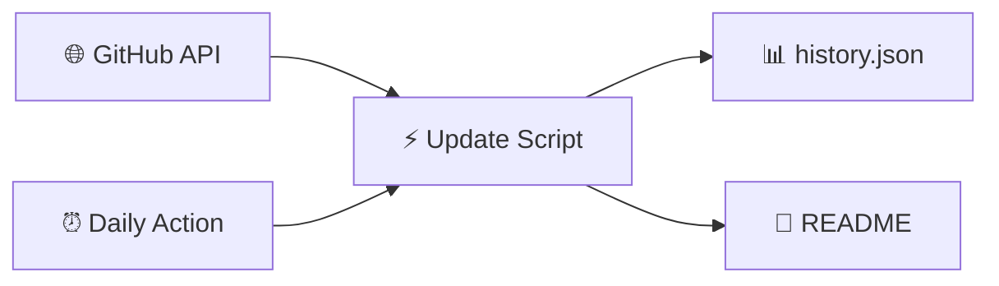

<!-- Static README shell — ranking tables are injected by Update-ParadiseFeed.ps1 -->

<div align="center">

<!-- Banner: committed PNG (reliable on GitHub — no external CDN) -->


<br/>

[](https://github.com/btstevens1984az/powershell-paradise/actions/workflows/daily-update.yml)
[](https://learn.microsoft.com/powershell/)
[](https://github.com/btstevens1984az/powershell-paradise/actions)
[](LICENSE)

<br/><br/>

<!-- PARADISE:STATS:START -->
<table align="center">
<tr>
<td align="center" width="25%">
<br/>
<h3>📅 Today</h3>
<h2>15</h2>
<sub>trending movers</sub>
<br/><br/>
</td>
<td align="center" width="25%">
<br/>
<h3>📆 This Week</h3>
<h2>15</h2>
<sub>new repos</sub>
<br/><br/>
</td>
<td align="center" width="25%">
<br/>
<h3>🗓️ This Month</h3>
<h2>15</h2>
<sub>new repos</sub>
<br/><br/>
</td>
<td align="center" width="25%">
<br/>
<h3>📈 This Year</h3>
<h2>15</h2>
<sub>new repos</sub>
<br/><br/>
</td>
</tr>
</table>
<!-- PARADISE:STATS:END -->

<br/>

<!-- PARADISE:META:START -->
<p align="center"><sub>🕐 <strong>Last refreshed:</strong> Friday, July 10, 2026 · 18:47 UTC · <a href="https://github.com/btstevens1984az/powershell-paradise/actions/workflows/daily-update.yml">GitHub Actions</a></sub></p>

[](https://github.com/btstevens1984az/powershell-paradise)
&nbsp;
[](https://github.com/btstevens1984az/powershell-paradise/actions)
&nbsp;
[](https://github.com/btstevens1984az/powershell-paradise)
&nbsp;
[](https://github.com/btstevens1984az/powershell-paradise)
<!-- PARADISE:META:END -->

</div>

---

## 📡 Welcome to the Paradise

> **PowerShell Paradise** is your cozy corner of GitHub for staying current — a living leaderboard that refreshes every morning with the hottest PowerShell projects, modules, and tools the community is starring right now.

<table>
<tr>
<td width="50%" valign="top">

### 🌊 What you'll find

| Window | The vibe |
|:------:|:---------|
| 🔥 **Today** | Star velocity — what's climbing *right now* |
| 📆 **Week** | Fresh repos from the last 7 days |
| 🗓️ **Month** | Standouts from the last 30 days |
| 📈 **Year** | The year's best new PowerShell repos |

</td>
<td width="50%" valign="top">

### 🧭 Jump around

| Go to | Section |
|:-----:|:--------|
| 🔥 | [Today's Top Movers](#-todays-top-movers) |
| 📆 | [This Week](#-this-weeks-top-repositories) |
| 🗓️ | [This Month](#️-this-months-top-repositories) |
| 📈 | [This Year](#-this-years-top-repositories) |
| ⚙️ | [How It Works](#️-how-it-works) |

</td>
</tr>
</table>

---

## 🔥 Today's Top Movers

[](https://github.com/btstevens1984az/powershell-paradise#-todays-top-movers)

> Repos with the biggest **star gains** since the last refresh. First run shows recently active repos instead.

<!-- PARADISE:TODAY:START -->
| # | Project | ⭐ Stars | 🍴 Forks | About | 🕐 Updated |
|:-:|---------|----------:|----------:|-------|------------|
| 🥇 |  &nbsp;**[winutil](https://github.com/ChrisTitusTech/winutil)**<br/><sub><code>ChrisTitusTech/winutil</code></sub> | **57.5k** | 3.3k | Chris Titus Tech's Windows Utility - Install Programs, Tweaks, Fixes, and Updates | 3h ago |
| 🥈 |  &nbsp;**[runner-images](https://github.com/actions/runner-images)**<br/><sub><code>actions/runner-images</code></sub> | **12.9k** | 3.8k | GitHub Actions runner images | 5h ago |
| 🥉 |  &nbsp;**[reverse-skill](https://github.com/zhaoxuya520/reverse-skill)**<br/><sub><code>zhaoxuya520/reverse-skill</code></sub> | **7.9k** | 1.2k | Reverse Engineering / Authorized Penetration Testing / Security Research Skill Router P… | 9h ago |
| **4** |  &nbsp;**[Pester](https://github.com/pester/Pester)**<br/><sub><code>pester/Pester</code></sub> | **3.3k** | 477 | Pester is the ubiquitous test and mock framework for PowerShell.<br/> `assertions`  `bdd` | 3h ago |
| **5** |  &nbsp;**[psmux](https://github.com/psmux/psmux)**<br/><sub><code>psmux/psmux</code></sub> | **2.9k** | 172 | Tmux on Windows Powershell - tmux for PowerShell, Windows Terminal, cmd.exe. Includes p…<br/> `cli`  `powershell` | 33m ago |
| **6** |  &nbsp;**[dbatools](https://github.com/dataplat/dbatools)**<br/><sub><code>dataplat/dbatools</code></sub> | **2.8k** | 867 | 🚀 SQL Server automation and instance migrations have never been safer, faster or freer<br/> `backup`  `best-practices` | 57m ago |
| **7** |  &nbsp;**[ScubaGear](https://github.com/cisagov/ScubaGear)**<br/><sub><code>cisagov/ScubaGear</code></sub> | **2.6k** | 367 | Automation to assess the state of your M365 tenant against CISA's baselines<br/> `assessment-tool`  `cisa` | 9m ago |
| **8** |  &nbsp;**[PowerShell-Docs](https://github.com/MicrosoftDocs/PowerShell-Docs)**<br/><sub><code>MicrosoftDocs/PowerShell-Docs</code></sub> | **2.5k** | 1.7k | The official PowerShell documentation sources<br/> `hacktoberfest`  `powershell` | 7h ago |
| **9** |  &nbsp;**[Microsoft365DSC](https://github.com/Microsoft365DSC/Microsoft365DSC)**<br/><sub><code>Microsoft365DSC/Microsoft365DSC</code></sub> | **2.3k** | 665 | Manages, configures, extracts and monitors Microsoft 365 tenant configurations<br/> `azuread`  `configuration-as-code` | 6h ago |
| **10** |  &nbsp;**[Extras](https://github.com/ScoopInstaller/Extras)**<br/><sub><code>ScoopInstaller/Extras</code></sub> | **2.1k** | 1.7k | 📦 The Extras bucket for Scoop.<br/> `hacktoberfest`  `scoop` | 2h ago |
| **11** |  &nbsp;**[architecture-center](https://github.com/MicrosoftDocs/architecture-center)**<br/><sub><code>MicrosoftDocs/architecture-center</code></sub> | **2k** | 1.8k | Open source documentation for the Azure Architecture Center on Microsoft Learn.<br/> `architecture`  `azure` | 1h ago |
| **12** |  &nbsp;**[Main](https://github.com/ScoopInstaller/Main)**<br/><sub><code>ScoopInstaller/Main</code></sub> | **1.9k** | 1.2k | 📦 The default bucket for Scoop.<br/> `scoop`  `scoop-apps` | 2h ago |
| **13** |  &nbsp;**[WindowsDeveloperConfig](https://github.com/microsoft/WindowsDeveloperConfig)**<br/><sub><code>microsoft/WindowsDeveloperConfig</code></sub> | **1.8k** | 135 | Automate the setup and configuration of your Windows development environment. | 18h ago |
| **14** |  &nbsp;**[RedXFreeSteamInstaller](https://github.com/Scriptez1/RedXFreeSteamInstaller)**<br/><sub><code>Scriptez1/RedXFreeSteamInstaller</code></sub> | **1.5k** | 18 | It allows you to automatically add all free and paid games and DLCs to your Steam accou…<br/> `bedavasteam`  `dokuman-tv` | 7m ago |
| **15** |  &nbsp;**[CSS-Exchange](https://github.com/microsoft/CSS-Exchange)**<br/><sub><code>microsoft/CSS-Exchange</code></sub> | **1.3k** | 392 | Exchange Server support tools and scripts | 22m ago |
<!-- PARADISE:TODAY:END -->

---

## 📆 This Week's Top Repositories

[](https://github.com/btstevens1984az/powershell-paradise#-this-weeks-top-repositories)

> PowerShell repos **created in the last 7 days**, ranked by total stars.

<!-- PARADISE:WEEK:START -->
| # | Project | ⭐ Stars | 🍴 Forks | About | 🕐 Updated |
|:-:|---------|----------:|----------:|-------|------------|
| 🥇 |  &nbsp;**[WinTrash](https://github.com/hasoftware/WinTrash)**<br/><sub><code>hasoftware/WinTrash</code></sub> | **146** | 19 | All-in-one PowerShell toolkit that scans 16 types of Windows app leftovers (dead PATH e…<br/> `cleaner`  `cleanup` | 1d ago |
| 🥈 |  &nbsp;**[IntuneToolKit](https://github.com/CYEBRSYSTEM-AliAlame/IntuneToolKit)**<br/><sub><code>CYEBRSYSTEM-AliAlame/IntuneToolKit</code></sub> | **83** | 21 | — | 6d ago |
| 🥉 |  &nbsp;**[Firestone2Green](https://github.com/Mer3y1338/Firestone2Green)**<br/><sub><code>Mer3y1338/Firestone2Green</code></sub> | **79** | 11 | 🟢 Firestone2Green — Windows one-click Firestone / Overwolf local recovery tool with au…<br/> `authorization-repair`  `avatar-repair` | 2h ago |
| **4** |  &nbsp;**[no-gdid](https://github.com/Korben00/no-gdid)**<br/><sub><code>Korben00/no-gdid</code></sub> | **43** | 6 | Read, understand and silence the Windows GDID device identifier (the ID that tracked a … | 2d ago |
| **5** |  &nbsp;**[go_darker](https://github.com/mr-r3b00t/go_darker)**<br/><sub><code>mr-r3b00t/go_darker</code></sub> | **36** | 0 | A windows telemetry hardening script, use at own risk | 4d ago |
| **6** |  &nbsp;**[claude-desktop-zh-simple](https://github.com/GMYXDS/claude-desktop-zh-simple)**<br/><sub><code>GMYXDS/claude-desktop-zh-simple</code></sub> | **26** | 0 | Claude Desktop 中文轻量汉化脚本，支持 Claude 最新版本，只会替换相关英文.json文件 | 18h ago |
| **7** |  &nbsp;**[Windows-GDID-Changer](https://github.com/gd03gd031/Windows-GDID-Changer)**<br/><sub><code>gd03gd031/Windows-GDID-Changer</code></sub> | **26** | 5 | A script that requests the generation of a new GDID from Microsoft servers and assigns … | 2d ago |
| **8** |  &nbsp;**[GDID-Disabler](https://github.com/SmtimesIWndr/GDID-Disabler)**<br/><sub><code>SmtimesIWndr/GDID-Disabler</code></sub> | **25** | 3 | — | 4d ago |
| **9** |  &nbsp;**[aicxd-skills](https://github.com/aicxd/aicxd-skills)**<br/><sub><code>aicxd/aicxd-skills</code></sub> | **14** | 1 | AI Skills I use daily — open-sourced | 7d ago |
| **10** |  &nbsp;**[gdid-guard](https://github.com/rroy676/gdid-guard)**<br/><sub><code>rroy676/gdid-guard</code></sub> | **11** | 1 | Audit and reduce Windows GDID/CDP device-graph exposure — includes snapshot/compare and…<br/> `cdp`  `device-fingerprinting` | 3d ago |
| **11** |  &nbsp;**[CODEV](https://github.com/TerminusAkivili/CODEV)**<br/><sub><code>TerminusAkivili/CODEV</code></sub> | **11** | 1 | A lightweight Human Accountability Harness for AI-assisted software development. CO-DEV… | 9h ago |
| **12** |  &nbsp;**[AD-Assessment-PowerShell-Script](https://github.com/Mohamed-Zeghlache/AD-Assessment-PowerShell-Script)**<br/><sub><code>Mohamed-Zeghlache/AD-Assessment-PowerShell-Script</code></sub> | **11** | 4 | Standalone PowerShell scripts that generate interactive, self-contained HTML reports fo… | 5d ago |
| **13** |  &nbsp;**[codex-desktop-model-menu-unfilter](https://github.com/I-am-gation/codex-desktop-model-menu-unfilter)**<br/><sub><code>I-am-gation/codex-desktop-model-menu-unfilter</code></sub> | **9** | 0 | Unofficial, reversible Windows utility that shows locally available models in the Codex… | 8h ago |
| **14** |  &nbsp;**[Intune-Remote-Help-Launcher](https://github.com/Kanlikilic/Intune-Remote-Help-Launcher)**<br/><sub><code>Kanlikilic/Intune-Remote-Help-Launcher</code></sub> | **7** | 1 | Launch Microsoft Remote Help faster by searching Intune-managed devices directly from a… | 3d ago |
| **15** |  &nbsp;**[Claude-Science-Windows](https://github.com/ben1ahrens/Claude-Science-Windows)**<br/><sub><code>ben1ahrens/Claude-Science-Windows</code></sub> | **7** | 0 | Run Claude Science on Windows. A WSL2-backed installer and taskbar launcher for Anthrop…<br/> `anthropic`  `bioinformatics` | 9h ago |
<!-- PARADISE:WEEK:END -->

---

## 🗓️ This Month's Top Repositories

[](https://github.com/btstevens1984az/powershell-paradise#%EF%B8%8F-this-months-top-repositories)

> PowerShell repos **created in the last 30 days**, ranked by total stars.

<!-- PARADISE:MONTH:START -->
| # | Project | ⭐ Stars | 🍴 Forks | About | 🕐 Updated |
|:-:|---------|----------:|----------:|-------|------------|
| 🥇 |  &nbsp;**[WinTrash](https://github.com/hasoftware/WinTrash)**<br/><sub><code>hasoftware/WinTrash</code></sub> | **146** | 19 | All-in-one PowerShell toolkit that scans 16 types of Windows app leftovers (dead PATH e…<br/> `cleaner`  `cleanup` | 1d ago |
| 🥈 |  &nbsp;**[EasySSDTester](https://github.com/CWS6206/EasySSDTester)**<br/><sub><code>CWS6206/EasySSDTester</code></sub> | **143** | 36 | Easy SSD Tester - Portable Windows 11 utility for checking SSD health, SMART data and s… | 20d ago |
| 🥉 |  &nbsp;**[codex-chatgpt-bridge](https://github.com/Zhenyu98/codex-chatgpt-bridge)**<br/><sub><code>Zhenyu98/codex-chatgpt-bridge</code></sub> | **103** | 13 | A safe bridge for Codex and ChatGPT to hand off coding work, save tokens, and keep loca…<br/> `agentic-workflow`  `ai-agents` | 5d ago |
| **4** |  &nbsp;**[ralph](https://github.com/SantanderAI/ralph)**<br/><sub><code>SantanderAI/ralph</code></sub> | **87** | 25 | A configurable Bash/PowerShell loop that runs an AI coding CLI with a fresh session eac…<br/> `agent`  `agentic` | 8h ago |
| **5** |  &nbsp;**[IntuneToolKit](https://github.com/CYEBRSYSTEM-AliAlame/IntuneToolKit)**<br/><sub><code>CYEBRSYSTEM-AliAlame/IntuneToolKit</code></sub> | **83** | 21 | — | 6d ago |
| **6** |  &nbsp;**[Firestone2Green](https://github.com/Mer3y1338/Firestone2Green)**<br/><sub><code>Mer3y1338/Firestone2Green</code></sub> | **79** | 11 | 🟢 Firestone2Green — Windows one-click Firestone / Overwolf local recovery tool with au…<br/> `authorization-repair`  `avatar-repair` | 2h ago |
| **7** |  &nbsp;**[ritual-agent-deployment](https://github.com/zunmax/ritual-agent-deployment)**<br/><sub><code>zunmax/ritual-agent-deployment</code></sub> | **73** | 50 | Deploy a recurring, self-funding sovereign AI agent on Ritual testnet with one command.<br/> `ai-agent`  `ritual-testnet` | 11d ago |
| **8** |  &nbsp;**[ios27-beta-indexing-progress-windows](https://github.com/CZJ0219/ios27-beta-indexing-progress-windows)**<br/><sub><code>CZJ0219/ios27-beta-indexing-progress-windows</code></sub> | **66** | 3 | iOS 27 Beta Indexing Progress Percentage Checker for Windows | 13d ago |
| **9** |  &nbsp;**[ctf-codex](https://github.com/ypyik0669/ctf-codex)**<br/><sub><code>ypyik0669/ctf-codex</code></sub> | **57** | 19 | 面向 Codex 的社区安全审计 Skill：用于授权 CTF、上线前安全检查、项目加固和 AI 安全报告整理 | 27d ago |
| **10** |  &nbsp;**[HumanAI](https://github.com/MADEVAL/HumanAI)**<br/><sub><code>MADEVAL/HumanAI</code></sub> | **53** | 18 | AI skill for rewriting machine-generated text to sound human-written across 9 languages…<br/> `ai`  `anti-ai` | 10d ago |
| **11** |  &nbsp;**[cc-unlock](https://github.com/JacksonTai2007/cc-unlock)**<br/><sub><code>JacksonTai2007/cc-unlock</code></sub> | **52** | 5 | — | 2d ago |
| **12** |  &nbsp;**[operate-ui-by-screenshot](https://github.com/BanmaXM/operate-ui-by-screenshot)**<br/><sub><code>BanmaXM/operate-ui-by-screenshot</code></sub> | **51** | 0 | Codex skill for screenshot-based UI operation and browser workflow testing. | 6d ago |
| **13** |  &nbsp;**[claude-reverse-skills](https://github.com/haikow/claude-reverse-skills)**<br/><sub><code>haikow/claude-reverse-skills</code></sub> | **48** | 8 | Claude Code 逆向工程 skill 集合 (apk/ida/radare2/js) + IDA MCP 接入，跨平台 Linux/Mac/Windows | 10d ago |
| **14** |  &nbsp;**[soplint](https://github.com/zaxardery8011-design/soplint)**<br/><sub><code>zaxardery8011-design/soplint</code></sub> | **44** | 12 | Lint rules for your AI agent's discipline, not its code<br/> `agent-reliability`  `ai-agents` | 2d ago |
| **15** |  &nbsp;**[no-gdid](https://github.com/Korben00/no-gdid)**<br/><sub><code>Korben00/no-gdid</code></sub> | **43** | 6 | Read, understand and silence the Windows GDID device identifier (the ID that tracked a … | 2d ago |
<!-- PARADISE:MONTH:END -->

---

## 📈 This Year's Top Repositories

[](https://github.com/btstevens1984az/powershell-paradise#-this-years-top-repositories)

> PowerShell repos **created since January 1**, ranked by total stars.

<!-- PARADISE:YEAR:START -->
| # | Project | ⭐ Stars | 🍴 Forks | About | 🕐 Updated |
|:-:|---------|----------:|----------:|-------|------------|
| 🥇 |  &nbsp;**[reverse-skill](https://github.com/zhaoxuya520/reverse-skill)**<br/><sub><code>zhaoxuya520/reverse-skill</code></sub> | **7.9k** | 1.2k | Reverse Engineering / Authorized Penetration Testing / Security Research Skill Router P… | 9h ago |
| 🥈 |  &nbsp;**[claude-desktop-zh-cn](https://github.com/javaht/claude-desktop-zh-cn)**<br/><sub><code>javaht/claude-desktop-zh-cn</code></sub> | **4.8k** | 246 | Claude Desktop Chinese Patch (macOS & Windows) | 6d ago |
| 🥉 |  &nbsp;**[CodexGuide](https://github.com/freestylefly/CodexGuide)**<br/><sub><code>freestylefly/CodexGuide</code></sub> | **2.5k** | 250 | CodexGuide：面向全球初学者、创作者、开发者与团队的 Codex 实践指南 | 5d ago |
| **4** |  &nbsp;**[WindowsDeveloperConfig](https://github.com/microsoft/WindowsDeveloperConfig)**<br/><sub><code>microsoft/WindowsDeveloperConfig</code></sub> | **1.8k** | 135 | Automate the setup and configuration of your Windows development environment. | 18h ago |
| **5** |  &nbsp;**[selfware.md](https://github.com/floatboatai/selfware.md)**<br/><sub><code>floatboatai/selfware.md</code></sub> | **1.1k** | 95 | — | 125d ago |
| **6** |  &nbsp;**[work-iq](https://github.com/microsoft/work-iq)**<br/><sub><code>microsoft/work-iq</code></sub> | **933** | 104 | MCP Server and CLI for accessing Work IQ | 10d ago |
| **7** |  &nbsp;**[codex-windows-fast-patch-skill](https://github.com/chen0416ccc-cpu/codex-windows-fast-patch-skill)**<br/><sub><code>chen0416ccc-cpu/codex-windows-fast-patch-skill</code></sub> | **913** | 96 | 此skills用于指导智能体在 Windows 上恢复 Codex Desktop 升级后失效的本地补丁和能力开关。（Computer Use，插件，破限，codex强制汉化… | 3d ago |
| **8** |  &nbsp;**[get-shit-done-for-antigravity](https://github.com/toonight/get-shit-done-for-antigravity)**<br/><sub><code>toonight/get-shit-done-for-antigravity</code></sub> | **903** | 141 | — | 100d ago |
| **9** |  &nbsp;**[commands](https://github.com/GuDaStudio/commands)**<br/><sub><code>GuDaStudio/commands</code></sub> | **886** | 50 | — | 155d ago |
| **10** |  &nbsp;**[PsiphonOverMITM](https://github.com/B3hnamR/PsiphonOverMITM)**<br/><sub><code>B3hnamR/PsiphonOverMITM</code></sub> | **548** | 79 | — | 57d ago |
| **11** |  &nbsp;**[PrivHound](https://github.com/dazzyddos/PrivHound)**<br/><sub><code>dazzyddos/PrivHound</code></sub> | **504** | 47 | A BloodHound OpenGraph collector that models Windows local privilege escalation as inte… | 75d ago |
| **12** |  &nbsp;**[ai-business-skills](https://github.com/minhnv0807/ai-business-skills)**<br/><sub><code>minhnv0807/ai-business-skills</code></sub> | **487** | 209 | 63 bilingual AI marketing skills (31 VN + 31 Global) for Claude Code, OpenCode, Codex, …<br/> `agent-skills`  `ai-agents` | 1d ago |
| **13** |  &nbsp;**[Bonsai-Image-Demo](https://github.com/PrismML-Eng/Bonsai-Image-Demo)**<br/><sub><code>PrismML-Eng/Bonsai-Image-Demo</code></sub> | **475** | 67 | Generate images locally<br/> `1-bit`  `bonsai` | 27d ago |
| **14** |  &nbsp;**[WinUtil_CN](https://github.com/constansino/WinUtil_CN)**<br/><sub><code>constansino/WinUtil_CN</code></sub> | **464** | 57 | WinUtil_CN：Chris Titus Tech WinUtil 中文汉化版，提供 WinUtil 中文界面、中文说明、Tweaks 中文解释与 Win11ISO 中文支持<br/> `chinese`  `chris-titus-tech` | 57d ago |
| **15** |  &nbsp;**[Light-Help](https://github.com/Cotton059/Light-Help)**<br/><sub><code>Cotton059/Light-Help</code></sub> | **458** | 211 | Help the audience perform some complex operations. | 21d ago |
<!-- PARADISE:YEAR:END -->

---

## ⚙️ How It Works



| Step | What happens |
|:----:|:-------------|
| 1️⃣ | Query GitHub for `language:powershell` repos with real activity |
| 2️⃣ | Compare star counts to yesterday's snapshot for velocity |
| 3️⃣ | Build four bubbly ranking tables — top 15 each |
| 4️⃣ | Auto-commit back to this README every morning at 06:00 UTC |

<details>
<summary><b>🛠️ Run locally</b></summary>

```powershell
$env:GITHUB_TOKEN = 'ghp_your_token'   # optional — higher API limits
./scripts/Update-ParadiseFeed.ps1
```

</details>

<details>
<summary><b>🔍 Filters applied</b></summary>

- Language: **PowerShell** · Forks excluded · Minimum **3 stars** · Top **15** per table

</details>

---

## 🌟 Why star this repo?

<table>
<tr>
<td align="center">😴<br/><b>Zero effort</b><br/><sub>Updates while you sleep</sub></td>
<td align="center">📡<br/><b>Community signal</b><br/><sub>See what builders love</sub></td>
<td align="center">🎓<br/><b>Learning radar</b><br/><sub>Find modules worth studying</sub></td>
<td align="center">🔓<br/><b>Open source</b><br/><sub>Fork &amp; adapt freely</sub></td>
</tr>
</table>

---

## 📜 License

MIT — see [LICENSE](LICENSE).

---

<div align="center">

**Built with ❤️ for the PowerShell community**

*Star this repo to get daily trending PowerShell projects in your GitHub feed.*

</div>
