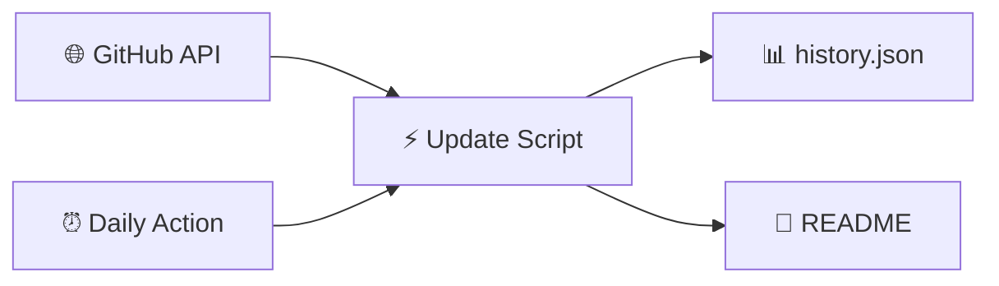

<!-- Static README shell — ranking tables are injected by Update-ParadiseFeed.ps1 -->

<div align="center">

<!-- Banner: committed PNG (reliable on GitHub — no external CDN) -->


<br/>

[](https://github.com/btstevens1984az/powershell-paradise/actions/workflows/daily-update.yml)
[](https://learn.microsoft.com/powershell/)
[](https://github.com/btstevens1984az/powershell-paradise/actions)
[](LICENSE)

<br/><br/>

<!-- PARADISE:STATS:START -->
<table align="center">
<tr>
<td align="center" width="25%">
<br/>
<h3>📅 Today</h3>
<h2>15</h2>
<sub>trending movers</sub>
<br/><br/>
</td>
<td align="center" width="25%">
<br/>
<h3>📆 This Week</h3>
<h2>15</h2>
<sub>new repos</sub>
<br/><br/>
</td>
<td align="center" width="25%">
<br/>
<h3>🗓️ This Month</h3>
<h2>15</h2>
<sub>new repos</sub>
<br/><br/>
</td>
<td align="center" width="25%">
<br/>
<h3>📈 This Year</h3>
<h2>15</h2>
<sub>new repos</sub>
<br/><br/>
</td>
</tr>
</table>
<!-- PARADISE:STATS:END -->

<br/>

<!-- PARADISE:META:START -->
<p align="center"><sub>🕐 <strong>Last refreshed:</strong> Thursday, July 16, 2026 · 07:51 UTC · <a href="https://github.com/btstevens1984az/powershell-paradise/actions/workflows/daily-update.yml">GitHub Actions</a></sub></p>

[](https://github.com/btstevens1984az/powershell-paradise)
&nbsp;
[](https://github.com/btstevens1984az/powershell-paradise/actions)
&nbsp;
[](https://github.com/btstevens1984az/powershell-paradise)
&nbsp;
[](https://github.com/btstevens1984az/powershell-paradise)
<!-- PARADISE:META:END -->

</div>

---

## 📡 Welcome to the Paradise

> **PowerShell Paradise** is your cozy corner of GitHub for staying current — a living leaderboard that refreshes every morning with the hottest PowerShell projects, modules, and tools the community is starring right now.

<table>
<tr>
<td width="50%" valign="top">

### 🌊 What you'll find

| Window | The vibe |
|:------:|:---------|
| 🔥 **Today** | Star velocity — what's climbing *right now* |
| 📆 **Week** | Fresh repos from the last 7 days |
| 🗓️ **Month** | Standouts from the last 30 days |
| 📈 **Year** | The year's best new PowerShell repos |

</td>
<td width="50%" valign="top">

### 🧭 Jump around

| Go to | Section |
|:-----:|:--------|
| 🔥 | [Today's Top Movers](#-todays-top-movers) |
| 📆 | [This Week](#-this-weeks-top-repositories) |
| 🗓️ | [This Month](#️-this-months-top-repositories) |
| 📈 | [This Year](#-this-years-top-repositories) |
| ⚙️ | [How It Works](#️-how-it-works) |

</td>
</tr>
</table>

---

## 🔥 Today's Top Movers

[](https://github.com/btstevens1984az/powershell-paradise#-todays-top-movers)

> Repos with the biggest **star gains** since the last refresh. First run shows recently active repos instead.

<!-- PARADISE:TODAY:START -->
| # | Project | ⭐ Stars | 🍴 Forks | About | 🕐 Updated |
|:-:|---------|----------:|----------:|-------|------------|
| 🥇 |  &nbsp;**[Win11Debloat](https://github.com/Raphire/Win11Debloat)**<br/><sub><code>Raphire/Win11Debloat</code></sub> | **52.4k** &nbsp; 🚀 **+372** | 2.2k | A simple, lightweight PowerShell script that allows you to remove pre-installed apps, d…<br/> `automated`  `bloatware` | 1d ago |
| 🥈 |  &nbsp;**[winutil](https://github.com/ChrisTitusTech/winutil)**<br/><sub><code>ChrisTitusTech/winutil</code></sub> | **58.1k** &nbsp; 🚀 **+92** | 3.4k | Chris Titus Tech's Windows Utility - Install Programs, Tweaks, Fixes, and Updates | 3h ago |
| 🥉 |  &nbsp;**[reverse-skill](https://github.com/zhaoxuya520/reverse-skill)**<br/><sub><code>zhaoxuya520/reverse-skill</code></sub> | **8.3k** &nbsp; 🚀 **+42** | 1.3k | Reverse Engineering / Authorized Penetration Testing / Security Research Skill Router P… | 13h ago |
| **4** |  &nbsp;**[claude-desktop-zh-cn](https://github.com/javaht/claude-desktop-zh-cn)**<br/><sub><code>javaht/claude-desktop-zh-cn</code></sub> | **5k** &nbsp; 🚀 **+39** | 255 | Claude Desktop Chinese Patch (macOS & Windows) | 1d ago |
| **5** |  &nbsp;**[RemoveWindowsAI](https://github.com/zoicware/RemoveWindowsAI)**<br/><sub><code>zoicware/RemoveWindowsAI</code></sub> | **12.4k** &nbsp; 🚀 **+19** | 426 | Force Remove Copilot, Recall and More in Windows 11<br/> `ai`  `bloatware` | 3d ago |
| **6** |  &nbsp;**[tiny11builder](https://github.com/ntdevlabs/tiny11builder)**<br/><sub><code>ntdevlabs/tiny11builder</code></sub> | **19.1k** &nbsp; 🚀 **+9** | 1.5k | Scripts to build a trimmed-down Windows 11 image. | 307d ago |
| **7** |  &nbsp;**[psmux](https://github.com/psmux/psmux)**<br/><sub><code>psmux/psmux</code></sub> | **3k** &nbsp; 🚀 **+7** | 180 | Tmux on Windows Powershell - tmux for PowerShell, Windows Terminal, cmd.exe. Includes p…<br/> `cli`  `powershell` | 21h ago |
| **8** |  &nbsp;**[core](https://github.com/dotnet/core)**<br/><sub><code>dotnet/core</code></sub> | **22k** &nbsp; 🚀 **+5** | 4.9k | .NET news, announcements, release notes, and more!<br/> `dotnet`  `dotnet-core` | 1d ago |
| **9** |  &nbsp;**[GOAD](https://github.com/Orange-Cyberdefense/GOAD)**<br/><sub><code>Orange-Cyberdefense/GOAD</code></sub> | **8k** &nbsp; 🚀 **+5** | 1.1k | game of active directory<br/> `active-directory`  `ansible` | 126d ago |
| **10** |  &nbsp;**[cmder](https://github.com/cmderdev/cmder)**<br/><sub><code>cmderdev/cmder</code></sub> | **27k** &nbsp; 🚀 **+4** | 2.1k | Lovely console emulator package for Windows<br/> `c-plus-plus`  `cmder` | 5d ago |
| **11** |  &nbsp;**[Scoop](https://github.com/ScoopInstaller/Scoop)**<br/><sub><code>ScoopInstaller/Scoop</code></sub> | **24.4k** &nbsp; 🚀 **+4** | 1.5k | A command-line installer for Windows.<br/> `installer`  `powershell` | 33d ago |
| **12** |  &nbsp;**[Office-Tool](https://github.com/YerongAI/Office-Tool)**<br/><sub><code>YerongAI/Office-Tool</code></sub> | **13.8k** &nbsp; 🚀 **+4** | 1k | Office Tool Plus localization projects.<br/> `msoffice`  `msproject` | 36d ago |
| **13** |  &nbsp;**[playbook](https://github.com/meetrevision/playbook)**<br/><sub><code>meetrevision/playbook</code></sub> | **2k** &nbsp; 🚀 **+4** | 114 | A lightweight, stable, and performance-focused customized version of Windows that enhan…<br/> `ame-wizard`  `gaming` | 2d ago |
| **14** |  &nbsp;**[flare-vm](https://github.com/mandiant/flare-vm)**<br/><sub><code>mandiant/flare-vm</code></sub> | **8.9k** &nbsp; 🚀 **+3** | 1.1k | A collection of software installations scripts for Windows systems that allows you to e…<br/> `flare`  `malware-analysis` | 23d ago |
| **15** |  &nbsp;**[awesome-powershell](https://github.com/janikvonrotz/awesome-powershell)**<br/><sub><code>janikvonrotz/awesome-powershell</code></sub> | **5.4k** &nbsp; 🚀 **+3** | 446 | This repository has been moved to https://codeberg.org/janikvonrotz/awesome-powershell.…<br/> `awesome`  `awesome-list` | 458d ago |
<!-- PARADISE:TODAY:END -->

---

## 📆 This Week's Top Repositories

[](https://github.com/btstevens1984az/powershell-paradise#-this-weeks-top-repositories)

> PowerShell repos **created in the last 7 days**, ranked by total stars.

<!-- PARADISE:WEEK:START -->
| # | Project | ⭐ Stars | 🍴 Forks | About | 🕐 Updated |
|:-:|---------|----------:|----------:|-------|------------|
| 🥇 |  &nbsp;**[Codex-Dream-Skin](https://github.com/Fei-Away/Codex-Dream-Skin)**<br/><sub><code>Fei-Away/Codex-Dream-Skin</code></sub> | **2.3k** | 298 | Codex Dream Skin | 35m ago |
| 🥈 |  &nbsp;**[GPT5.6-5.5-](https://github.com/zxr-roro/GPT5.6-5.5-)**<br/><sub><code>zxr-roro/GPT5.6-5.5-</code></sub> | **82** | 30 | 此项目为gpt5.6/5.5破甲方案 | 6d ago |
| 🥉 |  &nbsp;**[claude-watch](https://github.com/omidkorat/claude-watch)**<br/><sub><code>omidkorat/claude-watch</code></sub> | **21** | 1 | A macOS monitor that protects Claude usage with VPN-aware automatic process control. | 20h ago |
| **4** |  &nbsp;**[windows-telemetry-guard](https://github.com/WallabyDesigns/windows-telemetry-guard)**<br/><sub><code>WallabyDesigns/windows-telemetry-guard</code></sub> | **21** | 1 | — | 1d ago |
| **5** |  &nbsp;**[codex-desktop-model-menu-unfilter](https://github.com/I-am-gation/codex-desktop-model-menu-unfilter)**<br/><sub><code>I-am-gation/codex-desktop-model-menu-unfilter</code></sub> | **12** | 0 | Unofficial, reversible Windows utility that shows locally available models in the Codex… | 6d ago |
| **6** |  &nbsp;**[xuskill](https://github.com/xusheng-skill/xuskill)**<br/><sub><code>xusheng-skill/xuskill</code></sub> | **9** | 1 | A portable Codex Skill for AI self-media: topic selection, script audit, transcript-fir… | 4d ago |
| **7** |  &nbsp;**[TSKSkinSwap](https://github.com/YayiMiko/TSKSkinSwap)**<br/><sub><code>YayiMiko/TSKSkinSwap</code></sub> | **8** | 0 | 将《闪耀星骑士》中通常攻击 1 和通常攻击 2 的角色演出替换为成人变身动画（R18），支持一键安装和自动下载 | 3d ago |
| **8** |  &nbsp;**[codex-monitor-hud](https://github.com/LH-03/codex-monitor-hud)**<br/><sub><code>LH-03/codex-monitor-hud</code></sub> | **7** | 0 | A beautiful, configurable live Token HUD for Codex Desktop on Windows. | 31m ago |
| **9** |  &nbsp;**[agent-systems-lab](https://github.com/HariMohamed/agent-systems-lab)**<br/><sub><code>HariMohamed/agent-systems-lab</code></sub> | **6** | 0 | A curated lab for AI agent skills, workflows, scripts, system-design patterns, safety r… | 3d ago |
| **10** |  &nbsp;**[SKILLS-GROK](https://github.com/leonardeco/SKILLS-GROK)**<br/><sub><code>leonardeco/SKILLS-GROK</code></sub> | **6** | 0 | — | 13h ago |
| **11** |  &nbsp;**[fleet-cve-scanner](https://github.com/boostedchaos/fleet-cve-scanner)**<br/><sub><code>boostedchaos/fleet-cve-scanner</code></sub> | **5** | 0 | An open-source, single-script CVE scanner for RMM-managed fleets. Pure PowerShell 7 — j…<br/> `blueteam`  `cve` | 16h ago |
| **12** |  &nbsp;**[Zhao-LibTV-Prompt](https://github.com/zhaojinze86-code/Zhao-LibTV-Prompt)**<br/><sub><code>zhaojinze86-code/Zhao-LibTV-Prompt</code></sub> | **5** | 0 | 可以用于LibTV生成视频的专业级提示词 | 7d ago |
| **13** |  &nbsp;**[ieee-skills](https://github.com/CloudWave818/ieee-skills)**<br/><sub><code>CloudWave818/ieee-skills</code></sub> | **5** | 1 | 面向 IEEE 风格论文写作、润色、审稿、实验、图表、LaTeX、引用和论文阅读的 Codex skills。 | 17h ago |
| **14** |  &nbsp;**[shortcuts-cmd](https://github.com/Suhaas-code/shortcuts-cmd)**<br/><sub><code>Suhaas-code/shortcuts-cmd</code></sub> | **4** | 0 | A simple cli tool to look for your shortcuts | 2d ago |
| **15** |  &nbsp;**[feng-ge-codex-pet](https://github.com/hanhahahhh/feng-ge-codex-pet)**<br/><sub><code>hanhahahhh/feng-ge-codex-pet</code></sub> | **4** | 0 | — | 2d ago |
<!-- PARADISE:WEEK:END -->

---

## 🗓️ This Month's Top Repositories

[](https://github.com/btstevens1984az/powershell-paradise#%EF%B8%8F-this-months-top-repositories)

> PowerShell repos **created in the last 30 days**, ranked by total stars.

<!-- PARADISE:MONTH:START -->
| # | Project | ⭐ Stars | 🍴 Forks | About | 🕐 Updated |
|:-:|---------|----------:|----------:|-------|------------|
| 🥇 |  &nbsp;**[Codex-Dream-Skin](https://github.com/Fei-Away/Codex-Dream-Skin)**<br/><sub><code>Fei-Away/Codex-Dream-Skin</code></sub> | **2.3k** | 298 | Codex Dream Skin | 35m ago |
| 🥈 |  &nbsp;**[WinTrash](https://github.com/hasoftware/WinTrash)**<br/><sub><code>hasoftware/WinTrash</code></sub> | **202** | 26 | All-in-one PowerShell toolkit that scans 16 types of Windows app leftovers (dead PATH e…<br/> `cleaner`  `cleanup` | 7d ago |
| 🥉 |  &nbsp;**[EasySSDTester](https://github.com/CWS6206/EasySSDTester)**<br/><sub><code>CWS6206/EasySSDTester</code></sub> | **143** | 36 | Easy SSD Tester - Portable Windows 11 utility for checking SSD health, SMART data and s… | 26d ago |
| **4** |  &nbsp;**[codex-chatgpt-bridge](https://github.com/Zhenyu98/codex-chatgpt-bridge)**<br/><sub><code>Zhenyu98/codex-chatgpt-bridge</code></sub> | **106** | 13 | A safe bridge for Codex and ChatGPT to hand off coding work, save tokens, and keep loca…<br/> `agentic-workflow`  `ai-agents` | 4d ago |
| **5** |  &nbsp;**[ralph](https://github.com/SantanderAI/ralph)**<br/><sub><code>SantanderAI/ralph</code></sub> | **88** | 28 | A configurable Bash/PowerShell loop that runs an AI coding CLI with a fresh session eac…<br/> `agent`  `agentic` | 6d ago |
| **6** |  &nbsp;**[IntuneToolKit](https://github.com/CYEBRSYSTEM-AliAlame/IntuneToolKit)**<br/><sub><code>CYEBRSYSTEM-AliAlame/IntuneToolKit</code></sub> | **84** | 22 | — | 11d ago |
| **7** |  &nbsp;**[GPT5.6-5.5-](https://github.com/zxr-roro/GPT5.6-5.5-)**<br/><sub><code>zxr-roro/GPT5.6-5.5-</code></sub> | **82** | 30 | 此项目为gpt5.6/5.5破甲方案 | 6d ago |
| **8** |  &nbsp;**[no-gdid](https://github.com/Korben00/no-gdid)**<br/><sub><code>Korben00/no-gdid</code></sub> | **76** | 9 | Read, understand and silence the Windows GDID device identifier (the ID that tracked a … | 4d ago |
| **9** |  &nbsp;**[cc-unlock](https://github.com/JacksonTai2007/cc-unlock)**<br/><sub><code>JacksonTai2007/cc-unlock</code></sub> | **74** | 7 | — | 8d ago |
| **10** |  &nbsp;**[ritual-agent-deployment](https://github.com/zunmax/ritual-agent-deployment)**<br/><sub><code>zunmax/ritual-agent-deployment</code></sub> | **74** | 49 | Deploy a recurring, self-funding sovereign AI agent on Ritual testnet with one command.<br/> `ai-agent`  `ritual-testnet` | 17d ago |
| **11** |  &nbsp;**[ios27-beta-indexing-progress-windows](https://github.com/CZJ0219/ios27-beta-indexing-progress-windows)**<br/><sub><code>CZJ0219/ios27-beta-indexing-progress-windows</code></sub> | **68** | 3 | iOS 27 Beta Indexing Progress Percentage Checker for Windows | 19d ago |
| **12** |  &nbsp;**[Windows-GDID-Changer](https://github.com/gd03gd031/Windows-GDID-Changer)**<br/><sub><code>gd03gd031/Windows-GDID-Changer</code></sub> | **58** | 6 | A script that requests the generation of a new GDID from Microsoft servers and assigns … | 7d ago |
| **13** |  &nbsp;**[MegaManX4Recomp](https://github.com/mstan/MegaManX4Recomp)**<br/><sub><code>mstan/MegaManX4Recomp</code></sub> | **53** | 0 | Mega Man X4 (USA, SLUS-00561) statically recompiled to a native PC executable with PSXR… | 2d ago |
| **14** |  &nbsp;**[HumanAI](https://github.com/MADEVAL/HumanAI)**<br/><sub><code>MADEVAL/HumanAI</code></sub> | **53** | 18 | AI skill for rewriting machine-generated text to sound human-written across 9 languages…<br/> `ai`  `anti-ai` | 4d ago |
| **15** |  &nbsp;**[operate-ui-by-screenshot](https://github.com/BanmaXM/operate-ui-by-screenshot)**<br/><sub><code>BanmaXM/operate-ui-by-screenshot</code></sub> | **52** | 0 | Codex skill for screenshot-based UI operation and browser workflow testing. | 12d ago |
<!-- PARADISE:MONTH:END -->

---

## 📈 This Year's Top Repositories

[](https://github.com/btstevens1984az/powershell-paradise#-this-years-top-repositories)

> PowerShell repos **created since January 1**, ranked by total stars.

<!-- PARADISE:YEAR:START -->
| # | Project | ⭐ Stars | 🍴 Forks | About | 🕐 Updated |
|:-:|---------|----------:|----------:|-------|------------|
| 🥇 |  &nbsp;**[reverse-skill](https://github.com/zhaoxuya520/reverse-skill)**<br/><sub><code>zhaoxuya520/reverse-skill</code></sub> | **8.3k** | 1.3k | Reverse Engineering / Authorized Penetration Testing / Security Research Skill Router P… | 13h ago |
| 🥈 |  &nbsp;**[claude-desktop-zh-cn](https://github.com/javaht/claude-desktop-zh-cn)**<br/><sub><code>javaht/claude-desktop-zh-cn</code></sub> | **5k** | 255 | Claude Desktop Chinese Patch (macOS & Windows) | 1d ago |
| 🥉 |  &nbsp;**[Codex-Dream-Skin](https://github.com/Fei-Away/Codex-Dream-Skin)**<br/><sub><code>Fei-Away/Codex-Dream-Skin</code></sub> | **2.3k** | 298 | Codex Dream Skin | 35m ago |
| **4** |  &nbsp;**[WindowsDeveloperConfig](https://github.com/microsoft/WindowsDeveloperConfig)**<br/><sub><code>microsoft/WindowsDeveloperConfig</code></sub> | **1.8k** | 138 | Automate the setup and configuration of your Windows development environment. | 6d ago |
| **5** |  &nbsp;**[selfware.md](https://github.com/floatboatai/selfware.md)**<br/><sub><code>floatboatai/selfware.md</code></sub> | **1.1k** | 95 | — | 130d ago |
| **6** |  &nbsp;**[codex-windows-fast-patch-skill](https://github.com/chen0416ccc-cpu/codex-windows-fast-patch-skill)**<br/><sub><code>chen0416ccc-cpu/codex-windows-fast-patch-skill</code></sub> | **956** | 103 | 此skills用于指导智能体在 Windows 上恢复 Codex Desktop 升级后失效的本地补丁和能力开关。（Computer Use，插件，破限，codex强制汉化… | 2h ago |
| **7** |  &nbsp;**[work-iq](https://github.com/microsoft/work-iq)**<br/><sub><code>microsoft/work-iq</code></sub> | **939** | 108 | MCP Server and CLI for accessing Work IQ | 16d ago |
| **8** |  &nbsp;**[get-shit-done-for-antigravity](https://github.com/toonight/get-shit-done-for-antigravity)**<br/><sub><code>toonight/get-shit-done-for-antigravity</code></sub> | **906** | 142 | — | 106d ago |
| **9** |  &nbsp;**[commands](https://github.com/GuDaStudio/commands)**<br/><sub><code>GuDaStudio/commands</code></sub> | **885** | 50 | — | 160d ago |
| **10** |  &nbsp;**[PsiphonOverMITM](https://github.com/B3hnamR/PsiphonOverMITM)**<br/><sub><code>B3hnamR/PsiphonOverMITM</code></sub> | **549** | 79 | — | 63d ago |
| **11** |  &nbsp;**[PrivHound](https://github.com/dazzyddos/PrivHound)**<br/><sub><code>dazzyddos/PrivHound</code></sub> | **507** | 47 | A BloodHound OpenGraph collector that models Windows local privilege escalation as inte… | 81d ago |
| **12** |  &nbsp;**[ai-business-skills](https://github.com/minhnv0807/ai-business-skills)**<br/><sub><code>minhnv0807/ai-business-skills</code></sub> | **497** | 213 | 63 bilingual AI marketing skills (31 VN + 31 Global) for Claude Code, OpenCode, Codex, …<br/> `agent-skills`  `ai-agents` | 7d ago |
| **13** |  &nbsp;**[Bonsai-Image-Demo](https://github.com/PrismML-Eng/Bonsai-Image-Demo)**<br/><sub><code>PrismML-Eng/Bonsai-Image-Demo</code></sub> | **497** | 71 | Generate images locally<br/> `1-bit`  `bonsai` | 32d ago |
| **14** |  &nbsp;**[codex-visio-paper-figure-skill](https://github.com/pengjunchi0/codex-visio-paper-figure-skill)**<br/><sub><code>pengjunchi0/codex-visio-paper-figure-skill</code></sub> | **487** | 22 | 科研绘图skill、论文绘图skill、图片转visio等可编辑格式，将生成图转化为论文可编辑图，便于作者调整绘图细节<br/> `academic-figures`  `codex` | 23d ago |
| **15** |  &nbsp;**[WinUtil_CN](https://github.com/constansino/WinUtil_CN)**<br/><sub><code>constansino/WinUtil_CN</code></sub> | **478** | 61 | WinUtil_CN：Chris Titus Tech WinUtil 中文汉化版，提供 WinUtil 中文界面、中文说明、Tweaks 中文解释与 Win11ISO 中文支持<br/> `chinese`  `chris-titus-tech` | 62d ago |
<!-- PARADISE:YEAR:END -->

---

## ⚙️ How It Works



| Step | What happens |
|:----:|:-------------|
| 1️⃣ | Query GitHub for `language:powershell` repos with real activity |
| 2️⃣ | Compare star counts to yesterday's snapshot for velocity |
| 3️⃣ | Build four bubbly ranking tables — top 15 each |
| 4️⃣ | Auto-commit back to this README every morning at 06:00 UTC |

<details>
<summary><b>🛠️ Run locally</b></summary>

```powershell
$env:GITHUB_TOKEN = 'ghp_your_token'   # optional — higher API limits
./scripts/Update-ParadiseFeed.ps1
```

</details>

<details>
<summary><b>🔍 Filters applied</b></summary>

- Language: **PowerShell** · Forks excluded · Minimum **3 stars** · Top **15** per table

</details>

---

## 🌟 Why star this repo?

<table>
<tr>
<td align="center">😴<br/><b>Zero effort</b><br/><sub>Updates while you sleep</sub></td>
<td align="center">📡<br/><b>Community signal</b><br/><sub>See what builders love</sub></td>
<td align="center">🎓<br/><b>Learning radar</b><br/><sub>Find modules worth studying</sub></td>
<td align="center">🔓<br/><b>Open source</b><br/><sub>Fork &amp; adapt freely</sub></td>
</tr>
</table>

---

## 📜 License

MIT — see [LICENSE](LICENSE).

---

<div align="center">

**Built with ❤️ for the PowerShell community**

*Star this repo to get daily trending PowerShell projects in your GitHub feed.*

</div>
