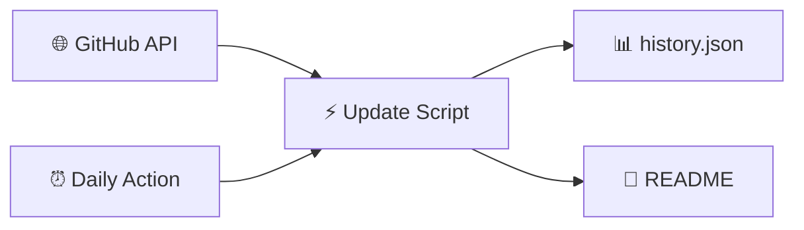

<!-- Static README shell — ranking tables are injected by Update-ParadiseFeed.ps1 -->

<div align="center">

<!-- Banner: committed PNG (reliable on GitHub — no external CDN) -->


<br/>

[](https://github.com/btstevens1984az/powershell-paradise/actions/workflows/daily-update.yml)
[](https://learn.microsoft.com/powershell/)
[](https://github.com/btstevens1984az/powershell-paradise/actions)
[](LICENSE)

<br/><br/>

<!-- PARADISE:STATS:START -->
<table align="center">
<tr>
<td align="center" width="25%">
<br/>
<h3>📅 Today</h3>
<h2>15</h2>
<sub>trending movers</sub>
<br/><br/>
</td>
<td align="center" width="25%">
<br/>
<h3>📆 This Week</h3>
<h2>15</h2>
<sub>new repos</sub>
<br/><br/>
</td>
<td align="center" width="25%">
<br/>
<h3>🗓️ This Month</h3>
<h2>15</h2>
<sub>new repos</sub>
<br/><br/>
</td>
<td align="center" width="25%">
<br/>
<h3>📈 This Year</h3>
<h2>15</h2>
<sub>new repos</sub>
<br/><br/>
</td>
</tr>
</table>
<!-- PARADISE:STATS:END -->

<br/>

<!-- PARADISE:META:START -->
<p align="center"><sub>🕐 <strong>Last refreshed:</strong> Friday, July 24, 2026 · 08:03 UTC · <a href="https://github.com/btstevens1984az/powershell-paradise/actions/workflows/daily-update.yml">GitHub Actions</a></sub></p>

[](https://github.com/btstevens1984az/powershell-paradise)
&nbsp;
[](https://github.com/btstevens1984az/powershell-paradise/actions)
&nbsp;
[](https://github.com/btstevens1984az/powershell-paradise)
&nbsp;
[](https://github.com/btstevens1984az/powershell-paradise)
<!-- PARADISE:META:END -->

</div>

---

## 📡 Welcome to the Paradise

> **PowerShell Paradise** is your cozy corner of GitHub for staying current — a living leaderboard that refreshes every morning with the hottest PowerShell projects, modules, and tools the community is starring right now.

<table>
<tr>
<td width="50%" valign="top">

### 🌊 What you'll find

| Window | The vibe |
|:------:|:---------|
| 🔥 **Today** | Star velocity — what's climbing *right now* |
| 📆 **Week** | Fresh repos from the last 7 days |
| 🗓️ **Month** | Standouts from the last 30 days |
| 📈 **Year** | The year's best new PowerShell repos |

</td>
<td width="50%" valign="top">

### 🧭 Jump around

| Go to | Section |
|:-----:|:--------|
| 🔥 | [Today's Top Movers](#-todays-top-movers) |
| 📆 | [This Week](#-this-weeks-top-repositories) |
| 🗓️ | [This Month](#️-this-months-top-repositories) |
| 📈 | [This Year](#-this-years-top-repositories) |
| ⚙️ | [How It Works](#️-how-it-works) |

</td>
</tr>
</table>

---

## 🔥 Today's Top Movers

[](https://github.com/btstevens1984az/powershell-paradise#-todays-top-movers)

> Repos with the biggest **star gains** since the last refresh. First run shows recently active repos instead.

<!-- PARADISE:TODAY:START -->
| # | Project | ⭐ Stars | 🍴 Forks | About | 🕐 Updated |
|:-:|---------|----------:|----------:|-------|------------|
| 🥇 |  &nbsp;**[Win11Debloat](https://github.com/Raphire/Win11Debloat)**<br/><sub><code>Raphire/Win11Debloat</code></sub> | **53.7k** &nbsp; 🚀 **+152** | 2.2k | A simple, lightweight PowerShell script that allows you to remove pre-installed apps, d…<br/> `automated`  `bloatware` | 12h ago |
| 🥈 |  &nbsp;**[winutil](https://github.com/ChrisTitusTech/winutil)**<br/><sub><code>ChrisTitusTech/winutil</code></sub> | **58.9k** &nbsp; 🚀 **+86** | 3.4k | Chris Titus Tech's Windows Utility - Install Programs, Tweaks, Fixes, and Updates | 2d ago |
| 🥉 |  &nbsp;**[reverse-skill](https://github.com/zhaoxuya520/reverse-skill)**<br/><sub><code>zhaoxuya520/reverse-skill</code></sub> | **8.8k** &nbsp; 🚀 **+49** | 1.4k | Reverse Engineering / Authorized Penetration Testing / Security Research Skill Router P… | 7d ago |
| **4** |  &nbsp;**[claude-desktop-zh-cn](https://github.com/javaht/claude-desktop-zh-cn)**<br/><sub><code>javaht/claude-desktop-zh-cn</code></sub> | **5.3k** &nbsp; 🚀 **+47** | 267 | Claude Desktop Chinese Patch (macOS & Windows) | 2d ago |
| **5** |  &nbsp;**[RemoveWindowsAI](https://github.com/zoicware/RemoveWindowsAI)**<br/><sub><code>zoicware/RemoveWindowsAI</code></sub> | **12.5k** &nbsp; 🚀 **+18** | 435 | Force Remove Copilot, Recall and More in Windows 11<br/> `ai`  `bloatware` | 6d ago |
| **6** |  &nbsp;**[SpotX](https://github.com/SpotX-Official/SpotX)**<br/><sub><code>SpotX-Official/SpotX</code></sub> | **21.8k** &nbsp; 🚀 **+13** | 1.1k | SpotX patcher used for patching the desktop version of Spotify<br/> `adblock`  `spotify` | 10d ago |
| **7** |  &nbsp;**[Office-Tool](https://github.com/YerongAI/Office-Tool)**<br/><sub><code>YerongAI/Office-Tool</code></sub> | **13.9k** &nbsp; 🚀 **+12** | 1k | Office Tool Plus localization projects.<br/> `msoffice`  `msproject` | 44d ago |
| **8** |  &nbsp;**[tiny11builder](https://github.com/ntdevlabs/tiny11builder)**<br/><sub><code>ntdevlabs/tiny11builder</code></sub> | **19.2k** &nbsp; 🚀 **+11** | 1.5k | Scripts to build a trimmed-down Windows 11 image. | 315d ago |
| **9** |  &nbsp;**[psmux](https://github.com/psmux/psmux)**<br/><sub><code>psmux/psmux</code></sub> | **3k** &nbsp; 🚀 **+11** | 187 | Tmux on Windows Powershell - tmux for PowerShell, Windows Terminal, cmd.exe. Includes p…<br/> `cli`  `powershell` | 13h ago |
| **10** |  &nbsp;**[Scoop](https://github.com/ScoopInstaller/Scoop)**<br/><sub><code>ScoopInstaller/Scoop</code></sub> | **24.4k** &nbsp; 🚀 **+4** | 1.5k | A command-line installer for Windows.<br/> `installer`  `powershell` | 41d ago |
| **11** |  &nbsp;**[docker](https://github.com/jenkinsci/docker)**<br/><sub><code>jenkinsci/docker</code></sub> | **7.6k** &nbsp; 🚀 **+4** | 4.6k | Docker official jenkins repo<br/> `docker`  `hacktoberfest` | 3d ago |
| **12** |  &nbsp;**[PowerSploit](https://github.com/PowerShellMafia/PowerSploit)**<br/><sub><code>PowerShellMafia/PowerSploit</code></sub> | **13.1k** &nbsp; 🚀 **+3** | 4.7k | PowerSploit - A PowerShell Post-Exploitation Framework | 2,166d ago |
| **13** |  &nbsp;**[runner-images](https://github.com/actions/runner-images)**<br/><sub><code>actions/runner-images</code></sub> | **12.9k** &nbsp; 🚀 **+3** | 3.8k | GitHub Actions runner images | 2d ago |
| **14** |  &nbsp;**[flare-vm](https://github.com/mandiant/flare-vm)**<br/><sub><code>mandiant/flare-vm</code></sub> | **8.9k** &nbsp; 🚀 **+3** | 1.1k | A collection of software installations scripts for Windows systems that allows you to e…<br/> `flare`  `malware-analysis` | 31d ago |
| **15** |  &nbsp;**[GOAD](https://github.com/Orange-Cyberdefense/GOAD)**<br/><sub><code>Orange-Cyberdefense/GOAD</code></sub> | **8.1k** &nbsp; 🚀 **+3** | 1.1k | game of active directory<br/> `active-directory`  `ansible` | 134d ago |
<!-- PARADISE:TODAY:END -->

---

## 📆 This Week's Top Repositories

[](https://github.com/btstevens1984az/powershell-paradise#-this-weeks-top-repositories)

> PowerShell repos **created in the last 7 days**, ranked by total stars.

<!-- PARADISE:WEEK:START -->
| # | Project | ⭐ Stars | 🍴 Forks | About | 🕐 Updated |
|:-:|---------|----------:|----------:|-------|------------|
| 🥇 |  &nbsp;**[WindowsUpdateRemedationTool](https://github.com/mertozsoy/WindowsUpdateRemedationTool)**<br/><sub><code>mertozsoy/WindowsUpdateRemedationTool</code></sub> | **75** | 11 | — | 5d ago |
| 🥈 |  &nbsp;**[pcairplay](https://github.com/gbulog/pcairplay)**<br/><sub><code>gbulog/pcairplay</code></sub> | **68** | 8 | Mirror an iPhone to a Windows PC using native iOS Screen Mirroring - no app on the phon… | 4d ago |
| 🥉 |  &nbsp;**[Windhawk-Backup-Manager](https://github.com/osmanonurkoc/Windhawk-Backup-Manager)**<br/><sub><code>osmanonurkoc/Windhawk-Backup-Manager</code></sub> | **31** | 0 | A modern, lightweight WPF utility to backup, review, and restore Windhawk mods, compile… | 3d ago |
| **4** |  &nbsp;**[codex-frontend-visual-handoff](https://github.com/zian10001/codex-frontend-visual-handoff)**<br/><sub><code>zian10001/codex-frontend-visual-handoff</code></sub> | **16** | 0 | — | 3d ago |
| **5** |  &nbsp;**[molt](https://github.com/0xCybin/molt)**<br/><sub><code>0xCybin/molt</code></sub> | **14** | 1 | Removes the LG Monitor App that installs itself with McAfee popups, plus OEM bloatware,…<br/> `adware-removal`  `bloatware` | 14h ago |
| **6** |  &nbsp;**[EnterpriseLab](https://github.com/mfgjwaterman/EnterpriseLab)**<br/><sub><code>mfgjwaterman/EnterpriseLab</code></sub> | **12** | 2 | EnterpriseLab is a PowerShell framework for building reproducible enterprise lab enviro… | 2d ago |
| **7** |  &nbsp;**[mayday-bubu-digital-materials](https://github.com/Jingjing-nx/mayday-bubu-digital-materials)**<br/><sub><code>Jingjing-nx/mayday-bubu-digital-materials</code></sub> | **12** | 1 | mayday卜卜电子物料：非官方五月天歌迷桌面项目，包含卜卜 Codex 宠物与 macOS/Windows 额度面板<br/> `codex`  `desktop-pet` | 4h ago |
| **8** |  &nbsp;**[dominion-wars-modern](https://github.com/AsusFarstrider/dominion-wars-modern)**<br/><sub><code>AsusFarstrider/dominion-wars-modern</code></sub> | **11** | 1 | A legal, reversible compatibility installer for running Star Trek: Deep Space Nine – Do… | 4d ago |
| **9** |  &nbsp;**[chatgpt-usage-overlay](https://github.com/goraeda-a11y/chatgpt-usage-overlay)**<br/><sub><code>goraeda-a11y/chatgpt-usage-overlay</code></sub> | **10** | 0 | Native-looking ChatGPT/Codex usage overlay for Windows | 2d ago |
| **10** |  &nbsp;**[CIPP](https://github.com/CyberDrain/CIPP)**<br/><sub><code>CyberDrain/CIPP</code></sub> | **9** | 10 | — | 4h ago |
| **11** |  &nbsp;**[btv-k8s-sandbox-infrastructure](https://github.com/blueteamvillage/btv-k8s-sandbox-infrastructure)**<br/><sub><code>blueteamvillage/btv-k8s-sandbox-infrastructure</code></sub> | **8** | 3 | Local Kubernetes sandbox for the Blue Team Village CTF at DEF CON 34 (Project Obsidian)… | 6d ago |
| **12** |  &nbsp;**[PrtgSensorKit](https://github.com/ArchitektApx/PrtgSensorKit)**<br/><sub><code>ArchitektApx/PrtgSensorKit</code></sub> | **8** | 2 | PowerShell framework for building PRTG custom sensors - less boilerplate, valid output …<br/> `monitoring`  `powershell` | 22h ago |
| **13** |  &nbsp;**[xiaoke-cursor-mpp](https://github.com/wozibile5555-max/xiaoke-cursor-mpp)**<br/><sub><code>wozibile5555-max/xiaoke-cursor-mpp</code></sub> | **8** | 0 | 把小克变成鼠标指针 | 5d ago |
| **14** |  &nbsp;**[iracing-x3d-tuning](https://github.com/no6969el/iracing-x3d-tuning)**<br/><sub><code>no6969el/iracing-x3d-tuning</code></sub> | **8** | 0 | A measurement-driven guide + PowerShell toolkit to eliminate iRacing stutters and freez… | 4h ago |
| **15** |  &nbsp;**[brain-os](https://github.com/ahmedyahia01/brain-os)**<br/><sub><code>ahmedyahia01/brain-os</code></sub> | **7** | 0 | A privacy-first, AI-ready personal knowledge operating system for Obsidian, Cursor, Cla… | 7d ago |
<!-- PARADISE:WEEK:END -->

---

## 🗓️ This Month's Top Repositories

[](https://github.com/btstevens1984az/powershell-paradise#%EF%B8%8F-this-months-top-repositories)

> PowerShell repos **created in the last 30 days**, ranked by total stars.

<!-- PARADISE:MONTH:START -->
| # | Project | ⭐ Stars | 🍴 Forks | About | 🕐 Updated |
|:-:|---------|----------:|----------:|-------|------------|
| 🥇 |  &nbsp;**[WinTrash](https://github.com/hasoftware/WinTrash)**<br/><sub><code>hasoftware/WinTrash</code></sub> | **212** | 26 | All-in-one PowerShell toolkit that scans 16 types of Windows app leftovers (dead PATH e…<br/> `cleaner`  `cleanup` | 8d ago |
| 🥈 |  &nbsp;**[PC-Cartridge-System](https://github.com/LewdM3at/PC-Cartridge-System)**<br/><sub><code>LewdM3at/PC-Cartridge-System</code></sub> | **203** | 13 | Physical game cartridges with 2.5" SSDs for your Steam/GoG/Local library | 11h ago |
| 🥉 |  &nbsp;**[no-gdid](https://github.com/Korben00/no-gdid)**<br/><sub><code>Korben00/no-gdid</code></sub> | **178** | 13 | Read, understand and silence the Windows GDID device identifier (the ID that tracked a … | 12d ago |
| **4** |  &nbsp;**[GPT5.6-5.5-](https://github.com/zxr-roro/GPT5.6-5.5-)**<br/><sub><code>zxr-roro/GPT5.6-5.5-</code></sub> | **153** | 55 | 此项目为gpt5.6/5.5破甲方案 | 14d ago |
| **5** |  &nbsp;**[Windows-GDID-Changer](https://github.com/gd03gd031/Windows-GDID-Changer)**<br/><sub><code>gd03gd031/Windows-GDID-Changer</code></sub> | **126** | 12 | A script that requests the generation of a new GDID from Microsoft servers and assigns … | 15h ago |
| **6** |  &nbsp;**[Firestone2Green](https://github.com/Mer3y1338/Firestone2Green)**<br/><sub><code>Mer3y1338/Firestone2Green</code></sub> | **114** | 15 | 🟢 Firestone2Green — Windows one-click Firestone / Overwolf local recovery tool with au…<br/> `authorization-repair`  `avatar-repair` | 3d ago |
| **7** |  &nbsp;**[IntuneToolKit](https://github.com/CYEBRSYSTEM-AliAlame/IntuneToolKit)**<br/><sub><code>CYEBRSYSTEM-AliAlame/IntuneToolKit</code></sub> | **87** | 23 | — | 19d ago |
| **8** |  &nbsp;**[cc-unlock](https://github.com/JacksonTai2007/cc-unlock)**<br/><sub><code>JacksonTai2007/cc-unlock</code></sub> | **78** | 8 | — | 16d ago |
| **9** |  &nbsp;**[ritual-agent-deployment](https://github.com/zunmax/ritual-agent-deployment)**<br/><sub><code>zunmax/ritual-agent-deployment</code></sub> | **76** | 48 | Deploy a recurring, self-funding sovereign AI agent on Ritual testnet with one command.<br/> `ai-agent`  `ritual-testnet` | 25d ago |
| **10** |  &nbsp;**[WindowsUpdateRemedationTool](https://github.com/mertozsoy/WindowsUpdateRemedationTool)**<br/><sub><code>mertozsoy/WindowsUpdateRemedationTool</code></sub> | **75** | 11 | — | 5d ago |
| **11** |  &nbsp;**[ieee-skills](https://github.com/CloudWave818/ieee-skills)**<br/><sub><code>CloudWave818/ieee-skills</code></sub> | **71** | 3 | 面向 IEEE 风格论文写作、润色、审稿、实验、图表、LaTeX、引用和论文阅读的 Codex skills。 | 3d ago |
| **12** |  &nbsp;**[pcairplay](https://github.com/gbulog/pcairplay)**<br/><sub><code>gbulog/pcairplay</code></sub> | **68** | 8 | Mirror an iPhone to a Windows PC using native iOS Screen Mirroring - no app on the phon… | 4d ago |
| **13** |  &nbsp;**[MegaManX4Recomp](https://github.com/mstan/MegaManX4Recomp)**<br/><sub><code>mstan/MegaManX4Recomp</code></sub> | **63** | 0 | Mega Man X4 (USA, SLUS-00561) statically recompiled to a native PC executable with PSXR… | 14h ago |
| **14** |  &nbsp;**[powershell-for-sysadmins](https://github.com/socaldavis/powershell-for-sysadmins)**<br/><sub><code>socaldavis/powershell-for-sysadmins</code></sub> | **61** | 8 | Real sysadmin PowerShell scripts from the PC-Addicts YouTube channel — sanitized, param…<br/> `active-directory`  `automation` | 5d ago |
| **15** |  &nbsp;**[rbxmulti-loader](https://github.com/BoardCrawler/rbxmulti-loader)**<br/><sub><code>BoardCrawler/rbxmulti-loader</code></sub> | **49** | 8 | Running multiple R0bl0x instances on Windows. | 6d ago |
<!-- PARADISE:MONTH:END -->

---

## 📈 This Year's Top Repositories

[](https://github.com/btstevens1984az/powershell-paradise#-this-years-top-repositories)

> PowerShell repos **created since January 1**, ranked by total stars.

<!-- PARADISE:YEAR:START -->
| # | Project | ⭐ Stars | 🍴 Forks | About | 🕐 Updated |
|:-:|---------|----------:|----------:|-------|------------|
| 🥇 |  &nbsp;**[reverse-skill](https://github.com/zhaoxuya520/reverse-skill)**<br/><sub><code>zhaoxuya520/reverse-skill</code></sub> | **8.8k** | 1.4k | Reverse Engineering / Authorized Penetration Testing / Security Research Skill Router P… | 7d ago |
| 🥈 |  &nbsp;**[claude-desktop-zh-cn](https://github.com/javaht/claude-desktop-zh-cn)**<br/><sub><code>javaht/claude-desktop-zh-cn</code></sub> | **5.3k** | 267 | Claude Desktop Chinese Patch (macOS & Windows) | 2d ago |
| 🥉 |  &nbsp;**[WindowsDeveloperConfig](https://github.com/microsoft/WindowsDeveloperConfig)**<br/><sub><code>microsoft/WindowsDeveloperConfig</code></sub> | **1.8k** | 140 | Automate the setup and configuration of your Windows development environment. | 2d ago |
| **4** |  &nbsp;**[selfware.md](https://github.com/floatboatai/selfware.md)**<br/><sub><code>floatboatai/selfware.md</code></sub> | **1.1k** | 95 | — | 138d ago |
| **5** |  &nbsp;**[codex-windows-fast-patch-skill](https://github.com/chen0416ccc-cpu/codex-windows-fast-patch-skill)**<br/><sub><code>chen0416ccc-cpu/codex-windows-fast-patch-skill</code></sub> | **985** | 106 | 此skills用于指导智能体在 Windows 上恢复 Codex Desktop 升级后失效的本地补丁和能力开关。（Computer Use，插件，破限，codex强制汉化… | 1h ago |
| **6** |  &nbsp;**[work-iq](https://github.com/microsoft/work-iq)**<br/><sub><code>microsoft/work-iq</code></sub> | **948** | 109 | MCP Server and CLI for accessing Work IQ | 9h ago |
| **7** |  &nbsp;**[get-shit-done-for-antigravity](https://github.com/toonight/get-shit-done-for-antigravity)**<br/><sub><code>toonight/get-shit-done-for-antigravity</code></sub> | **913** | 145 | — | 114d ago |
| **8** |  &nbsp;**[commands](https://github.com/GuDaStudio/commands)**<br/><sub><code>GuDaStudio/commands</code></sub> | **884** | 50 | — | 168d ago |
| **9** |  &nbsp;**[codex-visio-paper-figure-skill](https://github.com/pengjunchi0/codex-visio-paper-figure-skill)**<br/><sub><code>pengjunchi0/codex-visio-paper-figure-skill</code></sub> | **574** | 27 | 科研绘图skill、论文绘图skill、图片转visio等可编辑格式，将生成图转化为论文可编辑图，便于作者调整绘图细节<br/> `academic-figures`  `codex` | 31d ago |
| **10** |  &nbsp;**[PsiphonOverMITM](https://github.com/B3hnamR/PsiphonOverMITM)**<br/><sub><code>B3hnamR/PsiphonOverMITM</code></sub> | **549** | 79 | — | 71d ago |
| **11** |  &nbsp;**[Bonsai-Image-Demo](https://github.com/PrismML-Eng/Bonsai-Image-Demo)**<br/><sub><code>PrismML-Eng/Bonsai-Image-Demo</code></sub> | **511** | 72 | Generate images locally<br/> `1-bit`  `bonsai` | 40d ago |
| **12** |  &nbsp;**[ai-business-skills](https://github.com/minhnv0807/ai-business-skills)**<br/><sub><code>minhnv0807/ai-business-skills</code></sub> | **508** | 214 | 63 bilingual AI marketing skills (31 VN + 31 Global) for Claude Code, OpenCode, Codex, …<br/> `agent-skills`  `ai-agents` | 15d ago |
| **13** |  &nbsp;**[PrivHound](https://github.com/dazzyddos/PrivHound)**<br/><sub><code>dazzyddos/PrivHound</code></sub> | **508** | 48 | A BloodHound OpenGraph collector that models Windows local privilege escalation as inte… | 89d ago |
| **14** |  &nbsp;**[WinUtil_CN](https://github.com/constansino/WinUtil_CN)**<br/><sub><code>constansino/WinUtil_CN</code></sub> | **487** | 65 | WinUtil_CN：Chris Titus Tech WinUtil 中文汉化版，提供 WinUtil 中文界面、中文说明、Tweaks 中文解释与 Win11ISO 中文支持<br/> `chinese`  `chris-titus-tech` | 70d ago |
| **15** |  &nbsp;**[Light-Help](https://github.com/Cotton059/Light-Help)**<br/><sub><code>Cotton059/Light-Help</code></sub> | **474** | 218 | Help the audience perform some complex operations. | 7d ago |
<!-- PARADISE:YEAR:END -->

---

## ⚙️ How It Works



| Step | What happens |
|:----:|:-------------|
| 1️⃣ | Query GitHub for `language:powershell` repos with real activity |
| 2️⃣ | Compare star counts to yesterday's snapshot for velocity |
| 3️⃣ | Build four bubbly ranking tables — top 15 each |
| 4️⃣ | Auto-commit back to this README every morning at 06:00 UTC |

<details>
<summary><b>🛠️ Run locally</b></summary>

```powershell
$env:GITHUB_TOKEN = 'ghp_your_token'   # optional — higher API limits
./scripts/Update-ParadiseFeed.ps1
```

</details>

<details>
<summary><b>🔍 Filters applied</b></summary>

- Language: **PowerShell** · Forks excluded · Minimum **3 stars** · Top **15** per table

</details>

---

## 🌟 Why star this repo?

<table>
<tr>
<td align="center">😴<br/><b>Zero effort</b><br/><sub>Updates while you sleep</sub></td>
<td align="center">📡<br/><b>Community signal</b><br/><sub>See what builders love</sub></td>
<td align="center">🎓<br/><b>Learning radar</b><br/><sub>Find modules worth studying</sub></td>
<td align="center">🔓<br/><b>Open source</b><br/><sub>Fork &amp; adapt freely</sub></td>
</tr>
</table>

---

## 📜 License

MIT — see [LICENSE](LICENSE).

---

<div align="center">

**Built with ❤️ for the PowerShell community**

*Star this repo to get daily trending PowerShell projects in your GitHub feed.*

</div>
