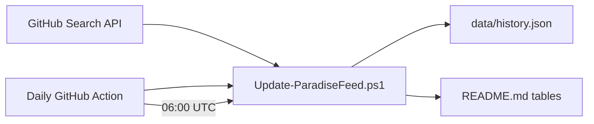

# PowerShell Paradise

<div align="center">


### Your daily newsfeed for the PowerShell ecosystem

[](https://github.com/btstevens1984az/powershell-paradise/actions/workflows/daily-update.yml)
[](https://learn.microsoft.com/powershell/)
[](LICENSE)
[](https://github.com/btstevens1984az/powershell-paradise/actions)

**Discover · Learn · Stay Current**

*Automatically curated rankings of the hottest PowerShell repositories on GitHub — refreshed every morning.*

<br/>

<!-- PARADISE:STATS:START -->
| 📅 Today | 📆 This Week | 🗓️ This Month | 📈 This Year |
|:---:|:---:|:---:|:---:|
| **15** trending | **15** new repos | **15** new repos | **15** new repos |
<!-- PARADISE:STATS:END -->

<br/>

<!-- PARADISE:META:START -->
**Last updated:** Thursday, July 2, 2026 · 9:16 PM  
**Data refresh:** 2026-07-03 01:16 UTC · **Tracked repos:** 100 · **Star history:** building baseline
<!-- PARADISE:META:END -->

</div>

---

## 📡 What is PowerShell Paradise?

PowerShell Paradise is a **living leaderboard** for the PowerShell community. Every day, an automated pipeline scans GitHub, ranks repositories by stars, and publishes fresh tables right here — no manual curation required.

Whether you're an admin shipping automation, a developer building modules, or a learner exploring the ecosystem, this repo is your **single bookmark** for what's trending in PowerShell.

| Window | What you get |
|--------|--------------|
| **Today** | Repositories gaining the most stars since the last update — your real-time pulse |
| **This Week** | New PowerShell repos from the last 7 days, ranked by stars |
| **This Month** | Standout projects from the last 30 days |
| **This Year** | The year's best new PowerShell repositories so far |

---

## 🗂️ Quick Navigation

| Section | Jump to |
|---------|---------|
| 🔥 Today's Top Movers | [Today's Rankings](#-todays-top-movers) |
| 📆 This Week | [Weekly Rankings](#-this-weeks-top-repositories) |
| 🗓️ This Month | [Monthly Rankings](#️-this-months-top-repositories) |
| 📈 This Year | [Yearly Rankings](#-this-years-top-repositories) |
| ⚙️ How It Works | [Methodology](#️-how-it-works) |

---

## 🔥 Today's Top Movers

> Repositories with the biggest **star gains** since the last refresh. On the first run, recently active repos are shown instead.

<!-- PARADISE:TODAY:START -->
| # | Repository | ⭐ Stars | 🍴 Forks | Description | Last Push |
|:-:|---|---:|---:|---|---|
| 🥇 | [ScoopInstaller/Extras](https://github.com/ScoopInstaller/Extras) | 2.1k | 1.7k | 📦 The Extras bucket for Scoop. | 12m ago |
| 🥈 | [ScoopInstaller/Main](https://github.com/ScoopInstaller/Main) | 1.9k | 1.2k | 📦 The default bucket for Scoop. | 13m ago |
| 🥉 | [Scriptez1/RedXFreeSteamInstaller](https://github.com/Scriptez1/RedXFreeSteamInstaller) | 1.4k | 17 | It allows you to automatically add all free and paid games and DLCs t… | 11m ago |
| **4** | [chawyehsu/dorado](https://github.com/chawyehsu/dorado) | 1.2k | 109 | 🐟 Yet Another bucket for lovely Scoop | 39m ago |
| **5** | [ItzLevvie/MicrosoftTeams-msinternal](https://github.com/ItzLevvie/MicrosoftTeams-msinternal) | 539 | 34 | This project was created from PowerShell which allows people to downl… | 8m ago |
| **6** | [MicrosoftDocs/power-platform](https://github.com/MicrosoftDocs/power-platform) | 503 | 689 | Documentation for Microsoft Power Platform | 13m ago |
| **7** | [chocolatey-community/chocolatey-packages](https://github.com/chocolatey-community/chocolatey-packages) | 477 | 398 | Chocolatey Community Maintainers Team Packages - packages that are ma… | 40m ago |
| **8** | [REIJI007/AdBlock_Rule_For_Clash](https://github.com/REIJI007/AdBlock_Rule_For_Clash) | 349 | 14 | 适用于Clash（premium核心与mihomo核心）的广告域名拦截RULE-SET规则集，每20分钟更新一次 | 1h ago |
| **9** | [gaelcolas/Sampler](https://github.com/gaelcolas/Sampler) | 237 | 47 | Module template with build pipeline and examples, including DSC eleme… | 11m ago |
| **10** | [microsoftgraph/microsoft-graph-docs-contrib](https://github.com/microsoftgraph/microsoft-graph-docs-contrib) | 142 | 513 | Documentation for the Microsoft Graph REST API | 35m ago |
| **11** | [REIJI007/AdBlock_Rule_For_Sing-box](https://github.com/REIJI007/AdBlock_Rule_For_Sing-box) | 142 | 20 | 适用于Sing-box的广告域名拦截RULE-SET规则集，每20分钟更新一次 | 3m ago |
| **12** | [bitbug0x55AA/Blue_Team_Hunting_Field_Notes](https://github.com/bitbug0x55AA/Blue_Team_Hunting_Field_Notes) | 101 | 19 | My external brain for cyber defense (WIP).  A practical collection of… | 3m ago |
| **13** | [ItzLevvie/Office16](https://github.com/ItzLevvie/Office16) | 68 | 6 | This project was created from PowerShell which shows internal and ext… | 7m ago |
| **14** | [SpecterShell/Dumplings](https://github.com/SpecterShell/Dumplings) | 49 | 30 | Dump remote resources and lint outdated packages | 56m ago |
| **15** | [usepvm/pvm](https://github.com/usepvm/pvm) | 39 | 2 | PHP Version Manager for windows | 44m ago |
<!-- PARADISE:TODAY:END -->

---

## 📆 This Week's Top Repositories

> PowerShell repositories **created in the last 7 days**, sorted by total stars.

<!-- PARADISE:WEEK:START -->
| # | Repository | ⭐ Stars | 🍴 Forks | Description | Last Push |
|:-:|---|---:|---:|---|---|
| 🥇 | [zunmax/ritual-agent-deployment](https://github.com/zunmax/ritual-agent-deployment) | 71 | 49 | Deploy a recurring, self-funding sovereign AI agent on Ritual testnet… | 4d ago |
| 🥈 | [wzj998/fluencer-predict-track](https://github.com/wzj998/fluencer-predict-track) | 24 | 9 | 投资大V合订本：追踪投资大V历史预测，并用公开数据验证准确性 | 3d ago |
| 🥉 | [JacksonTai2007/cc-unlock](https://github.com/JacksonTai2007/cc-unlock) | 16 | 0 | — | 2d ago |
| **4** | [mohamedlalah/SecretoBoot-Enterprise](https://github.com/mohamedlalah/SecretoBoot-Enterprise) | 11 | 0 | Professional Dual Boot Manager for Windows 11 and Google TV powered b… | 5d ago |
| **5** | [Isralechee/SpicetifyManager](https://github.com/Isralechee/SpicetifyManager) | 9 | 0 | PowerShell menu-driven manager for Spicetify + Spotify — one-click au… | 2d ago |
| **6** | [xu0106/latex-paper-writer-skill](https://github.com/xu0106/latex-paper-writer-skill) | 9 | 1 | — | 6d ago |
| **7** | [adlptv/Agent-AND](https://github.com/adlptv/Agent-AND) | 9 | 1 | — | 2d ago |
| **8** | [Helias/ai-notify](https://github.com/Helias/ai-notify) | 8 | 0 | — | 5d ago |
| **9** | [frangelbarrera/osint-agent-skills](https://github.com/frangelbarrera/osint-agent-skills) | 8 | 2 | OSINT knowledge base + MCP server for autonomous AI agents — Claude C… | 1d ago |
| **10** | [steviecoaster/Splitter](https://github.com/steviecoaster/Splitter) | 7 | 2 | Split a Windows Operating System ISO into smaller, edition-specific I… | 1d ago |
| **11** | [dfinke/PSDiaryAI](https://github.com/dfinke/PSDiaryAI) | 6 | 3 | Capture timestamped Markdown diary notes from PowerShell, then use AI… | 6d ago |
| **12** | [qiaohuaruan/foxit-skills](https://github.com/qiaohuaruan/foxit-skills) | 6 | 0 | Model Context Protocol (MCP) framework for enterprise desktop skills. | 2d ago |
| **13** | [derrickgong87/codex-lark-deliver](https://github.com/derrickgong87/codex-lark-deliver) | 6 | 1 | Codex Skill for Feishu/Lark completion notices and file-body delivery. | 3d ago |
| **14** | [mathruffian-dot/opencode-draw-free](https://github.com/mathruffian-dot/opencode-draw-free) | 6 | 0 | 免費 AI 生圖技能 for OpenCode/Claude Code — 零 API Key、零 Python、零 GPU，只要 Win… | 5d ago |
| **15** | [wepigcn/open-wepig-skills](https://github.com/wepigcn/open-wepig-skills) | 6 | 0 | wepig saas open skills | 3d ago |
<!-- PARADISE:WEEK:END -->

---

## 🗓️ This Month's Top Repositories

> PowerShell repositories **created in the last 30 days**, sorted by total stars.

<!-- PARADISE:MONTH:START -->
| # | Repository | ⭐ Stars | 🍴 Forks | Description | Last Push |
|:-:|---|---:|---:|---|---|
| 🥇 | [CWS6206/EasySSDTester](https://github.com/CWS6206/EasySSDTester) | 142 | 36 | Easy SSD Tester - Portable Windows 11 utility for checking SSD health… | 13d ago |
| 🥈 | [TigerBruce/lceda-operation-notes](https://github.com/TigerBruce/lceda-operation-notes) | 128 | 20 | — | 26d ago |
| 🥉 | [SantanderAI/ralph](https://github.com/SantanderAI/ralph) | 81 | 23 | A configurable Bash/PowerShell loop that runs an AI coding CLI with a… | 2d ago |
| **4** | [zunmax/ritual-agent-deployment](https://github.com/zunmax/ritual-agent-deployment) | 71 | 49 | Deploy a recurring, self-funding sovereign AI agent on Ritual testnet… | 4d ago |
| **5** | [CZJ0219/ios27-beta-indexing-progress-windows](https://github.com/CZJ0219/ios27-beta-indexing-progress-windows) | 63 | 3 | iOS 27 Beta Indexing Progress Percentage Checker for Windows | 6d ago |
| **6** | [xqnode/claude-code-desktop-offline](https://github.com/xqnode/claude-code-desktop-offline) | 59 | 0 | Claude Code 桌面版离线安装包 | 28d ago |
| **7** | [MADEVAL/HumanAI](https://github.com/MADEVAL/HumanAI) | 53 | 18 | AI skill for rewriting machine-generated text to sound human-written … | 2d ago |
| **8** | [xdoofy92/BraveControl](https://github.com/xdoofy92/BraveControl) | 45 | 0 | BraveControl desactiva funciones innecesarias de Brave para ofrecer u… | 16d ago |
| **9** | [zaxardery8011-design/soplint](https://github.com/zaxardery8011-design/soplint) | 43 | 11 | — | 22d ago |
| **10** | [ypyik0669/ctf-codex](https://github.com/ypyik0669/ctf-codex) | 43 | 15 | 面向 Codex 的社区安全审计 Skill：用于授权 CTF、上线前安全检查、项目加固和 AI 安全报告整理 | 19d ago |
| **11** | [sbousseaden/EDRUnChoker](https://github.com/sbousseaden/EDRUnChoker) | 42 | 3 | EDRUnChoker - fileless WMI defense that removes EDRChoker QoS throttl… | 24d ago |
| **12** | [VanillaNahida/Terminal-GIF-Player](https://github.com/VanillaNahida/Terminal-GIF-Player) | 41 | 3 | Play GIF animations in Windows terminal, with background music, lyric… | 25d ago |
| **13** | [zwj276765037-lab/Visio-copy](https://github.com/zwj276765037-lab/Visio-copy) | 37 | 5 | — | 18d ago |
| **14** | [Gyratingice-blip/codex-windows-bundled-plugin-repair](https://github.com/Gyratingice-blip/codex-windows-bundled-plugin-repair) | 36 | 2 | Repair Codex Desktop bundled Chrome and Computer Use plugins on Windows. | 12d ago |
| **15** | [navi118/codex-desktop-doctor-skill](https://github.com/navi118/codex-desktop-doctor-skill) | 36 | 0 | Codex Skill for diagnosing Chrome and Computer Use failures in Codex … | 3d ago |
<!-- PARADISE:MONTH:END -->

---

## 📈 This Year's Top Repositories

> PowerShell repositories **created since January 1**, sorted by total stars.

<!-- PARADISE:YEAR:START -->
| # | Repository | ⭐ Stars | 🍴 Forks | Description | Last Push |
|:-:|---|---:|---:|---|---|
| 🥇 | [zhaoxuya520/reverse-skill](https://github.com/zhaoxuya520/reverse-skill) | 7.2k | 1.1k | Reverse Engineering / Authorized Penetration Testing / Security Resea… | 4d ago |
| 🥈 | [javaht/claude-desktop-zh-cn](https://github.com/javaht/claude-desktop-zh-cn) | 4.4k | 223 | Claude Desktop Chinese Patch (macOS & Windows) | 13h ago |
| 🥉 | [freestylefly/CodexGuide](https://github.com/freestylefly/CodexGuide) | 2.4k | 239 | CodexGuide：面向全球初学者、创作者、开发者与团队的 Codex 实践指南 | 14h ago |
| **4** | [microsoft/WindowsDeveloperConfig](https://github.com/microsoft/WindowsDeveloperConfig) | 1.7k | 131 | Automate the setup and configuration of your Windows development envi… | 13d ago |
| **5** | [floatboatai/selfware.md](https://github.com/floatboatai/selfware.md) | 1.1k | 95 | — | 117d ago |
| **6** | [microsoft/work-iq](https://github.com/microsoft/work-iq) | 921 | 102 | MCP Server and CLI for accessing Work IQ | 2d ago |
| **7** | [toonight/get-shit-done-for-antigravity](https://github.com/toonight/get-shit-done-for-antigravity) | 896 | 140 | — | 92d ago |
| **8** | [GuDaStudio/commands](https://github.com/GuDaStudio/commands) | 883 | 50 | — | 147d ago |
| **9** | [chen0416ccc-cpu/codex-windows-fast-patch-skill](https://github.com/chen0416ccc-cpu/codex-windows-fast-patch-skill) | 850 | 87 | 此skills用于指导智能体在 Windows 上恢复 Codex Desktop 升级后失效的本地补丁和能力开关。（Computer U… | 9h ago |
| **10** | [B3hnamR/PsiphonOverMITM](https://github.com/B3hnamR/PsiphonOverMITM) | 548 | 79 | — | 50d ago |
| **11** | [dazzyddos/PrivHound](https://github.com/dazzyddos/PrivHound) | 503 | 47 | A BloodHound OpenGraph collector that models Windows local privilege … | 67d ago |
| **12** | [minhnv0807/ai-business-skills](https://github.com/minhnv0807/ai-business-skills) | 483 | 206 | 63 bilingual AI marketing skills (31 VN + 31 Global) for Claude Code,… | 13d ago |
| **13** | [PrismML-Eng/Bonsai-Image-Demo](https://github.com/PrismML-Eng/Bonsai-Image-Demo) | 464 | 63 | Generate images locally | 19d ago |
| **14** | [Cotton059/Light-Help](https://github.com/Cotton059/Light-Help) | 453 | 209 | Help the audience perform some complex operations. | 13d ago |
| **15** | [constansino/WinUtil_CN](https://github.com/constansino/WinUtil_CN) | 447 | 56 | WinUtil_CN：Chris Titus Tech WinUtil 中文汉化版，提供 WinUtil 中文界面、中文说明、Tweaks… | 49d ago |
<!-- PARADISE:YEAR:END -->

---

## ⚙️ How It Works



1. **Fetch** — Query the GitHub Search API for `language:powershell` repositories with meaningful activity.
2. **Track** — Compare star counts against `data/history.json` to surface today's fastest risers.
3. **Rank** — Build four time-window tables sorted by stars (plus star delta for Today).
4. **Publish** — Commit updated tables back to this README automatically.

### Run locally

```powershell
# From the repository root
$env:GITHUB_TOKEN = 'ghp_your_token'   # optional — raises API rate limits
./scripts/Update-ParadiseFeed.ps1
```

### Filters applied

- Language: **PowerShell**
- Forks excluded
- Minimum **3 stars** (reduces noise)
- Top **15** repositories per table

---

## 🌟 Why star this repo?

- **Zero effort** — Tables update while you sleep
- **Community signal** — See what PowerShell builders are paying attention to
- **Learning radar** — Find modules, tools, and patterns worth studying
- **Open source** — Fully transparent automation you can fork and adapt

---

## 📜 License

MIT — see [LICENSE](LICENSE).

---

<div align="center">

**Built with ❤️ for the PowerShell community**

*Star this repo to get daily trending PowerShell projects in your GitHub feed.*

</div>
