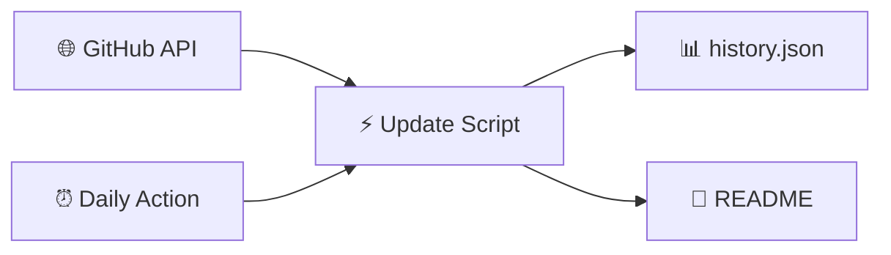

<!-- Static README shell — ranking tables are injected by Update-ParadiseFeed.ps1 -->

<div align="center">

<!-- Banner: committed PNG (reliable on GitHub — no external CDN) -->


<br/>

[](https://github.com/btstevens1984az/powershell-paradise/actions/workflows/daily-update.yml)
[](https://learn.microsoft.com/powershell/)
[](https://github.com/btstevens1984az/powershell-paradise/actions)
[](LICENSE)

<br/><br/>

<!-- PARADISE:STATS:START -->
<table align="center">
<tr>
<td align="center" width="25%">
<br/>
<h3>📅 Today</h3>
<h2>15</h2>
<sub>trending movers</sub>
<br/><br/>
</td>
<td align="center" width="25%">
<br/>
<h3>📆 This Week</h3>
<h2>15</h2>
<sub>new repos</sub>
<br/><br/>
</td>
<td align="center" width="25%">
<br/>
<h3>🗓️ This Month</h3>
<h2>15</h2>
<sub>new repos</sub>
<br/><br/>
</td>
<td align="center" width="25%">
<br/>
<h3>📈 This Year</h3>
<h2>15</h2>
<sub>new repos</sub>
<br/><br/>
</td>
</tr>
</table>
<!-- PARADISE:STATS:END -->

<br/>

<!-- PARADISE:META:START -->
<p align="center"><sub>🕐 <strong>Last refreshed:</strong> Tuesday, July 14, 2026 · 07:42 UTC · <a href="https://github.com/btstevens1984az/powershell-paradise/actions/workflows/daily-update.yml">GitHub Actions</a></sub></p>

[](https://github.com/btstevens1984az/powershell-paradise)
&nbsp;
[](https://github.com/btstevens1984az/powershell-paradise/actions)
&nbsp;
[](https://github.com/btstevens1984az/powershell-paradise)
&nbsp;
[](https://github.com/btstevens1984az/powershell-paradise)
<!-- PARADISE:META:END -->

</div>

---

## 📡 Welcome to the Paradise

> **PowerShell Paradise** is your cozy corner of GitHub for staying current — a living leaderboard that refreshes every morning with the hottest PowerShell projects, modules, and tools the community is starring right now.

<table>
<tr>
<td width="50%" valign="top">

### 🌊 What you'll find

| Window | The vibe |
|:------:|:---------|
| 🔥 **Today** | Star velocity — what's climbing *right now* |
| 📆 **Week** | Fresh repos from the last 7 days |
| 🗓️ **Month** | Standouts from the last 30 days |
| 📈 **Year** | The year's best new PowerShell repos |

</td>
<td width="50%" valign="top">

### 🧭 Jump around

| Go to | Section |
|:-----:|:--------|
| 🔥 | [Today's Top Movers](#-todays-top-movers) |
| 📆 | [This Week](#-this-weeks-top-repositories) |
| 🗓️ | [This Month](#️-this-months-top-repositories) |
| 📈 | [This Year](#-this-years-top-repositories) |
| ⚙️ | [How It Works](#️-how-it-works) |

</td>
</tr>
</table>

---

## 🔥 Today's Top Movers

[](https://github.com/btstevens1984az/powershell-paradise#-todays-top-movers)

> Repos with the biggest **star gains** since the last refresh. First run shows recently active repos instead.

<!-- PARADISE:TODAY:START -->
| # | Project | ⭐ Stars | 🍴 Forks | About | 🕐 Updated |
|:-:|---------|----------:|----------:|-------|------------|
| 🥇 |  &nbsp;**[Win11Debloat](https://github.com/Raphire/Win11Debloat)**<br/><sub><code>Raphire/Win11Debloat</code></sub> | **51.1k** &nbsp; 🚀 **+651** | 2.1k | A simple, lightweight PowerShell script that allows you to remove pre-installed apps, d…<br/> `automated`  `bloatware` | 3d ago |
| 🥈 |  &nbsp;**[winutil](https://github.com/ChrisTitusTech/winutil)**<br/><sub><code>ChrisTitusTech/winutil</code></sub> | **58k** &nbsp; 🚀 **+132** | 3.4k | Chris Titus Tech's Windows Utility - Install Programs, Tweaks, Fixes, and Updates | 13h ago |
| 🥉 |  &nbsp;**[CodexGuide](https://github.com/freestylefly/CodexGuide)**<br/><sub><code>freestylefly/CodexGuide</code></sub> | **2.7k** &nbsp; 🚀 **+72** | 264 | CodexGuide：面向全球初学者、创作者、开发者与团队的 Codex 实践指南 | 1d ago |
| **4** |  &nbsp;**[reverse-skill](https://github.com/zhaoxuya520/reverse-skill)**<br/><sub><code>zhaoxuya520/reverse-skill</code></sub> | **8.2k** &nbsp; 🚀 **+50** | 1.3k | Reverse Engineering / Authorized Penetration Testing / Security Research Skill Router P… | 4d ago |
| **5** |  &nbsp;**[claude-desktop-zh-cn](https://github.com/javaht/claude-desktop-zh-cn)**<br/><sub><code>javaht/claude-desktop-zh-cn</code></sub> | **4.9k** &nbsp; 🚀 **+34** | 252 | Claude Desktop Chinese Patch (macOS & Windows) | 50m ago |
| **6** |  &nbsp;**[psmux](https://github.com/psmux/psmux)**<br/><sub><code>psmux/psmux</code></sub> | **2.9k** &nbsp; 🚀 **+13** | 180 | Tmux on Windows Powershell - tmux for PowerShell, Windows Terminal, cmd.exe. Includes p…<br/> `cli`  `powershell` | 14h ago |
| **7** |  &nbsp;**[RemoveWindowsAI](https://github.com/zoicware/RemoveWindowsAI)**<br/><sub><code>zoicware/RemoveWindowsAI</code></sub> | **12.3k** &nbsp; 🚀 **+11** | 426 | Force Remove Copilot, Recall and More in Windows 11<br/> `ai`  `bloatware` | 15h ago |
| **8** |  &nbsp;**[SpotX](https://github.com/SpotX-Official/SpotX)**<br/><sub><code>SpotX-Official/SpotX</code></sub> | **21.7k** &nbsp; 🚀 **+10** | 1.1k | SpotX patcher used for patching the desktop version of Spotify<br/> `adblock`  `spotify` | 3d ago |
| **9** |  &nbsp;**[Office-Tool](https://github.com/YerongAI/Office-Tool)**<br/><sub><code>YerongAI/Office-Tool</code></sub> | **13.8k** &nbsp; 🚀 **+7** | 1k | Office Tool Plus localization projects.<br/> `msoffice`  `msproject` | 34d ago |
| **10** |  &nbsp;**[flare-vm](https://github.com/mandiant/flare-vm)**<br/><sub><code>mandiant/flare-vm</code></sub> | **8.9k** &nbsp; 🚀 **+7** | 1.1k | A collection of software installations scripts for Windows systems that allows you to e…<br/> `flare`  `malware-analysis` | 21d ago |
| **11** |  &nbsp;**[GOAD](https://github.com/Orange-Cyberdefense/GOAD)**<br/><sub><code>Orange-Cyberdefense/GOAD</code></sub> | **8k** &nbsp; 🚀 **+5** | 1.1k | game of active directory<br/> `active-directory`  `ansible` | 124d ago |
| **12** |  &nbsp;**[usbrubberducky-payloads](https://github.com/hak5/usbrubberducky-payloads)**<br/><sub><code>hak5/usbrubberducky-payloads</code></sub> | **5.8k** &nbsp; 🚀 **+5** | 1.7k | The Official USB Rubber Ducky Payload Repository<br/> `badusb`  `ducky-payloads` | 30d ago |
| **13** |  &nbsp;**[tiny11builder](https://github.com/ntdevlabs/tiny11builder)**<br/><sub><code>ntdevlabs/tiny11builder</code></sub> | **19.1k** &nbsp; 🚀 **+4** | 1.5k | Scripts to build a trimmed-down Windows 11 image. | 305d ago |
| **14** |  &nbsp;**[runner-images](https://github.com/actions/runner-images)**<br/><sub><code>actions/runner-images</code></sub> | **12.9k** &nbsp; 🚀 **+4** | 3.8k | GitHub Actions runner images | 19h ago |
| **15** |  &nbsp;**[docker](https://github.com/jenkinsci/docker)**<br/><sub><code>jenkinsci/docker</code></sub> | **7.6k** &nbsp; 🚀 **+4** | 4.6k | Docker official jenkins repo<br/> `docker`  `hacktoberfest` | 5d ago |
<!-- PARADISE:TODAY:END -->

---

## 📆 This Week's Top Repositories

[](https://github.com/btstevens1984az/powershell-paradise#-this-weeks-top-repositories)

> PowerShell repos **created in the last 7 days**, ranked by total stars.

<!-- PARADISE:WEEK:START -->
| # | Project | ⭐ Stars | 🍴 Forks | About | 🕐 Updated |
|:-:|---------|----------:|----------:|-------|------------|
| 🥇 |  &nbsp;**[no-gdid](https://github.com/Korben00/no-gdid)**<br/><sub><code>Korben00/no-gdid</code></sub> | **72** | 8 | Read, understand and silence the Windows GDID device identifier (the ID that tracked a … | 2d ago |
| 🥈 |  &nbsp;**[GPT5.6-5.5-](https://github.com/zxr-roro/GPT5.6-5.5-)**<br/><sub><code>zxr-roro/GPT5.6-5.5-</code></sub> | **55** | 21 | 此项目为gpt5.6/5.5破甲方案 | 4d ago |
| 🥉 |  &nbsp;**[Windows-GDID-Changer](https://github.com/gd03gd031/Windows-GDID-Changer)**<br/><sub><code>gd03gd031/Windows-GDID-Changer</code></sub> | **55** | 7 | A script that requests the generation of a new GDID from Microsoft servers and assigns … | 5d ago |
| **4** |  &nbsp;**[claude-watch](https://github.com/omidkorat/claude-watch)**<br/><sub><code>omidkorat/claude-watch</code></sub> | **20** | 1 | A macOS monitor that protects Claude usage with VPN-aware automatic process control. | 2d ago |
| **5** |  &nbsp;**[gdid-guard](https://github.com/rroy676/gdid-guard)**<br/><sub><code>rroy676/gdid-guard</code></sub> | **13** | 2 | Audit and reduce Windows GDID/CDP device-graph exposure — includes snapshot/compare and…<br/> `cdp`  `device-fingerprinting` | 7d ago |
| **6** |  &nbsp;**[Claude-Science-Windows](https://github.com/ben1ahrens/Claude-Science-Windows)**<br/><sub><code>ben1ahrens/Claude-Science-Windows</code></sub> | **12** | 0 | Run Claude Science on Windows. A WSL2-backed installer and taskbar launcher for Anthrop…<br/> `anthropic`  `bioinformatics` | 14h ago |
| **7** |  &nbsp;**[codex-desktop-model-menu-unfilter](https://github.com/I-am-gation/codex-desktop-model-menu-unfilter)**<br/><sub><code>I-am-gation/codex-desktop-model-menu-unfilter</code></sub> | **10** | 0 | Unofficial, reversible Windows utility that shows locally available models in the Codex… | 4d ago |
| **8** |  &nbsp;**[gdid-privacy](https://github.com/someguy0110/gdid-privacy)**<br/><sub><code>someguy0110/gdid-privacy</code></sub> | **9** | 1 | Control the Windows Global Device Identifier (GDID) on your own machine — rotate, spoof… | 5d ago |
| **9** |  &nbsp;**[Intune-Remote-Help-Launcher](https://github.com/Kanlikilic/Intune-Remote-Help-Launcher)**<br/><sub><code>Kanlikilic/Intune-Remote-Help-Launcher</code></sub> | **8** | 1 | Launch Microsoft Remote Help faster by searching Intune-managed devices directly from a… | 7d ago |
| **10** |  &nbsp;**[TSKSkinSwap](https://github.com/YayiMiko/TSKSkinSwap)**<br/><sub><code>YayiMiko/TSKSkinSwap</code></sub> | **7** | 0 | 将《闪耀星骑士》中通常攻击 1 和通常攻击 2 的角色演出替换为成人变身动画（R18），支持一键安装和自动下载 | 13h ago |
| **11** |  &nbsp;**[obsidian-wiki-system](https://github.com/LiyuanW21/obsidian-wiki-system)**<br/><sub><code>LiyuanW21/obsidian-wiki-system</code></sub> | **6** | 1 | A portable Obsidian wiki system for Codex, OpenCode, and other skill-capable agents. It…<br/> `llm-wiki`  `obsidian` | 6d ago |
| **12** |  &nbsp;**[agent-systems-lab](https://github.com/HariMohamed/agent-systems-lab)**<br/><sub><code>HariMohamed/agent-systems-lab</code></sub> | **6** | 0 | A curated lab for AI agent skills, workflows, scripts, system-design patterns, safety r… | 1d ago |
| **13** |  &nbsp;**[xuskill](https://github.com/xusheng-skill/xuskill)**<br/><sub><code>xusheng-skill/xuskill</code></sub> | **6** | 1 | A portable Codex Skill for AI self-media: topic selection, script audit, transcript-fir… | 2d ago |
| **14** |  &nbsp;**[amazon-market-ppt-report](https://github.com/luozhiming931123-ops/amazon-market-ppt-report)**<br/><sub><code>luozhiming931123-ops/amazon-market-ppt-report</code></sub> | **5** | 0 | Amazon marketplace analysis PPTX skill for SellerSprite/SIF MCP data, covering keyword … | 21h ago |
| **15** |  &nbsp;**[oneshot-installer-for-window](https://github.com/jikime/oneshot-installer-for-window)**<br/><sub><code>jikime/oneshot-installer-for-window</code></sub> | **5** | 2 | — | 7d ago |
<!-- PARADISE:WEEK:END -->

---

## 🗓️ This Month's Top Repositories

[](https://github.com/btstevens1984az/powershell-paradise#%EF%B8%8F-this-months-top-repositories)

> PowerShell repos **created in the last 30 days**, ranked by total stars.

<!-- PARADISE:MONTH:START -->
| # | Project | ⭐ Stars | 🍴 Forks | About | 🕐 Updated |
|:-:|---------|----------:|----------:|-------|------------|
| 🥇 |  &nbsp;**[WinTrash](https://github.com/hasoftware/WinTrash)**<br/><sub><code>hasoftware/WinTrash</code></sub> | **192** | 26 | All-in-one PowerShell toolkit that scans 16 types of Windows app leftovers (dead PATH e…<br/> `cleaner`  `cleanup` | 5d ago |
| 🥈 |  &nbsp;**[EasySSDTester](https://github.com/CWS6206/EasySSDTester)**<br/><sub><code>CWS6206/EasySSDTester</code></sub> | **143** | 36 | Easy SSD Tester - Portable Windows 11 utility for checking SSD health, SMART data and s… | 24d ago |
| 🥉 |  &nbsp;**[codex-chatgpt-bridge](https://github.com/Zhenyu98/codex-chatgpt-bridge)**<br/><sub><code>Zhenyu98/codex-chatgpt-bridge</code></sub> | **105** | 13 | A safe bridge for Codex and ChatGPT to hand off coding work, save tokens, and keep loca…<br/> `agentic-workflow`  `ai-agents` | 2d ago |
| **4** |  &nbsp;**[ralph](https://github.com/SantanderAI/ralph)**<br/><sub><code>SantanderAI/ralph</code></sub> | **88** | 28 | A configurable Bash/PowerShell loop that runs an AI coding CLI with a fresh session eac…<br/> `agent`  `agentic` | 4d ago |
| **5** |  &nbsp;**[IntuneToolKit](https://github.com/CYEBRSYSTEM-AliAlame/IntuneToolKit)**<br/><sub><code>CYEBRSYSTEM-AliAlame/IntuneToolKit</code></sub> | **83** | 21 | — | 9d ago |
| **6** |  &nbsp;**[ritual-agent-deployment](https://github.com/zunmax/ritual-agent-deployment)**<br/><sub><code>zunmax/ritual-agent-deployment</code></sub> | **74** | 49 | Deploy a recurring, self-funding sovereign AI agent on Ritual testnet with one command.<br/> `ai-agent`  `ritual-testnet` | 15d ago |
| **7** |  &nbsp;**[no-gdid](https://github.com/Korben00/no-gdid)**<br/><sub><code>Korben00/no-gdid</code></sub> | **72** | 8 | Read, understand and silence the Windows GDID device identifier (the ID that tracked a … | 2d ago |
| **8** |  &nbsp;**[cc-unlock](https://github.com/JacksonTai2007/cc-unlock)**<br/><sub><code>JacksonTai2007/cc-unlock</code></sub> | **71** | 6 | — | 6d ago |
| **9** |  &nbsp;**[ios27-beta-indexing-progress-windows](https://github.com/CZJ0219/ios27-beta-indexing-progress-windows)**<br/><sub><code>CZJ0219/ios27-beta-indexing-progress-windows</code></sub> | **68** | 3 | iOS 27 Beta Indexing Progress Percentage Checker for Windows | 17d ago |
| **10** |  &nbsp;**[GPT5.6-5.5-](https://github.com/zxr-roro/GPT5.6-5.5-)**<br/><sub><code>zxr-roro/GPT5.6-5.5-</code></sub> | **55** | 21 | 此项目为gpt5.6/5.5破甲方案 | 4d ago |
| **11** |  &nbsp;**[Windows-GDID-Changer](https://github.com/gd03gd031/Windows-GDID-Changer)**<br/><sub><code>gd03gd031/Windows-GDID-Changer</code></sub> | **55** | 7 | A script that requests the generation of a new GDID from Microsoft servers and assigns … | 5d ago |
| **12** |  &nbsp;**[HumanAI](https://github.com/MADEVAL/HumanAI)**<br/><sub><code>MADEVAL/HumanAI</code></sub> | **53** | 18 | AI skill for rewriting machine-generated text to sound human-written across 9 languages…<br/> `ai`  `anti-ai` | 2d ago |
| **13** |  &nbsp;**[operate-ui-by-screenshot](https://github.com/BanmaXM/operate-ui-by-screenshot)**<br/><sub><code>BanmaXM/operate-ui-by-screenshot</code></sub> | **52** | 0 | Codex skill for screenshot-based UI operation and browser workflow testing. | 10d ago |
| **14** |  &nbsp;**[maverick-validate](https://github.com/thermiteau/maverick-validate)**<br/><sub><code>thermiteau/maverick-validate</code></sub> | **46** | 3 | Evaluate software that was created by a coding agent | 6d ago |
| **15** |  &nbsp;**[scrcpy-helper](https://github.com/rockbenben/scrcpy-helper)**<br/><sub><code>rockbenben/scrcpy-helper</code></sub> | **45** | 5 | 免安装、双击即用的 scrcpy 中文图形界面（Windows）· A tiny, no-install Chinese GUI for scrcpy on Windows<br/> `adb`  `android` | 1d ago |
<!-- PARADISE:MONTH:END -->

---

## 📈 This Year's Top Repositories

[](https://github.com/btstevens1984az/powershell-paradise#-this-years-top-repositories)

> PowerShell repos **created since January 1**, ranked by total stars.

<!-- PARADISE:YEAR:START -->
| # | Project | ⭐ Stars | 🍴 Forks | About | 🕐 Updated |
|:-:|---------|----------:|----------:|-------|------------|
| 🥇 |  &nbsp;**[reverse-skill](https://github.com/zhaoxuya520/reverse-skill)**<br/><sub><code>zhaoxuya520/reverse-skill</code></sub> | **8.2k** | 1.3k | Reverse Engineering / Authorized Penetration Testing / Security Research Skill Router P… | 4d ago |
| 🥈 |  &nbsp;**[claude-desktop-zh-cn](https://github.com/javaht/claude-desktop-zh-cn)**<br/><sub><code>javaht/claude-desktop-zh-cn</code></sub> | **4.9k** | 252 | Claude Desktop Chinese Patch (macOS & Windows) | 50m ago |
| 🥉 |  &nbsp;**[CodexGuide](https://github.com/freestylefly/CodexGuide)**<br/><sub><code>freestylefly/CodexGuide</code></sub> | **2.7k** | 264 | CodexGuide：面向全球初学者、创作者、开发者与团队的 Codex 实践指南 | 1d ago |
| **4** |  &nbsp;**[WindowsDeveloperConfig](https://github.com/microsoft/WindowsDeveloperConfig)**<br/><sub><code>microsoft/WindowsDeveloperConfig</code></sub> | **1.8k** | 138 | Automate the setup and configuration of your Windows development environment. | 4d ago |
| **5** |  &nbsp;**[selfware.md](https://github.com/floatboatai/selfware.md)**<br/><sub><code>floatboatai/selfware.md</code></sub> | **1.1k** | 95 | — | 128d ago |
| **6** |  &nbsp;**[work-iq](https://github.com/microsoft/work-iq)**<br/><sub><code>microsoft/work-iq</code></sub> | **936** | 107 | MCP Server and CLI for accessing Work IQ | 14d ago |
| **7** |  &nbsp;**[codex-windows-fast-patch-skill](https://github.com/chen0416ccc-cpu/codex-windows-fast-patch-skill)**<br/><sub><code>chen0416ccc-cpu/codex-windows-fast-patch-skill</code></sub> | **935** | 101 | 此skills用于指导智能体在 Windows 上恢复 Codex Desktop 升级后失效的本地补丁和能力开关。（Computer Use，插件，破限，codex强制汉化… | 6h ago |
| **8** |  &nbsp;**[get-shit-done-for-antigravity](https://github.com/toonight/get-shit-done-for-antigravity)**<br/><sub><code>toonight/get-shit-done-for-antigravity</code></sub> | **905** | 142 | — | 104d ago |
| **9** |  &nbsp;**[commands](https://github.com/GuDaStudio/commands)**<br/><sub><code>GuDaStudio/commands</code></sub> | **886** | 51 | — | 158d ago |
| **10** |  &nbsp;**[PsiphonOverMITM](https://github.com/B3hnamR/PsiphonOverMITM)**<br/><sub><code>B3hnamR/PsiphonOverMITM</code></sub> | **548** | 79 | — | 61d ago |
| **11** |  &nbsp;**[PrivHound](https://github.com/dazzyddos/PrivHound)**<br/><sub><code>dazzyddos/PrivHound</code></sub> | **506** | 47 | A BloodHound OpenGraph collector that models Windows local privilege escalation as inte… | 79d ago |
| **12** |  &nbsp;**[ai-business-skills](https://github.com/minhnv0807/ai-business-skills)**<br/><sub><code>minhnv0807/ai-business-skills</code></sub> | **495** | 213 | 63 bilingual AI marketing skills (31 VN + 31 Global) for Claude Code, OpenCode, Codex, …<br/> `agent-skills`  `ai-agents` | 5d ago |
| **13** |  &nbsp;**[Bonsai-Image-Demo](https://github.com/PrismML-Eng/Bonsai-Image-Demo)**<br/><sub><code>PrismML-Eng/Bonsai-Image-Demo</code></sub> | **480** | 67 | Generate images locally<br/> `1-bit`  `bonsai` | 30d ago |
| **14** |  &nbsp;**[codex-visio-paper-figure-skill](https://github.com/pengjunchi0/codex-visio-paper-figure-skill)**<br/><sub><code>pengjunchi0/codex-visio-paper-figure-skill</code></sub> | **475** | 22 | 科研绘图skill、论文绘图skill、图片转visio等可编辑格式，将生成图转化为论文可编辑图，便于作者调整绘图细节<br/> `academic-figures`  `codex` | 21d ago |
| **15** |  &nbsp;**[WinUtil_CN](https://github.com/constansino/WinUtil_CN)**<br/><sub><code>constansino/WinUtil_CN</code></sub> | **475** | 59 | WinUtil_CN：Chris Titus Tech WinUtil 中文汉化版，提供 WinUtil 中文界面、中文说明、Tweaks 中文解释与 Win11ISO 中文支持<br/> `chinese`  `chris-titus-tech` | 60d ago |
<!-- PARADISE:YEAR:END -->

---

## ⚙️ How It Works



| Step | What happens |
|:----:|:-------------|
| 1️⃣ | Query GitHub for `language:powershell` repos with real activity |
| 2️⃣ | Compare star counts to yesterday's snapshot for velocity |
| 3️⃣ | Build four bubbly ranking tables — top 15 each |
| 4️⃣ | Auto-commit back to this README every morning at 06:00 UTC |

<details>
<summary><b>🛠️ Run locally</b></summary>

```powershell
$env:GITHUB_TOKEN = 'ghp_your_token'   # optional — higher API limits
./scripts/Update-ParadiseFeed.ps1
```

</details>

<details>
<summary><b>🔍 Filters applied</b></summary>

- Language: **PowerShell** · Forks excluded · Minimum **3 stars** · Top **15** per table

</details>

---

## 🌟 Why star this repo?

<table>
<tr>
<td align="center">😴<br/><b>Zero effort</b><br/><sub>Updates while you sleep</sub></td>
<td align="center">📡<br/><b>Community signal</b><br/><sub>See what builders love</sub></td>
<td align="center">🎓<br/><b>Learning radar</b><br/><sub>Find modules worth studying</sub></td>
<td align="center">🔓<br/><b>Open source</b><br/><sub>Fork &amp; adapt freely</sub></td>
</tr>
</table>

---

## 📜 License

MIT — see [LICENSE](LICENSE).

---

<div align="center">

**Built with ❤️ for the PowerShell community**

*Star this repo to get daily trending PowerShell projects in your GitHub feed.*

</div>
