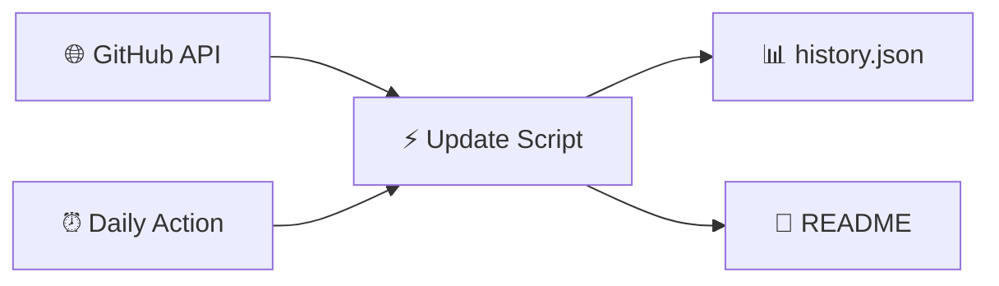

<!-- Static README shell — ranking tables are injected by Update-ParadiseFeed.ps1 -->

<div align="center">

<!-- Banner: committed PNG (reliable on GitHub — no external CDN) -->


<br/>

[](https://github.com/btstevens1984az/powershell-paradise/actions/workflows/daily-update.yml)
[](https://learn.microsoft.com/powershell/)
[](https://github.com/btstevens1984az/powershell-paradise/actions)
[](LICENSE)

<br/><br/>

<!-- PARADISE:STATS:START -->
<table align="center">
<tr>
<td align="center" width="25%">
<br/>
<h3>📅 Today</h3>
<h2>15</h2>
<sub>trending movers</sub>
<br/><br/>
</td>
<td align="center" width="25%">
<br/>
<h3>📆 This Week</h3>
<h2>15</h2>
<sub>new repos</sub>
<br/><br/>
</td>
<td align="center" width="25%">
<br/>
<h3>🗓️ This Month</h3>
<h2>15</h2>
<sub>new repos</sub>
<br/><br/>
</td>
<td align="center" width="25%">
<br/>
<h3>📈 This Year</h3>
<h2>15</h2>
<sub>new repos</sub>
<br/><br/>
</td>
</tr>
</table>
<!-- PARADISE:STATS:END -->

<br/>

<!-- PARADISE:META:START -->
<p align="center"><sub>🕐 <strong>Last refreshed:</strong> Thursday, September 10, 2026 · 10:37 UTC · <a href="https://github.com/btstevens1984az/powershell-paradise/actions/workflows/daily-update.yml">GitHub Actions</a></sub></p>

[](https://github.com/btstevens1984az/powershell-paradise)
&nbsp;
[](https://github.com/btstevens1984az/powershell-paradise/actions)
&nbsp;
[](https://github.com/btstevens1984az/powershell-paradise)
&nbsp;
[](https://github.com/btstevens1984az/powershell-paradise)
<!-- PARADISE:META:END -->

</div>

---

## 📡 Welcome to the Paradise

> **PowerShell Paradise** is your cozy corner of GitHub for staying current — a living leaderboard that refreshes every morning with the hottest PowerShell projects, modules, and tools the community is starring right now.

<table>
<tr>
<td width="50%" valign="top">

### 🌊 What you'll find

| Window | The vibe |
|:------:|:---------|
| 🔥 **Today** | Star velocity — what's climbing *right now* |
| 📆 **Week** | Fresh repos from the last 7 days |
| 🗓️ **Month** | Standouts from the last 30 days |
| 📈 **Year** | The year's best new PowerShell repos |

</td>
<td width="50%" valign="top">

### 🧭 Jump around

| Go to | Section |
|:-----:|:--------|
| 🔥 | [Today's Top Movers](#-todays-top-movers) |
| 📆 | [This Week](#-this-weeks-top-repositories) |
| 🗓️ | [This Month](#️-this-months-top-repositories) |
| 📈 | [This Year](#-this-years-top-repositories) |
| ⚙️ | [How It Works](#️-how-it-works) |

</td>
</tr>
</table>

---

## 🔥 Today's Top Movers

[](https://github.com/btstevens1984az/powershell-paradise#-todays-top-movers)

> Repos with the biggest **star gains** since the last refresh. First run shows recently active repos instead.

<!-- PARADISE:TODAY:START -->
| # | Project | ⭐ Stars | 🍴 Forks | About | 🕐 Updated |
|:-:|---------|----------:|----------:|-------|------------|
| 🥇 |  &nbsp;**[reverse-skill](https://github.com/zhaoxuya520/reverse-skill)**<br/><sub><code>zhaoxuya520/reverse-skill</code></sub> | **35.4k** &nbsp; 🚀 **+181** | 4.8k | Reverse Engineering / Authorized Penetration Testing / Security Research Skill Router P… | 7d ago |
| 🥈 |  &nbsp;**[winutil](https://github.com/ChrisTitusTech/winutil)**<br/><sub><code>ChrisTitusTech/winutil</code></sub> | **62.3k** &nbsp; 🚀 **+72** | 3.6k | Chris Titus Tech's Windows Utility - Install Programs, Tweaks, Fixes, and Updates | 9h ago |
| 🥉 |  &nbsp;**[Win11Debloat](https://github.com/Raphire/Win11Debloat)**<br/><sub><code>Raphire/Win11Debloat</code></sub> | **56.9k** &nbsp; 🚀 **+52** | 2.4k | A simple, lightweight PowerShell script that allows you to remove pre-installed apps, d…<br/> `automated`  `bloatware` | 6d ago |
| **4** |  &nbsp;**[WindowsDeveloperConfig](https://github.com/microsoft/WindowsDeveloperConfig)**<br/><sub><code>microsoft/WindowsDeveloperConfig</code></sub> | **2.1k** &nbsp; 🚀 **+15** | 161 | Automate the setup and configuration of your Windows development environment. | 5d ago |
| **5** |  &nbsp;**[SpotX](https://github.com/SpotX-Official/SpotX)**<br/><sub><code>SpotX-Official/SpotX</code></sub> | **22.3k** &nbsp; 🚀 **+12** | 1.1k | SpotX patcher used for patching the desktop version of Spotify<br/> `adblock`  `spotify` | 13h ago |
| **6** |  &nbsp;**[RemoveWindowsAI](https://github.com/zoicware/RemoveWindowsAI)**<br/><sub><code>zoicware/RemoveWindowsAI</code></sub> | **13k** &nbsp; 🚀 **+11** | 458 | Force Remove Copilot, Recall and More in Windows 11<br/> `ai`  `bloatware` | 2d ago |
| **7** |  &nbsp;**[Office-Tool](https://github.com/YerongAI/Office-Tool)**<br/><sub><code>YerongAI/Office-Tool</code></sub> | **14.2k** &nbsp; 🚀 **+10** | 1.1k | Office Tool Plus localization projects.<br/> `msoffice`  `msproject` | 24h ago |
| **8** |  &nbsp;**[tiny11builder](https://github.com/ntdevlabs/tiny11builder)**<br/><sub><code>ntdevlabs/tiny11builder</code></sub> | **19.6k** &nbsp; 🚀 **+9** | 1.5k | Scripts to build a trimmed-down Windows 11 image. | 363d ago |
| **9** |  &nbsp;**[psmux](https://github.com/psmux/psmux)**<br/><sub><code>psmux/psmux</code></sub> | **3.5k** &nbsp; 🚀 **+7** | 210 | Tmux on Windows Powershell - tmux for PowerShell, Windows Terminal, cmd.exe. Includes p…<br/> `cli`  `powershell` | 6h ago |
| **10** |  &nbsp;**[runner-images](https://github.com/actions/runner-images)**<br/><sub><code>actions/runner-images</code></sub> | **13.1k** &nbsp; 🚀 **+6** | 3.8k | GitHub Actions runner images | 22h ago |
| **11** |  &nbsp;**[flare-vm](https://github.com/mandiant/flare-vm)**<br/><sub><code>mandiant/flare-vm</code></sub> | **9k** &nbsp; 🚀 **+5** | 1.1k | A collection of software installations scripts for Windows systems that allows you to e…<br/> `flare`  `malware-analysis` | 79d ago |
| **12** |  &nbsp;**[GOAD](https://github.com/Orange-Cyberdefense/GOAD)**<br/><sub><code>Orange-Cyberdefense/GOAD</code></sub> | **8.3k** &nbsp; 🚀 **+5** | 1.1k | game of active directory<br/> `active-directory`  `ansible` | 182d ago |
| **13** |  &nbsp;**[Flipper-Zero-BadUSB](https://github.com/I-Am-Jakoby/Flipper-Zero-BadUSB)**<br/><sub><code>I-Am-Jakoby/Flipper-Zero-BadUSB</code></sub> | **7.1k** &nbsp; 🚀 **+4** | 890 | Repository for my flipper zero badUSB payloads. Now almost entirely plug and play.<br/> `badusb`  `badusb-payloads` | 817d ago |
| **14** |  &nbsp;**[usbrubberducky-payloads](https://github.com/hak5/usbrubberducky-payloads)**<br/><sub><code>hak5/usbrubberducky-payloads</code></sub> | **6k** &nbsp; 🚀 **+4** | 1.7k | The Official USB Rubber Ducky Payload Repository<br/> `badusb`  `ducky-payloads` | 9d ago |
| **15** |  &nbsp;**[PrivescCheck](https://github.com/itm4n/PrivescCheck)**<br/><sub><code>itm4n/PrivescCheck</code></sub> | **4k** &nbsp; 🚀 **+4** | 507 | Privilege Escalation Enumeration Script for Windows<br/> `pentest-tool`  `pentesting` | 22h ago |
<!-- PARADISE:TODAY:END -->

---

## 📆 This Week's Top Repositories

[](https://github.com/btstevens1984az/powershell-paradise#-this-weeks-top-repositories)

> PowerShell repos **created in the last 7 days**, ranked by total stars.

<!-- PARADISE:WEEK:START -->
| # | Project | ⭐ Stars | 🍴 Forks | About | 🕐 Updated |
|:-:|---------|----------:|----------:|-------|------------|
| 🥇 |  &nbsp;**[vintage-latex](https://github.com/Foadsf/vintage-latex)**<br/><sub><code>Foadsf/vintage-latex</code></sub> | **170** | 11 | Twenty LuaLaTeX and MetaPost (fiziko) examples of the old scientific-paper aesthetic: e…<br/> `fiziko`  `latex` | 21h ago |
| 🥈 |  &nbsp;**[rdp-scripts](https://github.com/durdoom/rdp-scripts)**<br/><sub><code>durdoom/rdp-scripts</code></sub> | **27** | 0 | RDP concurrent sessions limit remover for Windows | 21h ago |
| 🥉 |  &nbsp;**[TejOS](https://github.com/Suraj-Singh1/TejOS)**<br/><sub><code>Suraj-Singh1/TejOS</code></sub> | **26** | 0 | PowerShell + DISM tool that builds a debloated Windows 11 ISO with TPM and Secure Boot …<br/> `autounattend`  `debloat` | 2d ago |
| **4** |  &nbsp;**[HashSiphon](https://github.com/ivancabrera02/HashSiphon)**<br/><sub><code>ivancabrera02/HashSiphon</code></sub> | **26** | 5 | — | 3d ago |
| **5** |  &nbsp;**[Get-ServerFullReport](https://github.com/KikeMuller/Get-ServerFullReport)**<br/><sub><code>KikeMuller/Get-ServerFullReport</code></sub> | **25** | 10 | Inventario as-built y health check de servidores Windows en un solo .ps1<br/> `as-built`  `audit` | 4d ago |
| **6** |  &nbsp;**[Resonance-A-Plague-Tale-Legacy-Trainer](https://github.com/ivan-chen-x20b1/Resonance-A-Plague-Tale-Legacy-Trainer)**<br/><sub><code>ivan-chen-x20b1/Resonance-A-Plague-Tale-Legacy-Trainer</code></sub> | **16** | 3 | Resonance: A Plague Tale Legacy Trainer toolkit for Windows with Resonance Points Edito…<br/> `2026`  `change-resonance-points` | 1m ago |
| **7** |  &nbsp;**[A-Plague-Tale-Resonance-Trainer](https://github.com/samlio1997g4/A-Plague-Tale-Resonance-Trainer)**<br/><sub><code>samlio1997g4/A-Plague-Tale-Resonance-Trainer</code></sub> | **16** | 3 | Resonance: A Plague Tale Legacy Trainer toolkit for Windows with Resonance Points Edito…<br/> `2026`  `change-resonance-points` | 1m ago |
| **8** |  &nbsp;**[phaneslight](https://github.com/Aloim/phaneslight)**<br/><sub><code>Aloim/phaneslight</code></sub> | **13** | 2 | PhanesLight, manual install: multi-agent orchestration and durable project memory for C…<br/> `agent-skill`  `ai-agents` | 5d ago |
| **9** |  &nbsp;**[wsl-reclaim](https://github.com/ttncode/wsl-reclaim)**<br/><sub><code>ttncode/wsl-reclaim</code></sub> | **12** | 0 | Reclaim WSL2 disk space for real: clean inside the distro, then compact the .vhdx on Wi…<br/> `bash`  `cli` | 1d ago |
| **10** |  &nbsp;**[LaFirma-Remux-Forge](https://github.com/tkt2m7g87w-netizen/LaFirma-Remux-Forge)**<br/><sub><code>tkt2m7g87w-netizen/LaFirma-Remux-Forge</code></sub> | **10** | 0 | Remux MKV automatizado: mede a camada DV (MEL/FEL) antes de converter 7 para 8.1, Perfi… | 6h ago |
| **11** |  &nbsp;**[Dnvo-Janus](https://github.com/Contrary7/Dnvo-Janus)**<br/><sub><code>Contrary7/Dnvo-Janus</code></sub> | **8** | 0 | A desktop client and runtime for Steam CM protocol analysis and Denuvo Anti-Tamper lice… | 5d ago |
| **12** |  &nbsp;**[museum-relic-stamp](https://github.com/tanglele110-hash/museum-relic-stamp)**<br/><sub><code>tanglele110-hash/museum-relic-stamp</code></sub> | **7** | 2 | 博物馆文物图章 Agent Skill：文物参考图生成六色印谱海报。By @木渡川（TANGLELE） · MIT + CC BY 4.0 | 7d ago |
| **13** |  &nbsp;**[cc-switch-codex-cross-provider-bridge](https://github.com/StrengW/cc-switch-codex-cross-provider-bridge)**<br/><sub><code>StrengW/cc-switch-codex-cross-provider-bridge</code></sub> | **6** | 0 | 让 Codex 在 CC Switch 的 OpenAI Official 与第三方 Provider 之间切换后，仍能继续原来的会话。Continue Codex sess…<br/> `cc-switch`  `codex` | 16h ago |
| **14** |  &nbsp;**[iphone-usb-reverse-tethering-windows](https://github.com/0xbaksa/iphone-usb-reverse-tethering-windows)**<br/><sub><code>0xbaksa/iphone-usb-reverse-tethering-windows</code></sub> | **5** | 0 | Share your Windows PC's internet with an iPhone over a USB cable (reverse tethering). N…<br/> `cdc-ncm`  `hotel-wifi` | 6d ago |
| **15** |  &nbsp;**[v9000](https://github.com/221705/v9000)**<br/><sub><code>221705/v9000</code></sub> | **5** | 0 | After reviewing the 90HX unlock solutions posted by various experts on GitHub, I’m trul… | 2h ago |
<!-- PARADISE:WEEK:END -->

---

## 🗓️ This Month's Top Repositories

[](https://github.com/btstevens1984az/powershell-paradise#%EF%B8%8F-this-months-top-repositories)

> PowerShell repos **created in the last 30 days**, ranked by total stars.

<!-- PARADISE:MONTH:START -->
| # | Project | ⭐ Stars | 🍴 Forks | About | 🕐 Updated |
|:-:|---------|----------:|----------:|-------|------------|
| 🥇 |  &nbsp;**[cell-lct](https://github.com/yrui-cmd/cell-lct)**<br/><sub><code>yrui-cmd/cell-lct</code></sub> | **341** | 11 | Cell-lct：面向 Adobe Illustrator 的可编辑科研矢量绘图插件。免费额度每天抖音群里提供，抖音名（木纹），私人额度小红书找：木纹小路 | 4d ago |
| 🥈 |  &nbsp;**[creator-flow](https://github.com/Damonhhh/creator-flow)**<br/><sub><code>Damonhhh/creator-flow</code></sub> | **263** | 50 | CreatorFlow：从选题、评分、脚本、配音和素材一路走到成片与发布包的 Codex 自媒体视频工作流 | 17d ago |
| 🥉 |  &nbsp;**[vintage-latex](https://github.com/Foadsf/vintage-latex)**<br/><sub><code>Foadsf/vintage-latex</code></sub> | **170** | 11 | Twenty LuaLaTeX and MetaPost (fiziko) examples of the old scientific-paper aesthetic: e…<br/> `fiziko`  `latex` | 21h ago |
| **4** |  &nbsp;**[windows-cursor-scheme-fix](https://github.com/Arcadeq/windows-cursor-scheme-fix)**<br/><sub><code>Arcadeq/windows-cursor-scheme-fix</code></sub> | **139** | 1 | Fixes an issue where custom mouse cursor themes stop working after a Windows 11 update …<br/> `cursor`  `mouse-pointer` | 7d ago |
| **5** |  &nbsp;**[SteamDaddy-Backup](https://github.com/Contrary7/SteamDaddy-Backup)**<br/><sub><code>Contrary7/SteamDaddy-Backup</code></sub> | **135** | 12 | The ultimate SteamTools & GreenLuma alternative. Auto-unlock DLCs, fix connection & pur… | 14h ago |
| **6** |  &nbsp;**[dsh-reverse-skill](https://github.com/dhicoc/dsh-reverse-skill)**<br/><sub><code>dhicoc/dsh-reverse-skill</code></sub> | **127** | 12 | Complete reverse-skill (87 SKILL.md) as a DeepSeek Harness (dsh) Cordis plugin — revers…<br/> `ctf`  `deepseek-harness` | 15d ago |
| **7** |  &nbsp;**[material-design-3-ui-skill](https://github.com/skydashnet/material-design-3-ui-skill)**<br/><sub><code>skydashnet/material-design-3-ui-skill</code></sub> | **115** | 9 | A reusable Agent Skill for designing, reviewing, and implementing UI/UX with Google Mat…<br/> `accessibility`  `adaptive-design` | 23d ago |
| **8** |  &nbsp;**[codex-task-pointer](https://github.com/big0lives/codex-task-pointer)**<br/><sub><code>big0lives/codex-task-pointer</code></sub> | **99** | 10 | Pre-compaction hooks + a CAS-guarded task pointer that keep Codex agents on-goal across…<br/> `agent-hooks`  `agents` | 11d ago |
| **9** |  &nbsp;**[codex-multi-profile](https://github.com/Hung2124/codex-multi-profile)**<br/><sub><code>Hung2124/codex-multi-profile</code></sub> | **94** | 84 | Windows Codex Desktop multi-account via AuthSwap. Shared workspace, separate ChatGPT lo…<br/> `agent-skills`  `chatgpt` | 21d ago |
| **10** |  &nbsp;**[Ronnier-skill](https://github.com/Ayueh0102/Ronnier-skill)**<br/><sub><code>Ayueh0102/Ronnier-skill</code></sub> | **90** | 6 | 色彩科學／色度學完整中文學習筆記，包裝成 Claude Code skill，也支援 Codex。涵蓋 CIE 色度學、CIEDE2000、CIECAM02、色適應與演色性。<br/> `agent-md`  `ciecam02` | 15d ago |
| **11** |  &nbsp;**[psxrecomp-ports](https://github.com/Alexbeav/psxrecomp-ports)**<br/><sub><code>Alexbeav/psxrecomp-ports</code></sub> | **70** | 1 | Unofficial noncommercial PlayStation recompilation releases<br/> `compatibility`  `game-preservation` | 3d ago |
| **12** |  &nbsp;**[codebase-reverse](https://github.com/sharptoolbox/codebase-reverse)**<br/><sub><code>sharptoolbox/codebase-reverse</code></sub> | **66** | 33 | 完整源码逆向工程技能：把存量源码逆向为功能/实现/架构/接口/对象/组件/数据库完整元模型，深度定制于 Java Web 与 Java 微服务(Spring Boot/Clo… | 11d ago |
| **13** |  &nbsp;**[visio-com-skill](https://github.com/WUXU-Tech/visio-com-skill)**<br/><sub><code>WUXU-Tech/visio-com-skill</code></sub> | **55** | 0 | A clean-room Codex skill for generating editable Microsoft Visio .vsdx diagrams through… | 8d ago |
| **14** |  &nbsp;**[embedded-project-governance](https://github.com/crichars/embedded-project-governance)**<br/><sub><code>crichars/embedded-project-governance</code></sub> | **53** | 1 | 面向 AI 辅助嵌入式固件开发的轻量、风险分级治理 skill<br/> `agent-skills`  `claude-code` | 7d ago |
| **15** |  &nbsp;**[Zerohub](https://github.com/ZeroIQs/Zerohub)**<br/><sub><code>ZeroIQs/Zerohub</code></sub> | **50** | 3 | — | 7d ago |
<!-- PARADISE:MONTH:END -->

---

## 📈 This Year's Top Repositories

[](https://github.com/btstevens1984az/powershell-paradise#-this-years-top-repositories)

> PowerShell repos **created since January 1**, ranked by total stars.

<!-- PARADISE:YEAR:START -->
| # | Project | ⭐ Stars | 🍴 Forks | About | 🕐 Updated |
|:-:|---------|----------:|----------:|-------|------------|
| 🥇 |  &nbsp;**[reverse-skill](https://github.com/zhaoxuya520/reverse-skill)**<br/><sub><code>zhaoxuya520/reverse-skill</code></sub> | **35.4k** | 4.8k | Reverse Engineering / Authorized Penetration Testing / Security Research Skill Router P… | 7d ago |
| 🥈 |  &nbsp;**[WindowsDeveloperConfig](https://github.com/microsoft/WindowsDeveloperConfig)**<br/><sub><code>microsoft/WindowsDeveloperConfig</code></sub> | **2.1k** | 161 | Automate the setup and configuration of your Windows development environment. | 5d ago |
| 🥉 |  &nbsp;**[clawgod](https://github.com/0Chencc/clawgod)**<br/><sub><code>0Chencc/clawgod</code></sub> | **2k** | 326 | ClawGod is a runtime patch applied to the official Claude Code. It continues to be supp…<br/> `ai`  `assistant` | 22h ago |
| **4** |  &nbsp;**[cinema-dna-21x9x3](https://github.com/dacnay816y62-hub/cinema-dna-21x9x3)**<br/><sub><code>dacnay816y62-hub/cinema-dna-21x9x3</code></sub> | **1.3k** | 137 | 高级感电影画面生成 | 22h ago |
| **5** |  &nbsp;**[codex-windows-fast-patch-skill](https://github.com/chen0416ccc-cpu/codex-windows-fast-patch-skill)**<br/><sub><code>chen0416ccc-cpu/codex-windows-fast-patch-skill</code></sub> | **1.2k** | 123 | 此skills用于指导智能体在 Windows 上恢复 Codex Desktop 升级后失效的本地补丁和能力开关。（Computer Use，插件，破限，codex强制汉化… | 3d ago |
| **6** |  &nbsp;**[selfware.md](https://github.com/floatboatai/selfware.md)**<br/><sub><code>floatboatai/selfware.md</code></sub> | **1.1k** | 94 | — | 186d ago |
| **7** |  &nbsp;**[GrapeRoot](https://github.com/kunal12203/GrapeRoot)**<br/><sub><code>kunal12203/GrapeRoot</code></sub> | **1k** | 123 | Compounding Context for AI Coding Assistants — MCP graph engine for Claude Code, Cursor…<br/> `ai-coding`  `claude-code` | 7d ago |
| **8** |  &nbsp;**[work-iq](https://github.com/microsoft/work-iq)**<br/><sub><code>microsoft/work-iq</code></sub> | **996** | 126 | MCP Server and CLI for accessing Work IQ | 11h ago |
| **9** |  &nbsp;**[get-shit-done-for-antigravity](https://github.com/toonight/get-shit-done-for-antigravity)**<br/><sub><code>toonight/get-shit-done-for-antigravity</code></sub> | **946** | 151 | — | 21d ago |
| **10** |  &nbsp;**[deGDID](https://github.com/yegors/deGDID)**<br/><sub><code>yegors/deGDID</code></sub> | **910** | 46 | Deletes all instances of Microsoft's GDID and prevents minting of new ones | 33d ago |
| **11** |  &nbsp;**[commands](https://github.com/GuDaStudio/commands)**<br/><sub><code>GuDaStudio/commands</code></sub> | **877** | 49 | — | 216d ago |
| **12** |  &nbsp;**[codex-visio-paper-figure-skill](https://github.com/pengjunchi0/codex-visio-paper-figure-skill)**<br/><sub><code>pengjunchi0/codex-visio-paper-figure-skill</code></sub> | **854** | 40 | 科研绘图skill、论文绘图skill、图片转visio等可编辑格式，将生成图转化为论文可编辑图，便于作者调整绘图细节<br/> `academic-figures`  `codex` | 25d ago |
| **13** |  &nbsp;**[Light-Help](https://github.com/Cotton059/Light-Help)**<br/><sub><code>Cotton059/Light-Help</code></sub> | **620** | 262 | Help the audience perform some complex operations. | 6d ago |
| **14** |  &nbsp;**[ai-business-skills](https://github.com/minhnv0807/ai-business-skills)**<br/><sub><code>minhnv0807/ai-business-skills</code></sub> | **572** | 226 | 138 bilingual AI marketing skills (69 VN + 69 Global) for Claude Code, OpenCode, Codex,…<br/> `agent-skills`  `ai-agents` | 24d ago |
| **15** |  &nbsp;**[PsiphonOverMITM](https://github.com/B3hnamR/PsiphonOverMITM)**<br/><sub><code>B3hnamR/PsiphonOverMITM</code></sub> | **545** | 78 | — | 119d ago |
<!-- PARADISE:YEAR:END -->

---

## ⚙️ How It Works


```mermaid
flowchart LR
    A["🌐 GitHub API"] --> B["⚡ Update Script"]
    B --> C["📊 history.json"]
    B --> D["📝 README"]
    E["⏰ Daily Action"] --> B
```

| Step | What happens |
|:----:|:-------------|
| 1️⃣ | Query GitHub for `language:powershell` repos with real activity |
| 2️⃣ | Compare star counts to yesterday's snapshot for velocity |
| 3️⃣ | Build four bubbly ranking tables — top 15 each |
| 4️⃣ | Auto-commit back to this README every morning at 06:00 UTC |

<details>
<summary><b>🛠️ Run locally</b></summary>

```powershell
$env:GITHUB_TOKEN = 'ghp_your_token'   # optional — higher API limits
./scripts/Update-ParadiseFeed.ps1
```

</details>

<details>
<summary><b>🔍 Filters applied</b></summary>

- Language: **PowerShell** · Forks excluded · Minimum **3 stars** · Top **15** per table

</details>

---

## 🌟 Why star this repo?

<table>
<tr>
<td align="center">😴<br/><b>Zero effort</b><br/><sub>Updates while you sleep</sub></td>
<td align="center">📡<br/><b>Community signal</b><br/><sub>See what builders love</sub></td>
<td align="center">🎓<br/><b>Learning radar</b><br/><sub>Find modules worth studying</sub></td>
<td align="center">🔓<br/><b>Open source</b><br/><sub>Fork &amp; adapt freely</sub></td>
</tr>
</table>

---

## 📜 License

MIT — see [LICENSE](LICENSE).

---

<div align="center">

**Built with ❤️ for the PowerShell community**

*Star this repo to get daily trending PowerShell projects in your GitHub feed.*

</div>
