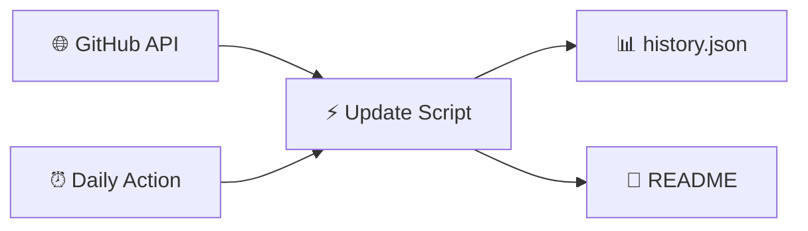

<!-- Static README shell — ranking tables are injected by Update-ParadiseFeed.ps1 -->

<div align="center">

<!-- Banner: committed PNG (reliable on GitHub — no external CDN) -->


<br/>

[](https://github.com/btstevens1984az/powershell-paradise/actions/workflows/daily-update.yml)
[](https://learn.microsoft.com/powershell/)
[](https://github.com/btstevens1984az/powershell-paradise/actions)
[](LICENSE)

<br/><br/>

<!-- PARADISE:STATS:START -->
<table align="center">
<tr>
<td align="center" width="25%">
<br/>
<h3>📅 Today</h3>
<h2>15</h2>
<sub>trending movers</sub>
<br/><br/>
</td>
<td align="center" width="25%">
<br/>
<h3>📆 This Week</h3>
<h2>15</h2>
<sub>new repos</sub>
<br/><br/>
</td>
<td align="center" width="25%">
<br/>
<h3>🗓️ This Month</h3>
<h2>15</h2>
<sub>new repos</sub>
<br/><br/>
</td>
<td align="center" width="25%">
<br/>
<h3>📈 This Year</h3>
<h2>15</h2>
<sub>new repos</sub>
<br/><br/>
</td>
</tr>
</table>
<!-- PARADISE:STATS:END -->

<br/>

<!-- PARADISE:META:START -->
<p align="center"><sub>🕐 <strong>Last refreshed:</strong> Friday, September 25, 2026 · 11:09 UTC · <a href="https://github.com/btstevens1984az/powershell-paradise/actions/workflows/daily-update.yml">GitHub Actions</a></sub></p>

[](https://github.com/btstevens1984az/powershell-paradise)
&nbsp;
[](https://github.com/btstevens1984az/powershell-paradise/actions)
&nbsp;
[](https://github.com/btstevens1984az/powershell-paradise)
&nbsp;
[](https://github.com/btstevens1984az/powershell-paradise)
<!-- PARADISE:META:END -->

</div>

---

## 📡 Welcome to the Paradise

> **PowerShell Paradise** is your cozy corner of GitHub for staying current — a living leaderboard that refreshes every morning with the hottest PowerShell projects, modules, and tools the community is starring right now.

<table>
<tr>
<td width="50%" valign="top">

### 🌊 What you'll find

| Window | The vibe |
|:------:|:---------|
| 🔥 **Today** | Star velocity — what's climbing *right now* |
| 📆 **Week** | Fresh repos from the last 7 days |
| 🗓️ **Month** | Standouts from the last 30 days |
| 📈 **Year** | The year's best new PowerShell repos |

</td>
<td width="50%" valign="top">

### 🧭 Jump around

| Go to | Section |
|:-----:|:--------|
| 🔥 | [Today's Top Movers](#-todays-top-movers) |
| 📆 | [This Week](#-this-weeks-top-repositories) |
| 🗓️ | [This Month](#️-this-months-top-repositories) |
| 📈 | [This Year](#-this-years-top-repositories) |
| ⚙️ | [How It Works](#️-how-it-works) |

</td>
</tr>
</table>

---

## 🔥 Today's Top Movers

[](https://github.com/btstevens1984az/powershell-paradise#-todays-top-movers)

> Repos with the biggest **star gains** since the last refresh. First run shows recently active repos instead.

<!-- PARADISE:TODAY:START -->
| # | Project | ⭐ Stars | 🍴 Forks | About | 🕐 Updated |
|:-:|---------|----------:|----------:|-------|------------|
| 🥇 |  &nbsp;**[reverse-skill](https://github.com/zhaoxuya520/reverse-skill)**<br/><sub><code>zhaoxuya520/reverse-skill</code></sub> | **37.4k** &nbsp; 🚀 **+254** | 5.2k | Reverse Engineering / Authorized Penetration Testing / Security Research Skill Router P… | 3d ago |
| 🥈 |  &nbsp;**[winutil](https://github.com/ChrisTitusTech/winutil)**<br/><sub><code>ChrisTitusTech/winutil</code></sub> | **63.1k** &nbsp; 🚀 **+33** | 3.7k | Chris Titus Tech's Windows Utility - Install Programs, Tweaks, Fixes, and Updates | 5d ago |
| 🥉 |  &nbsp;**[Win11Debloat](https://github.com/Raphire/Win11Debloat)**<br/><sub><code>Raphire/Win11Debloat</code></sub> | **57.6k** &nbsp; 🚀 **+31** | 2.5k | A simple, lightweight PowerShell script that allows you to remove pre-installed apps, d…<br/> `automated`  `bloatware` | 15d ago |
| **4** |  &nbsp;**[runner-images](https://github.com/actions/runner-images)**<br/><sub><code>actions/runner-images</code></sub> | **13.2k** &nbsp; 🚀 **+18** | 3.9k | GitHub Actions runner images | 49m ago |
| **5** |  &nbsp;**[WindowsDeveloperConfig](https://github.com/microsoft/WindowsDeveloperConfig)**<br/><sub><code>microsoft/WindowsDeveloperConfig</code></sub> | **2.2k** &nbsp; 🚀 **+13** | 170 | Automate the setup and configuration of your Windows development environment. | 11h ago |
| **6** |  &nbsp;**[SpotX](https://github.com/SpotX-Official/SpotX)**<br/><sub><code>SpotX-Official/SpotX</code></sub> | **22.5k** &nbsp; 🚀 **+10** | 1.1k | SpotX patcher used for patching the desktop version of Spotify<br/> `adblock`  `spotify` | 2d ago |
| **7** |  &nbsp;**[tiny11builder](https://github.com/ntdevlabs/tiny11builder)**<br/><sub><code>ntdevlabs/tiny11builder</code></sub> | **19.6k** &nbsp; 🚀 **+10** | 1.5k | Scripts to build a trimmed-down Windows 11 image. | 378d ago |
| **8** |  &nbsp;**[RemoveWindowsAI](https://github.com/zoicware/RemoveWindowsAI)**<br/><sub><code>zoicware/RemoveWindowsAI</code></sub> | **13.1k** &nbsp; 🚀 **+10** | 458 | Force Remove Copilot, Recall and More in Windows 11<br/> `ai`  `bloatware` | 2d ago |
| **9** |  &nbsp;**[flare-vm](https://github.com/mandiant/flare-vm)**<br/><sub><code>mandiant/flare-vm</code></sub> | **9.1k** &nbsp; 🚀 **+4** | 1.1k | A collection of software installations scripts for Windows systems that allows you to e…<br/> `flare`  `malware-analysis` | 94d ago |
| **10** |  &nbsp;**[psmux](https://github.com/psmux/psmux)**<br/><sub><code>psmux/psmux</code></sub> | **3.6k** &nbsp; 🚀 **+4** | 213 | Tmux on Windows Powershell - tmux for PowerShell, Windows Terminal, cmd.exe. Includes p…<br/> `cli`  `powershell` | 8h ago |
| **11** |  &nbsp;**[ScubaGear](https://github.com/cisagov/ScubaGear)**<br/><sub><code>cisagov/ScubaGear</code></sub> | **2.7k** &nbsp; 🚀 **+4** | 380 | Automation to assess the state of your M365 tenant against CISA's baselines<br/> `assessment-tool`  `cisa` | 9h ago |
| **12** |  &nbsp;**[clawgod](https://github.com/0Chencc/clawgod)**<br/><sub><code>0Chencc/clawgod</code></sub> | **2.1k** &nbsp; 🚀 **+4** | 330 | ClawGod is a runtime patch applied to the official Claude Code. It continues to be supp…<br/> `ai`  `assistant` | 3h ago |
| **13** |  &nbsp;**[Winget-AutoUpdate](https://github.com/Romanitho/Winget-AutoUpdate)**<br/><sub><code>Romanitho/Winget-AutoUpdate</code></sub> | **2k** &nbsp; 🚀 **+4** | 194 | WAU daily updates apps as system and notify connected users. (Allowlist and Blocklist s…<br/> `winget` | 11d ago |
| **14** |  &nbsp;**[GOAD](https://github.com/Orange-Cyberdefense/GOAD)**<br/><sub><code>Orange-Cyberdefense/GOAD</code></sub> | **8.4k** &nbsp; 🚀 **+3** | 1.1k | game of active directory<br/> `active-directory`  `ansible` | 197d ago |
| **15** |  &nbsp;**[docker](https://github.com/jenkinsci/docker)**<br/><sub><code>jenkinsci/docker</code></sub> | **7.6k** &nbsp; 🚀 **+3** | 4.6k | Docker official jenkins repo<br/> `docker`  `hacktoberfest` | 3d ago |
<!-- PARADISE:TODAY:END -->

---

## 📆 This Week's Top Repositories

[](https://github.com/btstevens1984az/powershell-paradise#-this-weeks-top-repositories)

> PowerShell repos **created in the last 7 days**, ranked by total stars.

<!-- PARADISE:WEEK:START -->
| # | Project | ⭐ Stars | 🍴 Forks | About | 🕐 Updated |
|:-:|---------|----------:|----------:|-------|------------|
| 🥇 |  &nbsp;**[Deepseek-Harness-Easy-Setup](https://github.com/vobl1999/Deepseek-Harness-Easy-Setup)**<br/><sub><code>vobl1999/Deepseek-Harness-Easy-Setup</code></sub> | **103** | 0 | — | 5d ago |
| 🥈 |  &nbsp;**[everything-search-skill](https://github.com/Mayuqi-crypto/everything-search-skill)**<br/><sub><code>Mayuqi-crypto/everything-search-skill</code></sub> | **65** | 2 | ⚡ Ultra-fast, index-powered local file search skill for AI agents (Cursor, Codex, PI-De…<br/> `agent-skill`  `codex` | 5d ago |
| 🥉 |  &nbsp;**[intunewin-contextprep](https://github.com/imabdk/intunewin-contextprep)**<br/><sub><code>imabdk/intunewin-contextprep</code></sub> | **43** | 3 | Right-click an installer in Explorer to package it as an .intunewin, with the detection… | 2d ago |
| **4** |  &nbsp;**[dsh-pojia-mode](https://github.com/z91772524-ai/dsh-pojia-mode)**<br/><sub><code>z91772524-ai/dsh-pojia-mode</code></sub> | **20** | 1 | 双击一个文件，给 DeepSeek Harness 加一个「破甲模式」Agent Preset —— 零侵入、零依赖、双击无黑框，不改 DSH 一字节代码，升级不丢。<br/> `agent-preset`  `ai-agent` | 5h ago |
| **5** |  &nbsp;**[qwen3.6-35b-a3b-144T-S](https://github.com/RicardoBertran/qwen3.6-35b-a3b-144T-S)**<br/><sub><code>RicardoBertran/qwen3.6-35b-a3b-144T-S</code></sub> | **16** | 0 | Configuración reproducible de Qwen 3.6 35B-A3B IQ2_XXS en una RTX 5070 de 12 GB | 5d ago |
| **6** |  &nbsp;**[BDB-Guardian](https://github.com/DevCop95/BDB-Guardian)**<br/><sub><code>DevCop95/BDB-Guardian</code></sub> | **11** | 0 | Defensive PowerShell monitor that detects BigDiskBuster-style DoS attacks against Windo…<br/> `blueteam`  `mitre-attack` | 5d ago |
| **7** |  &nbsp;**[win-plus-leave](https://github.com/vdBurgIT/win-plus-leave)**<br/><sub><code>vdBurgIT/win-plus-leave</code></sub> | **10** | 0 | 🪟 + Leave: the Win+L you never forget. Locks Windows when your YubiKey or USB key leav…<br/> `buskill`  `deadman-switch` | 23h ago |
| **8** |  &nbsp;**[ZCodeDeployNew](https://github.com/YuQii-111/ZCodeDeployNew)**<br/><sub><code>YuQii-111/ZCodeDeployNew</code></sub> | **10** | 1 | zcode 新版本破甲 | 4d ago |
| **9** |  &nbsp;**[lmstudio-prism-bonsai](https://github.com/paperniuk/lmstudio-prism-bonsai)**<br/><sub><code>paperniuk/lmstudio-prism-bonsai</code></sub> | **10** | 0 | Make LM Studio load Ternary Bonsai 2 GGUF (PQ2_0 / PTQ1_0) via Prism's llama.cpp fork, … | 4d ago |
| **10** |  &nbsp;**[Aion2-Steam-CN](https://github.com/duoluoyuji/Aion2-Steam-CN)**<br/><sub><code>duoluoyuji/Aion2-Steam-CN</code></sub> | **9** | 1 | AION 2 (Steam Playtest) 简体中文一键汉化补丁与还原工具 | 4d ago |
| **11** |  &nbsp;**[Steam-Commander](https://github.com/Hetfield1985/Steam-Commander)**<br/><sub><code>Hetfield1985/Steam-Commander</code></sub> | **9** | 1 | Convenient, fast or automatic way to add non-Steam games to your Steam library: auto-de…<br/> `game-launcher-software`  `game-library-manager` | 3d ago |
| **12** |  &nbsp;**[PSIT-OAS-Launcher-Modded-](https://github.com/Evangelion-eva/PSIT-OAS-Launcher-Modded-)**<br/><sub><code>Evangelion-eva/PSIT-OAS-Launcher-Modded-</code></sub> | **8** | 1 | — | 2d ago |
| **13** |  &nbsp;**[XiaomingCampusNetToolkit](https://github.com/xm2284/XiaomingCampusNetToolkit)**<br/><sub><code>xm2284/XiaomingCampusNetToolkit</code></sub> | **8** | 0 | 「小明」校园网加速工具箱 —— Windows 校园网/游戏网络一键优化、代理残留清理、自动备份可还原、延迟前后对比、匿名统计<br/> `campus`  `latency` | 5d ago |
| **14** |  &nbsp;**[CUMT-Campus-AutoLogin](https://github.com/pch211/CUMT-Campus-AutoLogin)**<br/><sub><code>pch211/CUMT-Campus-AutoLogin</code></sub> | **8** | 0 | 适用于 Windows 10/11 的中国矿业大学校园网自动连接与认证工具（非官方） | 3d ago |
| **15** |  &nbsp;**[Roblox-Luau-Formatter](https://github.com/hexagongemgate/Roblox-Luau-Formatter)**<br/><sub><code>hexagongemgate/Roblox-Luau-Formatter</code></sub> | **7** | 1 | Lightweight developer utility for formatting Lua and Luau files and folders.<br/> `code-style`  `developer-tool` | 4d ago |
<!-- PARADISE:WEEK:END -->

---

## 🗓️ This Month's Top Repositories

[](https://github.com/btstevens1984az/powershell-paradise#%EF%B8%8F-this-months-top-repositories)

> PowerShell repos **created in the last 30 days**, ranked by total stars.

<!-- PARADISE:MONTH:START -->
| # | Project | ⭐ Stars | 🍴 Forks | About | 🕐 Updated |
|:-:|---------|----------:|----------:|-------|------------|
| 🥇 |  &nbsp;**[myfreebuff](https://github.com/capncodes69/myfreebuff)**<br/><sub><code>capncodes69/myfreebuff</code></sub> | **506** | 3 | — | 21d ago |
| 🥈 |  &nbsp;**[vintage-latex](https://github.com/Foadsf/vintage-latex)**<br/><sub><code>Foadsf/vintage-latex</code></sub> | **422** | 23 | Twenty LuaLaTeX and MetaPost (fiziko) examples of the old scientific-paper aesthetic: e…<br/> `fiziko`  `latex` | 16d ago |
| 🥉 |  &nbsp;**[CUDA-for-AMD-Windows](https://github.com/Speedstu/CUDA-for-AMD-Windows)**<br/><sub><code>Speedstu/CUDA-for-AMD-Windows</code></sub> | **294** | 26 | Run CUDA-targeted Windows applications on AMD GPUs with ZLUDA + ROCm/HIP.<br/> `amd`  `amd-gpu` | 5d ago |
| **4** |  &nbsp;**[codex-task-pointer](https://github.com/big0lives/codex-task-pointer)**<br/><sub><code>big0lives/codex-task-pointer</code></sub> | **246** | 16 | Pre-compaction hooks + a CAS-guarded task pointer that keep Codex agents on-goal across…<br/> `agent-hooks`  `agents` | 26d ago |
| **5** |  &nbsp;**[SteamDaddy-Backup](https://github.com/Contrary7/SteamDaddy-Backup)**<br/><sub><code>Contrary7/SteamDaddy-Backup</code></sub> | **226** | 16 | The ultimate SteamTools & GreenLuma alternative. Auto-unlock DLCs, fix connection & pur…<br/> `depot`  `depot-downloader` | 8d ago |
| **6** |  &nbsp;**[BrokenPipe](https://github.com/KillaBoi/BrokenPipe)**<br/><sub><code>KillaBoi/BrokenPipe</code></sub> | **221** | 54 | Steam Client Service Local Privilege Escalation Vulnerability | 7d ago |
| **7** |  &nbsp;**[embedded-project-governance](https://github.com/crichars/embedded-project-governance)**<br/><sub><code>crichars/embedded-project-governance</code></sub> | **105** | 1 | 面向 AI 辅助嵌入式固件开发的轻量、风险分级治理 skill<br/> `agent-skills`  `claude-code` | 22d ago |
| **8** |  &nbsp;**[Deepseek-Harness-Easy-Setup](https://github.com/vobl1999/Deepseek-Harness-Easy-Setup)**<br/><sub><code>vobl1999/Deepseek-Harness-Easy-Setup</code></sub> | **103** | 0 | — | 5d ago |
| **9** |  &nbsp;**[visio-com-skill](https://github.com/WUXU-Tech/visio-com-skill)**<br/><sub><code>WUXU-Tech/visio-com-skill</code></sub> | **95** | 0 | A clean-room Codex skill for generating editable Microsoft Visio .vsdx diagrams through… | 23d ago |
| **10** |  &nbsp;**[codebase-reverse](https://github.com/sharptoolbox/codebase-reverse)**<br/><sub><code>sharptoolbox/codebase-reverse</code></sub> | **92** | 48 | 完整源码逆向工程技能：把存量源码逆向为功能/实现/架构/接口/对象/组件/数据库完整元模型，深度定制于 Java Web 与 Java 微服务(Spring Boot/Clo… | 26d ago |
| **11** |  &nbsp;**[Ronnier-skill](https://github.com/Ayueh0102/Ronnier-skill)**<br/><sub><code>Ayueh0102/Ronnier-skill</code></sub> | **90** | 6 | 色彩科學／色度學完整中文學習筆記，包裝成 Claude Code skill，也支援 Codex。涵蓋 CIE 色度學、CIEDE2000、CIECAM02、色適應與演色性。<br/> `agent-md`  `ciecam02` | 30d ago |
| **12** |  &nbsp;**[MiniMax-H3-OneClick](https://github.com/TianyiDataScience/MiniMax-H3-OneClick)**<br/><sub><code>TianyiDataScience/MiniMax-H3-OneClick</code></sub> | **75** | 12 | 一键安装MiniMax H3+ComfyUI视频生成工作流。 | 9d ago |
| **13** |  &nbsp;**[everything-search-skill](https://github.com/Mayuqi-crypto/everything-search-skill)**<br/><sub><code>Mayuqi-crypto/everything-search-skill</code></sub> | **65** | 2 | ⚡ Ultra-fast, index-powered local file search skill for AI agents (Cursor, Codex, PI-De…<br/> `agent-skill`  `codex` | 5d ago |
| **14** |  &nbsp;**[win-use-master](https://github.com/sun509549-del/win-use-master)**<br/><sub><code>sun509549-del/win-use-master</code></sub> | **50** | 0 | Windows desktop app automation and reproducible evidence Agent Skill | 4d ago |
| **15** |  &nbsp;**[intunewin-contextprep](https://github.com/imabdk/intunewin-contextprep)**<br/><sub><code>imabdk/intunewin-contextprep</code></sub> | **43** | 3 | Right-click an installer in Explorer to package it as an .intunewin, with the detection… | 2d ago |
<!-- PARADISE:MONTH:END -->

---

## 📈 This Year's Top Repositories

[](https://github.com/btstevens1984az/powershell-paradise#-this-years-top-repositories)

> PowerShell repos **created since January 1**, ranked by total stars.

<!-- PARADISE:YEAR:START -->
| # | Project | ⭐ Stars | 🍴 Forks | About | 🕐 Updated |
|:-:|---------|----------:|----------:|-------|------------|
| 🥇 |  &nbsp;**[reverse-skill](https://github.com/zhaoxuya520/reverse-skill)**<br/><sub><code>zhaoxuya520/reverse-skill</code></sub> | **37.4k** | 5.2k | Reverse Engineering / Authorized Penetration Testing / Security Research Skill Router P… | 3d ago |
| 🥈 |  &nbsp;**[WindowsDeveloperConfig](https://github.com/microsoft/WindowsDeveloperConfig)**<br/><sub><code>microsoft/WindowsDeveloperConfig</code></sub> | **2.2k** | 170 | Automate the setup and configuration of your Windows development environment. | 11h ago |
| 🥉 |  &nbsp;**[clawgod](https://github.com/0Chencc/clawgod)**<br/><sub><code>0Chencc/clawgod</code></sub> | **2.1k** | 330 | ClawGod is a runtime patch applied to the official Claude Code. It continues to be supp…<br/> `ai`  `assistant` | 3h ago |
| **4** |  &nbsp;**[cinema-dna-21x9x3](https://github.com/dacnay816y62-hub/cinema-dna-21x9x3)**<br/><sub><code>dacnay816y62-hub/cinema-dna-21x9x3</code></sub> | **1.4k** | 139 | 高级感电影画面生成 | 6d ago |
| **5** |  &nbsp;**[codex-windows-fast-patch-skill](https://github.com/chen0416ccc-cpu/codex-windows-fast-patch-skill)**<br/><sub><code>chen0416ccc-cpu/codex-windows-fast-patch-skill</code></sub> | **1.2k** | 127 | 此skills用于指导智能体在 Windows 上恢复 Codex Desktop 升级后失效的本地补丁和能力开关。（Computer Use，插件，破限，codex强制汉化… | 2h ago |
| **6** |  &nbsp;**[deGDID](https://github.com/yegors/deGDID)**<br/><sub><code>yegors/deGDID</code></sub> | **1.1k** | 54 | Deletes all instances of Microsoft's GDID and prevents minting of new ones | 48d ago |
| **7** |  &nbsp;**[selfware.md](https://github.com/floatboatai/selfware.md)**<br/><sub><code>floatboatai/selfware.md</code></sub> | **1.1k** | 94 | — | 201d ago |
| **8** |  &nbsp;**[GrapeRoot](https://github.com/kunal12203/GrapeRoot)**<br/><sub><code>kunal12203/GrapeRoot</code></sub> | **1k** | 123 | Compounding Context for AI Coding Assistants — MCP graph engine for Claude Code, Cursor…<br/> `ai-coding`  `claude-code` | 22d ago |
| **9** |  &nbsp;**[work-iq](https://github.com/microsoft/work-iq)**<br/><sub><code>microsoft/work-iq</code></sub> | **1k** | 133 | MCP Server and CLI for accessing Work IQ | 6h ago |
| **10** |  &nbsp;**[get-shit-done-for-antigravity](https://github.com/toonight/get-shit-done-for-antigravity)**<br/><sub><code>toonight/get-shit-done-for-antigravity</code></sub> | **956** | 151 | — | 36d ago |
| **11** |  &nbsp;**[codex-visio-paper-figure-skill](https://github.com/pengjunchi0/codex-visio-paper-figure-skill)**<br/><sub><code>pengjunchi0/codex-visio-paper-figure-skill</code></sub> | **946** | 47 | 科研绘图skill、论文绘图skill、图片转visio等可编辑格式，将生成图转化为论文可编辑图，便于作者调整绘图细节<br/> `academic-figures`  `codex` | 40d ago |
| **12** |  &nbsp;**[graftcode](https://github.com/grft-dev/graftcode)**<br/><sub><code>grft-dev/graftcode</code></sub> | **929** | 9 | Connect any code. Call as dependency. The official repository for Graftcode: the integr…<br/> `ai-agents`  `developer-experience` | 1d ago |
| **13** |  &nbsp;**[commands](https://github.com/GuDaStudio/commands)**<br/><sub><code>GuDaStudio/commands</code></sub> | **876** | 49 | — | 231d ago |
| **14** |  &nbsp;**[Light-Help](https://github.com/Cotton059/Light-Help)**<br/><sub><code>Cotton059/Light-Help</code></sub> | **660** | 275 | Help the audience perform some complex operations. | 1d ago |
| **15** |  &nbsp;**[anti-defensive-writing](https://github.com/Kiterlin/anti-defensive-writing)**<br/><sub><code>Kiterlin/anti-defensive-writing</code></sub> | **660** | 23 | Codex skill for removing defensive writing and strengthening prose.<br/> `academic-writing`  `agent-skill` | 1h ago |
<!-- PARADISE:YEAR:END -->

---

## ⚙️ How It Works


```mermaid
flowchart LR
    A["🌐 GitHub API"] --> B["⚡ Update Script"]
    B --> C["📊 history.json"]
    B --> D["📝 README"]
    E["⏰ Daily Action"] --> B
```

| Step | What happens |
|:----:|:-------------|
| 1️⃣ | Query GitHub for `language:powershell` repos with real activity |
| 2️⃣ | Compare star counts to yesterday's snapshot for velocity |
| 3️⃣ | Build four bubbly ranking tables — top 15 each |
| 4️⃣ | Auto-commit back to this README every morning at 06:00 UTC |

<details>
<summary><b>🛠️ Run locally</b></summary>

```powershell
$env:GITHUB_TOKEN = 'ghp_your_token'   # optional — higher API limits
./scripts/Update-ParadiseFeed.ps1
```

</details>

<details>
<summary><b>🔍 Filters applied</b></summary>

- Language: **PowerShell** · Forks excluded · Minimum **3 stars** · Top **15** per table

</details>

---

## 🌟 Why star this repo?

<table>
<tr>
<td align="center">😴<br/><b>Zero effort</b><br/><sub>Updates while you sleep</sub></td>
<td align="center">📡<br/><b>Community signal</b><br/><sub>See what builders love</sub></td>
<td align="center">🎓<br/><b>Learning radar</b><br/><sub>Find modules worth studying</sub></td>
<td align="center">🔓<br/><b>Open source</b><br/><sub>Fork &amp; adapt freely</sub></td>
</tr>
</table>

---

## 📜 License

MIT — see [LICENSE](LICENSE).

---

<div align="center">

**Built with ❤️ for the PowerShell community**

*Star this repo to get daily trending PowerShell projects in your GitHub feed.*

</div>
