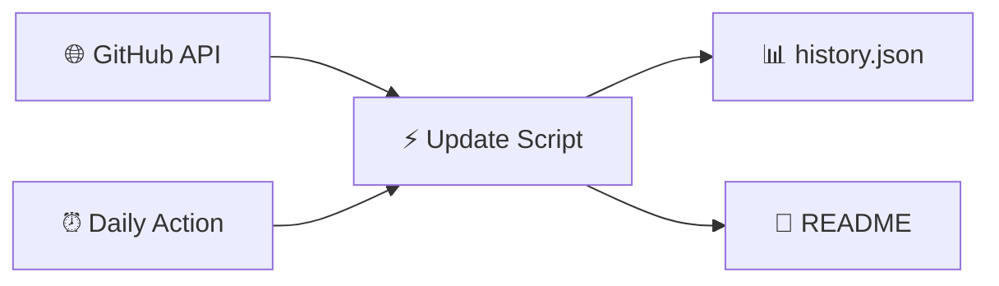

<!-- Static README shell — ranking tables are injected by Update-ParadiseFeed.ps1 -->

<div align="center">

<!-- Banner: committed PNG (reliable on GitHub — no external CDN) -->


<br/>

[](https://github.com/btstevens1984az/powershell-paradise/actions/workflows/daily-update.yml)
[](https://learn.microsoft.com/powershell/)
[](https://github.com/btstevens1984az/powershell-paradise/actions)
[](LICENSE)

<br/><br/>

<!-- PARADISE:STATS:START -->
<table align="center">
<tr>
<td align="center" width="25%">
<br/>
<h3>📅 Today</h3>
<h2>15</h2>
<sub>trending movers</sub>
<br/><br/>
</td>
<td align="center" width="25%">
<br/>
<h3>📆 This Week</h3>
<h2>15</h2>
<sub>new repos</sub>
<br/><br/>
</td>
<td align="center" width="25%">
<br/>
<h3>🗓️ This Month</h3>
<h2>15</h2>
<sub>new repos</sub>
<br/><br/>
</td>
<td align="center" width="25%">
<br/>
<h3>📈 This Year</h3>
<h2>15</h2>
<sub>new repos</sub>
<br/><br/>
</td>
</tr>
</table>
<!-- PARADISE:STATS:END -->

<br/>

<!-- PARADISE:META:START -->
<p align="center"><sub>🕐 <strong>Last refreshed:</strong> Monday, July 27, 2026 · 09:22 UTC · <a href="https://github.com/btstevens1984az/powershell-paradise/actions/workflows/daily-update.yml">GitHub Actions</a></sub></p>

[](https://github.com/btstevens1984az/powershell-paradise)
&nbsp;
[](https://github.com/btstevens1984az/powershell-paradise/actions)
&nbsp;
[](https://github.com/btstevens1984az/powershell-paradise)
&nbsp;
[](https://github.com/btstevens1984az/powershell-paradise)
<!-- PARADISE:META:END -->

</div>

---

## 📡 Welcome to the Paradise

> **PowerShell Paradise** is your cozy corner of GitHub for staying current — a living leaderboard that refreshes every morning with the hottest PowerShell projects, modules, and tools the community is starring right now.

<table>
<tr>
<td width="50%" valign="top">

### 🌊 What you'll find

| Window | The vibe |
|:------:|:---------|
| 🔥 **Today** | Star velocity — what's climbing *right now* |
| 📆 **Week** | Fresh repos from the last 7 days |
| 🗓️ **Month** | Standouts from the last 30 days |
| 📈 **Year** | The year's best new PowerShell repos |

</td>
<td width="50%" valign="top">

### 🧭 Jump around

| Go to | Section |
|:-----:|:--------|
| 🔥 | [Today's Top Movers](#-todays-top-movers) |
| 📆 | [This Week](#-this-weeks-top-repositories) |
| 🗓️ | [This Month](#️-this-months-top-repositories) |
| 📈 | [This Year](#-this-years-top-repositories) |
| ⚙️ | [How It Works](#️-how-it-works) |

</td>
</tr>
</table>

---

## 🔥 Today's Top Movers

[](https://github.com/btstevens1984az/powershell-paradise#-todays-top-movers)

> Repos with the biggest **star gains** since the last refresh. First run shows recently active repos instead.

<!-- PARADISE:TODAY:START -->
| # | Project | ⭐ Stars | 🍴 Forks | About | 🕐 Updated |
|:-:|---------|----------:|----------:|-------|------------|
| 🥇 |  &nbsp;**[Win11Debloat](https://github.com/Raphire/Win11Debloat)**<br/><sub><code>Raphire/Win11Debloat</code></sub> | **53.9k** &nbsp; 🚀 **+80** | 2.3k | A simple, lightweight PowerShell script that allows you to remove pre-installed apps, d…<br/> `automated`  `bloatware` | 13h ago |
| 🥈 |  &nbsp;**[reverse-skill](https://github.com/zhaoxuya520/reverse-skill)**<br/><sub><code>zhaoxuya520/reverse-skill</code></sub> | **9k** &nbsp; 🚀 **+78** | 1.4k | Reverse Engineering / Authorized Penetration Testing / Security Research Skill Router P… | 2d ago |
| 🥉 |  &nbsp;**[winutil](https://github.com/ChrisTitusTech/winutil)**<br/><sub><code>ChrisTitusTech/winutil</code></sub> | **59.1k** &nbsp; 🚀 **+68** | 3.4k | Chris Titus Tech's Windows Utility - Install Programs, Tweaks, Fixes, and Updates | 3d ago |
| **4** |  &nbsp;**[psmux](https://github.com/psmux/psmux)**<br/><sub><code>psmux/psmux</code></sub> | **3.1k** &nbsp; 🚀 **+14** | 188 | Tmux on Windows Powershell - tmux for PowerShell, Windows Terminal, cmd.exe. Includes p…<br/> `cli`  `powershell` | 9m ago |
| **5** |  &nbsp;**[SpotX](https://github.com/SpotX-Official/SpotX)**<br/><sub><code>SpotX-Official/SpotX</code></sub> | **21.8k** &nbsp; 🚀 **+13** | 1.1k | SpotX patcher used for patching the desktop version of Spotify<br/> `adblock`  `spotify` | 2d ago |
| **6** |  &nbsp;**[RemoveWindowsAI](https://github.com/zoicware/RemoveWindowsAI)**<br/><sub><code>zoicware/RemoveWindowsAI</code></sub> | **12.6k** &nbsp; 🚀 **+11** | 436 | Force Remove Copilot, Recall and More in Windows 11<br/> `ai`  `bloatware` | 9d ago |
| **7** |  &nbsp;**[Office-Tool](https://github.com/YerongAI/Office-Tool)**<br/><sub><code>YerongAI/Office-Tool</code></sub> | **13.9k** &nbsp; 🚀 **+8** | 1k | Office Tool Plus localization projects.<br/> `msoffice`  `msproject` | 47d ago |
| **8** |  &nbsp;**[Sophia-Script-for-Windows](https://github.com/farag2/Sophia-Script-for-Windows)**<br/><sub><code>farag2/Sophia-Script-for-Windows</code></sub> | **9.6k** &nbsp; 🚀 **+6** | 641 | :zap: The most powerful open source tweaker on GitHub for fine-tuning Windows 10 & Wind…<br/> `24h2`  `25h2` | 9d ago |
| **9** |  &nbsp;**[tiny11builder](https://github.com/ntdevlabs/tiny11builder)**<br/><sub><code>ntdevlabs/tiny11builder</code></sub> | **19.2k** &nbsp; 🚀 **+4** | 1.5k | Scripts to build a trimmed-down Windows 11 image. | 318d ago |
| **10** |  &nbsp;**[flare-vm](https://github.com/mandiant/flare-vm)**<br/><sub><code>mandiant/flare-vm</code></sub> | **8.9k** &nbsp; 🚀 **+4** | 1.1k | A collection of software installations scripts for Windows systems that allows you to e…<br/> `flare`  `malware-analysis` | 34d ago |
| **11** |  &nbsp;**[Flipper-Zero-BadUSB](https://github.com/I-Am-Jakoby/Flipper-Zero-BadUSB)**<br/><sub><code>I-Am-Jakoby/Flipper-Zero-BadUSB</code></sub> | **7k** &nbsp; 🚀 **+4** | 879 | Repository for my flipper zero badUSB payloads. Now almost entirely plug and play.<br/> `badusb`  `badusb-payloads` | 772d ago |
| **12** |  &nbsp;**[windows_hardening](https://github.com/0x6d69636b/windows_hardening)**<br/><sub><code>0x6d69636b/windows_hardening</code></sub> | **2.6k** &nbsp; 🚀 **+4** | 329 | HardeningKitty and Windows Hardening Settings<br/> `audit`  `blueteam` | 6d ago |
| **13** |  &nbsp;**[Winget-AutoUpdate](https://github.com/Romanitho/Winget-AutoUpdate)**<br/><sub><code>Romanitho/Winget-AutoUpdate</code></sub> | **1.9k** &nbsp; 🚀 **+4** | 191 | WAU daily updates apps as system and notify connected users. (Allowlist and Blocklist s…<br/> `winget` | 28d ago |
| **14** |  &nbsp;**[runner-images](https://github.com/actions/runner-images)**<br/><sub><code>actions/runner-images</code></sub> | **13k** &nbsp; 🚀 **+3** | 3.8k | GitHub Actions runner images | 60m ago |
| **15** |  &nbsp;**[docker](https://github.com/jenkinsci/docker)**<br/><sub><code>jenkinsci/docker</code></sub> | **7.6k** &nbsp; 🚀 **+3** | 4.6k | Docker official jenkins repo<br/> `docker`  `hacktoberfest` | 2h ago |
<!-- PARADISE:TODAY:END -->

---

## 📆 This Week's Top Repositories

[](https://github.com/btstevens1984az/powershell-paradise#-this-weeks-top-repositories)

> PowerShell repos **created in the last 7 days**, ranked by total stars.

<!-- PARADISE:WEEK:START -->
| # | Project | ⭐ Stars | 🍴 Forks | About | 🕐 Updated |
|:-:|---------|----------:|----------:|-------|------------|
| 🥇 |  &nbsp;**[pcairplay](https://github.com/gbulog/pcairplay)**<br/><sub><code>gbulog/pcairplay</code></sub> | **75** | 8 | Mirror an iPhone to a Windows PC using native iOS Screen Mirroring - no app on the phon… | 3d ago |
| 🥈 |  &nbsp;**[Windhawk-Backup-Manager](https://github.com/osmanonurkoc/Windhawk-Backup-Manager)**<br/><sub><code>osmanonurkoc/Windhawk-Backup-Manager</code></sub> | **39** | 0 | A modern, lightweight WPF utility to backup, review, and restore Windhawk mods, compile… | 22h ago |
| 🥉 |  &nbsp;**[codex-frontend-visual-handoff](https://github.com/zian10001/codex-frontend-visual-handoff)**<br/><sub><code>zian10001/codex-frontend-visual-handoff</code></sub> | **24** | 0 | — | 6d ago |
| **4** |  &nbsp;**[EnterpriseLab](https://github.com/mfgjwaterman/EnterpriseLab)**<br/><sub><code>mfgjwaterman/EnterpriseLab</code></sub> | **14** | 4 | EnterpriseLab is a PowerShell framework for building reproducible enterprise lab enviro… | 5d ago |
| **5** |  &nbsp;**[CIPP](https://github.com/CyberDrain/CIPP)**<br/><sub><code>CyberDrain/CIPP</code></sub> | **14** | 12 | — | 1h ago |
| **6** |  &nbsp;**[ircc-tracker-reader](https://github.com/HZkuroko/ircc-tracker-reader)**<br/><sub><code>HZkuroko/ircc-tracker-reader</code></sub> | **12** | 2 | To get the information from the borken IRCC tracker website | 23h ago |
| **7** |  &nbsp;**[Codex-Bugs-Fix-Solution](https://github.com/JupiterLyr/Codex-Bugs-Fix-Solution)**<br/><sub><code>JupiterLyr/Codex-Bugs-Fix-Solution</code></sub> | **11** | 1 | 修复 Codex 沙箱模式的 Bug：批量检查并修复Windows文件/文件夹的所有者，清理未知用户和权限，拦截本不应该有的巨量写入请求。 / Fix bugs in Cod…<br/> `bugfix`  `codex` | 2d ago |
| **8** |  &nbsp;**[chatgpt-usage-overlay](https://github.com/goraeda-a11y/chatgpt-usage-overlay)**<br/><sub><code>goraeda-a11y/chatgpt-usage-overlay</code></sub> | **10** | 0 | Native-looking ChatGPT/Codex usage overlay for Windows | 5d ago |
| **9** |  &nbsp;**[ProtonPortSync](https://github.com/omv421/ProtonPortSync)**<br/><sub><code>omv421/ProtonPortSync</code></sub> | **9** | 0 | Keeps qBittorrent's port matched to whatever port Proton VPN is forwarding you. Under a…<br/> `automation`  `port-forwarding` | 8h ago |
| **10** |  &nbsp;**[winsxs-hydration-repair](https://github.com/Icarus202/winsxs-hydration-repair)**<br/><sub><code>Icarus202/winsxs-hydration-repair</code></sub> | **8** | 2 | Fix Windows Update error 0x800f0986 / PSFX_E_APPLY_FORWARD_DELTA_FAILED on Server 2019 …<br/> `0x800f0986`  `cbs` | 1d ago |
| **11** |  &nbsp;**[claude-code-free](https://github.com/sherifjavaandroid/claude-code-free)**<br/><sub><code>sherifjavaandroid/claude-code-free</code></sub> | **7** | 0 | — | 2d ago |
| **12** |  &nbsp;**[clipwarp](https://github.com/botnick/clipwarp)**<br/><sub><code>botnick/clipwarp</code></sub> | **7** | 3 | Paste clipboard images into Claude Code on Windows - fixes the broken Ctrl+V image past…<br/> `ai-tools`  `anthropic` | 4d ago |
| **13** |  &nbsp;**[sandbox-shenanigans](https://github.com/unrooted/sandbox-shenanigans)**<br/><sub><code>unrooted/sandbox-shenanigans</code></sub> | **6** | 1 | A showcase repo containing demo of a potential Windows Sandbox abuse<br/> `powershell`  `windows` | 7d ago |
| **14** |  &nbsp;**[VDI-Bridge](https://github.com/danieloz147/VDI-Bridge)**<br/><sub><code>danieloz147/VDI-Bridge</code></sub> | **6** | 0 | Covert bidirectional data channel over remote desktop audio and keyboard | 5d ago |
| **15** |  &nbsp;**[Custom-modelswitch](https://github.com/TechTronixx/Custom-modelswitch)**<br/><sub><code>TechTronixx/Custom-modelswitch</code></sub> | **5** | 1 | Terminal UI to point your AI coding tools at a custom gateway for Claude/OpenAI | 19h ago |
<!-- PARADISE:WEEK:END -->

---

## 🗓️ This Month's Top Repositories

[](https://github.com/btstevens1984az/powershell-paradise#%EF%B8%8F-this-months-top-repositories)

> PowerShell repos **created in the last 30 days**, ranked by total stars.

<!-- PARADISE:MONTH:START -->
| # | Project | ⭐ Stars | 🍴 Forks | About | 🕐 Updated |
|:-:|---------|----------:|----------:|-------|------------|
| 🥇 |  &nbsp;**[no-gdid](https://github.com/Korben00/no-gdid)**<br/><sub><code>Korben00/no-gdid</code></sub> | **233** | 15 | Read, understand and silence the Windows GDID device identifier (the ID that tracked a … | 1d ago |
| 🥈 |  &nbsp;**[PC-Cartridge-System](https://github.com/LewdM3at/PC-Cartridge-System)**<br/><sub><code>LewdM3at/PC-Cartridge-System</code></sub> | **215** | 13 | Physical game cartridges with 2.5" SSDs for your Steam/GoG/Local library | 2d ago |
| 🥉 |  &nbsp;**[WinTrash](https://github.com/hasoftware/WinTrash)**<br/><sub><code>hasoftware/WinTrash</code></sub> | **213** | 26 | All-in-one PowerShell toolkit that scans 16 types of Windows app leftovers (dead PATH e…<br/> `cleaner`  `cleanup` | 11d ago |
| **4** |  &nbsp;**[GPT5.6-5.5-](https://github.com/zxr-roro/GPT5.6-5.5-)**<br/><sub><code>zxr-roro/GPT5.6-5.5-</code></sub> | **173** | 59 | 此项目为gpt5.6/5.5破甲方案 | 17d ago |
| **5** |  &nbsp;**[Windows-GDID-Changer](https://github.com/gd03gd031/Windows-GDID-Changer)**<br/><sub><code>gd03gd031/Windows-GDID-Changer</code></sub> | **145** | 13 | A script that requests the generation of a new GDID from Microsoft servers and assigns … | 4d ago |
| **6** |  &nbsp;**[Firestone2Green](https://github.com/Mer3y1338/Firestone2Green)**<br/><sub><code>Mer3y1338/Firestone2Green</code></sub> | **116** | 17 | 🟢 Firestone2Green — Windows one-click Firestone / Overwolf local recovery tool with au…<br/> `authorization-repair`  `avatar-repair` | 6d ago |
| **7** |  &nbsp;**[cc-unlock](https://github.com/JacksonTai2007/cc-unlock)**<br/><sub><code>JacksonTai2007/cc-unlock</code></sub> | **91** | 12 | — | 3d ago |
| **8** |  &nbsp;**[ieee-skills](https://github.com/CloudWave818/ieee-skills)**<br/><sub><code>CloudWave818/ieee-skills</code></sub> | **91** | 5 | 面向 IEEE 风格论文写作、润色、审稿、实验、图表、LaTeX、引用和论文阅读的 Codex skills。 | 6d ago |
| **9** |  &nbsp;**[IntuneToolKit](https://github.com/CYEBRSYSTEM-AliAlame/IntuneToolKit)**<br/><sub><code>CYEBRSYSTEM-AliAlame/IntuneToolKit</code></sub> | **88** | 23 | — | 22d ago |
| **10** |  &nbsp;**[WindowsUpdateRemedationTool](https://github.com/mertozsoy/WindowsUpdateRemedationTool)**<br/><sub><code>mertozsoy/WindowsUpdateRemedationTool</code></sub> | **79** | 12 | — | 8d ago |
| **11** |  &nbsp;**[pcairplay](https://github.com/gbulog/pcairplay)**<br/><sub><code>gbulog/pcairplay</code></sub> | **75** | 8 | Mirror an iPhone to a Windows PC using native iOS Screen Mirroring - no app on the phon… | 3d ago |
| **12** |  &nbsp;**[MegaManX4Recomp](https://github.com/mstan/MegaManX4Recomp)**<br/><sub><code>mstan/MegaManX4Recomp</code></sub> | **64** | 0 | Mega Man X4 (USA, SLUS-00561) statically recompiled to a native PC executable with PSXR… | 4d ago |
| **13** |  &nbsp;**[powershell-for-sysadmins](https://github.com/socaldavis/powershell-for-sysadmins)**<br/><sub><code>socaldavis/powershell-for-sysadmins</code></sub> | **61** | 8 | Real sysadmin PowerShell scripts from the PC-Addicts YouTube channel — sanitized, param…<br/> `active-directory`  `automation` | 8d ago |
| **14** |  &nbsp;**[rbxmulti-loader](https://github.com/BoardCrawler/rbxmulti-loader)**<br/><sub><code>BoardCrawler/rbxmulti-loader</code></sub> | **49** | 8 | Running multiple R0bl0x instances on Windows. | 9d ago |
| **15** |  &nbsp;**[maverick-validate](https://github.com/thermiteau/maverick-validate)**<br/><sub><code>thermiteau/maverick-validate</code></sub> | **47** | 3 | Evaluate software that was created by a coding agent | 19d ago |
<!-- PARADISE:MONTH:END -->

---

## 📈 This Year's Top Repositories

[](https://github.com/btstevens1984az/powershell-paradise#-this-years-top-repositories)

> PowerShell repos **created since January 1**, ranked by total stars.

<!-- PARADISE:YEAR:START -->
| # | Project | ⭐ Stars | 🍴 Forks | About | 🕐 Updated |
|:-:|---------|----------:|----------:|-------|------------|
| 🥇 |  &nbsp;**[reverse-skill](https://github.com/zhaoxuya520/reverse-skill)**<br/><sub><code>zhaoxuya520/reverse-skill</code></sub> | **9k** | 1.4k | Reverse Engineering / Authorized Penetration Testing / Security Research Skill Router P… | 2d ago |
| 🥈 |  &nbsp;**[WindowsDeveloperConfig](https://github.com/microsoft/WindowsDeveloperConfig)**<br/><sub><code>microsoft/WindowsDeveloperConfig</code></sub> | **1.8k** | 139 | Automate the setup and configuration of your Windows development environment. | 5d ago |
| 🥉 |  &nbsp;**[selfware.md](https://github.com/floatboatai/selfware.md)**<br/><sub><code>floatboatai/selfware.md</code></sub> | **1.1k** | 95 | — | 141d ago |
| **4** |  &nbsp;**[codex-windows-fast-patch-skill](https://github.com/chen0416ccc-cpu/codex-windows-fast-patch-skill)**<br/><sub><code>chen0416ccc-cpu/codex-windows-fast-patch-skill</code></sub> | **996** | 108 | 此skills用于指导智能体在 Windows 上恢复 Codex Desktop 升级后失效的本地补丁和能力开关。（Computer Use，插件，破限，codex强制汉化… | 2d ago |
| **5** |  &nbsp;**[work-iq](https://github.com/microsoft/work-iq)**<br/><sub><code>microsoft/work-iq</code></sub> | **952** | 111 | MCP Server and CLI for accessing Work IQ | 3d ago |
| **6** |  &nbsp;**[get-shit-done-for-antigravity](https://github.com/toonight/get-shit-done-for-antigravity)**<br/><sub><code>toonight/get-shit-done-for-antigravity</code></sub> | **920** | 145 | — | 117d ago |
| **7** |  &nbsp;**[commands](https://github.com/GuDaStudio/commands)**<br/><sub><code>GuDaStudio/commands</code></sub> | **883** | 50 | — | 171d ago |
| **8** |  &nbsp;**[codex-visio-paper-figure-skill](https://github.com/pengjunchi0/codex-visio-paper-figure-skill)**<br/><sub><code>pengjunchi0/codex-visio-paper-figure-skill</code></sub> | **585** | 28 | 科研绘图skill、论文绘图skill、图片转visio等可编辑格式，将生成图转化为论文可编辑图，便于作者调整绘图细节<br/> `academic-figures`  `codex` | 34d ago |
| **9** |  &nbsp;**[PsiphonOverMITM](https://github.com/B3hnamR/PsiphonOverMITM)**<br/><sub><code>B3hnamR/PsiphonOverMITM</code></sub> | **548** | 79 | — | 74d ago |
| **10** |  &nbsp;**[Bonsai-Image-Demo](https://github.com/PrismML-Eng/Bonsai-Image-Demo)**<br/><sub><code>PrismML-Eng/Bonsai-Image-Demo</code></sub> | **514** | 72 | Generate images locally<br/> `1-bit`  `bonsai` | 43d ago |
| **11** |  &nbsp;**[ai-business-skills](https://github.com/minhnv0807/ai-business-skills)**<br/><sub><code>minhnv0807/ai-business-skills</code></sub> | **509** | 214 | 63 bilingual AI marketing skills (31 VN + 31 Global) for Claude Code, OpenCode, Codex, …<br/> `agent-skills`  `ai-agents` | 18d ago |
| **12** |  &nbsp;**[PrivHound](https://github.com/dazzyddos/PrivHound)**<br/><sub><code>dazzyddos/PrivHound</code></sub> | **509** | 49 | A BloodHound OpenGraph collector that models Windows local privilege escalation as inte… | 92d ago |
| **13** |  &nbsp;**[WinUtil_CN](https://github.com/constansino/WinUtil_CN)**<br/><sub><code>constansino/WinUtil_CN</code></sub> | **490** | 65 | WinUtil_CN：Chris Titus Tech WinUtil 中文汉化版，提供 WinUtil 中文界面、中文说明、Tweaks 中文解释与 Win11ISO 中文支持<br/> `chinese`  `chris-titus-tech` | 73d ago |
| **14** |  &nbsp;**[Light-Help](https://github.com/Cotton059/Light-Help)**<br/><sub><code>Cotton059/Light-Help</code></sub> | **479** | 222 | Help the audience perform some complex operations. | 10d ago |
| **15** |  &nbsp;**[thesis-docx](https://github.com/the-shy123456/thesis-docx)**<br/><sub><code>the-shy123456/thesis-docx</code></sub> | **427** | 25 | 写论文的skill<br/> `skill`  `thesis` | 109d ago |
<!-- PARADISE:YEAR:END -->

---

## ⚙️ How It Works


```mermaid
flowchart LR
    A["🌐 GitHub API"] --> B["⚡ Update Script"]
    B --> C["📊 history.json"]
    B --> D["📝 README"]
    E["⏰ Daily Action"] --> B
```

| Step | What happens |
|:----:|:-------------|
| 1️⃣ | Query GitHub for `language:powershell` repos with real activity |
| 2️⃣ | Compare star counts to yesterday's snapshot for velocity |
| 3️⃣ | Build four bubbly ranking tables — top 15 each |
| 4️⃣ | Auto-commit back to this README every morning at 06:00 UTC |

<details>
<summary><b>🛠️ Run locally</b></summary>

```powershell
$env:GITHUB_TOKEN = 'ghp_your_token'   # optional — higher API limits
./scripts/Update-ParadiseFeed.ps1
```

</details>

<details>
<summary><b>🔍 Filters applied</b></summary>

- Language: **PowerShell** · Forks excluded · Minimum **3 stars** · Top **15** per table

</details>

---

## 🌟 Why star this repo?

<table>
<tr>
<td align="center">😴<br/><b>Zero effort</b><br/><sub>Updates while you sleep</sub></td>
<td align="center">📡<br/><b>Community signal</b><br/><sub>See what builders love</sub></td>
<td align="center">🎓<br/><b>Learning radar</b><br/><sub>Find modules worth studying</sub></td>
<td align="center">🔓<br/><b>Open source</b><br/><sub>Fork &amp; adapt freely</sub></td>
</tr>
</table>

---

## 📜 License

MIT — see [LICENSE](LICENSE).

---

<div align="center">

**Built with ❤️ for the PowerShell community**

*Star this repo to get daily trending PowerShell projects in your GitHub feed.*

</div>
