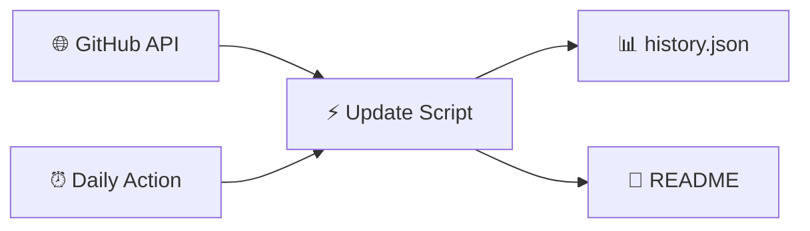

<!-- Static README shell — ranking tables are injected by Update-ParadiseFeed.ps1 -->

<div align="center">

<!-- Banner: committed PNG (reliable on GitHub — no external CDN) -->


<br/>

[](https://github.com/btstevens1984az/powershell-paradise/actions/workflows/daily-update.yml)
[](https://learn.microsoft.com/powershell/)
[](https://github.com/btstevens1984az/powershell-paradise/actions)
[](LICENSE)

<br/><br/>

<!-- PARADISE:STATS:START -->
<table align="center">
<tr>
<td align="center" width="25%">
<br/>
<h3>📅 Today</h3>
<h2>15</h2>
<sub>trending movers</sub>
<br/><br/>
</td>
<td align="center" width="25%">
<br/>
<h3>📆 This Week</h3>
<h2>15</h2>
<sub>new repos</sub>
<br/><br/>
</td>
<td align="center" width="25%">
<br/>
<h3>🗓️ This Month</h3>
<h2>15</h2>
<sub>new repos</sub>
<br/><br/>
</td>
<td align="center" width="25%">
<br/>
<h3>📈 This Year</h3>
<h2>15</h2>
<sub>new repos</sub>
<br/><br/>
</td>
</tr>
</table>
<!-- PARADISE:STATS:END -->

<br/>

<!-- PARADISE:META:START -->
<p align="center"><sub>🕐 <strong>Last refreshed:</strong> Tuesday, September 1, 2026 · 11:06 UTC · <a href="https://github.com/btstevens1984az/powershell-paradise/actions/workflows/daily-update.yml">GitHub Actions</a></sub></p>

[](https://github.com/btstevens1984az/powershell-paradise)
&nbsp;
[](https://github.com/btstevens1984az/powershell-paradise/actions)
&nbsp;
[](https://github.com/btstevens1984az/powershell-paradise)
&nbsp;
[](https://github.com/btstevens1984az/powershell-paradise)
<!-- PARADISE:META:END -->

</div>

---

## 📡 Welcome to the Paradise

> **PowerShell Paradise** is your cozy corner of GitHub for staying current — a living leaderboard that refreshes every morning with the hottest PowerShell projects, modules, and tools the community is starring right now.

<table>
<tr>
<td width="50%" valign="top">

### 🌊 What you'll find

| Window | The vibe |
|:------:|:---------|
| 🔥 **Today** | Star velocity — what's climbing *right now* |
| 📆 **Week** | Fresh repos from the last 7 days |
| 🗓️ **Month** | Standouts from the last 30 days |
| 📈 **Year** | The year's best new PowerShell repos |

</td>
<td width="50%" valign="top">

### 🧭 Jump around

| Go to | Section |
|:-----:|:--------|
| 🔥 | [Today's Top Movers](#-todays-top-movers) |
| 📆 | [This Week](#-this-weeks-top-repositories) |
| 🗓️ | [This Month](#️-this-months-top-repositories) |
| 📈 | [This Year](#-this-years-top-repositories) |
| ⚙️ | [How It Works](#️-how-it-works) |

</td>
</tr>
</table>

---

## 🔥 Today's Top Movers

[](https://github.com/btstevens1984az/powershell-paradise#-todays-top-movers)

> Repos with the biggest **star gains** since the last refresh. First run shows recently active repos instead.

<!-- PARADISE:TODAY:START -->
| # | Project | ⭐ Stars | 🍴 Forks | About | 🕐 Updated |
|:-:|---------|----------:|----------:|-------|------------|
| 🥇 |  &nbsp;**[reverse-skill](https://github.com/zhaoxuya520/reverse-skill)**<br/><sub><code>zhaoxuya520/reverse-skill</code></sub> | **33.6k** &nbsp; 🚀 **+919** | 4.5k | Reverse Engineering / Authorized Penetration Testing / Security Research Skill Router P… | 1d ago |
| 🥈 |  &nbsp;**[winutil](https://github.com/ChrisTitusTech/winutil)**<br/><sub><code>ChrisTitusTech/winutil</code></sub> | **61.7k** &nbsp; 🚀 **+68** | 3.6k | Chris Titus Tech's Windows Utility - Install Programs, Tweaks, Fixes, and Updates | 14h ago |
| 🥉 |  &nbsp;**[Win11Debloat](https://github.com/Raphire/Win11Debloat)**<br/><sub><code>Raphire/Win11Debloat</code></sub> | **56.6k** &nbsp; 🚀 **+49** | 2.4k | A simple, lightweight PowerShell script that allows you to remove pre-installed apps, d…<br/> `automated`  `bloatware` | 2d ago |
| **4** |  &nbsp;**[tiny11builder](https://github.com/ntdevlabs/tiny11builder)**<br/><sub><code>ntdevlabs/tiny11builder</code></sub> | **19.5k** &nbsp; 🚀 **+10** | 1.5k | Scripts to build a trimmed-down Windows 11 image. | 354d ago |
| **5** |  &nbsp;**[Office-Tool](https://github.com/YerongAI/Office-Tool)**<br/><sub><code>YerongAI/Office-Tool</code></sub> | **14.1k** &nbsp; 🚀 **+10** | 1k | Office Tool Plus localization projects.<br/> `msoffice`  `msproject` | 1d ago |
| **6** |  &nbsp;**[RemoveWindowsAI](https://github.com/zoicware/RemoveWindowsAI)**<br/><sub><code>zoicware/RemoveWindowsAI</code></sub> | **13k** &nbsp; 🚀 **+9** | 457 | Force Remove Copilot, Recall and More in Windows 11<br/> `ai`  `bloatware` | 5d ago |
| **7** |  &nbsp;**[GOAD](https://github.com/Orange-Cyberdefense/GOAD)**<br/><sub><code>Orange-Cyberdefense/GOAD</code></sub> | **8.3k** &nbsp; 🚀 **+9** | 1.1k | game of active directory<br/> `active-directory`  `ansible` | 173d ago |
| **8** |  &nbsp;**[psmux](https://github.com/psmux/psmux)**<br/><sub><code>psmux/psmux</code></sub> | **3.4k** &nbsp; 🚀 **+9** | 211 | Tmux on Windows Powershell - tmux for PowerShell, Windows Terminal, cmd.exe. Includes p…<br/> `cli`  `powershell` | 1d ago |
| **9** |  &nbsp;**[runner-images](https://github.com/actions/runner-images)**<br/><sub><code>actions/runner-images</code></sub> | **13.1k** &nbsp; 🚀 **+8** | 3.8k | GitHub Actions runner images | 8m ago |
| **10** |  &nbsp;**[Fast-Kubernetes](https://github.com/omerbsezer/Fast-Kubernetes)**<br/><sub><code>omerbsezer/Fast-Kubernetes</code></sub> | **3.8k** &nbsp; 🚀 **+7** | 1.4k | This repo covers Kubernetes with LABs: Kubectl, Pod, Deployment, Service, PV, PVC, Roll…<br/> `affinity`  `config-maps` | 505d ago |
| **11** |  &nbsp;**[Scoop](https://github.com/ScoopInstaller/Scoop)**<br/><sub><code>ScoopInstaller/Scoop</code></sub> | **24.6k** &nbsp; 🚀 **+3** | 1.5k | A command-line installer for Windows.<br/> `installer`  `powershell` | 4d ago |
| **12** |  &nbsp;**[badusb](https://github.com/FalsePhilosopher/badusb)**<br/><sub><code>FalsePhilosopher/badusb</code></sub> | **2k** &nbsp; 🚀 **+3** | 275 | Flipper Zero badusb payload library | 11h ago |
| **13** |  &nbsp;**[nishang](https://github.com/samratashok/nishang)**<br/><sub><code>samratashok/nishang</code></sub> | **10.1k** &nbsp; 🚀 **+2** | 2.5k | Nishang - Offensive PowerShell for red team, penetration testing and offensive security.<br/> `activedirectory`  `hacking` | 859d ago |
| **14** |  &nbsp;**[Flipper-Zero-BadUSB](https://github.com/I-Am-Jakoby/Flipper-Zero-BadUSB)**<br/><sub><code>I-Am-Jakoby/Flipper-Zero-BadUSB</code></sub> | **7k** &nbsp; 🚀 **+2** | 886 | Repository for my flipper zero badUSB payloads. Now almost entirely plug and play.<br/> `badusb`  `badusb-payloads` | 808d ago |
| **15** |  &nbsp;**[awesome-love2d](https://github.com/love2d-community/awesome-love2d)**<br/><sub><code>love2d-community/awesome-love2d</code></sub> | **4.5k** &nbsp; 🚀 **+2** | 243 | A curated list of amazingly awesome LÖVE libraries, resources and shiny things.<br/> `awesome`  `awesome-list` | 9d ago |
<!-- PARADISE:TODAY:END -->

---

## 📆 This Week's Top Repositories

[](https://github.com/btstevens1984az/powershell-paradise#-this-weeks-top-repositories)

> PowerShell repos **created in the last 7 days**, ranked by total stars.

<!-- PARADISE:WEEK:START -->
| # | Project | ⭐ Stars | 🍴 Forks | About | 🕐 Updated |
|:-:|---------|----------:|----------:|-------|------------|
| 🥇 |  &nbsp;**[Ronnier-skill](https://github.com/Ayueh0102/Ronnier-skill)**<br/><sub><code>Ayueh0102/Ronnier-skill</code></sub> | **87** | 6 | 色彩科學／色度學完整中文學習筆記，包裝成 Claude Code skill，也支援 Codex。涵蓋 CIE 色度學、CIEDE2000、CIECAM02、色適應與演色性。<br/> `agent-md`  `ciecam02` | 6d ago |
| 🥈 |  &nbsp;**[99-Nights-in-the-Forest-Loot-Resource-Radar](https://github.com/swelteringsne/99-Nights-in-the-Forest-Loot-Resource-Radar)**<br/><sub><code>swelteringsne/99-Nights-in-the-Forest-Loot-Resource-Radar</code></sub> | **46** | 13 | 99 Nights in the Forest Radar for Windows with player, Deer, missing-kid, chest, loot, …<br/> `99-nights-campfire`  `99-nights-deer-radar` | 1m ago |
| 🥉 |  &nbsp;**[How-to-Fish-Free-Multiplayer-Fix](https://github.com/creamylookout/How-to-Fish-Free-Multiplayer-Fix)**<br/><sub><code>creamylookout/How-to-Fish-Free-Multiplayer-Fix</code></sub> | **40** | 15 | How to Fish Free Multiplayer Fix for Windows — free Steam co-op troubleshooting with lo…<br/> `connection-fix`  `free-multiplayer-fix` | 1m ago |
| **4** |  &nbsp;**[Bee-Swarm-Simulator-Quest-Field-Helper](https://github.com/spitefulingr/Bee-Swarm-Simulator-Quest-Field-Helper)**<br/><sub><code>spitefulingr/Bee-Swarm-Simulator-Quest-Field-Helper</code></sub> | **37** | 15 | Bee Swarm Simulator Quest & Field Helper with pollen routes, token collection profiles,…<br/> `auto-farm`  `bee-swarm-auto-farm` | 1m ago |
| **5** |  &nbsp;**[codebase-reverse](https://github.com/sharptoolbox/codebase-reverse)**<br/><sub><code>sharptoolbox/codebase-reverse</code></sub> | **37** | 22 | 完整源码逆向工程技能：把存量源码逆向为功能/实现/架构/接口/对象/组件/数据库完整元模型，深度定制于 Java Web 与 Java 微服务(Spring Boot/Clo… | 2d ago |
| **6** |  &nbsp;**[Delta-Force-Optimizer-Lag-Stutter-Fix](https://github.com/scholarlybat/Delta-Force-Optimizer-Lag-Stutter-Fix)**<br/><sub><code>scholarlybat/Delta-Force-Optimizer-Lag-Stutter-Fix</code></sub> | **30** | 16 | Delta Force performance optimizer for Windows — reduce stutter, frame-time spikes, back…<br/> `delta-force`  `delta-force-crash` | 1m ago |
| **7** |  &nbsp;**[Delta-Force-Cheats-Mod-Menu-2026](https://github.com/spitefulingr/Delta-Force-Cheats-Mod-Menu-2026)**<br/><sub><code>spitefulingr/Delta-Force-Cheats-Mod-Menu-2026</code></sub> | **30** | 7 | Delta Force gameplay toolkit featuring Aim Assist, visual ESP, radar, operator informat…<br/> `aim-assistance`  `combined-arms` | 1m ago |
| **8** |  &nbsp;**[AI-Old-Video-Restoration-Tool](https://github.com/glossycannon/AI-Old-Video-Restoration-Tool)**<br/><sub><code>glossycannon/AI-Old-Video-Restoration-Tool</code></sub> | **29** | 8 | AI Old Video Restorer for Windows focused on offline VHS and archive-video repair: deno…<br/> `2x-upscale`  `4k-restoration` | 1m ago |
| **9** |  &nbsp;**[Blox-Fruits-Mastery-Boss-Farm-Toolkit](https://github.com/glossycannon/Blox-Fruits-Mastery-Boss-Farm-Toolkit)**<br/><sub><code>glossycannon/Blox-Fruits-Mastery-Boss-Farm-Toolkit</code></sub> | **29** | 0 | Blox Fruits progression toolkit with Auto Quest, level and mastery farming presets, bos…<br/> `auto-farming`  `blox-fruits` | 1m ago |
| **10** |  &nbsp;**[PUBG-Stutter-Input-Lag-Crash-Fix](https://github.com/growingsqueeg/PUBG-Stutter-Input-Lag-Crash-Fix)**<br/><sub><code>growingsqueeg/PUBG-Stutter-Input-Lag-Crash-Fix</code></sub> | **29** | 8 | PUBG performance toolkit focused on smoother gameplay, lower input delay, stable frame …<br/> `frame-pacing`  `input-lag` | 5m ago |
| **11** |  &nbsp;**[mgs4Ultra120](https://github.com/drbermejor/mgs4Ultra120)**<br/><sub><code>drbermejor/mgs4Ultra120</code></sub> | **29** | 1 | Open-source ultrawide Hor+ and experimental 120 FPS patch for MGS4 Master Collection on PC<br/> `directx-12`  `metal-gear-solid-4` | 16h ago |
| **12** |  &nbsp;**[Local-Background-Removal-Tool](https://github.com/glossycannon/Local-Background-Removal-Tool)**<br/><sub><code>glossycannon/Local-Background-Removal-Tool</code></sub> | **27** | 7 | AI background remover for Windows focused on bulk image cleanup: remove backdrops, isol…<br/> `batch-cutout`  `creative-workflow` | 1m ago |
| **13** |  &nbsp;**[SteamDaddy-Backup](https://github.com/Contrary7/SteamDaddy-Backup)**<br/><sub><code>Contrary7/SteamDaddy-Backup</code></sub> | **27** | 1 | Backhups repository for SD core engine and plugin. | 21h ago |
| **14** |  &nbsp;**[Delta-Force-Cheat-Mod-Menu-Aim-ESP](https://github.com/growingsqueeg/Delta-Force-Cheat-Mod-Menu-Aim-ESP)**<br/><sub><code>growingsqueeg/Delta-Force-Cheat-Mod-Menu-Aim-ESP</code></sub> | **26** | 8 | Delta Force Mod Menu for Windows with configurable Aim Assist, ESP, Radar, Vehicle ESP,…<br/> `aim-assist`  `delta-force` | 5m ago |
| **15** |  &nbsp;**[Mistfall-Hunter-External-Menu-2026](https://github.com/mammothbrew/Mistfall-Hunter-External-Menu-2026)**<br/><sub><code>mammothbrew/Mistfall-Hunter-External-Menu-2026</code></sub> | **25** | 7 | Mistfall Hunter external overlay toolkit featuring player information, loot and relic t…<br/> `desktop-tool`  `external-overlay` | 1m ago |
<!-- PARADISE:WEEK:END -->

---

## 🗓️ This Month's Top Repositories

[](https://github.com/btstevens1984az/powershell-paradise#%EF%B8%8F-this-months-top-repositories)

> PowerShell repos **created in the last 30 days**, ranked by total stars.

<!-- PARADISE:MONTH:START -->
| # | Project | ⭐ Stars | 🍴 Forks | About | 🕐 Updated |
|:-:|---------|----------:|----------:|-------|------------|
| 🥇 |  &nbsp;**[creator-flow](https://github.com/Damonhhh/creator-flow)**<br/><sub><code>Damonhhh/creator-flow</code></sub> | **255** | 48 | CreatorFlow：从选题、评分、脚本、配音和素材一路走到成片与发布包的 Codex 自媒体视频工作流 | 8d ago |
| 🥈 |  &nbsp;**[cell-lct](https://github.com/yrui-cmd/cell-lct)**<br/><sub><code>yrui-cmd/cell-lct</code></sub> | **228** | 10 | Cell-lct：面向 Adobe Illustrator 的可编辑科研矢量绘图插件。免费额度每天抖音群里提供，抖音名（木纹），私人额度小红书找：木纹小路 | 6d ago |
| 🥉 |  &nbsp;**[ResetNightmare](https://github.com/Semperis-Community/ResetNightmare)**<br/><sub><code>Semperis-Community/ResetNightmare</code></sub> | **209** | 37 | POC tool for ResetNightmare (CVE-2026-27912) | 12d ago |
| **4** |  &nbsp;**[material-design-3-ui-skill](https://github.com/skydashnet/material-design-3-ui-skill)**<br/><sub><code>skydashnet/material-design-3-ui-skill</code></sub> | **107** | 9 | A reusable Agent Skill for designing, reviewing, and implementing UI/UX with Google Mat…<br/> `accessibility`  `adaptive-design` | 14d ago |
| **5** |  &nbsp;**[minimax-h3-opencode-skills](https://github.com/unknowlei/minimax-h3-opencode-skills)**<br/><sub><code>unknowlei/minimax-h3-opencode-skills</code></sub> | **103** | 3 | OpenCode skill suite for MiniMax H3 directing, routing, multishot planning, prompt gene…<br/> `agent-skills`  `minimax-h3` | 23d ago |
| **6** |  &nbsp;**[dsh-reverse-skill](https://github.com/dhicoc/dsh-reverse-skill)**<br/><sub><code>dhicoc/dsh-reverse-skill</code></sub> | **102** | 13 | Complete reverse-skill (87 SKILL.md) as a DeepSeek Harness (dsh) Cordis plugin — revers…<br/> `ctf`  `deepseek-harness` | 6d ago |
| **7** |  &nbsp;**[codex-multi-profile](https://github.com/Hung2124/codex-multi-profile)**<br/><sub><code>Hung2124/codex-multi-profile</code></sub> | **93** | 85 | Windows Codex Desktop multi-account via AuthSwap. Shared workspace, separate ChatGPT lo…<br/> `agent-skills`  `chatgpt` | 12d ago |
| **8** |  &nbsp;**[windows-cursor-scheme-fix](https://github.com/Arcadeq/windows-cursor-scheme-fix)**<br/><sub><code>Arcadeq/windows-cursor-scheme-fix</code></sub> | **92** | 0 | Fixes an issue where custom mouse cursor themes stop working after a Windows 11 update …<br/> `cursor`  `mouse-pointer` | 10d ago |
| **9** |  &nbsp;**[-Delta-Force-Graphics-Optimizer](https://github.com/Leonard8818/-Delta-Force-Graphics-Optimizer)**<br/><sub><code>Leonard8818/-Delta-Force-Graphics-Optimizer</code></sub> | **88** | 4 | 三角洲行动画面优化助手 — 一键应用 30+ 项 Windows 帧率优化，改动前自动备份、随时一键还原。非官方个人工具。 | 2d ago |
| **10** |  &nbsp;**[Ronnier-skill](https://github.com/Ayueh0102/Ronnier-skill)**<br/><sub><code>Ayueh0102/Ronnier-skill</code></sub> | **87** | 6 | 色彩科學／色度學完整中文學習筆記，包裝成 Claude Code skill，也支援 Codex。涵蓋 CIE 色度學、CIEDE2000、CIECAM02、色適應與演色性。<br/> `agent-md`  `ciecam02` | 6d ago |
| **11** |  &nbsp;**[WeFlow-Community-Patch](https://github.com/AnonymousUser443/WeFlow-Community-Patch)**<br/><sub><code>AnonymousUser443/WeFlow-Community-Patch</code></sub> | **51** | 11 | Community hotfix for WeFlow 5.0.0 export failures and private-chat export hang<br/> `chat-export`  `hotfix` | 29d ago |
| **12** |  &nbsp;**[99-Nights-in-the-Forest-Loot-Resource-Radar](https://github.com/swelteringsne/99-Nights-in-the-Forest-Loot-Resource-Radar)**<br/><sub><code>swelteringsne/99-Nights-in-the-Forest-Loot-Resource-Radar</code></sub> | **46** | 13 | 99 Nights in the Forest Radar for Windows with player, Deer, missing-kid, chest, loot, …<br/> `99-nights-campfire`  `99-nights-deer-radar` | 1m ago |
| **13** |  &nbsp;**[Subagent-Bionic-Claude](https://github.com/JohnCorreiaisme/Subagent-Bionic-Claude)**<br/><sub><code>JohnCorreiaisme/Subagent-Bionic-Claude</code></sub> | **45** | 10 | Have Claude use a offline LLM as a subagent | 6d ago |
| **14** |  &nbsp;**[dsh-vision-complete](https://github.com/Yts1919/dsh-vision-complete)**<br/><sub><code>Yts1919/dsh-vision-complete</code></sub> | **43** | 3 | 给 DeepSeek 补上「眼睛和耳朵」的多模态视觉插件：看图 / OCR / 物体检测 / 视频理解 / 语音转写 / 截图直读，一键安装（DSH 插件）。<br/> `dashscope`  `deepseek` | 16d ago |
| **15** |  &nbsp;**[discwright](https://github.com/lazardjokovic/discwright)**<br/><sub><code>lazardjokovic/discwright</code></sub> | **42** | 0 | Turn GOG offline installers into burnable game discs with a custom icon, label and auto…<br/> `autorun`  `gog` | 2d ago |
<!-- PARADISE:MONTH:END -->

---

## 📈 This Year's Top Repositories

[](https://github.com/btstevens1984az/powershell-paradise#-this-years-top-repositories)

> PowerShell repos **created since January 1**, ranked by total stars.

<!-- PARADISE:YEAR:START -->
| # | Project | ⭐ Stars | 🍴 Forks | About | 🕐 Updated |
|:-:|---------|----------:|----------:|-------|------------|
| 🥇 |  &nbsp;**[reverse-skill](https://github.com/zhaoxuya520/reverse-skill)**<br/><sub><code>zhaoxuya520/reverse-skill</code></sub> | **33.6k** | 4.5k | Reverse Engineering / Authorized Penetration Testing / Security Research Skill Router P… | 1d ago |
| 🥈 |  &nbsp;**[WindowsDeveloperConfig](https://github.com/microsoft/WindowsDeveloperConfig)**<br/><sub><code>microsoft/WindowsDeveloperConfig</code></sub> | **1.9k** | 159 | Automate the setup and configuration of your Windows development environment. | 4d ago |
| 🥉 |  &nbsp;**[cinema-dna-21x9x3](https://github.com/dacnay816y62-hub/cinema-dna-21x9x3)**<br/><sub><code>dacnay816y62-hub/cinema-dna-21x9x3</code></sub> | **1.2k** | 123 | 高级感电影画面生成 | 17h ago |
| **4** |  &nbsp;**[codex-windows-fast-patch-skill](https://github.com/chen0416ccc-cpu/codex-windows-fast-patch-skill)**<br/><sub><code>chen0416ccc-cpu/codex-windows-fast-patch-skill</code></sub> | **1.1k** | 121 | 此skills用于指导智能体在 Windows 上恢复 Codex Desktop 升级后失效的本地补丁和能力开关。（Computer Use，插件，破限，codex强制汉化… | 2d ago |
| **5** |  &nbsp;**[selfware.md](https://github.com/floatboatai/selfware.md)**<br/><sub><code>floatboatai/selfware.md</code></sub> | **1.1k** | 94 | — | 177d ago |
| **6** |  &nbsp;**[GrapeRoot](https://github.com/kunal12203/GrapeRoot)**<br/><sub><code>kunal12203/GrapeRoot</code></sub> | **1k** | 123 | Compounding Context for AI Coding Assistants — MCP graph engine for Claude Code, Cursor…<br/> `ai-coding`  `claude-code` | 28d ago |
| **7** |  &nbsp;**[work-iq](https://github.com/microsoft/work-iq)**<br/><sub><code>microsoft/work-iq</code></sub> | **980** | 123 | MCP Server and CLI for accessing Work IQ | 3d ago |
| **8** |  &nbsp;**[get-shit-done-for-antigravity](https://github.com/toonight/get-shit-done-for-antigravity)**<br/><sub><code>toonight/get-shit-done-for-antigravity</code></sub> | **939** | 148 | — | 12d ago |
| **9** |  &nbsp;**[commands](https://github.com/GuDaStudio/commands)**<br/><sub><code>GuDaStudio/commands</code></sub> | **878** | 49 | — | 207d ago |
| **10** |  &nbsp;**[deGDID](https://github.com/yegors/deGDID)**<br/><sub><code>yegors/deGDID</code></sub> | **873** | 43 | Deletes all instances of Microsoft's GDID and prevents minting of new ones | 24d ago |
| **11** |  &nbsp;**[codex-visio-paper-figure-skill](https://github.com/pengjunchi0/codex-visio-paper-figure-skill)**<br/><sub><code>pengjunchi0/codex-visio-paper-figure-skill</code></sub> | **792** | 37 | 科研绘图skill、论文绘图skill、图片转visio等可编辑格式，将生成图转化为论文可编辑图，便于作者调整绘图细节<br/> `academic-figures`  `codex` | 16d ago |
| **12** |  &nbsp;**[Light-Help](https://github.com/Cotton059/Light-Help)**<br/><sub><code>Cotton059/Light-Help</code></sub> | **599** | 257 | Help the audience perform some complex operations. | 1h ago |
| **13** |  &nbsp;**[ai-business-skills](https://github.com/minhnv0807/ai-business-skills)**<br/><sub><code>minhnv0807/ai-business-skills</code></sub> | **562** | 224 | 138 bilingual AI marketing skills (69 VN + 69 Global) for Claude Code, OpenCode, Codex,…<br/> `agent-skills`  `ai-agents` | 15d ago |
| **14** |  &nbsp;**[PsiphonOverMITM](https://github.com/B3hnamR/PsiphonOverMITM)**<br/><sub><code>B3hnamR/PsiphonOverMITM</code></sub> | **544** | 78 | — | 110d ago |
| **15** |  &nbsp;**[coralline](https://github.com/Nanako0129/coralline)**<br/><sub><code>Nanako0129/coralline</code></sub> | **539** | 41 | 🪸 Powerlevel10k-inspired statusline for Claude Code — paste one prompt and your AI int…<br/> `bash`  `claude` | 9d ago |
<!-- PARADISE:YEAR:END -->

---

## ⚙️ How It Works


```mermaid
flowchart LR
    A["🌐 GitHub API"] --> B["⚡ Update Script"]
    B --> C["📊 history.json"]
    B --> D["📝 README"]
    E["⏰ Daily Action"] --> B
```

| Step | What happens |
|:----:|:-------------|
| 1️⃣ | Query GitHub for `language:powershell` repos with real activity |
| 2️⃣ | Compare star counts to yesterday's snapshot for velocity |
| 3️⃣ | Build four bubbly ranking tables — top 15 each |
| 4️⃣ | Auto-commit back to this README every morning at 06:00 UTC |

<details>
<summary><b>🛠️ Run locally</b></summary>

```powershell
$env:GITHUB_TOKEN = 'ghp_your_token'   # optional — higher API limits
./scripts/Update-ParadiseFeed.ps1
```

</details>

<details>
<summary><b>🔍 Filters applied</b></summary>

- Language: **PowerShell** · Forks excluded · Minimum **3 stars** · Top **15** per table

</details>

---

## 🌟 Why star this repo?

<table>
<tr>
<td align="center">😴<br/><b>Zero effort</b><br/><sub>Updates while you sleep</sub></td>
<td align="center">📡<br/><b>Community signal</b><br/><sub>See what builders love</sub></td>
<td align="center">🎓<br/><b>Learning radar</b><br/><sub>Find modules worth studying</sub></td>
<td align="center">🔓<br/><b>Open source</b><br/><sub>Fork &amp; adapt freely</sub></td>
</tr>
</table>

---

## 📜 License

MIT — see [LICENSE](LICENSE).

---

<div align="center">

**Built with ❤️ for the PowerShell community**

*Star this repo to get daily trending PowerShell projects in your GitHub feed.*

</div>
