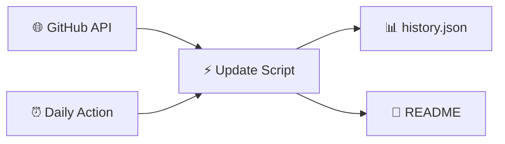

<!-- Static README shell — ranking tables are injected by Update-ParadiseFeed.ps1 -->

<div align="center">

<!-- Banner: committed PNG (reliable on GitHub — no external CDN) -->


<br/>

[](https://github.com/btstevens1984az/powershell-paradise/actions/workflows/daily-update.yml)
[](https://learn.microsoft.com/powershell/)
[](https://github.com/btstevens1984az/powershell-paradise/actions)
[](LICENSE)

<br/><br/>

<!-- PARADISE:STATS:START -->
<table align="center">
<tr>
<td align="center" width="25%">
<br/>
<h3>📅 Today</h3>
<h2>15</h2>
<sub>trending movers</sub>
<br/><br/>
</td>
<td align="center" width="25%">
<br/>
<h3>📆 This Week</h3>
<h2>15</h2>
<sub>new repos</sub>
<br/><br/>
</td>
<td align="center" width="25%">
<br/>
<h3>🗓️ This Month</h3>
<h2>15</h2>
<sub>new repos</sub>
<br/><br/>
</td>
<td align="center" width="25%">
<br/>
<h3>📈 This Year</h3>
<h2>15</h2>
<sub>new repos</sub>
<br/><br/>
</td>
</tr>
</table>
<!-- PARADISE:STATS:END -->

<br/>

<!-- PARADISE:META:START -->
<p align="center"><sub>🕐 <strong>Last refreshed:</strong> Thursday, September 3, 2026 · 10:40 UTC · <a href="https://github.com/btstevens1984az/powershell-paradise/actions/workflows/daily-update.yml">GitHub Actions</a></sub></p>

[](https://github.com/btstevens1984az/powershell-paradise)
&nbsp;
[](https://github.com/btstevens1984az/powershell-paradise/actions)
&nbsp;
[](https://github.com/btstevens1984az/powershell-paradise)
&nbsp;
[](https://github.com/btstevens1984az/powershell-paradise)
<!-- PARADISE:META:END -->

</div>

---

## 📡 Welcome to the Paradise

> **PowerShell Paradise** is your cozy corner of GitHub for staying current — a living leaderboard that refreshes every morning with the hottest PowerShell projects, modules, and tools the community is starring right now.

<table>
<tr>
<td width="50%" valign="top">

### 🌊 What you'll find

| Window | The vibe |
|:------:|:---------|
| 🔥 **Today** | Star velocity — what's climbing *right now* |
| 📆 **Week** | Fresh repos from the last 7 days |
| 🗓️ **Month** | Standouts from the last 30 days |
| 📈 **Year** | The year's best new PowerShell repos |

</td>
<td width="50%" valign="top">

### 🧭 Jump around

| Go to | Section |
|:-----:|:--------|
| 🔥 | [Today's Top Movers](#-todays-top-movers) |
| 📆 | [This Week](#-this-weeks-top-repositories) |
| 🗓️ | [This Month](#️-this-months-top-repositories) |
| 📈 | [This Year](#-this-years-top-repositories) |
| ⚙️ | [How It Works](#️-how-it-works) |

</td>
</tr>
</table>

---

## 🔥 Today's Top Movers

[](https://github.com/btstevens1984az/powershell-paradise#-todays-top-movers)

> Repos with the biggest **star gains** since the last refresh. First run shows recently active repos instead.

<!-- PARADISE:TODAY:START -->
| # | Project | ⭐ Stars | 🍴 Forks | About | 🕐 Updated |
|:-:|---------|----------:|----------:|-------|------------|
| 🥇 |  &nbsp;**[reverse-skill](https://github.com/zhaoxuya520/reverse-skill)**<br/><sub><code>zhaoxuya520/reverse-skill</code></sub> | **34.2k** &nbsp; 🚀 **+261** | 4.6k | Reverse Engineering / Authorized Penetration Testing / Security Research Skill Router P… | 3d ago |
| 🥈 |  &nbsp;**[winutil](https://github.com/ChrisTitusTech/winutil)**<br/><sub><code>ChrisTitusTech/winutil</code></sub> | **61.8k** &nbsp; 🚀 **+63** | 3.6k | Chris Titus Tech's Windows Utility - Install Programs, Tweaks, Fixes, and Updates | 13h ago |
| 🥉 |  &nbsp;**[Win11Debloat](https://github.com/Raphire/Win11Debloat)**<br/><sub><code>Raphire/Win11Debloat</code></sub> | **56.6k** &nbsp; 🚀 **+48** | 2.4k | A simple, lightweight PowerShell script that allows you to remove pre-installed apps, d…<br/> `automated`  `bloatware` | 4d ago |
| **4** |  &nbsp;**[SpotX](https://github.com/SpotX-Official/SpotX)**<br/><sub><code>SpotX-Official/SpotX</code></sub> | **22.2k** &nbsp; 🚀 **+18** | 1.1k | SpotX patcher used for patching the desktop version of Spotify<br/> `adblock`  `spotify` | 2d ago |
| **5** |  &nbsp;**[RemoveWindowsAI](https://github.com/zoicware/RemoveWindowsAI)**<br/><sub><code>zoicware/RemoveWindowsAI</code></sub> | **13k** &nbsp; 🚀 **+8** | 459 | Force Remove Copilot, Recall and More in Windows 11<br/> `ai`  `bloatware` | 7d ago |
| **6** |  &nbsp;**[psmux](https://github.com/psmux/psmux)**<br/><sub><code>psmux/psmux</code></sub> | **3.4k** &nbsp; 🚀 **+8** | 211 | Tmux on Windows Powershell - tmux for PowerShell, Windows Terminal, cmd.exe. Includes p…<br/> `cli`  `powershell` | 17h ago |
| **7** |  &nbsp;**[tiny11builder](https://github.com/ntdevlabs/tiny11builder)**<br/><sub><code>ntdevlabs/tiny11builder</code></sub> | **19.5k** &nbsp; 🚀 **+6** | 1.5k | Scripts to build a trimmed-down Windows 11 image. | 356d ago |
| **8** |  &nbsp;**[flare-vm](https://github.com/mandiant/flare-vm)**<br/><sub><code>mandiant/flare-vm</code></sub> | **9k** &nbsp; 🚀 **+6** | 1.1k | A collection of software installations scripts for Windows systems that allows you to e…<br/> `flare`  `malware-analysis` | 72d ago |
| **9** |  &nbsp;**[GOAD](https://github.com/Orange-Cyberdefense/GOAD)**<br/><sub><code>Orange-Cyberdefense/GOAD</code></sub> | **8.3k** &nbsp; 🚀 **+6** | 1.1k | game of active directory<br/> `active-directory`  `ansible` | 175d ago |
| **10** |  &nbsp;**[WindowsDeveloperConfig](https://github.com/microsoft/WindowsDeveloperConfig)**<br/><sub><code>microsoft/WindowsDeveloperConfig</code></sub> | **2k** &nbsp; 🚀 **+5** | 158 | Automate the setup and configuration of your Windows development environment. | 1d ago |
| **11** |  &nbsp;**[Scoop](https://github.com/ScoopInstaller/Scoop)**<br/><sub><code>ScoopInstaller/Scoop</code></sub> | **24.6k** &nbsp; 🚀 **+4** | 1.5k | A command-line installer for Windows.<br/> `installer`  `powershell` | 6d ago |
| **12** |  &nbsp;**[Office-Tool](https://github.com/YerongAI/Office-Tool)**<br/><sub><code>YerongAI/Office-Tool</code></sub> | **14.1k** &nbsp; 🚀 **+4** | 1k | Office Tool Plus localization projects.<br/> `msoffice`  `msproject` | 3d ago |
| **13** |  &nbsp;**[PrivescCheck](https://github.com/itm4n/PrivescCheck)**<br/><sub><code>itm4n/PrivescCheck</code></sub> | **3.9k** &nbsp; 🚀 **+4** | 507 | Privilege Escalation Enumeration Script for Windows<br/> `pentest-tool`  `pentesting` | 1d ago |
| **14** |  &nbsp;**[MicroBurst](https://github.com/NetSPI/MicroBurst)**<br/><sub><code>NetSPI/MicroBurst</code></sub> | **2.4k** &nbsp; 🚀 **+4** | 340 | A collection of scripts for assessing Microsoft Azure security | 66d ago |
| **15** |  &nbsp;**[Flipper-Zero-BadUSB](https://github.com/I-Am-Jakoby/Flipper-Zero-BadUSB)**<br/><sub><code>I-Am-Jakoby/Flipper-Zero-BadUSB</code></sub> | **7.1k** &nbsp; 🚀 **+3** | 887 | Repository for my flipper zero badUSB payloads. Now almost entirely plug and play.<br/> `badusb`  `badusb-payloads` | 810d ago |
<!-- PARADISE:TODAY:END -->

---

## 📆 This Week's Top Repositories

[](https://github.com/btstevens1984az/powershell-paradise#-this-weeks-top-repositories)

> PowerShell repos **created in the last 7 days**, ranked by total stars.

<!-- PARADISE:WEEK:START -->
| # | Project | ⭐ Stars | 🍴 Forks | About | 🕐 Updated |
|:-:|---------|----------:|----------:|-------|------------|
| 🥇 |  &nbsp;**[codebase-reverse](https://github.com/sharptoolbox/codebase-reverse)**<br/><sub><code>sharptoolbox/codebase-reverse</code></sub> | **51** | 31 | 完整源码逆向工程技能：把存量源码逆向为功能/实现/架构/接口/对象/组件/数据库完整元模型，深度定制于 Java Web 与 Java 微服务(Spring Boot/Clo… | 4d ago |
| 🥈 |  &nbsp;**[SteamDaddy-Backup](https://github.com/Contrary7/SteamDaddy-Backup)**<br/><sub><code>Contrary7/SteamDaddy-Backup</code></sub> | **39** | 3 | The ultimate SteamTools & GreenLuma alternative. Auto-unlock DLCs, fix connection & pur… | 14h ago |
| 🥉 |  &nbsp;**[FF7R-DLSS5](https://github.com/zhubaohi/FF7R-DLSS5)**<br/><sub><code>zhubaohi/FF7R-DLSS5</code></sub> | **27** | 3 | One-click DLSS 5 Neural Rendering (RenodX) mod installer for FINAL FANTASY VII Rebirth | 4d ago |
| **4** |  &nbsp;**[AdaptiveDisk](https://github.com/orloxgr/AdaptiveDisk)**<br/><sub><code>orloxgr/AdaptiveDisk</code></sub> | **26** | 5 | Copy files from damaged disks FAST — skip bad sectors, map readable areas, and recover … | 3d ago |
| **5** |  &nbsp;**[GT2Recomp](https://github.com/jpcarstech/GT2Recomp)**<br/><sub><code>jpcarstech/GT2Recomp</code></sub> | **25** | 1 | — | 1h ago |
| **6** |  &nbsp;**[codex-task-pointer](https://github.com/big0lives/codex-task-pointer)**<br/><sub><code>big0lives/codex-task-pointer</code></sub> | **25** | 3 | Pre-compaction hooks + a CAS-guarded task pointer that keep Codex agents on-goal across…<br/> `agent-hooks`  `agents` | 4d ago |
| **7** |  &nbsp;**[THUNDER](https://github.com/alexhack235-code/THUNDER)**<br/><sub><code>alexhack235-code/THUNDER</code></sub> | **22** | 1 | THUNDER is a cross-platform defensive security framework engineered by NEXO-TECH to pro… | 7d ago |
| **8** |  &nbsp;**[-Video-downloader-extension-yt-dlp](https://github.com/toml15/-Video-downloader-extension-yt-dlp)**<br/><sub><code>toml15/-Video-downloader-extension-yt-dlp</code></sub> | **21** | 1 | Fast, local & unlimited Video & MP3 Downloader Extension for Chrome, Firefox, Edge & Br… | 4d ago |
| **9** |  &nbsp;**[chatgpt-local-mcp-kit](https://github.com/zararogers338-hash/chatgpt-local-mcp-kit)**<br/><sub><code>zararogers338-hash/chatgpt-local-mcp-kit</code></sub> | **14** | 0 | Windows 网页 ChatGPT 本机 MCP 部署包：AgentDock、OAuth、浏览器与 Codex ACP，含中文教程、故障排查和 Agent 部署信。 | 5d ago |
| **10** |  &nbsp;**[az104-azure-administrator-labs](https://github.com/Jamonygr/az104-azure-administrator-labs)**<br/><sub><code>Jamonygr/az104-azure-administrator-labs</code></sub> | **13** | 8 | Command-first AZ-104 lab curriculum: 28 offline-validated labs with Azure CLI, PowerShe… | 19h ago |
| **11** |  &nbsp;**[ai-tongriyao](https://github.com/tongriyaotxt/ai-tongriyao)**<br/><sub><code>tongriyaotxt/ai-tongriyao</code></sub> | **12** | 3 | An AI stand-in that chats on WeChat as you: persona distillation + pure GUI automation … | 7d ago |
| **12** |  &nbsp;**[fnv-dlss5](https://github.com/chasmlol/fnv-dlss5)**<br/><sub><code>chasmlol/fnv-dlss5</code></sub> | **11** | 0 | Source-only Fallout New Vegas vanilla-raster DLAA and Neural Rendering host for RTX Remix<br/> `dlss`  `fallout-new-vegas` | 5d ago |
| **13** |  &nbsp;**[dlssnr-signature-repair](https://github.com/kayle2203/dlssnr-signature-repair)**<br/><sub><code>kayle2203/dlssnr-signature-repair</code></sub> | **10** | 0 | Source-only repair utility for one known RenoDX DLSS Neural Rendering STANDBY/FAILED si… | 6d ago |
| **14** |  &nbsp;**[visio-com-skill](https://github.com/WUXU-Tech/visio-com-skill)**<br/><sub><code>WUXU-Tech/visio-com-skill</code></sub> | **9** | 0 | A clean-room Codex skill for generating editable Microsoft Visio .vsdx diagrams through… | 1d ago |
| **15** |  &nbsp;**[solari](https://github.com/brandazine/solari)**<br/><sub><code>brandazine/solari</code></sub> | **8** | 0 | —<br/> `cli`  `marketing` | 50m ago |
<!-- PARADISE:WEEK:END -->

---

## 🗓️ This Month's Top Repositories

[](https://github.com/btstevens1984az/powershell-paradise#%EF%B8%8F-this-months-top-repositories)

> PowerShell repos **created in the last 30 days**, ranked by total stars.

<!-- PARADISE:MONTH:START -->
| # | Project | ⭐ Stars | 🍴 Forks | About | 🕐 Updated |
|:-:|---------|----------:|----------:|-------|------------|
| 🥇 |  &nbsp;**[cell-lct](https://github.com/yrui-cmd/cell-lct)**<br/><sub><code>yrui-cmd/cell-lct</code></sub> | **270** | 10 | Cell-lct：面向 Adobe Illustrator 的可编辑科研矢量绘图插件。免费额度每天抖音群里提供，抖音名（木纹），私人额度小红书找：木纹小路 | 8d ago |
| 🥈 |  &nbsp;**[creator-flow](https://github.com/Damonhhh/creator-flow)**<br/><sub><code>Damonhhh/creator-flow</code></sub> | **258** | 48 | CreatorFlow：从选题、评分、脚本、配音和素材一路走到成片与发布包的 Codex 自媒体视频工作流 | 10d ago |
| 🥉 |  &nbsp;**[dsh-reverse-skill](https://github.com/dhicoc/dsh-reverse-skill)**<br/><sub><code>dhicoc/dsh-reverse-skill</code></sub> | **115** | 13 | Complete reverse-skill (87 SKILL.md) as a DeepSeek Harness (dsh) Cordis plugin — revers…<br/> `ctf`  `deepseek-harness` | 8d ago |
| **4** |  &nbsp;**[material-design-3-ui-skill](https://github.com/skydashnet/material-design-3-ui-skill)**<br/><sub><code>skydashnet/material-design-3-ui-skill</code></sub> | **108** | 9 | A reusable Agent Skill for designing, reviewing, and implementing UI/UX with Google Mat…<br/> `accessibility`  `adaptive-design` | 16d ago |
| **5** |  &nbsp;**[windows-cursor-scheme-fix](https://github.com/Arcadeq/windows-cursor-scheme-fix)**<br/><sub><code>Arcadeq/windows-cursor-scheme-fix</code></sub> | **107** | 1 | Fixes an issue where custom mouse cursor themes stop working after a Windows 11 update …<br/> `cursor`  `mouse-pointer` | 8h ago |
| **6** |  &nbsp;**[minimax-h3-opencode-skills](https://github.com/unknowlei/minimax-h3-opencode-skills)**<br/><sub><code>unknowlei/minimax-h3-opencode-skills</code></sub> | **104** | 3 | OpenCode skill suite for MiniMax H3 directing, routing, multishot planning, prompt gene…<br/> `agent-skills`  `minimax-h3` | 25d ago |
| **7** |  &nbsp;**[-Delta-Force-Graphics-Optimizer](https://github.com/Leonard8818/-Delta-Force-Graphics-Optimizer)**<br/><sub><code>Leonard8818/-Delta-Force-Graphics-Optimizer</code></sub> | **94** | 5 | 三角洲行动画面优化助手 — 一键应用 30+ 项 Windows 帧率优化，改动前自动备份、随时一键还原。非官方个人工具。 | 2h ago |
| **8** |  &nbsp;**[codex-multi-profile](https://github.com/Hung2124/codex-multi-profile)**<br/><sub><code>Hung2124/codex-multi-profile</code></sub> | **93** | 85 | Windows Codex Desktop multi-account via AuthSwap. Shared workspace, separate ChatGPT lo…<br/> `agent-skills`  `chatgpt` | 14d ago |
| **9** |  &nbsp;**[Ronnier-skill](https://github.com/Ayueh0102/Ronnier-skill)**<br/><sub><code>Ayueh0102/Ronnier-skill</code></sub> | **87** | 6 | 色彩科學／色度學完整中文學習筆記，包裝成 Claude Code skill，也支援 Codex。涵蓋 CIE 色度學、CIEDE2000、CIECAM02、色適應與演色性。<br/> `agent-md`  `ciecam02` | 8d ago |
| **10** |  &nbsp;**[psxrecomp-ports](https://github.com/Alexbeav/psxrecomp-ports)**<br/><sub><code>Alexbeav/psxrecomp-ports</code></sub> | **60** | 1 | Unofficial noncommercial PlayStation recompilation releases<br/> `compatibility`  `game-preservation` | 16h ago |
| **11** |  &nbsp;**[codebase-reverse](https://github.com/sharptoolbox/codebase-reverse)**<br/><sub><code>sharptoolbox/codebase-reverse</code></sub> | **51** | 31 | 完整源码逆向工程技能：把存量源码逆向为功能/实现/架构/接口/对象/组件/数据库完整元模型，深度定制于 Java Web 与 Java 微服务(Spring Boot/Clo… | 4d ago |
| **12** |  &nbsp;**[Zerohub](https://github.com/ZeroIQs/Zerohub)**<br/><sub><code>ZeroIQs/Zerohub</code></sub> | **46** | 3 | — | 1d ago |
| **13** |  &nbsp;**[Subagent-Bionic-Claude](https://github.com/JohnCorreiaisme/Subagent-Bionic-Claude)**<br/><sub><code>JohnCorreiaisme/Subagent-Bionic-Claude</code></sub> | **45** | 10 | Have Claude use a offline LLM as a subagent | 8d ago |
| **14** |  &nbsp;**[dsh-vision-complete](https://github.com/Yts1919/dsh-vision-complete)**<br/><sub><code>Yts1919/dsh-vision-complete</code></sub> | **43** | 3 | 给 DeepSeek 补上「眼睛和耳朵」的多模态视觉插件：看图 / OCR / 物体检测 / 视频理解 / 语音转写 / 截图直读，一键安装（DSH 插件）。<br/> `dashscope`  `deepseek` | 18d ago |
| **15** |  &nbsp;**[discwright](https://github.com/lazardjokovic/discwright)**<br/><sub><code>lazardjokovic/discwright</code></sub> | **42** | 0 | Turn GOG offline installers into burnable game discs with a custom icon, label and auto…<br/> `autorun`  `gog` | 15h ago |
<!-- PARADISE:MONTH:END -->

---

## 📈 This Year's Top Repositories

[](https://github.com/btstevens1984az/powershell-paradise#-this-years-top-repositories)

> PowerShell repos **created since January 1**, ranked by total stars.

<!-- PARADISE:YEAR:START -->
| # | Project | ⭐ Stars | 🍴 Forks | About | 🕐 Updated |
|:-:|---------|----------:|----------:|-------|------------|
| 🥇 |  &nbsp;**[reverse-skill](https://github.com/zhaoxuya520/reverse-skill)**<br/><sub><code>zhaoxuya520/reverse-skill</code></sub> | **34.2k** | 4.6k | Reverse Engineering / Authorized Penetration Testing / Security Research Skill Router P… | 3d ago |
| 🥈 |  &nbsp;**[WindowsDeveloperConfig](https://github.com/microsoft/WindowsDeveloperConfig)**<br/><sub><code>microsoft/WindowsDeveloperConfig</code></sub> | **2k** | 158 | Automate the setup and configuration of your Windows development environment. | 1d ago |
| 🥉 |  &nbsp;**[cinema-dna-21x9x3](https://github.com/dacnay816y62-hub/cinema-dna-21x9x3)**<br/><sub><code>dacnay816y62-hub/cinema-dna-21x9x3</code></sub> | **1.3k** | 134 | 高级感电影画面生成 | 2d ago |
| **4** |  &nbsp;**[codex-windows-fast-patch-skill](https://github.com/chen0416ccc-cpu/codex-windows-fast-patch-skill)**<br/><sub><code>chen0416ccc-cpu/codex-windows-fast-patch-skill</code></sub> | **1.1k** | 121 | 此skills用于指导智能体在 Windows 上恢复 Codex Desktop 升级后失效的本地补丁和能力开关。（Computer Use，插件，破限，codex强制汉化… | 2h ago |
| **5** |  &nbsp;**[selfware.md](https://github.com/floatboatai/selfware.md)**<br/><sub><code>floatboatai/selfware.md</code></sub> | **1.1k** | 94 | — | 179d ago |
| **6** |  &nbsp;**[GrapeRoot](https://github.com/kunal12203/GrapeRoot)**<br/><sub><code>kunal12203/GrapeRoot</code></sub> | **1k** | 123 | Compounding Context for AI Coding Assistants — MCP graph engine for Claude Code, Cursor…<br/> `ai-coding`  `claude-code` | 1d ago |
| **7** |  &nbsp;**[work-iq](https://github.com/microsoft/work-iq)**<br/><sub><code>microsoft/work-iq</code></sub> | **985** | 123 | MCP Server and CLI for accessing Work IQ | 17h ago |
| **8** |  &nbsp;**[get-shit-done-for-antigravity](https://github.com/toonight/get-shit-done-for-antigravity)**<br/><sub><code>toonight/get-shit-done-for-antigravity</code></sub> | **939** | 148 | — | 14d ago |
| **9** |  &nbsp;**[commands](https://github.com/GuDaStudio/commands)**<br/><sub><code>GuDaStudio/commands</code></sub> | **877** | 49 | — | 209d ago |
| **10** |  &nbsp;**[deGDID](https://github.com/yegors/deGDID)**<br/><sub><code>yegors/deGDID</code></sub> | **874** | 43 | Deletes all instances of Microsoft's GDID and prevents minting of new ones | 26d ago |
| **11** |  &nbsp;**[codex-visio-paper-figure-skill](https://github.com/pengjunchi0/codex-visio-paper-figure-skill)**<br/><sub><code>pengjunchi0/codex-visio-paper-figure-skill</code></sub> | **811** | 37 | 科研绘图skill、论文绘图skill、图片转visio等可编辑格式，将生成图转化为论文可编辑图，便于作者调整绘图细节<br/> `academic-figures`  `codex` | 18d ago |
| **12** |  &nbsp;**[Light-Help](https://github.com/Cotton059/Light-Help)**<br/><sub><code>Cotton059/Light-Help</code></sub> | **603** | 259 | Help the audience perform some complex operations. | 1m ago |
| **13** |  &nbsp;**[ai-business-skills](https://github.com/minhnv0807/ai-business-skills)**<br/><sub><code>minhnv0807/ai-business-skills</code></sub> | **569** | 224 | 138 bilingual AI marketing skills (69 VN + 69 Global) for Claude Code, OpenCode, Codex,…<br/> `agent-skills`  `ai-agents` | 17d ago |
| **14** |  &nbsp;**[PsiphonOverMITM](https://github.com/B3hnamR/PsiphonOverMITM)**<br/><sub><code>B3hnamR/PsiphonOverMITM</code></sub> | **544** | 78 | — | 112d ago |
| **15** |  &nbsp;**[coralline](https://github.com/Nanako0129/coralline)**<br/><sub><code>Nanako0129/coralline</code></sub> | **541** | 41 | 🪸 Powerlevel10k-inspired statusline for Claude Code — paste one prompt and your AI int…<br/> `bash`  `claude` | 11d ago |
<!-- PARADISE:YEAR:END -->

---

## ⚙️ How It Works


```mermaid
flowchart LR
    A["🌐 GitHub API"] --> B["⚡ Update Script"]
    B --> C["📊 history.json"]
    B --> D["📝 README"]
    E["⏰ Daily Action"] --> B
```

| Step | What happens |
|:----:|:-------------|
| 1️⃣ | Query GitHub for `language:powershell` repos with real activity |
| 2️⃣ | Compare star counts to yesterday's snapshot for velocity |
| 3️⃣ | Build four bubbly ranking tables — top 15 each |
| 4️⃣ | Auto-commit back to this README every morning at 06:00 UTC |

<details>
<summary><b>🛠️ Run locally</b></summary>

```powershell
$env:GITHUB_TOKEN = 'ghp_your_token'   # optional — higher API limits
./scripts/Update-ParadiseFeed.ps1
```

</details>

<details>
<summary><b>🔍 Filters applied</b></summary>

- Language: **PowerShell** · Forks excluded · Minimum **3 stars** · Top **15** per table

</details>

---

## 🌟 Why star this repo?

<table>
<tr>
<td align="center">😴<br/><b>Zero effort</b><br/><sub>Updates while you sleep</sub></td>
<td align="center">📡<br/><b>Community signal</b><br/><sub>See what builders love</sub></td>
<td align="center">🎓<br/><b>Learning radar</b><br/><sub>Find modules worth studying</sub></td>
<td align="center">🔓<br/><b>Open source</b><br/><sub>Fork &amp; adapt freely</sub></td>
</tr>
</table>

---

## 📜 License

MIT — see [LICENSE](LICENSE).

---

<div align="center">

**Built with ❤️ for the PowerShell community**

*Star this repo to get daily trending PowerShell projects in your GitHub feed.*

</div>
