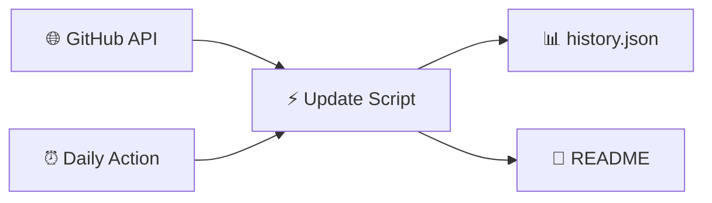

<!-- Static README shell — ranking tables are injected by Update-ParadiseFeed.ps1 -->

<div align="center">

<!-- Banner: committed PNG (reliable on GitHub — no external CDN) -->


<br/>

[](https://github.com/btstevens1984az/powershell-paradise/actions/workflows/daily-update.yml)
[](https://learn.microsoft.com/powershell/)
[](https://github.com/btstevens1984az/powershell-paradise/actions)
[](LICENSE)

<br/><br/>

<!-- PARADISE:STATS:START -->
<table align="center">
<tr>
<td align="center" width="25%">
<br/>
<h3>📅 Today</h3>
<h2>15</h2>
<sub>trending movers</sub>
<br/><br/>
</td>
<td align="center" width="25%">
<br/>
<h3>📆 This Week</h3>
<h2>15</h2>
<sub>new repos</sub>
<br/><br/>
</td>
<td align="center" width="25%">
<br/>
<h3>🗓️ This Month</h3>
<h2>15</h2>
<sub>new repos</sub>
<br/><br/>
</td>
<td align="center" width="25%">
<br/>
<h3>📈 This Year</h3>
<h2>15</h2>
<sub>new repos</sub>
<br/><br/>
</td>
</tr>
</table>
<!-- PARADISE:STATS:END -->

<br/>

<!-- PARADISE:META:START -->
<p align="center"><sub>🕐 <strong>Last refreshed:</strong> Tuesday, September 22, 2026 · 10:58 UTC · <a href="https://github.com/btstevens1984az/powershell-paradise/actions/workflows/daily-update.yml">GitHub Actions</a></sub></p>

[](https://github.com/btstevens1984az/powershell-paradise)
&nbsp;
[](https://github.com/btstevens1984az/powershell-paradise/actions)
&nbsp;
[](https://github.com/btstevens1984az/powershell-paradise)
&nbsp;
[](https://github.com/btstevens1984az/powershell-paradise)
<!-- PARADISE:META:END -->

</div>

---

## 📡 Welcome to the Paradise

> **PowerShell Paradise** is your cozy corner of GitHub for staying current — a living leaderboard that refreshes every morning with the hottest PowerShell projects, modules, and tools the community is starring right now.

<table>
<tr>
<td width="50%" valign="top">

### 🌊 What you'll find

| Window | The vibe |
|:------:|:---------|
| 🔥 **Today** | Star velocity — what's climbing *right now* |
| 📆 **Week** | Fresh repos from the last 7 days |
| 🗓️ **Month** | Standouts from the last 30 days |
| 📈 **Year** | The year's best new PowerShell repos |

</td>
<td width="50%" valign="top">

### 🧭 Jump around

| Go to | Section |
|:-----:|:--------|
| 🔥 | [Today's Top Movers](#-todays-top-movers) |
| 📆 | [This Week](#-this-weeks-top-repositories) |
| 🗓️ | [This Month](#️-this-months-top-repositories) |
| 📈 | [This Year](#-this-years-top-repositories) |
| ⚙️ | [How It Works](#️-how-it-works) |

</td>
</tr>
</table>

---

## 🔥 Today's Top Movers

[](https://github.com/btstevens1984az/powershell-paradise#-todays-top-movers)

> Repos with the biggest **star gains** since the last refresh. First run shows recently active repos instead.

<!-- PARADISE:TODAY:START -->
| # | Project | ⭐ Stars | 🍴 Forks | About | 🕐 Updated |
|:-:|---------|----------:|----------:|-------|------------|
| 🥇 |  &nbsp;**[reverse-skill](https://github.com/zhaoxuya520/reverse-skill)**<br/><sub><code>zhaoxuya520/reverse-skill</code></sub> | **36.9k** &nbsp; 🚀 **+90** | 5.1k | Reverse Engineering / Authorized Penetration Testing / Security Research Skill Router P… | 4h ago |
| 🥈 |  &nbsp;**[winutil](https://github.com/ChrisTitusTech/winutil)**<br/><sub><code>ChrisTitusTech/winutil</code></sub> | **63k** &nbsp; 🚀 **+40** | 3.7k | Chris Titus Tech's Windows Utility - Install Programs, Tweaks, Fixes, and Updates | 2d ago |
| 🥉 |  &nbsp;**[Win11Debloat](https://github.com/Raphire/Win11Debloat)**<br/><sub><code>Raphire/Win11Debloat</code></sub> | **57.5k** &nbsp; 🚀 **+32** | 2.5k | A simple, lightweight PowerShell script that allows you to remove pre-installed apps, d…<br/> `automated`  `bloatware` | 12d ago |
| **4** |  &nbsp;**[SpotX](https://github.com/SpotX-Official/SpotX)**<br/><sub><code>SpotX-Official/SpotX</code></sub> | **22.4k** &nbsp; 🚀 **+13** | 1.1k | SpotX patcher used for patching the desktop version of Spotify<br/> `adblock`  `spotify` | 8m ago |
| **5** |  &nbsp;**[RemoveWindowsAI](https://github.com/zoicware/RemoveWindowsAI)**<br/><sub><code>zoicware/RemoveWindowsAI</code></sub> | **13.1k** &nbsp; 🚀 **+8** | 457 | Force Remove Copilot, Recall and More in Windows 11<br/> `ai`  `bloatware` | 17h ago |
| **6** |  &nbsp;**[usbrubberducky-payloads](https://github.com/hak5/usbrubberducky-payloads)**<br/><sub><code>hak5/usbrubberducky-payloads</code></sub> | **6k** &nbsp; 🚀 **+7** | 1.7k | The Official USB Rubber Ducky Payload Repository<br/> `badusb`  `ducky-payloads` | 21d ago |
| **7** |  &nbsp;**[Office-Tool](https://github.com/YerongAI/Office-Tool)**<br/><sub><code>YerongAI/Office-Tool</code></sub> | **14.3k** &nbsp; 🚀 **+6** | 1.1k | Office Tool Plus localization projects.<br/> `msoffice`  `msproject` | 1d ago |
| **8** |  &nbsp;**[GOAD](https://github.com/Orange-Cyberdefense/GOAD)**<br/><sub><code>Orange-Cyberdefense/GOAD</code></sub> | **8.4k** &nbsp; 🚀 **+6** | 1.1k | game of active directory<br/> `active-directory`  `ansible` | 194d ago |
| **9** |  &nbsp;**[runner-images](https://github.com/actions/runner-images)**<br/><sub><code>actions/runner-images</code></sub> | **13.2k** &nbsp; 🚀 **+4** | 3.9k | GitHub Actions runner images | 1h ago |
| **10** |  &nbsp;**[RedTeaming-Tactics-and-Techniques](https://github.com/mantvydasb/RedTeaming-Tactics-and-Techniques)**<br/><sub><code>mantvydasb/RedTeaming-Tactics-and-Techniques</code></sub> | **4.7k** &nbsp; 🚀 **+4** | 1.1k | Red Teaming Tactics and Techniques<br/> `offensive-security`  `oscp` | 101d ago |
| **11** |  &nbsp;**[psmux](https://github.com/psmux/psmux)**<br/><sub><code>psmux/psmux</code></sub> | **3.5k** &nbsp; 🚀 **+4** | 214 | Tmux on Windows Powershell - tmux for PowerShell, Windows Terminal, cmd.exe. Includes p…<br/> `cli`  `powershell` | 22h ago |
| **12** |  &nbsp;**[PowerShell-Docs](https://github.com/MicrosoftDocs/PowerShell-Docs)**<br/><sub><code>MicrosoftDocs/PowerShell-Docs</code></sub> | **2.5k** &nbsp; 🚀 **+4** | 1.7k | The official PowerShell documentation sources<br/> `hacktoberfest`  `powershell` | 10h ago |
| **13** |  &nbsp;**[WindowsDeveloperConfig](https://github.com/microsoft/WindowsDeveloperConfig)**<br/><sub><code>microsoft/WindowsDeveloperConfig</code></sub> | **2.2k** &nbsp; 🚀 **+4** | 169 | Automate the setup and configuration of your Windows development environment. | 3d ago |
| **14** |  &nbsp;**[clawgod](https://github.com/0Chencc/clawgod)**<br/><sub><code>0Chencc/clawgod</code></sub> | **2k** &nbsp; 🚀 **+4** | 329 | ClawGod is a runtime patch applied to the official Claude Code. It continues to be supp…<br/> `ai`  `assistant` | 3h ago |
| **15** |  &nbsp;**[tiny11builder](https://github.com/ntdevlabs/tiny11builder)**<br/><sub><code>ntdevlabs/tiny11builder</code></sub> | **19.6k** &nbsp; 🚀 **+3** | 1.5k | Scripts to build a trimmed-down Windows 11 image. | 375d ago |
<!-- PARADISE:TODAY:END -->

---

## 📆 This Week's Top Repositories

[](https://github.com/btstevens1984az/powershell-paradise#-this-weeks-top-repositories)

> PowerShell repos **created in the last 7 days**, ranked by total stars.

<!-- PARADISE:WEEK:START -->
| # | Project | ⭐ Stars | 🍴 Forks | About | 🕐 Updated |
|:-:|---------|----------:|----------:|-------|------------|
| 🥇 |  &nbsp;**[Deepseek-Harness-Easy-Setup](https://github.com/vobl1999/Deepseek-Harness-Easy-Setup)**<br/><sub><code>vobl1999/Deepseek-Harness-Easy-Setup</code></sub> | **104** | 0 | — | 2d ago |
| 🥈 |  &nbsp;**[everything-search-skill](https://github.com/Mayuqi-crypto/everything-search-skill)**<br/><sub><code>Mayuqi-crypto/everything-search-skill</code></sub> | **57** | 2 | ⚡ Ultra-fast, index-powered local file search skill for AI agents (Cursor, Codex, PI-De…<br/> `agent-skill`  `codex` | 2d ago |
| 🥉 |  &nbsp;**[intunewin-contextprep](https://github.com/imabdk/intunewin-contextprep)**<br/><sub><code>imabdk/intunewin-contextprep</code></sub> | **40** | 3 | — | 2d ago |
| **4** |  &nbsp;**[qwen3.6-35b-a3b-144T-S](https://github.com/RicardoBertran/qwen3.6-35b-a3b-144T-S)**<br/><sub><code>RicardoBertran/qwen3.6-35b-a3b-144T-S</code></sub> | **12** | 0 | Configuración reproducible de Qwen 3.6 35B-A3B IQ2_XXS en una RTX 5070 de 12 GB | 2d ago |
| **5** |  &nbsp;**[BDB-Guardian](https://github.com/DevCop95/BDB-Guardian)**<br/><sub><code>DevCop95/BDB-Guardian</code></sub> | **10** | 0 | Defensive PowerShell monitor that detects BigDiskBuster-style DoS attacks against Windo…<br/> `blueteam`  `mitre-attack` | 2d ago |
| **6** |  &nbsp;**[Ultimate](https://github.com/FR33THYFR33THY/Ultimate)**<br/><sub><code>FR33THYFR33THY/Ultimate</code></sub> | **10** | 0 | — | 10h ago |
| **7** |  &nbsp;**[deviload](https://github.com/Pronexsteam/deviload)**<br/><sub><code>Pronexsteam/deviload</code></sub> | **9** | 2 | Deviload — a clean Windows desktop front-end for yt-lp: paste a link, pick quality, dow… | 12h ago |
| **8** |  &nbsp;**[WinSux](https://github.com/FR33THYFR33THY/WinSux)**<br/><sub><code>FR33THYFR33THY/WinSux</code></sub> | **8** | 1 | — | 10h ago |
| **9** |  &nbsp;**[Afterhours](https://github.com/Tokaku7/Afterhours)**<br/><sub><code>Tokaku7/Afterhours</code></sub> | **8** | 0 | A lightweight Windows desktop game time dashboard | 4d ago |
| **10** |  &nbsp;**[Anyone-Can-Cook-II-Any-Character-in-Any-Playset-Mod-for-Disney-Infinity-3.0](https://github.com/AaBysT/Anyone-Can-Cook-II-Any-Character-in-Any-Playset-Mod-for-Disney-Infinity-3.0)**<br/><sub><code>AaBysT/Anyone-Can-Cook-II-Any-Character-in-Any-Playset-Mod-for-Disney-Infinity-3.0</code></sub> | **7** | 0 | A mod for Disney Infinity 3.0 that allows any character in any playset | 3d ago |
| **11** |  &nbsp;**[Roblox-Luau-Formatter](https://github.com/hexagongemgate/Roblox-Luau-Formatter)**<br/><sub><code>hexagongemgate/Roblox-Luau-Formatter</code></sub> | **7** | 1 | Lightweight developer utility for formatting Lua and Luau files and folders.<br/> `code-style`  `developer-tool` | 19h ago |
| **12** |  &nbsp;**[Vortex-zh-TW](https://github.com/threesecond/Vortex-zh-TW)**<br/><sub><code>threesecond/Vortex-zh-TW</code></sub> | **7** | 0 | — | 3d ago |
| **13** |  &nbsp;**[Roblox-Luau-Formatter](https://github.com/BaseSmokeHover/Roblox-Luau-Formatter)**<br/><sub><code>BaseSmokeHover/Roblox-Luau-Formatter</code></sub> | **7** | 3 | Free Lua, Luau and Roblox code formatter with configurable formatting rules.<br/> `automatic-formatting`  `code-quality` | 19h ago |
| **14** |  &nbsp;**[XiaomingCampusNetToolkit](https://github.com/xm2284/XiaomingCampusNetToolkit)**<br/><sub><code>xm2284/XiaomingCampusNetToolkit</code></sub> | **6** | 0 | 「小明」校园网加速工具箱 —— Windows 校园网/游戏网络一键优化、代理残留清理、自动备份可还原、延迟前后对比、匿名统计<br/> `campus`  `latency` | 2d ago |
| **15** |  &nbsp;**[Steam-Commander](https://github.com/Hetfield1985/Steam-Commander)**<br/><sub><code>Hetfield1985/Steam-Commander</code></sub> | **6** | 1 | Convenient, fast or automatic way to add non-Steam games to your Steam library: auto-de…<br/> `game-launcher-software`  `game-library-manager` | 6h ago |
<!-- PARADISE:WEEK:END -->

---

## 🗓️ This Month's Top Repositories

[](https://github.com/btstevens1984az/powershell-paradise#%EF%B8%8F-this-months-top-repositories)

> PowerShell repos **created in the last 30 days**, ranked by total stars.

<!-- PARADISE:MONTH:START -->
| # | Project | ⭐ Stars | 🍴 Forks | About | 🕐 Updated |
|:-:|---------|----------:|----------:|-------|------------|
| 🥇 |  &nbsp;**[myfreebuff](https://github.com/capncodes69/myfreebuff)**<br/><sub><code>capncodes69/myfreebuff</code></sub> | **649** | 3 | — | 18d ago |
| 🥈 |  &nbsp;**[vintage-latex](https://github.com/Foadsf/vintage-latex)**<br/><sub><code>Foadsf/vintage-latex</code></sub> | **416** | 23 | Twenty LuaLaTeX and MetaPost (fiziko) examples of the old scientific-paper aesthetic: e…<br/> `fiziko`  `latex` | 13d ago |
| 🥉 |  &nbsp;**[CUDA-for-AMD-Windows](https://github.com/Speedstu/CUDA-for-AMD-Windows)**<br/><sub><code>Speedstu/CUDA-for-AMD-Windows</code></sub> | **285** | 27 | Run CUDA-targeted Windows applications on AMD GPUs with ZLUDA + ROCm/HIP.<br/> `amd`  `amd-gpu` | 2d ago |
| **4** |  &nbsp;**[codex-task-pointer](https://github.com/big0lives/codex-task-pointer)**<br/><sub><code>big0lives/codex-task-pointer</code></sub> | **220** | 16 | Pre-compaction hooks + a CAS-guarded task pointer that keep Codex agents on-goal across…<br/> `agent-hooks`  `agents` | 23d ago |
| **5** |  &nbsp;**[SteamDaddy-Backup](https://github.com/Contrary7/SteamDaddy-Backup)**<br/><sub><code>Contrary7/SteamDaddy-Backup</code></sub> | **220** | 16 | The ultimate SteamTools & GreenLuma alternative. Auto-unlock DLCs, fix connection & pur…<br/> `depot`  `depot-downloader` | 5d ago |
| **6** |  &nbsp;**[BrokenPipe](https://github.com/KillaBoi/BrokenPipe)**<br/><sub><code>KillaBoi/BrokenPipe</code></sub> | **218** | 52 | Steam Client Service Local Privilege Escalation Vulnerability | 4d ago |
| **7** |  &nbsp;**[embedded-project-governance](https://github.com/crichars/embedded-project-governance)**<br/><sub><code>crichars/embedded-project-governance</code></sub> | **105** | 1 | 面向 AI 辅助嵌入式固件开发的轻量、风险分级治理 skill<br/> `agent-skills`  `claude-code` | 19d ago |
| **8** |  &nbsp;**[Deepseek-Harness-Easy-Setup](https://github.com/vobl1999/Deepseek-Harness-Easy-Setup)**<br/><sub><code>vobl1999/Deepseek-Harness-Easy-Setup</code></sub> | **104** | 0 | — | 2d ago |
| **9** |  &nbsp;**[visio-com-skill](https://github.com/WUXU-Tech/visio-com-skill)**<br/><sub><code>WUXU-Tech/visio-com-skill</code></sub> | **95** | 0 | A clean-room Codex skill for generating editable Microsoft Visio .vsdx diagrams through… | 20d ago |
| **10** |  &nbsp;**[Ronnier-skill](https://github.com/Ayueh0102/Ronnier-skill)**<br/><sub><code>Ayueh0102/Ronnier-skill</code></sub> | **90** | 6 | 色彩科學／色度學完整中文學習筆記，包裝成 Claude Code skill，也支援 Codex。涵蓋 CIE 色度學、CIEDE2000、CIECAM02、色適應與演色性。<br/> `agent-md`  `ciecam02` | 27d ago |
| **11** |  &nbsp;**[codebase-reverse](https://github.com/sharptoolbox/codebase-reverse)**<br/><sub><code>sharptoolbox/codebase-reverse</code></sub> | **90** | 45 | 完整源码逆向工程技能：把存量源码逆向为功能/实现/架构/接口/对象/组件/数据库完整元模型，深度定制于 Java Web 与 Java 微服务(Spring Boot/Clo… | 23d ago |
| **12** |  &nbsp;**[psxrecomp-ports](https://github.com/alexbeavs-ps1-ports/psxrecomp-ports)**<br/><sub><code>alexbeavs-ps1-ports/psxrecomp-ports</code></sub> | **89** | 3 | Unofficial noncommercial PlayStation recompilation releases<br/> `compatibility`  `game-preservation` | 23h ago |
| **13** |  &nbsp;**[MiniMax-H3-OneClick](https://github.com/TianyiDataScience/MiniMax-H3-OneClick)**<br/><sub><code>TianyiDataScience/MiniMax-H3-OneClick</code></sub> | **71** | 11 | 一键安装MiniMax H3+ComfyUI视频生成工作流。 | 6d ago |
| **14** |  &nbsp;**[Maa-Assistant-Browndust2](https://github.com/alkaidjin/Maa-Assistant-Browndust2)**<br/><sub><code>alkaidjin/Maa-Assistant-Browndust2</code></sub> | **67** | 3 | Browndust2 日常自动化小助手 | 23h ago |
| **15** |  &nbsp;**[everything-search-skill](https://github.com/Mayuqi-crypto/everything-search-skill)**<br/><sub><code>Mayuqi-crypto/everything-search-skill</code></sub> | **57** | 2 | ⚡ Ultra-fast, index-powered local file search skill for AI agents (Cursor, Codex, PI-De…<br/> `agent-skill`  `codex` | 2d ago |
<!-- PARADISE:MONTH:END -->

---

## 📈 This Year's Top Repositories

[](https://github.com/btstevens1984az/powershell-paradise#-this-years-top-repositories)

> PowerShell repos **created since January 1**, ranked by total stars.

<!-- PARADISE:YEAR:START -->
| # | Project | ⭐ Stars | 🍴 Forks | About | 🕐 Updated |
|:-:|---------|----------:|----------:|-------|------------|
| 🥇 |  &nbsp;**[reverse-skill](https://github.com/zhaoxuya520/reverse-skill)**<br/><sub><code>zhaoxuya520/reverse-skill</code></sub> | **36.9k** | 5.1k | Reverse Engineering / Authorized Penetration Testing / Security Research Skill Router P… | 4h ago |
| 🥈 |  &nbsp;**[WindowsDeveloperConfig](https://github.com/microsoft/WindowsDeveloperConfig)**<br/><sub><code>microsoft/WindowsDeveloperConfig</code></sub> | **2.2k** | 169 | Automate the setup and configuration of your Windows development environment. | 3d ago |
| 🥉 |  &nbsp;**[clawgod](https://github.com/0Chencc/clawgod)**<br/><sub><code>0Chencc/clawgod</code></sub> | **2k** | 329 | ClawGod is a runtime patch applied to the official Claude Code. It continues to be supp…<br/> `ai`  `assistant` | 3h ago |
| **4** |  &nbsp;**[cinema-dna-21x9x3](https://github.com/dacnay816y62-hub/cinema-dna-21x9x3)**<br/><sub><code>dacnay816y62-hub/cinema-dna-21x9x3</code></sub> | **1.4k** | 138 | 高级感电影画面生成 | 3d ago |
| **5** |  &nbsp;**[codex-windows-fast-patch-skill](https://github.com/chen0416ccc-cpu/codex-windows-fast-patch-skill)**<br/><sub><code>chen0416ccc-cpu/codex-windows-fast-patch-skill</code></sub> | **1.2k** | 126 | 此skills用于指导智能体在 Windows 上恢复 Codex Desktop 升级后失效的本地补丁和能力开关。（Computer Use，插件，破限，codex强制汉化… | 6d ago |
| **6** |  &nbsp;**[deGDID](https://github.com/yegors/deGDID)**<br/><sub><code>yegors/deGDID</code></sub> | **1.1k** | 54 | Deletes all instances of Microsoft's GDID and prevents minting of new ones | 45d ago |
| **7** |  &nbsp;**[selfware.md](https://github.com/floatboatai/selfware.md)**<br/><sub><code>floatboatai/selfware.md</code></sub> | **1.1k** | 94 | — | 198d ago |
| **8** |  &nbsp;**[GrapeRoot](https://github.com/kunal12203/GrapeRoot)**<br/><sub><code>kunal12203/GrapeRoot</code></sub> | **1k** | 122 | Compounding Context for AI Coding Assistants — MCP graph engine for Claude Code, Cursor…<br/> `ai-coding`  `claude-code` | 19d ago |
| **9** |  &nbsp;**[work-iq](https://github.com/microsoft/work-iq)**<br/><sub><code>microsoft/work-iq</code></sub> | **1k** | 132 | MCP Server and CLI for accessing Work IQ | 9h ago |
| **10** |  &nbsp;**[get-shit-done-for-antigravity](https://github.com/toonight/get-shit-done-for-antigravity)**<br/><sub><code>toonight/get-shit-done-for-antigravity</code></sub> | **954** | 151 | — | 33d ago |
| **11** |  &nbsp;**[codex-visio-paper-figure-skill](https://github.com/pengjunchi0/codex-visio-paper-figure-skill)**<br/><sub><code>pengjunchi0/codex-visio-paper-figure-skill</code></sub> | **924** | 46 | 科研绘图skill、论文绘图skill、图片转visio等可编辑格式，将生成图转化为论文可编辑图，便于作者调整绘图细节<br/> `academic-figures`  `codex` | 37d ago |
| **12** |  &nbsp;**[commands](https://github.com/GuDaStudio/commands)**<br/><sub><code>GuDaStudio/commands</code></sub> | **876** | 49 | — | 228d ago |
| **13** |  &nbsp;**[Light-Help](https://github.com/Cotton059/Light-Help)**<br/><sub><code>Cotton059/Light-Help</code></sub> | **652** | 273 | Help the audience perform some complex operations. | 5d ago |
| **14** |  &nbsp;**[myfreebuff](https://github.com/capncodes69/myfreebuff)**<br/><sub><code>capncodes69/myfreebuff</code></sub> | **649** | 3 | — | 18d ago |
| **15** |  &nbsp;**[anti-defensive-writing](https://github.com/Kiterlin/anti-defensive-writing)**<br/><sub><code>Kiterlin/anti-defensive-writing</code></sub> | **617** | 22 | Codex skill for removing defensive writing and strengthening prose.<br/> `academic-writing`  `agent-skill` | 2h ago |
<!-- PARADISE:YEAR:END -->

---

## ⚙️ How It Works


```mermaid
flowchart LR
    A["🌐 GitHub API"] --> B["⚡ Update Script"]
    B --> C["📊 history.json"]
    B --> D["📝 README"]
    E["⏰ Daily Action"] --> B
```

| Step | What happens |
|:----:|:-------------|
| 1️⃣ | Query GitHub for `language:powershell` repos with real activity |
| 2️⃣ | Compare star counts to yesterday's snapshot for velocity |
| 3️⃣ | Build four bubbly ranking tables — top 15 each |
| 4️⃣ | Auto-commit back to this README every morning at 06:00 UTC |

<details>
<summary><b>🛠️ Run locally</b></summary>

```powershell
$env:GITHUB_TOKEN = 'ghp_your_token'   # optional — higher API limits
./scripts/Update-ParadiseFeed.ps1
```

</details>

<details>
<summary><b>🔍 Filters applied</b></summary>

- Language: **PowerShell** · Forks excluded · Minimum **3 stars** · Top **15** per table

</details>

---

## 🌟 Why star this repo?

<table>
<tr>
<td align="center">😴<br/><b>Zero effort</b><br/><sub>Updates while you sleep</sub></td>
<td align="center">📡<br/><b>Community signal</b><br/><sub>See what builders love</sub></td>
<td align="center">🎓<br/><b>Learning radar</b><br/><sub>Find modules worth studying</sub></td>
<td align="center">🔓<br/><b>Open source</b><br/><sub>Fork &amp; adapt freely</sub></td>
</tr>
</table>

---

## 📜 License

MIT — see [LICENSE](LICENSE).

---

<div align="center">

**Built with ❤️ for the PowerShell community**

*Star this repo to get daily trending PowerShell projects in your GitHub feed.*

</div>
