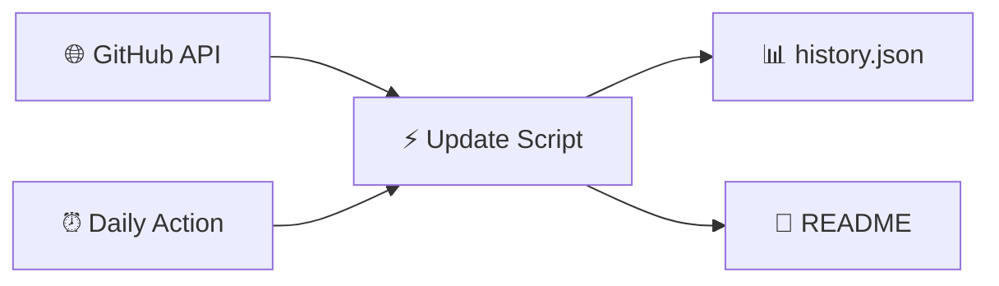

<!-- Static README shell — ranking tables are injected by Update-ParadiseFeed.ps1 -->

<div align="center">

<!-- Banner: committed PNG (reliable on GitHub — no external CDN) -->


<br/>

[](https://github.com/btstevens1984az/powershell-paradise/actions/workflows/daily-update.yml)
[](https://learn.microsoft.com/powershell/)
[](https://github.com/btstevens1984az/powershell-paradise/actions)
[](LICENSE)

<br/><br/>

<!-- PARADISE:STATS:START -->
<table align="center">
<tr>
<td align="center" width="25%">
<br/>
<h3>📅 Today</h3>
<h2>15</h2>
<sub>trending movers</sub>
<br/><br/>
</td>
<td align="center" width="25%">
<br/>
<h3>📆 This Week</h3>
<h2>15</h2>
<sub>new repos</sub>
<br/><br/>
</td>
<td align="center" width="25%">
<br/>
<h3>🗓️ This Month</h3>
<h2>15</h2>
<sub>new repos</sub>
<br/><br/>
</td>
<td align="center" width="25%">
<br/>
<h3>📈 This Year</h3>
<h2>15</h2>
<sub>new repos</sub>
<br/><br/>
</td>
</tr>
</table>
<!-- PARADISE:STATS:END -->

<br/>

<!-- PARADISE:META:START -->
<p align="center"><sub>🕐 <strong>Last refreshed:</strong> Monday, August 10, 2026 · 07:28 UTC · <a href="https://github.com/btstevens1984az/powershell-paradise/actions/workflows/daily-update.yml">GitHub Actions</a></sub></p>

[](https://github.com/btstevens1984az/powershell-paradise)
&nbsp;
[](https://github.com/btstevens1984az/powershell-paradise/actions)
&nbsp;
[](https://github.com/btstevens1984az/powershell-paradise)
&nbsp;
[](https://github.com/btstevens1984az/powershell-paradise)
<!-- PARADISE:META:END -->

</div>

---

## 📡 Welcome to the Paradise

> **PowerShell Paradise** is your cozy corner of GitHub for staying current — a living leaderboard that refreshes every morning with the hottest PowerShell projects, modules, and tools the community is starring right now.

<table>
<tr>
<td width="50%" valign="top">

### 🌊 What you'll find

| Window | The vibe |
|:------:|:---------|
| 🔥 **Today** | Star velocity — what's climbing *right now* |
| 📆 **Week** | Fresh repos from the last 7 days |
| 🗓️ **Month** | Standouts from the last 30 days |
| 📈 **Year** | The year's best new PowerShell repos |

</td>
<td width="50%" valign="top">

### 🧭 Jump around

| Go to | Section |
|:-----:|:--------|
| 🔥 | [Today's Top Movers](#-todays-top-movers) |
| 📆 | [This Week](#-this-weeks-top-repositories) |
| 🗓️ | [This Month](#️-this-months-top-repositories) |
| 📈 | [This Year](#-this-years-top-repositories) |
| ⚙️ | [How It Works](#️-how-it-works) |

</td>
</tr>
</table>

---

## 🔥 Today's Top Movers

[](https://github.com/btstevens1984az/powershell-paradise#-todays-top-movers)

> Repos with the biggest **star gains** since the last refresh. First run shows recently active repos instead.

<!-- PARADISE:TODAY:START -->
| # | Project | ⭐ Stars | 🍴 Forks | About | 🕐 Updated |
|:-:|---------|----------:|----------:|-------|------------|
| 🥇 |  &nbsp;**[reverse-skill](https://github.com/zhaoxuya520/reverse-skill)**<br/><sub><code>zhaoxuya520/reverse-skill</code></sub> | **22.9k** &nbsp; 🚀 **+1076** | 3.1k | Reverse Engineering / Authorized Penetration Testing / Security Research Skill Router P… | 21h ago |
| 🥈 |  &nbsp;**[winutil](https://github.com/ChrisTitusTech/winutil)**<br/><sub><code>ChrisTitusTech/winutil</code></sub> | **60.1k** &nbsp; 🚀 **+82** | 3.5k | Chris Titus Tech's Windows Utility - Install Programs, Tweaks, Fixes, and Updates | 6h ago |
| 🥉 |  &nbsp;**[Win11Debloat](https://github.com/Raphire/Win11Debloat)**<br/><sub><code>Raphire/Win11Debloat</code></sub> | **55.1k** &nbsp; 🚀 **+72** | 2.4k | A simple, lightweight PowerShell script that allows you to remove pre-installed apps, d…<br/> `automated`  `bloatware` | 1d ago |
| **4** |  &nbsp;**[SpotX](https://github.com/SpotX-Official/SpotX)**<br/><sub><code>SpotX-Official/SpotX</code></sub> | **22k** &nbsp; 🚀 **+21** | 1.1k | SpotX patcher used for patching the desktop version of Spotify<br/> `adblock`  `spotify` | 2d ago |
| **5** |  &nbsp;**[RemoveWindowsAI](https://github.com/zoicware/RemoveWindowsAI)**<br/><sub><code>zoicware/RemoveWindowsAI</code></sub> | **12.7k** &nbsp; 🚀 **+13** | 441 | Force Remove Copilot, Recall and More in Windows 11<br/> `ai`  `bloatware` | 1d ago |
| **6** |  &nbsp;**[tiny11builder](https://github.com/ntdevlabs/tiny11builder)**<br/><sub><code>ntdevlabs/tiny11builder</code></sub> | **19.3k** &nbsp; 🚀 **+11** | 1.5k | Scripts to build a trimmed-down Windows 11 image. | 332d ago |
| **7** |  &nbsp;**[psmux](https://github.com/psmux/psmux)**<br/><sub><code>psmux/psmux</code></sub> | **3.2k** &nbsp; 🚀 **+10** | 196 | Tmux on Windows Powershell - tmux for PowerShell, Windows Terminal, cmd.exe. Includes p…<br/> `cli`  `powershell` | 13h ago |
| **8** |  &nbsp;**[Extras](https://github.com/ScoopInstaller/Extras)**<br/><sub><code>ScoopInstaller/Extras</code></sub> | **2.1k** &nbsp; 🚀 **+10** | 1.7k | 📦 The Extras bucket for Scoop.<br/> `hacktoberfest`  `scoop` | 3h ago |
| **9** |  &nbsp;**[Office-Tool](https://github.com/YerongAI/Office-Tool)**<br/><sub><code>YerongAI/Office-Tool</code></sub> | **14k** &nbsp; 🚀 **+8** | 1k | Office Tool Plus localization projects.<br/> `msoffice`  `msproject` | 61d ago |
| **10** |  &nbsp;**[commando-vm](https://github.com/mandiant/commando-vm)**<br/><sub><code>mandiant/commando-vm</code></sub> | **7.7k** &nbsp; 🚀 **+7** | 1.4k | Complete Mandiant Offensive VM (Commando VM), a fully customizable Windows-based pentes…<br/> `fireeye-flare`  `penetration-testing` | 298d ago |
| **11** |  &nbsp;**[usbrubberducky-payloads](https://github.com/hak5/usbrubberducky-payloads)**<br/><sub><code>hak5/usbrubberducky-payloads</code></sub> | **5.9k** &nbsp; 🚀 **+6** | 1.7k | The Official USB Rubber Ducky Payload Repository<br/> `badusb`  `ducky-payloads` | 57d ago |
| **12** |  &nbsp;**[Fast-Kubernetes](https://github.com/omerbsezer/Fast-Kubernetes)**<br/><sub><code>omerbsezer/Fast-Kubernetes</code></sub> | **3.6k** &nbsp; 🚀 **+6** | 1.3k | This repo covers Kubernetes with LABs: Kubectl, Pod, Deployment, Service, PV, PVC, Roll…<br/> `affinity`  `config-maps` | 483d ago |
| **13** |  &nbsp;**[GOAD](https://github.com/Orange-Cyberdefense/GOAD)**<br/><sub><code>Orange-Cyberdefense/GOAD</code></sub> | **8.2k** &nbsp; 🚀 **+5** | 1.1k | game of active directory<br/> `active-directory`  `ansible` | 151d ago |
| **14** |  &nbsp;**[Scoop](https://github.com/ScoopInstaller/Scoop)**<br/><sub><code>ScoopInstaller/Scoop</code></sub> | **24.5k** &nbsp; 🚀 **+3** | 1.5k | A command-line installer for Windows.<br/> `installer`  `powershell` | 58d ago |
| **15** |  &nbsp;**[runner-images](https://github.com/actions/runner-images)**<br/><sub><code>actions/runner-images</code></sub> | **13k** &nbsp; 🚀 **+3** | 3.8k | GitHub Actions runner images | 3d ago |
<!-- PARADISE:TODAY:END -->

---

## 📆 This Week's Top Repositories

[](https://github.com/btstevens1984az/powershell-paradise#-this-weeks-top-repositories)

> PowerShell repos **created in the last 7 days**, ranked by total stars.

<!-- PARADISE:WEEK:START -->
| # | Project | ⭐ Stars | 🍴 Forks | About | 🕐 Updated |
|:-:|---------|----------:|----------:|-------|------------|
| 🥇 |  &nbsp;**[codex-deepseek-subagent](https://github.com/Utopia-V/codex-deepseek-subagent)**<br/><sub><code>Utopia-V/codex-deepseek-subagent</code></sub> | **126** | 7 | Run DeepSeek V4 Flash as a native Codex subagent without replacing the OpenAI main agent.<br/> `codex`  `deepseek` | 2d ago |
| 🥈 |  &nbsp;**[minimax-h3-opencode-skills](https://github.com/unknowlei/minimax-h3-opencode-skills)**<br/><sub><code>unknowlei/minimax-h3-opencode-skills</code></sub> | **26** | 0 | OpenCode skill suite for MiniMax H3 directing, routing, multishot planning, prompt gene…<br/> `agent-skills`  `minimax-h3` | 20h ago |
| 🥉 |  &nbsp;**[ds-vision-skill-plus](https://github.com/KagaribiDev/ds-vision-skill-plus)**<br/><sub><code>KagaribiDev/ds-vision-skill-plus</code></sub> | **17** | 1 | ds-vision-skill-plus：是基于ds-vision-skill的升级版，主要功能是给deepseek类似的纯文本推理模型提供可随着大语言模型发展而迭代提升的高… | 5d ago |
| **4** |  &nbsp;**[consolize](https://github.com/cybx/consolize)**<br/><sub><code>cybx/consolize</code></sub> | **14** | 0 | Turn a Windows 11 IoT LTSC PC into a couch gaming console: boots straight into Steam Bi… | 2d ago |
| **5** |  &nbsp;**[WeFlow-Community-Patch](https://github.com/AnonymousUser443/WeFlow-Community-Patch)**<br/><sub><code>AnonymousUser443/WeFlow-Community-Patch</code></sub> | **13** | 3 | Community hotfix for WeFlow 5.0.0 export failures and private-chat export hang<br/> `chat-export`  `hotfix` | 7d ago |
| **6** |  &nbsp;**[cc-devenv-doctor](https://github.com/killernay/cc-devenv-doctor)**<br/><sub><code>killernay/cc-devenv-doctor</code></sub> | **13** | 2 | One command to take a bare Windows or Mac machine to a working Claude Code setup — plus…<br/> `bash`  `bootstrap` | 4d ago |
| **7** |  &nbsp;**[TautWeekly](https://github.com/sparkmoxie/TautWeekly)**<br/><sub><code>sparkmoxie/TautWeekly</code></sub> | **9** | 0 | Preview-first weekly Plex activity newsletters powered by Tautulli. | 5h ago |
| **8** |  &nbsp;**[-Delta-Force-Graphics-Optimizer](https://github.com/Leonard8818/-Delta-Force-Graphics-Optimizer)**<br/><sub><code>Leonard8818/-Delta-Force-Graphics-Optimizer</code></sub> | **9** | 0 | 三角洲行动画面优化助手 — 一键应用 30+ 项 Windows 帧率优化，改动前自动备份、随时一键还原。非官方个人工具。 | 1h ago |
| **9** |  &nbsp;**[tybhy-workflow](https://github.com/tybhy/tybhy-workflow)**<br/><sub><code>tybhy/tybhy-workflow</code></sub> | **9** | 0 | opencode skills for AI multi-agent teams: requirement → auto dev → QA closed loop (pm-t… | 4h ago |
| **10** |  &nbsp;**[huawei-lite-watch-development](https://github.com/AlanLinYu/huawei-lite-watch-development)**<br/><sub><code>AlanLinYu/huawei-lite-watch-development</code></sub> | **8** | 1 | 华为轻智能手表开发 Codex Skill / Huawei Lite Wearable Development Skill<br/> `codex-skill`  `harmonyos` | 4d ago |
| **11** |  &nbsp;**[ICT-Service-Desk-Knowledge-Base-DE](https://github.com/SilvioSimon/ICT-Service-Desk-Knowledge-Base-DE)**<br/><sub><code>SilvioSimon/ICT-Service-Desk-Knowledge-Base-DE</code></sub> | **7** | 0 | Personal IT Service Desk knowledge base (in german) featuring troubleshooting guides, s… | 2d ago |
| **12** |  &nbsp;**[douyin-tiktok-story-skill-agent-database](https://github.com/liujunxibaba/douyin-tiktok-story-skill-agent-database)**<br/><sub><code>liujunxibaba/douyin-tiktok-story-skill-agent-database</code></sub> | **6** | 1 | Searchable local SQLite reference database for the Douyin and TikTok Story Skill & Agent. | 5d ago |
| **13** |  &nbsp;**[Aegis-Privacy-Shield](https://github.com/yarrowmartin3-prog/Aegis-Privacy-Shield)**<br/><sub><code>yarrowmartin3-prog/Aegis-Privacy-Shield</code></sub> | **6** | 1 | Suite d'outils Blue Team PowerShell (Self-Healing) par NovaSuite Technologies pour érad…<br/> `blue-team`  `hardening` | 1d ago |
| **14** |  &nbsp;**[codex-standard-devflow](https://github.com/qi-mouren/codex-standard-devflow)**<br/><sub><code>qi-mouren/codex-standard-devflow</code></sub> | **5** | 0 | — | 2d ago |
| **15** |  &nbsp;**[pglogical-windows](https://github.com/semihkiroglu/pglogical-windows)**<br/><sub><code>semihkiroglu/pglogical-windows</code></sub> | **5** | 0 | Unofficial Windows x64 build & release pipeline for the pglogical PostgreSQL extension … | 4h ago |
<!-- PARADISE:WEEK:END -->

---

## 🗓️ This Month's Top Repositories

[](https://github.com/btstevens1984az/powershell-paradise#%EF%B8%8F-this-months-top-repositories)

> PowerShell repos **created in the last 30 days**, ranked by total stars.

<!-- PARADISE:MONTH:START -->
| # | Project | ⭐ Stars | 🍴 Forks | About | 🕐 Updated |
|:-:|---------|----------:|----------:|-------|------------|
| 🥇 |  &nbsp;**[PC-Cartridge-System](https://github.com/LewdM3at/PC-Cartridge-System)**<br/><sub><code>LewdM3at/PC-Cartridge-System</code></sub> | **255** | 20 | Physical game cartridges with 2.5" SSDs for your Steam/GoG/Local library | 13d ago |
| 🥈 |  &nbsp;**[codex-deepseek-subagent](https://github.com/Utopia-V/codex-deepseek-subagent)**<br/><sub><code>Utopia-V/codex-deepseek-subagent</code></sub> | **126** | 7 | Run DeepSeek V4 Flash as a native Codex subagent without replacing the OpenAI main agent.<br/> `codex`  `deepseek` | 2d ago |
| 🥉 |  &nbsp;**[im-definitely-working](https://github.com/donutlabs/im-definitely-working)**<br/><sub><code>donutlabs/im-definitely-working</code></sub> | **124** | 15 | For Educational Purposes (it's a joke) | 10d ago |
| **4** |  &nbsp;**[ds-vision-skill](https://github.com/Sorwcyra/ds-vision-skill)**<br/><sub><code>Sorwcyra/ds-vision-skill</code></sub> | **107** | 8 | ds-vision-skill: Vision skill suite to add multimodal image capabilities for DeepSeek | 6h ago |
| **5** |  &nbsp;**[ResetNightmare](https://github.com/Semperis-Community/ResetNightmare)**<br/><sub><code>Semperis-Community/ResetNightmare</code></sub> | **96** | 20 | POC tool for ResetNightmare (CVE-2026-27912) | 8d ago |
| **6** |  &nbsp;**[WindowsUpdateRemedationTool](https://github.com/mertozsoy/WindowsUpdateRemedationTool)**<br/><sub><code>mertozsoy/WindowsUpdateRemedationTool</code></sub> | **89** | 12 | — | 22d ago |
| **7** |  &nbsp;**[pcairplay](https://github.com/gbulog/pcairplay)**<br/><sub><code>gbulog/pcairplay</code></sub> | **85** | 10 | Mirror an iPhone to a Windows PC using native iOS Screen Mirroring - no app on the phon… | 17d ago |
| **8** |  &nbsp;**[RDPWrap-Self-Heal](https://github.com/BuildWithSubha/RDPWrap-Self-Heal)**<br/><sub><code>BuildWithSubha/RDPWrap-Self-Heal</code></sub> | **80** | 0 | Self-healing RDP Wrapper for Windows 10/11/Server — auto-repairs multi-session Remote D…<br/> `homelab`  `multi-session` | 4d ago |
| **9** |  &nbsp;**[kos-starter-kit](https://github.com/kravetech/kos-starter-kit)**<br/><sub><code>kravetech/kos-starter-kit</code></sub> | **63** | 27 | A portable AI-assisted Knowledge OS starter kit for Obsidian, Codex, Claude Code, and c… | 5d ago |
| **10** |  &nbsp;**[powershell-for-sysadmins](https://github.com/socaldavis/powershell-for-sysadmins)**<br/><sub><code>socaldavis/powershell-for-sysadmins</code></sub> | **62** | 8 | Real sysadmin PowerShell scripts from the PC-Addicts YouTube channel — sanitized, param…<br/> `active-directory`  `automation` | 22d ago |
| **11** |  &nbsp;**[rbxmulti-loader](https://github.com/BoardCrawler/rbxmulti-loader)**<br/><sub><code>BoardCrawler/rbxmulti-loader</code></sub> | **49** | 8 | Running multiple R0bl0x instances on Windows. | 23d ago |
| **12** |  &nbsp;**[Windhawk-Backup-Manager](https://github.com/osmanonurkoc/Windhawk-Backup-Manager)**<br/><sub><code>osmanonurkoc/Windhawk-Backup-Manager</code></sub> | **47** | 0 | A modern, lightweight WPF utility to backup, review, and restore Windhawk mods, compile…<br/> `backup`  `backup-script` | 11d ago |
| **13** |  &nbsp;**[codex_apply_patch_fix](https://github.com/ikooky/codex_apply_patch_fix)**<br/><sub><code>ikooky/codex_apply_patch_fix</code></sub> | **34** | 0 | Persistent fix for Codex apply_patch failures on Windows. | 15d ago |
| **14** |  &nbsp;**[CIPP](https://github.com/CyberDrain/CIPP)**<br/><sub><code>CyberDrain/CIPP</code></sub> | **33** | 30 | — | 38m ago |
| **15** |  &nbsp;**[Win11Debloat-CN](https://github.com/beiwo090902-code/Win11Debloat-CN)**<br/><sub><code>beiwo090902-code/Win11Debloat-CN</code></sub> | **33** | 0 | Windows 11 Debloat 工具中文独立版，汉化：被窝。基于 Raphire/Win11Debloat。 | 26d ago |
<!-- PARADISE:MONTH:END -->

---

## 📈 This Year's Top Repositories

[](https://github.com/btstevens1984az/powershell-paradise#-this-years-top-repositories)

> PowerShell repos **created since January 1**, ranked by total stars.

<!-- PARADISE:YEAR:START -->
| # | Project | ⭐ Stars | 🍴 Forks | About | 🕐 Updated |
|:-:|---------|----------:|----------:|-------|------------|
| 🥇 |  &nbsp;**[reverse-skill](https://github.com/zhaoxuya520/reverse-skill)**<br/><sub><code>zhaoxuya520/reverse-skill</code></sub> | **22.9k** | 3.1k | Reverse Engineering / Authorized Penetration Testing / Security Research Skill Router P… | 21h ago |
| 🥈 |  &nbsp;**[WindowsDeveloperConfig](https://github.com/microsoft/WindowsDeveloperConfig)**<br/><sub><code>microsoft/WindowsDeveloperConfig</code></sub> | **1.9k** | 148 | Automate the setup and configuration of your Windows development environment. | 3d ago |
| 🥉 |  &nbsp;**[codex-windows-fast-patch-skill](https://github.com/chen0416ccc-cpu/codex-windows-fast-patch-skill)**<br/><sub><code>chen0416ccc-cpu/codex-windows-fast-patch-skill</code></sub> | **1.1k** | 114 | 此skills用于指导智能体在 Windows 上恢复 Codex Desktop 升级后失效的本地补丁和能力开关。（Computer Use，插件，破限，codex强制汉化… | 11h ago |
| **4** |  &nbsp;**[selfware.md](https://github.com/floatboatai/selfware.md)**<br/><sub><code>floatboatai/selfware.md</code></sub> | **1.1k** | 95 | — | 155d ago |
| **5** |  &nbsp;**[GrapeRoot](https://github.com/kunal12203/GrapeRoot)**<br/><sub><code>kunal12203/GrapeRoot</code></sub> | **1k** | 122 | Compounding Context for AI Coding Assistants — MCP graph engine for Claude Code, Cursor…<br/> `ai-coding`  `claude-code` | 6d ago |
| **6** |  &nbsp;**[work-iq](https://github.com/microsoft/work-iq)**<br/><sub><code>microsoft/work-iq</code></sub> | **964** | 115 | MCP Server and CLI for accessing Work IQ | 3d ago |
| **7** |  &nbsp;**[get-shit-done-for-antigravity](https://github.com/toonight/get-shit-done-for-antigravity)**<br/><sub><code>toonight/get-shit-done-for-antigravity</code></sub> | **930** | 146 | — | 131d ago |
| **8** |  &nbsp;**[commands](https://github.com/GuDaStudio/commands)**<br/><sub><code>GuDaStudio/commands</code></sub> | **880** | 49 | — | 185d ago |
| **9** |  &nbsp;**[codex-visio-paper-figure-skill](https://github.com/pengjunchi0/codex-visio-paper-figure-skill)**<br/><sub><code>pengjunchi0/codex-visio-paper-figure-skill</code></sub> | **673** | 31 | 科研绘图skill、论文绘图skill、图片转visio等可编辑格式，将生成图转化为论文可编辑图，便于作者调整绘图细节<br/> `academic-figures`  `codex` | 13d ago |
| **10** |  &nbsp;**[deGDID](https://github.com/yegors/deGDID)**<br/><sub><code>yegors/deGDID</code></sub> | **657** | 29 | Deletes all instances of Microsoft's GDID and prevents minting of new ones | 1d ago |
| **11** |  &nbsp;**[PsiphonOverMITM](https://github.com/B3hnamR/PsiphonOverMITM)**<br/><sub><code>B3hnamR/PsiphonOverMITM</code></sub> | **549** | 79 | — | 88d ago |
| **12** |  &nbsp;**[coralline](https://github.com/Nanako0129/coralline)**<br/><sub><code>Nanako0129/coralline</code></sub> | **533** | 40 | 🪸 Powerlevel10k-inspired statusline for Claude Code — paste one prompt and your AI int…<br/> `bash`  `claude` | 5d ago |
| **13** |  &nbsp;**[ai-business-skills](https://github.com/minhnv0807/ai-business-skills)**<br/><sub><code>minhnv0807/ai-business-skills</code></sub> | **526** | 218 | 138 bilingual AI marketing skills (69 VN + 69 Global) for Claude Code, OpenCode, Codex,…<br/> `agent-skills`  `ai-agents` | 3d ago |
| **14** |  &nbsp;**[Bonsai-Image-Demo](https://github.com/PrismML-Eng/Bonsai-Image-Demo)**<br/><sub><code>PrismML-Eng/Bonsai-Image-Demo</code></sub> | **526** | 73 | Generate images locally<br/> `1-bit`  `bonsai` | 57d ago |
| **15** |  &nbsp;**[Light-Help](https://github.com/Cotton059/Light-Help)**<br/><sub><code>Cotton059/Light-Help</code></sub> | **523** | 234 | Help the audience perform some complex operations. | 11d ago |
<!-- PARADISE:YEAR:END -->

---

## ⚙️ How It Works


```mermaid
flowchart LR
    A["🌐 GitHub API"] --> B["⚡ Update Script"]
    B --> C["📊 history.json"]
    B --> D["📝 README"]
    E["⏰ Daily Action"] --> B
```

| Step | What happens |
|:----:|:-------------|
| 1️⃣ | Query GitHub for `language:powershell` repos with real activity |
| 2️⃣ | Compare star counts to yesterday's snapshot for velocity |
| 3️⃣ | Build four bubbly ranking tables — top 15 each |
| 4️⃣ | Auto-commit back to this README every morning at 06:00 UTC |

<details>
<summary><b>🛠️ Run locally</b></summary>

```powershell
$env:GITHUB_TOKEN = 'ghp_your_token'   # optional — higher API limits
./scripts/Update-ParadiseFeed.ps1
```

</details>

<details>
<summary><b>🔍 Filters applied</b></summary>

- Language: **PowerShell** · Forks excluded · Minimum **3 stars** · Top **15** per table

</details>

---

## 🌟 Why star this repo?

<table>
<tr>
<td align="center">😴<br/><b>Zero effort</b><br/><sub>Updates while you sleep</sub></td>
<td align="center">📡<br/><b>Community signal</b><br/><sub>See what builders love</sub></td>
<td align="center">🎓<br/><b>Learning radar</b><br/><sub>Find modules worth studying</sub></td>
<td align="center">🔓<br/><b>Open source</b><br/><sub>Fork &amp; adapt freely</sub></td>
</tr>
</table>

---

## 📜 License

MIT — see [LICENSE](LICENSE).

---

<div align="center">

**Built with ❤️ for the PowerShell community**

*Star this repo to get daily trending PowerShell projects in your GitHub feed.*

</div>
