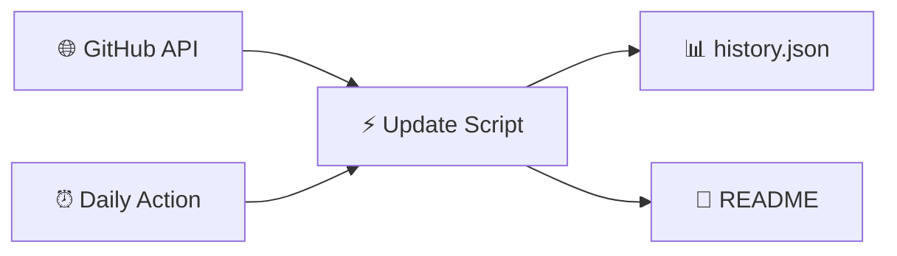

<!-- Static README shell — ranking tables are injected by Update-ParadiseFeed.ps1 -->

<div align="center">

<!-- Banner: committed PNG (reliable on GitHub — no external CDN) -->


<br/>

[](https://github.com/btstevens1984az/powershell-paradise/actions/workflows/daily-update.yml)
[](https://learn.microsoft.com/powershell/)
[](https://github.com/btstevens1984az/powershell-paradise/actions)
[](LICENSE)

<br/><br/>

<!-- PARADISE:STATS:START -->
<table align="center">
<tr>
<td align="center" width="25%">
<br/>
<h3>📅 Today</h3>
<h2>15</h2>
<sub>trending movers</sub>
<br/><br/>
</td>
<td align="center" width="25%">
<br/>
<h3>📆 This Week</h3>
<h2>15</h2>
<sub>new repos</sub>
<br/><br/>
</td>
<td align="center" width="25%">
<br/>
<h3>🗓️ This Month</h3>
<h2>15</h2>
<sub>new repos</sub>
<br/><br/>
</td>
<td align="center" width="25%">
<br/>
<h3>📈 This Year</h3>
<h2>15</h2>
<sub>new repos</sub>
<br/><br/>
</td>
</tr>
</table>
<!-- PARADISE:STATS:END -->

<br/>

<!-- PARADISE:META:START -->
<p align="center"><sub>🕐 <strong>Last refreshed:</strong> Tuesday, August 18, 2026 · 06:39 UTC · <a href="https://github.com/btstevens1984az/powershell-paradise/actions/workflows/daily-update.yml">GitHub Actions</a></sub></p>

[](https://github.com/btstevens1984az/powershell-paradise)
&nbsp;
[](https://github.com/btstevens1984az/powershell-paradise/actions)
&nbsp;
[](https://github.com/btstevens1984az/powershell-paradise)
&nbsp;
[](https://github.com/btstevens1984az/powershell-paradise)
<!-- PARADISE:META:END -->

</div>

---

## 📡 Welcome to the Paradise

> **PowerShell Paradise** is your cozy corner of GitHub for staying current — a living leaderboard that refreshes every morning with the hottest PowerShell projects, modules, and tools the community is starring right now.

<table>
<tr>
<td width="50%" valign="top">

### 🌊 What you'll find

| Window | The vibe |
|:------:|:---------|
| 🔥 **Today** | Star velocity — what's climbing *right now* |
| 📆 **Week** | Fresh repos from the last 7 days |
| 🗓️ **Month** | Standouts from the last 30 days |
| 📈 **Year** | The year's best new PowerShell repos |

</td>
<td width="50%" valign="top">

### 🧭 Jump around

| Go to | Section |
|:-----:|:--------|
| 🔥 | [Today's Top Movers](#-todays-top-movers) |
| 📆 | [This Week](#-this-weeks-top-repositories) |
| 🗓️ | [This Month](#️-this-months-top-repositories) |
| 📈 | [This Year](#-this-years-top-repositories) |
| ⚙️ | [How It Works](#️-how-it-works) |

</td>
</tr>
</table>

---

## 🔥 Today's Top Movers

[](https://github.com/btstevens1984az/powershell-paradise#-todays-top-movers)

> Repos with the biggest **star gains** since the last refresh. First run shows recently active repos instead.

<!-- PARADISE:TODAY:START -->
| # | Project | ⭐ Stars | 🍴 Forks | About | 🕐 Updated |
|:-:|---------|----------:|----------:|-------|------------|
| 🥇 |  &nbsp;**[dsh-routing-suite](https://github.com/yjh051108/dsh-routing-suite)**<br/><sub><code>yjh051108/dsh-routing-suite</code></sub> | **5.6k** &nbsp; 🚀 **+2533** | 93 | dsh-routing-suite — injector + router-standard kit: install the runtime injector first,… | 14h ago |
| 🥈 |  &nbsp;**[reverse-skill](https://github.com/zhaoxuya520/reverse-skill)**<br/><sub><code>zhaoxuya520/reverse-skill</code></sub> | **26.1k** &nbsp; 🚀 **+292** | 3.5k | Reverse Engineering / Authorized Penetration Testing / Security Research Skill Router P… | 2d ago |
| 🥉 |  &nbsp;**[winutil](https://github.com/ChrisTitusTech/winutil)**<br/><sub><code>ChrisTitusTech/winutil</code></sub> | **60.8k** &nbsp; 🚀 **+54** | 3.5k | Chris Titus Tech's Windows Utility - Install Programs, Tweaks, Fixes, and Updates | 2d ago |
| **4** |  &nbsp;**[Win11Debloat](https://github.com/Raphire/Win11Debloat)**<br/><sub><code>Raphire/Win11Debloat</code></sub> | **55.6k** &nbsp; 🚀 **+36** | 2.4k | A simple, lightweight PowerShell script that allows you to remove pre-installed apps, d…<br/> `automated`  `bloatware` | 1d ago |
| **5** |  &nbsp;**[SpotX](https://github.com/SpotX-Official/SpotX)**<br/><sub><code>SpotX-Official/SpotX</code></sub> | **22.1k** &nbsp; 🚀 **+17** | 1.1k | SpotX patcher used for patching the desktop version of Spotify<br/> `adblock`  `spotify` | 2d ago |
| **6** |  &nbsp;**[psmux](https://github.com/psmux/psmux)**<br/><sub><code>psmux/psmux</code></sub> | **3.3k** &nbsp; 🚀 **+13** | 199 | Tmux on Windows Powershell - tmux for PowerShell, Windows Terminal, cmd.exe. Includes p…<br/> `cli`  `powershell` | 11h ago |
| **7** |  &nbsp;**[tiny11builder](https://github.com/ntdevlabs/tiny11builder)**<br/><sub><code>ntdevlabs/tiny11builder</code></sub> | **19.4k** &nbsp; 🚀 **+7** | 1.5k | Scripts to build a trimmed-down Windows 11 image. | 340d ago |
| **8** |  &nbsp;**[RemoveWindowsAI](https://github.com/zoicware/RemoveWindowsAI)**<br/><sub><code>zoicware/RemoveWindowsAI</code></sub> | **12.8k** &nbsp; 🚀 **+7** | 448 | Force Remove Copilot, Recall and More in Windows 11<br/> `ai`  `bloatware` | 11h ago |
| **9** |  &nbsp;**[Office-Tool](https://github.com/YerongAI/Office-Tool)**<br/><sub><code>YerongAI/Office-Tool</code></sub> | **14k** &nbsp; 🚀 **+6** | 1k | Office Tool Plus localization projects.<br/> `msoffice`  `msproject` | 6d ago |
| **10** |  &nbsp;**[runner-images](https://github.com/actions/runner-images)**<br/><sub><code>actions/runner-images</code></sub> | **13k** &nbsp; 🚀 **+4** | 3.8k | GitHub Actions runner images | 13h ago |
| **11** |  &nbsp;**[Scoop](https://github.com/ScoopInstaller/Scoop)**<br/><sub><code>ScoopInstaller/Scoop</code></sub> | **24.6k** &nbsp; 🚀 **+3** | 1.5k | A command-line installer for Windows.<br/> `installer`  `powershell` | 66d ago |
| **12** |  &nbsp;**[GOAD](https://github.com/Orange-Cyberdefense/GOAD)**<br/><sub><code>Orange-Cyberdefense/GOAD</code></sub> | **8.2k** &nbsp; 🚀 **+3** | 1.1k | game of active directory<br/> `active-directory`  `ansible` | 159d ago |
| **13** |  &nbsp;**[docker](https://github.com/jenkinsci/docker)**<br/><sub><code>jenkinsci/docker</code></sub> | **7.6k** &nbsp; 🚀 **+3** | 4.6k | Docker official jenkins repo<br/> `docker`  `hacktoberfest` | 17h ago |
| **14** |  &nbsp;**[Flipper-Zero-BadUSB](https://github.com/I-Am-Jakoby/Flipper-Zero-BadUSB)**<br/><sub><code>I-Am-Jakoby/Flipper-Zero-BadUSB</code></sub> | **7k** &nbsp; 🚀 **+3** | 880 | Repository for my flipper zero badUSB payloads. Now almost entirely plug and play.<br/> `badusb`  `badusb-payloads` | 794d ago |
| **15** |  &nbsp;**[svg-explorer-extension](https://github.com/tibold/svg-explorer-extension)**<br/><sub><code>tibold/svg-explorer-extension</code></sub> | **3.7k** &nbsp; 🚀 **+3** | 203 | Extension module for Windows Explorer to render SVG thumbnails, so that you can have an… | 2,269d ago |
<!-- PARADISE:TODAY:END -->

---

## 📆 This Week's Top Repositories

[](https://github.com/btstevens1984az/powershell-paradise#-this-weeks-top-repositories)

> PowerShell repos **created in the last 7 days**, ranked by total stars.

<!-- PARADISE:WEEK:START -->
| # | Project | ⭐ Stars | 🍴 Forks | About | 🕐 Updated |
|:-:|---------|----------:|----------:|-------|------------|
| 🥇 |  &nbsp;**[dsh-routing-suite](https://github.com/yjh051108/dsh-routing-suite)**<br/><sub><code>yjh051108/dsh-routing-suite</code></sub> | **5.6k** | 93 | dsh-routing-suite — injector + router-standard kit: install the runtime injector first,… | 14h ago |
| 🥈 |  &nbsp;**[codex-multi-profile](https://github.com/Hung2124/codex-multi-profile)**<br/><sub><code>Hung2124/codex-multi-profile</code></sub> | **94** | 88 | Windows Codex Desktop multi-account via AuthSwap. Shared workspace, separate ChatGPT lo…<br/> `agent-skills`  `chatgpt` | 2d ago |
| 🥉 |  &nbsp;**[material-design-3-ui-skill](https://github.com/skydashnet/material-design-3-ui-skill)**<br/><sub><code>skydashnet/material-design-3-ui-skill</code></sub> | **74** | 8 | A reusable Agent Skill for designing, reviewing, and implementing UI/UX with Google Mat…<br/> `accessibility`  `adaptive-design` | 22h ago |
| **4** |  &nbsp;**[GoLiveBypass](https://github.com/bezumiya/GoLiveBypass)**<br/><sub><code>bezumiya/GoLiveBypass</code></sub> | **42** | 2 | GoLiveBypass — Equicord/Vencord plugin that restores Go Live & camera for Brazilian Dis…<br/> `brazil`  `discord` | 1m ago |
| **5** |  &nbsp;**[dsh-vision-complete](https://github.com/Yts1919/dsh-vision-complete)**<br/><sub><code>Yts1919/dsh-vision-complete</code></sub> | **37** | 2 | 给 DeepSeek 补上「眼睛和耳朵」的多模态视觉插件：看图 / OCR / 物体检测 / 视频理解 / 语音转写 / 截图直读，一键安装（DSH 插件）。<br/> `dashscope`  `deepseek` | 2d ago |
| **6** |  &nbsp;**[dsh-infinite-gen-1](https://github.com/Minglink/dsh-infinite-gen-1)**<br/><sub><code>Minglink/dsh-infinite-gen-1</code></sub> | **33** | 2 | DeepSeek 专用破甲插件「无限一代」dsh-infinite-gen-1 — armor-breaking plugin for DeepSeek，新一代全局破甲方案，… | 2d ago |
| **7** |  &nbsp;**[dsh-reverse-skill](https://github.com/dhicoc/dsh-reverse-skill)**<br/><sub><code>dhicoc/dsh-reverse-skill</code></sub> | **30** | 6 | Complete reverse-skill (85 SKILL.md) as a DeepSeek Harness (dsh) Cordis plugin — revers…<br/> `ctf`  `deepseek-harness` | 1d ago |
| **8** |  &nbsp;**[FIFA-13-Local-FUT](https://github.com/KyroGeorge2/FIFA-13-Local-FUT)**<br/><sub><code>KyroGeorge2/FIFA-13-Local-FUT</code></sub> | **20** | 7 | Local FUT 13 Revival | 2d ago |
| **9** |  &nbsp;**[SwiftParticleMenuDemo](https://github.com/nicedayzhu/SwiftParticleMenuDemo)**<br/><sub><code>nicedayzhu/SwiftParticleMenuDemo</code></sub> | **19** | 5 | https://steamcommunity.com/sharedfiles/filedetails/?id=3781686794 | 7d ago |
| **10** |  &nbsp;**[claude-code-skills](https://github.com/Magerko/claude-code-skills)**<br/><sub><code>Magerko/claude-code-skills</code></sub> | **17** | 0 | Скиллы для Claude Code: дисциплинированный пайплайн разработки и два пред-запусковых ау…<br/> `ai-agents`  `checklist` | 5d ago |
| **11** |  &nbsp;**[m365-usage-dashboard](https://github.com/AussieCH/m365-usage-dashboard)**<br/><sub><code>AussieCH/m365-usage-dashboard</code></sub> | **14** | 1 | — | 2d ago |
| **12** |  &nbsp;**[umat-skill](https://github.com/xvchujin/umat-skill)**<br/><sub><code>xvchujin/umat-skill</code></sub> | **12** | 0 | Abaqus UMAT Codex skills for constitutive modeling, return mapping, damage, state contr… | 17h ago |
| **13** |  &nbsp;**[creator-flow](https://github.com/Damonhhh/creator-flow)**<br/><sub><code>Damonhhh/creator-flow</code></sub> | **11** | 0 | CreatorFlow：从选题、评分、脚本、配音和素材一路走到成片与发布包的 Codex 自媒体视频工作流 | 2d ago |
| **14** |  &nbsp;**[SwiftMvpEffect](https://github.com/nicedayzhu/SwiftMvpEffect)**<br/><sub><code>nicedayzhu/SwiftMvpEffect</code></sub> | **7** | 2 | — | 7d ago |
| **15** |  &nbsp;**[ZeroCleaner](https://github.com/ZeroIQs/ZeroCleaner)**<br/><sub><code>ZeroIQs/ZeroCleaner</code></sub> | **7** | 0 | — | 3d ago |
<!-- PARADISE:WEEK:END -->

---

## 🗓️ This Month's Top Repositories

[](https://github.com/btstevens1984az/powershell-paradise#%EF%B8%8F-this-months-top-repositories)

> PowerShell repos **created in the last 30 days**, ranked by total stars.

<!-- PARADISE:MONTH:START -->
| # | Project | ⭐ Stars | 🍴 Forks | About | 🕐 Updated |
|:-:|---------|----------:|----------:|-------|------------|
| 🥇 |  &nbsp;**[dsh-routing-suite](https://github.com/yjh051108/dsh-routing-suite)**<br/><sub><code>yjh051108/dsh-routing-suite</code></sub> | **5.6k** | 93 | dsh-routing-suite — injector + router-standard kit: install the runtime injector first,… | 14h ago |
| 🥈 |  &nbsp;**[ResetNightmare](https://github.com/Semperis-Community/ResetNightmare)**<br/><sub><code>Semperis-Community/ResetNightmare</code></sub> | **199** | 36 | POC tool for ResetNightmare (CVE-2026-27912) | 4d ago |
| 🥉 |  &nbsp;**[ds-vision-skill](https://github.com/Sorwcyra/ds-vision-skill)**<br/><sub><code>Sorwcyra/ds-vision-skill</code></sub> | **162** | 10 | ds-vision-skill: Vision skill suite to add multimodal image capabilities for DeepSeek, … | 6h ago |
| **4** |  &nbsp;**[im-definitely-working](https://github.com/donutlabs/im-definitely-working)**<br/><sub><code>donutlabs/im-definitely-working</code></sub> | **144** | 18 | For Educational Purposes (it's a joke) | 18d ago |
| **5** |  &nbsp;**[vice-city-vr](https://github.com/dubrovskiy-yevhen-stakelogic/vice-city-vr)**<br/><sub><code>dubrovskiy-yevhen-stakelogic/vice-city-vr</code></sub> | **141** | 6 | — | 5d ago |
| **6** |  &nbsp;**[codex-multi-profile](https://github.com/Hung2124/codex-multi-profile)**<br/><sub><code>Hung2124/codex-multi-profile</code></sub> | **94** | 88 | Windows Codex Desktop multi-account via AuthSwap. Shared workspace, separate ChatGPT lo…<br/> `agent-skills`  `chatgpt` | 2d ago |
| **7** |  &nbsp;**[WindowsUpdateRemedationTool](https://github.com/mertozsoy/WindowsUpdateRemedationTool)**<br/><sub><code>mertozsoy/WindowsUpdateRemedationTool</code></sub> | **90** | 12 | — | 29d ago |
| **8** |  &nbsp;**[pcairplay](https://github.com/gbulog/pcairplay)**<br/><sub><code>gbulog/pcairplay</code></sub> | **86** | 10 | Mirror an iPhone to a Windows PC using native iOS Screen Mirroring - no app on the phon… | 25d ago |
| **9** |  &nbsp;**[minimax-h3-opencode-skills](https://github.com/unknowlei/minimax-h3-opencode-skills)**<br/><sub><code>unknowlei/minimax-h3-opencode-skills</code></sub> | **75** | 3 | OpenCode skill suite for MiniMax H3 directing, routing, multishot planning, prompt gene…<br/> `agent-skills`  `minimax-h3` | 9d ago |
| **10** |  &nbsp;**[material-design-3-ui-skill](https://github.com/skydashnet/material-design-3-ui-skill)**<br/><sub><code>skydashnet/material-design-3-ui-skill</code></sub> | **74** | 8 | A reusable Agent Skill for designing, reviewing, and implementing UI/UX with Google Mat…<br/> `accessibility`  `adaptive-design` | 22h ago |
| **11** |  &nbsp;**[Windhawk-Backup-Manager](https://github.com/osmanonurkoc/Windhawk-Backup-Manager)**<br/><sub><code>osmanonurkoc/Windhawk-Backup-Manager</code></sub> | **54** | 0 | A modern, lightweight WPF utility to backup, review, and restore Windhawk mods, compile…<br/> `backup`  `backup-script` | 19d ago |
| **12** |  &nbsp;**[-Delta-Force-Graphics-Optimizer](https://github.com/Leonard8818/-Delta-Force-Graphics-Optimizer)**<br/><sub><code>Leonard8818/-Delta-Force-Graphics-Optimizer</code></sub> | **49** | 0 | 三角洲行动画面优化助手 — 一键应用 30+ 项 Windows 帧率优化，改动前自动备份、随时一键还原。非官方个人工具。 | 17h ago |
| **13** |  &nbsp;**[RDPWrap-Self-Heal](https://github.com/BuildWithSubha/RDPWrap-Self-Heal)**<br/><sub><code>BuildWithSubha/RDPWrap-Self-Heal</code></sub> | **47** | 0 | Self-healing RDP Wrapper for Windows 10/11/Server — auto-repairs multi-session Remote D…<br/> `homelab`  `multi-session` | 12d ago |
| **14** |  &nbsp;**[GoLiveBypass](https://github.com/bezumiya/GoLiveBypass)**<br/><sub><code>bezumiya/GoLiveBypass</code></sub> | **42** | 2 | GoLiveBypass — Equicord/Vencord plugin that restores Go Live & camera for Brazilian Dis…<br/> `brazil`  `discord` | 1m ago |
| **15** |  &nbsp;**[dsh-vision-complete](https://github.com/Yts1919/dsh-vision-complete)**<br/><sub><code>Yts1919/dsh-vision-complete</code></sub> | **37** | 2 | 给 DeepSeek 补上「眼睛和耳朵」的多模态视觉插件：看图 / OCR / 物体检测 / 视频理解 / 语音转写 / 截图直读，一键安装（DSH 插件）。<br/> `dashscope`  `deepseek` | 2d ago |
<!-- PARADISE:MONTH:END -->

---

## 📈 This Year's Top Repositories

[](https://github.com/btstevens1984az/powershell-paradise#-this-years-top-repositories)

> PowerShell repos **created since January 1**, ranked by total stars.

<!-- PARADISE:YEAR:START -->
| # | Project | ⭐ Stars | 🍴 Forks | About | 🕐 Updated |
|:-:|---------|----------:|----------:|-------|------------|
| 🥇 |  &nbsp;**[reverse-skill](https://github.com/zhaoxuya520/reverse-skill)**<br/><sub><code>zhaoxuya520/reverse-skill</code></sub> | **26.1k** | 3.5k | Reverse Engineering / Authorized Penetration Testing / Security Research Skill Router P… | 2d ago |
| 🥈 |  &nbsp;**[dsh-routing-suite](https://github.com/yjh051108/dsh-routing-suite)**<br/><sub><code>yjh051108/dsh-routing-suite</code></sub> | **5.6k** | 93 | dsh-routing-suite — injector + router-standard kit: install the runtime injector first,… | 14h ago |
| 🥉 |  &nbsp;**[WindowsDeveloperConfig](https://github.com/microsoft/WindowsDeveloperConfig)**<br/><sub><code>microsoft/WindowsDeveloperConfig</code></sub> | **1.9k** | 148 | Automate the setup and configuration of your Windows development environment. | 3d ago |
| **4** |  &nbsp;**[codex-windows-fast-patch-skill](https://github.com/chen0416ccc-cpu/codex-windows-fast-patch-skill)**<br/><sub><code>chen0416ccc-cpu/codex-windows-fast-patch-skill</code></sub> | **1.1k** | 115 | 此skills用于指导智能体在 Windows 上恢复 Codex Desktop 升级后失效的本地补丁和能力开关。（Computer Use，插件，破限，codex强制汉化… | 43m ago |
| **5** |  &nbsp;**[selfware.md](https://github.com/floatboatai/selfware.md)**<br/><sub><code>floatboatai/selfware.md</code></sub> | **1.1k** | 95 | — | 163d ago |
| **6** |  &nbsp;**[GrapeRoot](https://github.com/kunal12203/GrapeRoot)**<br/><sub><code>kunal12203/GrapeRoot</code></sub> | **1k** | 122 | Compounding Context for AI Coding Assistants — MCP graph engine for Claude Code, Cursor…<br/> `ai-coding`  `claude-code` | 14d ago |
| **7** |  &nbsp;**[work-iq](https://github.com/microsoft/work-iq)**<br/><sub><code>microsoft/work-iq</code></sub> | **969** | 117 | MCP Server and CLI for accessing Work IQ | 1d ago |
| **8** |  &nbsp;**[get-shit-done-for-antigravity](https://github.com/toonight/get-shit-done-for-antigravity)**<br/><sub><code>toonight/get-shit-done-for-antigravity</code></sub> | **927** | 146 | — | 139d ago |
| **9** |  &nbsp;**[commands](https://github.com/GuDaStudio/commands)**<br/><sub><code>GuDaStudio/commands</code></sub> | **880** | 49 | — | 193d ago |
| **10** |  &nbsp;**[deGDID](https://github.com/yegors/deGDID)**<br/><sub><code>yegors/deGDID</code></sub> | **798** | 35 | Deletes all instances of Microsoft's GDID and prevents minting of new ones | 9d ago |
| **11** |  &nbsp;**[codex-visio-paper-figure-skill](https://github.com/pengjunchi0/codex-visio-paper-figure-skill)**<br/><sub><code>pengjunchi0/codex-visio-paper-figure-skill</code></sub> | **717** | 32 | 科研绘图skill、论文绘图skill、图片转visio等可编辑格式，将生成图转化为论文可编辑图，便于作者调整绘图细节<br/> `academic-figures`  `codex` | 2d ago |
| **12** |  &nbsp;**[PsiphonOverMITM](https://github.com/B3hnamR/PsiphonOverMITM)**<br/><sub><code>B3hnamR/PsiphonOverMITM</code></sub> | **543** | 78 | — | 96d ago |
| **13** |  &nbsp;**[ai-business-skills](https://github.com/minhnv0807/ai-business-skills)**<br/><sub><code>minhnv0807/ai-business-skills</code></sub> | **543** | 220 | 138 bilingual AI marketing skills (69 VN + 69 Global) for Claude Code, OpenCode, Codex,…<br/> `agent-skills`  `ai-agents` | 1d ago |
| **14** |  &nbsp;**[Light-Help](https://github.com/Cotton059/Light-Help)**<br/><sub><code>Cotton059/Light-Help</code></sub> | **540** | 239 | Help the audience perform some complex operations. | 5d ago |
| **15** |  &nbsp;**[coralline](https://github.com/Nanako0129/coralline)**<br/><sub><code>Nanako0129/coralline</code></sub> | **531** | 40 | 🪸 Powerlevel10k-inspired statusline for Claude Code — paste one prompt and your AI int…<br/> `bash`  `claude` | 13d ago |
<!-- PARADISE:YEAR:END -->

---

## ⚙️ How It Works


```mermaid
flowchart LR
    A["🌐 GitHub API"] --> B["⚡ Update Script"]
    B --> C["📊 history.json"]
    B --> D["📝 README"]
    E["⏰ Daily Action"] --> B
```

| Step | What happens |
|:----:|:-------------|
| 1️⃣ | Query GitHub for `language:powershell` repos with real activity |
| 2️⃣ | Compare star counts to yesterday's snapshot for velocity |
| 3️⃣ | Build four bubbly ranking tables — top 15 each |
| 4️⃣ | Auto-commit back to this README every morning at 06:00 UTC |

<details>
<summary><b>🛠️ Run locally</b></summary>

```powershell
$env:GITHUB_TOKEN = 'ghp_your_token'   # optional — higher API limits
./scripts/Update-ParadiseFeed.ps1
```

</details>

<details>
<summary><b>🔍 Filters applied</b></summary>

- Language: **PowerShell** · Forks excluded · Minimum **3 stars** · Top **15** per table

</details>

---

## 🌟 Why star this repo?

<table>
<tr>
<td align="center">😴<br/><b>Zero effort</b><br/><sub>Updates while you sleep</sub></td>
<td align="center">📡<br/><b>Community signal</b><br/><sub>See what builders love</sub></td>
<td align="center">🎓<br/><b>Learning radar</b><br/><sub>Find modules worth studying</sub></td>
<td align="center">🔓<br/><b>Open source</b><br/><sub>Fork &amp; adapt freely</sub></td>
</tr>
</table>

---

## 📜 License

MIT — see [LICENSE](LICENSE).

---

<div align="center">

**Built with ❤️ for the PowerShell community**

*Star this repo to get daily trending PowerShell projects in your GitHub feed.*

</div>
