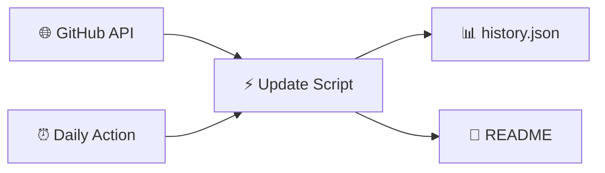

<!-- Static README shell — ranking tables are injected by Update-ParadiseFeed.ps1 -->

<div align="center">

<!-- Banner: committed PNG (reliable on GitHub — no external CDN) -->


<br/>

[](https://github.com/btstevens1984az/powershell-paradise/actions/workflows/daily-update.yml)
[](https://learn.microsoft.com/powershell/)
[](https://github.com/btstevens1984az/powershell-paradise/actions)
[](LICENSE)

<br/><br/>

<!-- PARADISE:STATS:START -->
<table align="center">
<tr>
<td align="center" width="25%">
<br/>
<h3>📅 Today</h3>
<h2>15</h2>
<sub>trending movers</sub>
<br/><br/>
</td>
<td align="center" width="25%">
<br/>
<h3>📆 This Week</h3>
<h2>12</h2>
<sub>new repos</sub>
<br/><br/>
</td>
<td align="center" width="25%">
<br/>
<h3>🗓️ This Month</h3>
<h2>15</h2>
<sub>new repos</sub>
<br/><br/>
</td>
<td align="center" width="25%">
<br/>
<h3>📈 This Year</h3>
<h2>15</h2>
<sub>new repos</sub>
<br/><br/>
</td>
</tr>
</table>
<!-- PARADISE:STATS:END -->

<br/>

<!-- PARADISE:META:START -->
<p align="center"><sub>🕐 <strong>Last refreshed:</strong> Wednesday, August 26, 2026 · 06:43 UTC · <a href="https://github.com/btstevens1984az/powershell-paradise/actions/workflows/daily-update.yml">GitHub Actions</a></sub></p>

[](https://github.com/btstevens1984az/powershell-paradise)
&nbsp;
[](https://github.com/btstevens1984az/powershell-paradise/actions)
&nbsp;
[](https://github.com/btstevens1984az/powershell-paradise)
&nbsp;
[](https://github.com/btstevens1984az/powershell-paradise)
<!-- PARADISE:META:END -->

</div>

---

## 📡 Welcome to the Paradise

> **PowerShell Paradise** is your cozy corner of GitHub for staying current — a living leaderboard that refreshes every morning with the hottest PowerShell projects, modules, and tools the community is starring right now.

<table>
<tr>
<td width="50%" valign="top">

### 🌊 What you'll find

| Window | The vibe |
|:------:|:---------|
| 🔥 **Today** | Star velocity — what's climbing *right now* |
| 📆 **Week** | Fresh repos from the last 7 days |
| 🗓️ **Month** | Standouts from the last 30 days |
| 📈 **Year** | The year's best new PowerShell repos |

</td>
<td width="50%" valign="top">

### 🧭 Jump around

| Go to | Section |
|:-----:|:--------|
| 🔥 | [Today's Top Movers](#-todays-top-movers) |
| 📆 | [This Week](#-this-weeks-top-repositories) |
| 🗓️ | [This Month](#️-this-months-top-repositories) |
| 📈 | [This Year](#-this-years-top-repositories) |
| ⚙️ | [How It Works](#️-how-it-works) |

</td>
</tr>
</table>

---

## 🔥 Today's Top Movers

[](https://github.com/btstevens1984az/powershell-paradise#-todays-top-movers)

> Repos with the biggest **star gains** since the last refresh. First run shows recently active repos instead.

<!-- PARADISE:TODAY:START -->
| # | Project | ⭐ Stars | 🍴 Forks | About | 🕐 Updated |
|:-:|---------|----------:|----------:|-------|------------|
| 🥇 |  &nbsp;**[reverse-skill](https://github.com/zhaoxuya520/reverse-skill)**<br/><sub><code>zhaoxuya520/reverse-skill</code></sub> | **29.4k** &nbsp; 🚀 **+482** | 4k | Reverse Engineering / Authorized Penetration Testing / Security Research Skill Router P… | 2d ago |
| 🥈 |  &nbsp;**[Win11Debloat](https://github.com/Raphire/Win11Debloat)**<br/><sub><code>Raphire/Win11Debloat</code></sub> | **56.3k** &nbsp; 🚀 **+139** | 2.4k | A simple, lightweight PowerShell script that allows you to remove pre-installed apps, d…<br/> `automated`  `bloatware` | 1d ago |
| 🥉 |  &nbsp;**[winutil](https://github.com/ChrisTitusTech/winutil)**<br/><sub><code>ChrisTitusTech/winutil</code></sub> | **61.2k** &nbsp; 🚀 **+61** | 3.6k | Chris Titus Tech's Windows Utility - Install Programs, Tweaks, Fixes, and Updates | 2d ago |
| **4** |  &nbsp;**[RemoveWindowsAI](https://github.com/zoicware/RemoveWindowsAI)**<br/><sub><code>zoicware/RemoveWindowsAI</code></sub> | **12.9k** &nbsp; 🚀 **+17** | 450 | Force Remove Copilot, Recall and More in Windows 11<br/> `ai`  `bloatware` | 2d ago |
| **5** |  &nbsp;**[Office-Tool](https://github.com/YerongAI/Office-Tool)**<br/><sub><code>YerongAI/Office-Tool</code></sub> | **14.1k** &nbsp; 🚀 **+12** | 1k | Office Tool Plus localization projects.<br/> `msoffice`  `msproject` | 24h ago |
| **6** |  &nbsp;**[psmux](https://github.com/psmux/psmux)**<br/><sub><code>psmux/psmux</code></sub> | **3.3k** &nbsp; 🚀 **+12** | 209 | Tmux on Windows Powershell - tmux for PowerShell, Windows Terminal, cmd.exe. Includes p…<br/> `cli`  `powershell` | 1h ago |
| **7** |  &nbsp;**[SpotX](https://github.com/SpotX-Official/SpotX)**<br/><sub><code>SpotX-Official/SpotX</code></sub> | **22.2k** &nbsp; 🚀 **+10** | 1.1k | SpotX patcher used for patching the desktop version of Spotify<br/> `adblock`  `spotify` | 10d ago |
| **8** |  &nbsp;**[Fast-Kubernetes](https://github.com/omerbsezer/Fast-Kubernetes)**<br/><sub><code>omerbsezer/Fast-Kubernetes</code></sub> | **3.7k** &nbsp; 🚀 **+8** | 1.4k | This repo covers Kubernetes with LABs: Kubectl, Pod, Deployment, Service, PV, PVC, Roll…<br/> `affinity`  `config-maps` | 499d ago |
| **9** |  &nbsp;**[tiny11builder](https://github.com/ntdevlabs/tiny11builder)**<br/><sub><code>ntdevlabs/tiny11builder</code></sub> | **19.4k** &nbsp; 🚀 **+7** | 1.5k | Scripts to build a trimmed-down Windows 11 image. | 348d ago |
| **10** |  &nbsp;**[GOAD](https://github.com/Orange-Cyberdefense/GOAD)**<br/><sub><code>Orange-Cyberdefense/GOAD</code></sub> | **8.2k** &nbsp; 🚀 **+7** | 1.1k | game of active directory<br/> `active-directory`  `ansible` | 167d ago |
| **11** |  &nbsp;**[nishang](https://github.com/samratashok/nishang)**<br/><sub><code>samratashok/nishang</code></sub> | **10.1k** &nbsp; 🚀 **+4** | 2.5k | Nishang - Offensive PowerShell for red team, penetration testing and offensive security.<br/> `activedirectory`  `hacking` | 852d ago |
| **12** |  &nbsp;**[Winget-AutoUpdate](https://github.com/Romanitho/Winget-AutoUpdate)**<br/><sub><code>Romanitho/Winget-AutoUpdate</code></sub> | **2k** &nbsp; 🚀 **+4** | 193 | WAU daily updates apps as system and notify connected users. (Allowlist and Blocklist s…<br/> `winget` | 58d ago |
| **13** |  &nbsp;**[Sophia-Script-for-Windows](https://github.com/farag2/Sophia-Script-for-Windows)**<br/><sub><code>farag2/Sophia-Script-for-Windows</code></sub> | **9.7k** &nbsp; 🚀 **+3** | 642 | :zap: The most powerful PowerShell module for fine-tuning Windows 10 & Windows 11 on Gi…<br/> `24h2`  `25h2` | 2d ago |
| **14** |  &nbsp;**[PrivescCheck](https://github.com/itm4n/PrivescCheck)**<br/><sub><code>itm4n/PrivescCheck</code></sub> | **3.9k** &nbsp; 🚀 **+3** | 506 | Privilege Escalation Enumeration Script for Windows<br/> `pentest-tool`  `pentesting` | 7d ago |
| **15** |  &nbsp;**[flare-vm](https://github.com/mandiant/flare-vm)**<br/><sub><code>mandiant/flare-vm</code></sub> | **9k** &nbsp; 🚀 **+2** | 1.1k | A collection of software installations scripts for Windows systems that allows you to e…<br/> `flare`  `malware-analysis` | 64d ago |
<!-- PARADISE:TODAY:END -->

---

## 📆 This Week's Top Repositories

[](https://github.com/btstevens1984az/powershell-paradise#-this-weeks-top-repositories)

> PowerShell repos **created in the last 7 days**, ranked by total stars.

<!-- PARADISE:WEEK:START -->
| # | Project | ⭐ Stars | 🍴 Forks | About | 🕐 Updated |
|:-:|---------|----------:|----------:|-------|------------|
| 🥇 |  &nbsp;**[Subagent-Bionic-Claude](https://github.com/JohnCorreiaisme/Subagent-Bionic-Claude)**<br/><sub><code>JohnCorreiaisme/Subagent-Bionic-Claude</code></sub> | **40** | 9 | Have Claude use a offline LLM as a subagent | 6h ago |
| 🥈 |  &nbsp;**[Raymond-agentic-workflow](https://github.com/kirisawa-subaru/Raymond-agentic-workflow)**<br/><sub><code>kirisawa-subaru/Raymond-agentic-workflow</code></sub> | **32** | 0 | 让agent做好agent能做的事, 从而让人专注于自己想做的事. 为更顺畅的 coding 协作而生的工作流和工具箱. | 4d ago |
| 🥉 |  &nbsp;**[cell-lct](https://github.com/yrui-cmd/cell-lct)**<br/><sub><code>yrui-cmd/cell-lct</code></sub> | **27** | 3 | Cell-lct：面向 Adobe Illustrator 的可编辑科研矢量绘图插件。免费额度每天抖音群里提供，抖音名（木纹），私人额度小红书找：木纹小路 | 18h ago |
| **4** |  &nbsp;**[endfield-playtime-checker](https://github.com/genrusaii/endfield-playtime-checker)**<br/><sub><code>genrusaii/endfield-playtime-checker</code></sub> | **22** | 1 | calculate your arknights: endfield total playtime, session history and stats directly f… | 5d ago |
| **5** |  &nbsp;**[tortoise-oneclick-compiler](https://github.com/kasperfriend/tortoise-oneclick-compiler)**<br/><sub><code>kasperfriend/tortoise-oneclick-compiler</code></sub> | **18** | 6 | A collection of scripts for one-click compiling TortoiseWoW with portable database | 3d ago |
| **6** |  &nbsp;**[codex-fpga-engineering-workflow](https://github.com/prasetyarobert205-jpg/codex-fpga-engineering-workflow)**<br/><sub><code>prasetyarobert205-jpg/codex-fpga-engineering-workflow</code></sub> | **12** | 2 | Evidence-driven multi-agent FPGA/SoC FPGA workflow for Codex: RTL, CDC/RDC, STA, verifi…<br/> `ai-agents`  `cdc` | 2d ago |
| **7** |  &nbsp;**[Switch-StardewValley-Mod](https://github.com/zmzhang2022-ai/Switch-StardewValley-Mod)**<br/><sub><code>zmzhang2022-ai/Switch-StardewValley-Mod</code></sub> | **7** | 0 | Native Nintendo Switch Stardew Valley mod with Automate Lite, Wood Path networks, Fish …<br/> `arm64`  `atmosphere` | 2h ago |
| **8** |  &nbsp;**[citation-checker](https://github.com/babaknaderi/citation-checker)**<br/><sub><code>babaknaderi/citation-checker</code></sub> | **7** | 0 | A citation-integrity agent for detecting fabricated references, metadata errors, and un…<br/> `academic-writing`  `ai-agents` | 5d ago |
| **9** |  &nbsp;**[mirasim-quota-widget](https://github.com/chiakinanam1/mirasim-quota-widget)**<br/><sub><code>chiakinanam1/mirasim-quota-widget</code></sub> | **4** | 0 | Mirasim 额度监视器(Windows):托盘三枚圆环(5h/7d/Fable,阈值变色)+ 水墨面板 —— 积分明细、期末回归预估、均速参考、秒级倒计时;零额度消耗、不…<br/> `mirasim`  `powershell` | 13h ago |
| **10** |  &nbsp;**[pebble-mascot](https://github.com/war3shenzuo/pebble-mascot)**<br/><sub><code>war3shenzuo/pebble-mascot</code></sub> | **4** | 1 | — | 5d ago |
| **11** |  &nbsp;**[Entra-Token-Broker](https://github.com/PJMarcum/Entra-Token-Broker)**<br/><sub><code>PJMarcum/Entra-Token-Broker</code></sub> | **4** | 0 | Secure, secretless authentication for unattended workloads on Entra-joined devices usin… | 5d ago |
| **12** |  &nbsp;**[Ai-workflow](https://github.com/Taki7980/Ai-workflow)**<br/><sub><code>Taki7980/Ai-workflow</code></sub> | **4** | 0 | — | 10h ago |
<!-- PARADISE:WEEK:END -->

---

## 🗓️ This Month's Top Repositories

[](https://github.com/btstevens1984az/powershell-paradise#%EF%B8%8F-this-months-top-repositories)

> PowerShell repos **created in the last 30 days**, ranked by total stars.

<!-- PARADISE:MONTH:START -->
| # | Project | ⭐ Stars | 🍴 Forks | About | 🕐 Updated |
|:-:|---------|----------:|----------:|-------|------------|
| 🥇 |  &nbsp;**[dsh-infinite-gen-2](https://github.com/Minglink/dsh-infinite-gen-2)**<br/><sub><code>Minglink/dsh-infinite-gen-2</code></sub> | **400** | 20 | DeepSeek 专用破甲插件「无限二代」dsh-infinite-gen-2 — armor-breaking plugin for DeepSeek稳定化破甲提示词，求 …<br/> `armor-breaking`  `deepseek` | 16m ago |
| 🥈 |  &nbsp;**[ResetNightmare](https://github.com/Semperis-Community/ResetNightmare)**<br/><sub><code>Semperis-Community/ResetNightmare</code></sub> | **207** | 37 | POC tool for ResetNightmare (CVE-2026-27912) | 6d ago |
| 🥉 |  &nbsp;**[creator-flow](https://github.com/Damonhhh/creator-flow)**<br/><sub><code>Damonhhh/creator-flow</code></sub> | **205** | 44 | CreatorFlow：从选题、评分、脚本、配音和素材一路走到成片与发布包的 Codex 自媒体视频工作流 | 2d ago |
| **4** |  &nbsp;**[ds-vision-skill](https://github.com/Sorwcyra/ds-vision-skill)**<br/><sub><code>Sorwcyra/ds-vision-skill</code></sub> | **166** | 11 | ds-vision-skill: Vision skill suite to add multimodal image capabilities for DeepSeek, … | 6h ago |
| **5** |  &nbsp;**[im-definitely-working](https://github.com/donutlabs/im-definitely-working)**<br/><sub><code>donutlabs/im-definitely-working</code></sub> | **149** | 18 | For Educational Purposes (it's a joke) | 26d ago |
| **6** |  &nbsp;**[material-design-3-ui-skill](https://github.com/skydashnet/material-design-3-ui-skill)**<br/><sub><code>skydashnet/material-design-3-ui-skill</code></sub> | **102** | 9 | A reusable Agent Skill for designing, reviewing, and implementing UI/UX with Google Mat…<br/> `accessibility`  `adaptive-design` | 8d ago |
| **7** |  &nbsp;**[codex-multi-profile](https://github.com/Hung2124/codex-multi-profile)**<br/><sub><code>Hung2124/codex-multi-profile</code></sub> | **93** | 87 | Windows Codex Desktop multi-account via AuthSwap. Shared workspace, separate ChatGPT lo…<br/> `agent-skills`  `chatgpt` | 6d ago |
| **8** |  &nbsp;**[minimax-h3-opencode-skills](https://github.com/unknowlei/minimax-h3-opencode-skills)**<br/><sub><code>unknowlei/minimax-h3-opencode-skills</code></sub> | **92** | 2 | OpenCode skill suite for MiniMax H3 directing, routing, multishot planning, prompt gene…<br/> `agent-skills`  `minimax-h3` | 17d ago |
| **9** |  &nbsp;**[dsh-reverse-skill](https://github.com/dhicoc/dsh-reverse-skill)**<br/><sub><code>dhicoc/dsh-reverse-skill</code></sub> | **80** | 11 | Complete reverse-skill (85 SKILL.md) as a DeepSeek Harness (dsh) Cordis plugin — revers…<br/> `ctf`  `deepseek-harness` | 4d ago |
| **10** |  &nbsp;**[-Delta-Force-Graphics-Optimizer](https://github.com/Leonard8818/-Delta-Force-Graphics-Optimizer)**<br/><sub><code>Leonard8818/-Delta-Force-Graphics-Optimizer</code></sub> | **77** | 4 | 三角洲行动画面优化助手 — 一键应用 30+ 项 Windows 帧率优化，改动前自动备份、随时一键还原。非官方个人工具。 | 3d ago |
| **11** |  &nbsp;**[dsh-vision-complete](https://github.com/Yts1919/dsh-vision-complete)**<br/><sub><code>Yts1919/dsh-vision-complete</code></sub> | **42** | 3 | 给 DeepSeek 补上「眼睛和耳朵」的多模态视觉插件：看图 / OCR / 物体检测 / 视频理解 / 语音转写 / 截图直读，一键安装（DSH 插件）。<br/> `dashscope`  `deepseek` | 10d ago |
| **12** |  &nbsp;**[WeFlow-Community-Patch](https://github.com/AnonymousUser443/WeFlow-Community-Patch)**<br/><sub><code>AnonymousUser443/WeFlow-Community-Patch</code></sub> | **42** | 9 | Community hotfix for WeFlow 5.0.0 export failures and private-chat export hang<br/> `chat-export`  `hotfix` | 23d ago |
| **13** |  &nbsp;**[Subagent-Bionic-Claude](https://github.com/JohnCorreiaisme/Subagent-Bionic-Claude)**<br/><sub><code>JohnCorreiaisme/Subagent-Bionic-Claude</code></sub> | **40** | 9 | Have Claude use a offline LLM as a subagent | 6h ago |
| **14** |  &nbsp;**[FIFA-13-Local-FUT](https://github.com/KyroGeorge2/FIFA-13-Local-FUT)**<br/><sub><code>KyroGeorge2/FIFA-13-Local-FUT</code></sub> | **34** | 8 | Local FUT 13 Revival | 10d ago |
| **15** |  &nbsp;**[discwright](https://github.com/lazardjokovic/discwright)**<br/><sub><code>lazardjokovic/discwright</code></sub> | **34** | 0 | Turn GOG offline installers into burnable game discs with a custom icon, label and auto…<br/> `autorun`  `gog` | 2d ago |
<!-- PARADISE:MONTH:END -->

---

## 📈 This Year's Top Repositories

[](https://github.com/btstevens1984az/powershell-paradise#-this-years-top-repositories)

> PowerShell repos **created since January 1**, ranked by total stars.

<!-- PARADISE:YEAR:START -->
| # | Project | ⭐ Stars | 🍴 Forks | About | 🕐 Updated |
|:-:|---------|----------:|----------:|-------|------------|
| 🥇 |  &nbsp;**[reverse-skill](https://github.com/zhaoxuya520/reverse-skill)**<br/><sub><code>zhaoxuya520/reverse-skill</code></sub> | **29.4k** | 4k | Reverse Engineering / Authorized Penetration Testing / Security Research Skill Router P… | 2d ago |
| 🥈 |  &nbsp;**[WindowsDeveloperConfig](https://github.com/microsoft/WindowsDeveloperConfig)**<br/><sub><code>microsoft/WindowsDeveloperConfig</code></sub> | **1.9k** | 152 | Automate the setup and configuration of your Windows development environment. | 2h ago |
| 🥉 |  &nbsp;**[codex-windows-fast-patch-skill](https://github.com/chen0416ccc-cpu/codex-windows-fast-patch-skill)**<br/><sub><code>chen0416ccc-cpu/codex-windows-fast-patch-skill</code></sub> | **1.1k** | 119 | 此skills用于指导智能体在 Windows 上恢复 Codex Desktop 升级后失效的本地补丁和能力开关。（Computer Use，插件，破限，codex强制汉化… | 4d ago |
| **4** |  &nbsp;**[selfware.md](https://github.com/floatboatai/selfware.md)**<br/><sub><code>floatboatai/selfware.md</code></sub> | **1.1k** | 95 | — | 171d ago |
| **5** |  &nbsp;**[GrapeRoot](https://github.com/kunal12203/GrapeRoot)**<br/><sub><code>kunal12203/GrapeRoot</code></sub> | **1k** | 123 | Compounding Context for AI Coding Assistants — MCP graph engine for Claude Code, Cursor…<br/> `ai-coding`  `claude-code` | 22d ago |
| **6** |  &nbsp;**[work-iq](https://github.com/microsoft/work-iq)**<br/><sub><code>microsoft/work-iq</code></sub> | **977** | 119 | MCP Server and CLI for accessing Work IQ | 2d ago |
| **7** |  &nbsp;**[get-shit-done-for-antigravity](https://github.com/toonight/get-shit-done-for-antigravity)**<br/><sub><code>toonight/get-shit-done-for-antigravity</code></sub> | **931** | 147 | — | 5d ago |
| **8** |  &nbsp;**[commands](https://github.com/GuDaStudio/commands)**<br/><sub><code>GuDaStudio/commands</code></sub> | **879** | 49 | — | 201d ago |
| **9** |  &nbsp;**[deGDID](https://github.com/yegors/deGDID)**<br/><sub><code>yegors/deGDID</code></sub> | **854** | 40 | Deletes all instances of Microsoft's GDID and prevents minting of new ones | 17d ago |
| **10** |  &nbsp;**[codex-visio-paper-figure-skill](https://github.com/pengjunchi0/codex-visio-paper-figure-skill)**<br/><sub><code>pengjunchi0/codex-visio-paper-figure-skill</code></sub> | **760** | 35 | 科研绘图skill、论文绘图skill、图片转visio等可编辑格式，将生成图转化为论文可编辑图，便于作者调整绘图细节<br/> `academic-figures`  `codex` | 10d ago |
| **11** |  &nbsp;**[Light-Help](https://github.com/Cotton059/Light-Help)**<br/><sub><code>Cotton059/Light-Help</code></sub> | **588** | 255 | Help the audience perform some complex operations. | 1d ago |
| **12** |  &nbsp;**[ai-business-skills](https://github.com/minhnv0807/ai-business-skills)**<br/><sub><code>minhnv0807/ai-business-skills</code></sub> | **554** | 222 | 138 bilingual AI marketing skills (69 VN + 69 Global) for Claude Code, OpenCode, Codex,…<br/> `agent-skills`  `ai-agents` | 9d ago |
| **13** |  &nbsp;**[PsiphonOverMITM](https://github.com/B3hnamR/PsiphonOverMITM)**<br/><sub><code>B3hnamR/PsiphonOverMITM</code></sub> | **544** | 78 | — | 104d ago |
| **14** |  &nbsp;**[coralline](https://github.com/Nanako0129/coralline)**<br/><sub><code>Nanako0129/coralline</code></sub> | **537** | 41 | 🪸 Powerlevel10k-inspired statusline for Claude Code — paste one prompt and your AI int…<br/> `bash`  `claude` | 3d ago |
| **15** |  &nbsp;**[Bonsai-Image-Demo](https://github.com/PrismML-Eng/Bonsai-Image-Demo)**<br/><sub><code>PrismML-Eng/Bonsai-Image-Demo</code></sub> | **531** | 73 | Generate images locally<br/> `1-bit`  `bonsai` | 73d ago |
<!-- PARADISE:YEAR:END -->

---

## ⚙️ How It Works


```mermaid
flowchart LR
    A["🌐 GitHub API"] --> B["⚡ Update Script"]
    B --> C["📊 history.json"]
    B --> D["📝 README"]
    E["⏰ Daily Action"] --> B
```

| Step | What happens |
|:----:|:-------------|
| 1️⃣ | Query GitHub for `language:powershell` repos with real activity |
| 2️⃣ | Compare star counts to yesterday's snapshot for velocity |
| 3️⃣ | Build four bubbly ranking tables — top 15 each |
| 4️⃣ | Auto-commit back to this README every morning at 06:00 UTC |

<details>
<summary><b>🛠️ Run locally</b></summary>

```powershell
$env:GITHUB_TOKEN = 'ghp_your_token'   # optional — higher API limits
./scripts/Update-ParadiseFeed.ps1
```

</details>

<details>
<summary><b>🔍 Filters applied</b></summary>

- Language: **PowerShell** · Forks excluded · Minimum **3 stars** · Top **15** per table

</details>

---

## 🌟 Why star this repo?

<table>
<tr>
<td align="center">😴<br/><b>Zero effort</b><br/><sub>Updates while you sleep</sub></td>
<td align="center">📡<br/><b>Community signal</b><br/><sub>See what builders love</sub></td>
<td align="center">🎓<br/><b>Learning radar</b><br/><sub>Find modules worth studying</sub></td>
<td align="center">🔓<br/><b>Open source</b><br/><sub>Fork &amp; adapt freely</sub></td>
</tr>
</table>

---

## 📜 License

MIT — see [LICENSE](LICENSE).

---

<div align="center">

**Built with ❤️ for the PowerShell community**

*Star this repo to get daily trending PowerShell projects in your GitHub feed.*

</div>
