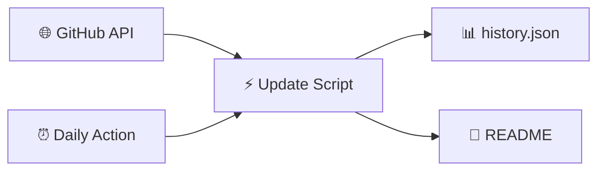

<!-- Static README shell — ranking tables are injected by Update-ParadiseFeed.ps1 -->

<div align="center">

<!-- Banner: committed PNG (reliable on GitHub — no external CDN) -->


<br/>

[](https://github.com/btstevens1984az/powershell-paradise/actions/workflows/daily-update.yml)
[](https://learn.microsoft.com/powershell/)
[](https://github.com/btstevens1984az/powershell-paradise/actions)
[](LICENSE)

<br/><br/>

<!-- PARADISE:STATS:START -->
<table align="center">
<tr>
<td align="center" width="25%">
<br/>
<h3>📅 Today</h3>
<h2>15</h2>
<sub>trending movers</sub>
<br/><br/>
</td>
<td align="center" width="25%">
<br/>
<h3>📆 This Week</h3>
<h2>15</h2>
<sub>new repos</sub>
<br/><br/>
</td>
<td align="center" width="25%">
<br/>
<h3>🗓️ This Month</h3>
<h2>15</h2>
<sub>new repos</sub>
<br/><br/>
</td>
<td align="center" width="25%">
<br/>
<h3>📈 This Year</h3>
<h2>15</h2>
<sub>new repos</sub>
<br/><br/>
</td>
</tr>
</table>
<!-- PARADISE:STATS:END -->

<br/>

<!-- PARADISE:META:START -->
<p align="center"><sub>🕐 <strong>Last refreshed:</strong> Monday, September 28, 2026 · 12:55 UTC · <a href="https://github.com/btstevens1984az/powershell-paradise/actions/workflows/daily-update.yml">GitHub Actions</a></sub></p>

[](https://github.com/btstevens1984az/powershell-paradise)
&nbsp;
[](https://github.com/btstevens1984az/powershell-paradise/actions)
&nbsp;
[](https://github.com/btstevens1984az/powershell-paradise)
&nbsp;
[](https://github.com/btstevens1984az/powershell-paradise)
<!-- PARADISE:META:END -->

</div>

---

## 📡 Welcome to the Paradise

> **PowerShell Paradise** is your cozy corner of GitHub for staying current — a living leaderboard that refreshes every morning with the hottest PowerShell projects, modules, and tools the community is starring right now.

<table>
<tr>
<td width="50%" valign="top">

### 🌊 What you'll find

| Window | The vibe |
|:------:|:---------|
| 🔥 **Today** | Star velocity — what's climbing *right now* |
| 📆 **Week** | Fresh repos from the last 7 days |
| 🗓️ **Month** | Standouts from the last 30 days |
| 📈 **Year** | The year's best new PowerShell repos |

</td>
<td width="50%" valign="top">

### 🧭 Jump around

| Go to | Section |
|:-----:|:--------|
| 🔥 | [Today's Top Movers](#-todays-top-movers) |
| 📆 | [This Week](#-this-weeks-top-repositories) |
| 🗓️ | [This Month](#️-this-months-top-repositories) |
| 📈 | [This Year](#-this-years-top-repositories) |
| ⚙️ | [How It Works](#️-how-it-works) |

</td>
</tr>
</table>

---

## 🔥 Today's Top Movers

[](https://github.com/btstevens1984az/powershell-paradise#-todays-top-movers)

> Repos with the biggest **star gains** since the last refresh. First run shows recently active repos instead.

<!-- PARADISE:TODAY:START -->
| # | Project | ⭐ Stars | 🍴 Forks | About | 🕐 Updated |
|:-:|---------|----------:|----------:|-------|------------|
| 🥇 |  &nbsp;**[WindowsDeveloperConfig](https://github.com/microsoft/WindowsDeveloperConfig)**<br/><sub><code>microsoft/WindowsDeveloperConfig</code></sub> | **2.6k** &nbsp; 🚀 **+285** | 182 | Automate the setup and configuration of your Windows development environment. | 2d ago |
| 🥈 |  &nbsp;**[reverse-skill](https://github.com/zhaoxuya520/reverse-skill)**<br/><sub><code>zhaoxuya520/reverse-skill</code></sub> | **38.5k** &nbsp; 🚀 **+264** | 5.4k | Reverse Engineering / Authorized Penetration Testing / Security Research Skill Router P… | 6d ago |
| 🥉 |  &nbsp;**[winutil](https://github.com/ChrisTitusTech/winutil)**<br/><sub><code>ChrisTitusTech/winutil</code></sub> | **63.3k** &nbsp; 🚀 **+56** | 3.7k | Chris Titus Tech's Windows Utility - Install Programs, Tweaks, Fixes, and Updates | 4h ago |
| **4** |  &nbsp;**[Win11Debloat](https://github.com/Raphire/Win11Debloat)**<br/><sub><code>Raphire/Win11Debloat</code></sub> | **57.7k** &nbsp; 🚀 **+29** | 2.5k | A simple, lightweight PowerShell script that allows you to remove pre-installed apps, d…<br/> `automated`  `bloatware` | 18d ago |
| **5** |  &nbsp;**[runner-images](https://github.com/actions/runner-images)**<br/><sub><code>actions/runner-images</code></sub> | **13.4k** &nbsp; 🚀 **+23** | 3.9k | GitHub Actions runner images | 3h ago |
| **6** |  &nbsp;**[tiny11builder](https://github.com/ntdevlabs/tiny11builder)**<br/><sub><code>ntdevlabs/tiny11builder</code></sub> | **19.7k** &nbsp; 🚀 **+8** | 1.5k | Scripts to build a trimmed-down Windows 11 image. | 381d ago |
| **7** |  &nbsp;**[clawgod](https://github.com/0Chencc/clawgod)**<br/><sub><code>0Chencc/clawgod</code></sub> | **2.1k** &nbsp; 🚀 **+7** | 329 | ClawGod is a runtime patch applied to the official Claude Code. It continues to be supp…<br/> `ai`  `assistant` | 5h ago |
| **8** |  &nbsp;**[SpotX](https://github.com/SpotX-Official/SpotX)**<br/><sub><code>SpotX-Official/SpotX</code></sub> | **22.5k** &nbsp; 🚀 **+5** | 1.1k | SpotX patcher used for patching the desktop version of Spotify<br/> `adblock`  `spotify` | 5d ago |
| **9** |  &nbsp;**[Office-Tool](https://github.com/YerongAI/Office-Tool)**<br/><sub><code>YerongAI/Office-Tool</code></sub> | **14.3k** &nbsp; 🚀 **+5** | 1.1k | Office Tool Plus localization projects.<br/> `msoffice`  `msproject` | 7d ago |
| **10** |  &nbsp;**[Sophia-Script-for-Windows](https://github.com/farag2/Sophia-Script-for-Windows)**<br/><sub><code>farag2/Sophia-Script-for-Windows</code></sub> | **9.8k** &nbsp; 🚀 **+4** | 644 | :zap: The most powerful PowerShell module for fine-tuning Windows 10 & Windows 11 on Gi…<br/> `25h2`  `26h2` | 16h ago |
| **11** |  &nbsp;**[usbrubberducky-payloads](https://github.com/hak5/usbrubberducky-payloads)**<br/><sub><code>hak5/usbrubberducky-payloads</code></sub> | **6k** &nbsp; 🚀 **+4** | 1.7k | The Official USB Rubber Ducky Payload Repository<br/> `badusb`  `ducky-payloads` | 27d ago |
| **12** |  &nbsp;**[nishang](https://github.com/samratashok/nishang)**<br/><sub><code>samratashok/nishang</code></sub> | **10.1k** &nbsp; 🚀 **+3** | 2.5k | Nishang - Offensive PowerShell for red team, penetration testing and offensive security.<br/> `activedirectory`  `hacking` | 886d ago |
| **13** |  &nbsp;**[flare-vm](https://github.com/mandiant/flare-vm)**<br/><sub><code>mandiant/flare-vm</code></sub> | **9.1k** &nbsp; 🚀 **+3** | 1.1k | A collection of software installations scripts for Windows systems that allows you to e…<br/> `flare`  `malware-analysis` | 97d ago |
| **14** |  &nbsp;**[Flipper-Zero-BadUSB](https://github.com/I-Am-Jakoby/Flipper-Zero-BadUSB)**<br/><sub><code>I-Am-Jakoby/Flipper-Zero-BadUSB</code></sub> | **7.1k** &nbsp; 🚀 **+3** | 892 | Repository for my flipper zero badUSB payloads. Now almost entirely plug and play.<br/> `badusb`  `badusb-payloads` | 835d ago |
| **15** |  &nbsp;**[Invoke-Obfuscation](https://github.com/danielbohannon/Invoke-Obfuscation)**<br/><sub><code>danielbohannon/Invoke-Obfuscation</code></sub> | **4.3k** &nbsp; 🚀 **+3** | 820 | PowerShell Obfuscator | 1,145d ago |
<!-- PARADISE:TODAY:END -->

---

## 📆 This Week's Top Repositories

[](https://github.com/btstevens1984az/powershell-paradise#-this-weeks-top-repositories)

> PowerShell repos **created in the last 7 days**, ranked by total stars.

<!-- PARADISE:WEEK:START -->
| # | Project | ⭐ Stars | 🍴 Forks | About | 🕐 Updated |
|:-:|---------|----------:|----------:|-------|------------|
| 🥇 |  &nbsp;**[unreal-home-wizard](https://github.com/amirmushichge/unreal-home-wizard)**<br/><sub><code>amirmushichge/unreal-home-wizard</code></sub> | **222** | 33 | Turn room and home photographs into reviewable, walkable Unreal Engine projects with Co…<br/> `architecture`  `codex` | 4d ago |
| 🥈 |  &nbsp;**[yangziwen112-jushi-fund-research-open](https://github.com/yangziwen112/yangziwen112-jushi-fund-research-open)**<br/><sub><code>yangziwen112/yangziwen112-jushi-fund-research-open</code></sub> | **51** | 2 | — | 3h ago |
| 🥉 |  &nbsp;**[win-plus-leave](https://github.com/vdBurgIT/win-plus-leave)**<br/><sub><code>vdBurgIT/win-plus-leave</code></sub> | **11** | 0 | 🪟 + Leave: the Win+L you never forget. Locks Windows when your YubiKey or USB key leav…<br/> `buskill`  `deadman-switch` | 3d ago |
| **4** |  &nbsp;**[lmstudio-prism-bonsai](https://github.com/paperniuk/lmstudio-prism-bonsai)**<br/><sub><code>paperniuk/lmstudio-prism-bonsai</code></sub> | **11** | 0 | Make LM Studio load Ternary Bonsai 2 GGUF (PQ2_0 / PTQ1_0) via Prism's llama.cpp fork, … | 7d ago |
| **5** |  &nbsp;**[de-ai-router](https://github.com/YuliangXiu/de-ai-router)**<br/><sub><code>YuliangXiu/de-ai-router</code></sub> | **10** | 0 | 去AI味指令路由器 Agent Skill — route de-AI-tone requests to the right humanizer skill (10 skil… | 3d ago |
| **6** |  &nbsp;**[Disaster_response](https://github.com/pavanbonthu3-art/Disaster_response)**<br/><sub><code>pavanbonthu3-art/Disaster_response</code></sub> | **9** | 0 | — | 2d ago |
| **7** |  &nbsp;**[PSIT-OAS-Launcher-Modded-](https://github.com/Evangelion-eva/PSIT-OAS-Launcher-Modded-)**<br/><sub><code>Evangelion-eva/PSIT-OAS-Launcher-Modded-</code></sub> | **9** | 1 | — | 5d ago |
| **8** |  &nbsp;**[IThome-For-WinUI](https://github.com/diave971/IThome-For-WinUI)**<br/><sub><code>diave971/IThome-For-WinUI</code></sub> | **9** | 0 | IT之家 WinUI 3 第三方桌面客户端 | 3d ago |
| **9** |  &nbsp;**[Blood-of-Dawnwalker-Trainer-2026](https://github.com/sveltedrama/Blood-of-Dawnwalker-Trainer-2026)**<br/><sub><code>sveltedrama/Blood-of-Dawnwalker-Trainer-2026</code></sub> | **9** | 3 | Transparent project page for a documented single-player trainer concept for The Blood o…<br/> `action-rpg-tools`  `blood-of-dawnwalker-abilities` | 18h ago |
| **10** |  &nbsp;**[CUMT-Campus-AutoLogin](https://github.com/pch211/CUMT-Campus-AutoLogin)**<br/><sub><code>pch211/CUMT-Campus-AutoLogin</code></sub> | **8** | 0 | 适用于 Windows 10/11 的中国矿业大学校园网自动连接与认证工具（非官方） | 6d ago |
| **11** |  &nbsp;**[Jev](https://github.com/dfinke/Jev)**<br/><sub><code>dfinke/Jev</code></sub> | **7** | 2 | PowerShell decisions with TypeSafe AI's Jev model: https://typesafe.ai/blog/introducing… | 1d ago |
| **12** |  &nbsp;**[Roblox-Luau-Formatter](https://github.com/hexagongemgate/Roblox-Luau-Formatter)**<br/><sub><code>hexagongemgate/Roblox-Luau-Formatter</code></sub> | **7** | 1 | Lightweight developer utility for formatting Lua and Luau files and folders.<br/> `code-style`  `developer-tool` | 7d ago |
| **13** |  &nbsp;**[Roblox-Luau-Formatter](https://github.com/BaseSmokeHover/Roblox-Luau-Formatter)**<br/><sub><code>BaseSmokeHover/Roblox-Luau-Formatter</code></sub> | **7** | 3 | Free Lua, Luau and Roblox code formatter with configurable formatting rules.<br/> `automatic-formatting`  `code-quality` | 7d ago |
| **14** |  &nbsp;**[LUNA](https://github.com/dnunezx/LUNA)**<br/><sub><code>dnunezx/LUNA</code></sub> | **6** | 1 | LUNA is visual PS2 loader built from NHDDL and Neutrino.<br/> `neutrino`  `nhddl` | 11h ago |
| **15** |  &nbsp;**[Big-Walk-Puzzle-Route-Assistant](https://github.com/uprightmigr/Big-Walk-Puzzle-Route-Assistant)**<br/><sub><code>uprightmigr/Big-Walk-Puzzle-Route-Assistant</code></sub> | **6** | 0 | Big Walk tools for PC: route bookmarks, puzzle assistance, challenge profiles. Save you…<br/> `big-walk`  `big-walk-challenge-notes` | 18h ago |
<!-- PARADISE:WEEK:END -->

---

## 🗓️ This Month's Top Repositories

[](https://github.com/btstevens1984az/powershell-paradise#%EF%B8%8F-this-months-top-repositories)

> PowerShell repos **created in the last 30 days**, ranked by total stars.

<!-- PARADISE:MONTH:START -->
| # | Project | ⭐ Stars | 🍴 Forks | About | 🕐 Updated |
|:-:|---------|----------:|----------:|-------|------------|
| 🥇 |  &nbsp;**[myfreebuff](https://github.com/capncodes69/myfreebuff)**<br/><sub><code>capncodes69/myfreebuff</code></sub> | **488** | 3 | — | 24d ago |
| 🥈 |  &nbsp;**[vintage-latex](https://github.com/Foadsf/vintage-latex)**<br/><sub><code>Foadsf/vintage-latex</code></sub> | **430** | 23 | Twenty LuaLaTeX and MetaPost (fiziko) examples of the old scientific-paper aesthetic: e…<br/> `fiziko`  `latex` | 19d ago |
| 🥉 |  &nbsp;**[CUDA-for-AMD-Windows](https://github.com/Speedstu/CUDA-for-AMD-Windows)**<br/><sub><code>Speedstu/CUDA-for-AMD-Windows</code></sub> | **300** | 26 | Run CUDA-targeted Windows applications on AMD GPUs with ZLUDA + ROCm/HIP.<br/> `amd`  `amd-gpu` | 8d ago |
| **4** |  &nbsp;**[codex-task-pointer](https://github.com/big0lives/codex-task-pointer)**<br/><sub><code>big0lives/codex-task-pointer</code></sub> | **246** | 16 | Pre-compaction hooks + a CAS-guarded task pointer that keep Codex agents on-goal across…<br/> `agent-hooks`  `agents` | 29d ago |
| **5** |  &nbsp;**[BrokenPipe](https://github.com/KillaBoi/BrokenPipe)**<br/><sub><code>KillaBoi/BrokenPipe</code></sub> | **223** | 53 | Steam Client Service Local Privilege Escalation Vulnerability | 11d ago |
| **6** |  &nbsp;**[unreal-home-wizard](https://github.com/amirmushichge/unreal-home-wizard)**<br/><sub><code>amirmushichge/unreal-home-wizard</code></sub> | **222** | 33 | Turn room and home photographs into reviewable, walkable Unreal Engine projects with Co…<br/> `architecture`  `codex` | 4d ago |
| **7** |  &nbsp;**[embedded-project-governance](https://github.com/crichars/embedded-project-governance)**<br/><sub><code>crichars/embedded-project-governance</code></sub> | **106** | 1 | 面向 AI 辅助嵌入式固件开发的轻量、风险分级治理 skill<br/> `agent-skills`  `claude-code` | 25d ago |
| **8** |  &nbsp;**[Deepseek-Harness-Easy-Setup](https://github.com/vobl1999/Deepseek-Harness-Easy-Setup)**<br/><sub><code>vobl1999/Deepseek-Harness-Easy-Setup</code></sub> | **103** | 0 | — | 8d ago |
| **9** |  &nbsp;**[visio-com-skill](https://github.com/WUXU-Tech/visio-com-skill)**<br/><sub><code>WUXU-Tech/visio-com-skill</code></sub> | **95** | 0 | A clean-room Codex skill for generating editable Microsoft Visio .vsdx diagrams through… | 26d ago |
| **10** |  &nbsp;**[codebase-reverse](https://github.com/sharptoolbox/codebase-reverse)**<br/><sub><code>sharptoolbox/codebase-reverse</code></sub> | **92** | 48 | 完整源码逆向工程技能：把存量源码逆向为功能/实现/架构/接口/对象/组件/数据库完整元模型，深度定制于 Java Web 与 Java 微服务(Spring Boot/Clo… | 29d ago |
| **11** |  &nbsp;**[MiniMax-H3-OneClick](https://github.com/TianyiDataScience/MiniMax-H3-OneClick)**<br/><sub><code>TianyiDataScience/MiniMax-H3-OneClick</code></sub> | **77** | 14 | 一键安装MiniMax H3+ComfyUI视频生成工作流。 | 12d ago |
| **12** |  &nbsp;**[everything-search-skill](https://github.com/Mayuqi-crypto/everything-search-skill)**<br/><sub><code>Mayuqi-crypto/everything-search-skill</code></sub> | **69** | 2 | ⚡ Ultra-fast, index-powered local file search skill for AI agents (Cursor, Codex, PI-De…<br/> `agent-skill`  `codex` | 8d ago |
| **13** |  &nbsp;**[yangziwen112-jushi-fund-research-open](https://github.com/yangziwen112/yangziwen112-jushi-fund-research-open)**<br/><sub><code>yangziwen112/yangziwen112-jushi-fund-research-open</code></sub> | **51** | 2 | — | 3h ago |
| **14** |  &nbsp;**[win-use-master](https://github.com/sun509549-del/win-use-master)**<br/><sub><code>sun509549-del/win-use-master</code></sub> | **50** | 0 | Windows desktop app automation and reproducible evidence Agent Skill | 7d ago |
| **15** |  &nbsp;**[Salesforce-Code-Review-Agent](https://github.com/rediga/Salesforce-Code-Review-Agent)**<br/><sub><code>rediga/Salesforce-Code-Review-Agent</code></sub> | **47** | 33 | Salesforce DX code review: Apex, LWC, Flows, security (CRUD/FLS), governors, and Bugbot.<br/> `apex`  `code-review` | 5d ago |
<!-- PARADISE:MONTH:END -->

---

## 📈 This Year's Top Repositories

[](https://github.com/btstevens1984az/powershell-paradise#-this-years-top-repositories)

> PowerShell repos **created since January 1**, ranked by total stars.

<!-- PARADISE:YEAR:START -->
| # | Project | ⭐ Stars | 🍴 Forks | About | 🕐 Updated |
|:-:|---------|----------:|----------:|-------|------------|
| 🥇 |  &nbsp;**[reverse-skill](https://github.com/zhaoxuya520/reverse-skill)**<br/><sub><code>zhaoxuya520/reverse-skill</code></sub> | **38.5k** | 5.4k | Reverse Engineering / Authorized Penetration Testing / Security Research Skill Router P… | 6d ago |
| 🥈 |  &nbsp;**[WindowsDeveloperConfig](https://github.com/microsoft/WindowsDeveloperConfig)**<br/><sub><code>microsoft/WindowsDeveloperConfig</code></sub> | **2.6k** | 182 | Automate the setup and configuration of your Windows development environment. | 2d ago |
| 🥉 |  &nbsp;**[clawgod](https://github.com/0Chencc/clawgod)**<br/><sub><code>0Chencc/clawgod</code></sub> | **2.1k** | 329 | ClawGod is a runtime patch applied to the official Claude Code. It continues to be supp…<br/> `ai`  `assistant` | 5h ago |
| **4** |  &nbsp;**[cinema-dna-21x9x3](https://github.com/dacnay816y62-hub/cinema-dna-21x9x3)**<br/><sub><code>dacnay816y62-hub/cinema-dna-21x9x3</code></sub> | **1.4k** | 139 | 高级感电影画面生成 | 9d ago |
| **5** |  &nbsp;**[codex-windows-fast-patch-skill](https://github.com/chen0416ccc-cpu/codex-windows-fast-patch-skill)**<br/><sub><code>chen0416ccc-cpu/codex-windows-fast-patch-skill</code></sub> | **1.2k** | 126 | 此skills用于指导智能体在 Windows 上恢复 Codex Desktop 升级后失效的本地补丁和能力开关。（Computer Use，插件，破限，codex强制汉化… | 6h ago |
| **6** |  &nbsp;**[deGDID](https://github.com/yegors/deGDID)**<br/><sub><code>yegors/deGDID</code></sub> | **1.1k** | 55 | Deletes all instances of Microsoft's GDID and prevents minting of new ones | 51d ago |
| **7** |  &nbsp;**[selfware.md](https://github.com/floatboatai/selfware.md)**<br/><sub><code>floatboatai/selfware.md</code></sub> | **1.1k** | 94 | — | 204d ago |
| **8** |  &nbsp;**[GrapeRoot](https://github.com/kunal12203/GrapeRoot)**<br/><sub><code>kunal12203/GrapeRoot</code></sub> | **1k** | 123 | Compounding Context for AI Coding Assistants — MCP graph engine for Claude Code, Cursor…<br/> `ai-coding`  `claude-code` | 25d ago |
| **9** |  &nbsp;**[codex-visio-paper-figure-skill](https://github.com/pengjunchi0/codex-visio-paper-figure-skill)**<br/><sub><code>pengjunchi0/codex-visio-paper-figure-skill</code></sub> | **962** | 47 | 科研绘图skill、论文绘图skill、图片转visio等可编辑格式，将生成图转化为论文可编辑图，便于作者调整绘图细节<br/> `academic-figures`  `codex` | 43d ago |
| **10** |  &nbsp;**[get-shit-done-for-antigravity](https://github.com/toonight/get-shit-done-for-antigravity)**<br/><sub><code>toonight/get-shit-done-for-antigravity</code></sub> | **953** | 150 | — | 39d ago |
| **11** |  &nbsp;**[graftcode](https://github.com/grft-dev/graftcode)**<br/><sub><code>grft-dev/graftcode</code></sub> | **930** | 9 | Connect any code. Call as dependency. The official repository for Graftcode: the integr…<br/> `ai-agents`  `developer-experience` | 4d ago |
| **12** |  &nbsp;**[commands](https://github.com/GuDaStudio/commands)**<br/><sub><code>GuDaStudio/commands</code></sub> | **876** | 49 | — | 234d ago |
| **13** |  &nbsp;**[anti-defensive-writing](https://github.com/Kiterlin/anti-defensive-writing)**<br/><sub><code>Kiterlin/anti-defensive-writing</code></sub> | **707** | 26 | Codex skill for removing defensive writing and strengthening prose.<br/> `academic-writing`  `agent-skill` | 2h ago |
| **14** |  &nbsp;**[Light-Help](https://github.com/Cotton059/Light-Help)**<br/><sub><code>Cotton059/Light-Help</code></sub> | **668** | 281 | Help the audience perform some complex operations. | 3d ago |
| **15** |  &nbsp;**[ai-business-skills](https://github.com/minhnv0807/ai-business-skills)**<br/><sub><code>minhnv0807/ai-business-skills</code></sub> | **593** | 230 | 138 bilingual AI marketing skills (69 VN + 69 Global) for Claude Code, OpenCode, Codex,…<br/> `agent-skills`  `ai-agents` | 16d ago |
<!-- PARADISE:YEAR:END -->

---

## ⚙️ How It Works


```mermaid
flowchart LR
    A["🌐 GitHub API"] --> B["⚡ Update Script"]
    B --> C["📊 history.json"]
    B --> D["📝 README"]
    E["⏰ Daily Action"] --> B
```

| Step | What happens |
|:----:|:-------------|
| 1️⃣ | Query GitHub for `language:powershell` repos with real activity |
| 2️⃣ | Compare star counts to yesterday's snapshot for velocity |
| 3️⃣ | Build four bubbly ranking tables — top 15 each |
| 4️⃣ | Auto-commit back to this README every morning at 06:00 UTC |

<details>
<summary><b>🛠️ Run locally</b></summary>

```powershell
$env:GITHUB_TOKEN = 'ghp_your_token'   # optional — higher API limits
./scripts/Update-ParadiseFeed.ps1
```

</details>

<details>
<summary><b>🔍 Filters applied</b></summary>

- Language: **PowerShell** · Forks excluded · Minimum **3 stars** · Top **15** per table

</details>

---

## 🌟 Why star this repo?

<table>
<tr>
<td align="center">😴<br/><b>Zero effort</b><br/><sub>Updates while you sleep</sub></td>
<td align="center">📡<br/><b>Community signal</b><br/><sub>See what builders love</sub></td>
<td align="center">🎓<br/><b>Learning radar</b><br/><sub>Find modules worth studying</sub></td>
<td align="center">🔓<br/><b>Open source</b><br/><sub>Fork &amp; adapt freely</sub></td>
</tr>
</table>

---

## 📜 License

MIT — see [LICENSE](LICENSE).

---

<div align="center">

**Built with ❤️ for the PowerShell community**

*Star this repo to get daily trending PowerShell projects in your GitHub feed.*

</div>
