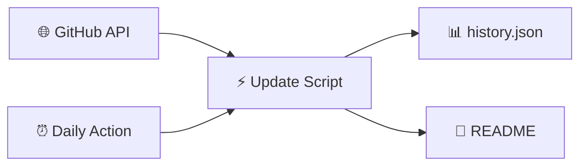

<!-- Static README shell — ranking tables are injected by Update-ParadiseFeed.ps1 -->

<div align="center">

<!-- Banner: committed PNG (reliable on GitHub — no external CDN) -->


<br/>

[](https://github.com/btstevens1984az/powershell-paradise/actions/workflows/daily-update.yml)
[](https://learn.microsoft.com/powershell/)
[](https://github.com/btstevens1984az/powershell-paradise/actions)
[](LICENSE)

<br/><br/>

<!-- PARADISE:STATS:START -->
<table align="center">
<tr>
<td align="center" width="25%">
<br/>
<h3>📅 Today</h3>
<h2>15</h2>
<sub>trending movers</sub>
<br/><br/>
</td>
<td align="center" width="25%">
<br/>
<h3>📆 This Week</h3>
<h2>15</h2>
<sub>new repos</sub>
<br/><br/>
</td>
<td align="center" width="25%">
<br/>
<h3>🗓️ This Month</h3>
<h2>15</h2>
<sub>new repos</sub>
<br/><br/>
</td>
<td align="center" width="25%">
<br/>
<h3>📈 This Year</h3>
<h2>15</h2>
<sub>new repos</sub>
<br/><br/>
</td>
</tr>
</table>
<!-- PARADISE:STATS:END -->

<br/>

<!-- PARADISE:META:START -->
<p align="center"><sub>🕐 <strong>Last refreshed:</strong> Friday, October 9, 2026 · 12:34 UTC · <a href="https://github.com/btstevens1984az/powershell-paradise/actions/workflows/daily-update.yml">GitHub Actions</a></sub></p>

[](https://github.com/btstevens1984az/powershell-paradise)
&nbsp;
[](https://github.com/btstevens1984az/powershell-paradise/actions)
&nbsp;
[](https://github.com/btstevens1984az/powershell-paradise)
&nbsp;
[](https://github.com/btstevens1984az/powershell-paradise)
<!-- PARADISE:META:END -->

</div>

---

## 📡 Welcome to the Paradise

> **PowerShell Paradise** is your cozy corner of GitHub for staying current — a living leaderboard that refreshes every morning with the hottest PowerShell projects, modules, and tools the community is starring right now.

<table>
<tr>
<td width="50%" valign="top">

### 🌊 What you'll find

| Window | The vibe |
|:------:|:---------|
| 🔥 **Today** | Star velocity — what's climbing *right now* |
| 📆 **Week** | Fresh repos from the last 7 days |
| 🗓️ **Month** | Standouts from the last 30 days |
| 📈 **Year** | The year's best new PowerShell repos |

</td>
<td width="50%" valign="top">

### 🧭 Jump around

| Go to | Section |
|:-----:|:--------|
| 🔥 | [Today's Top Movers](#-todays-top-movers) |
| 📆 | [This Week](#-this-weeks-top-repositories) |
| 🗓️ | [This Month](#️-this-months-top-repositories) |
| 📈 | [This Year](#-this-years-top-repositories) |
| ⚙️ | [How It Works](#️-how-it-works) |

</td>
</tr>
</table>

---

## 🔥 Today's Top Movers

[](https://github.com/btstevens1984az/powershell-paradise#-todays-top-movers)

> Repos with the biggest **star gains** since the last refresh. First run shows recently active repos instead.

<!-- PARADISE:TODAY:START -->
| # | Project | ⭐ Stars | 🍴 Forks | About | 🕐 Updated |
|:-:|---------|----------:|----------:|-------|------------|
| 🥇 |  &nbsp;**[Win11Debloat](https://github.com/Raphire/Win11Debloat)**<br/><sub><code>Raphire/Win11Debloat</code></sub> | **58.9k** &nbsp; 🚀 **+364** | 2.5k | A simple, lightweight PowerShell script that allows you to remove pre-installed apps, d…<br/> `automated`  `bloatware` | 16h ago |
| 🥈 |  &nbsp;**[reverse-skill](https://github.com/zhaoxuya520/reverse-skill)**<br/><sub><code>zhaoxuya520/reverse-skill</code></sub> | **40.4k** &nbsp; 🚀 **+189** | 5.6k | Reverse Engineering / Authorized Penetration Testing / Security Research Skill Router P… | 17d ago |
| 🥉 |  &nbsp;**[winutil](https://github.com/ChrisTitusTech/winutil)**<br/><sub><code>ChrisTitusTech/winutil</code></sub> | **63.9k** &nbsp; 🚀 **+66** | 3.7k | Chris Titus Tech's Windows Utility - Install Programs, Tweaks, Fixes, and Updates | 7h ago |
| **4** |  &nbsp;**[WindowsDeveloperConfig](https://github.com/microsoft/WindowsDeveloperConfig)**<br/><sub><code>microsoft/WindowsDeveloperConfig</code></sub> | **3.1k** &nbsp; 🚀 **+23** | 209 | Automate the setup and configuration of your Windows development environment. | 5h ago |
| **5** |  &nbsp;**[tiny11builder](https://github.com/ntdevlabs/tiny11builder)**<br/><sub><code>ntdevlabs/tiny11builder</code></sub> | **19.8k** &nbsp; 🚀 **+15** | 1.5k | Scripts to build a trimmed-down Windows 11 image. | 392d ago |
| **6** |  &nbsp;**[SpotX](https://github.com/SpotX-Official/SpotX)**<br/><sub><code>SpotX-Official/SpotX</code></sub> | **22.7k** &nbsp; 🚀 **+11** | 1.1k | SpotX patcher used for patching the desktop version of Spotify<br/> `adblock`  `spotify` | 2d ago |
| **7** |  &nbsp;**[Office-Tool](https://github.com/YerongAI/Office-Tool)**<br/><sub><code>YerongAI/Office-Tool</code></sub> | **14.5k** &nbsp; 🚀 **+11** | 1.1k | Office Tool Plus localization projects.<br/> `msoffice`  `msproject` | 18d ago |
| **8** |  &nbsp;**[psmux](https://github.com/psmux/psmux)**<br/><sub><code>psmux/psmux</code></sub> | **3.6k** &nbsp; 🚀 **+8** | 221 | Tmux on Windows Powershell - tmux for PowerShell, Windows Terminal, cmd.exe. Includes p…<br/> `cli`  `powershell` | 2h ago |
| **9** |  &nbsp;**[runner-images](https://github.com/actions/runner-images)**<br/><sub><code>actions/runner-images</code></sub> | **13.4k** &nbsp; 🚀 **+7** | 3.9k | GitHub Actions runner images | 2d ago |
| **10** |  &nbsp;**[RemoveWindowsAI](https://github.com/zoicware/RemoveWindowsAI)**<br/><sub><code>zoicware/RemoveWindowsAI</code></sub> | **13.2k** &nbsp; 🚀 **+6** | 463 | Force Remove Copilot, Recall and More in Windows 11<br/> `ai`  `bloatware` | 1d ago |
| **11** |  &nbsp;**[Scoop](https://github.com/ScoopInstaller/Scoop)**<br/><sub><code>ScoopInstaller/Scoop</code></sub> | **24.7k** &nbsp; 🚀 **+4** | 1.5k | A command-line installer for Windows.<br/> `installer`  `powershell` | 2d ago |
| **12** |  &nbsp;**[Flipper-Zero-BadUSB](https://github.com/I-Am-Jakoby/Flipper-Zero-BadUSB)**<br/><sub><code>I-Am-Jakoby/Flipper-Zero-BadUSB</code></sub> | **7.1k** &nbsp; 🚀 **+4** | 891 | Repository for my flipper zero badUSB payloads. Now almost entirely plug and play.<br/> `badusb`  `badusb-payloads` | 846d ago |
| **13** |  &nbsp;**[Sophia-Script-for-Windows](https://github.com/farag2/Sophia-Script-for-Windows)**<br/><sub><code>farag2/Sophia-Script-for-Windows</code></sub> | **9.8k** &nbsp; 🚀 **+3** | 642 | :zap: The most powerful PowerShell module for fine-tuning Windows 10 & Windows 11 on Gi…<br/> `25h2`  `26h2` | 14h ago |
| **14** |  &nbsp;**[GOAD](https://github.com/Orange-Cyberdefense/GOAD)**<br/><sub><code>Orange-Cyberdefense/GOAD</code></sub> | **8.5k** &nbsp; 🚀 **+3** | 1.2k | game of active directory<br/> `active-directory`  `ansible` | 211d ago |
| **15** |  &nbsp;**[IntuneManagement](https://github.com/Micke-K/IntuneManagement)**<br/><sub><code>Micke-K/IntuneManagement</code></sub> | **2.1k** &nbsp; 🚀 **+3** | 382 | Copy, export, import, delete, document and compare policies and profiles in Intune and …<br/> `documentation`  `endpoint-manager` | 16d ago |
<!-- PARADISE:TODAY:END -->

---

## 📆 This Week's Top Repositories

[](https://github.com/btstevens1984az/powershell-paradise#-this-weeks-top-repositories)

> PowerShell repos **created in the last 7 days**, ranked by total stars.

<!-- PARADISE:WEEK:START -->
| # | Project | ⭐ Stars | 🍴 Forks | About | 🕐 Updated |
|:-:|---------|----------:|----------:|-------|------------|
| 🥇 |  &nbsp;**[dragon-codex-boot](https://github.com/yushua0808-cpu/dragon-codex-boot)**<br/><sub><code>yushua0808-cpu/dragon-codex-boot</code></sub> | **80** | 11 | Community Windows startup animation launcher for Codex with live-window handoff and rev…<br/> `codex`  `startup-animation` | 3d ago |
| 🥈 |  &nbsp;**[aegis-claude](https://github.com/Soulringen/aegis-claude)**<br/><sub><code>Soulringen/aegis-claude</code></sub> | **65** | 0 | Windows reset for local Claude device identifiers. Chats stay. / Сброс локальных иденти… | 5d ago |
| 🥉 |  &nbsp;**[winkit](https://github.com/klaudikdev/winkit)**<br/><sub><code>klaudikdev/winkit</code></sub> | **28** | 2 | Open-source toolkit for setting up and tuning Windows 10 and 11. Every change can be un…<br/> `developer-tools`  `powershell` | 2d ago |
| **4** |  &nbsp;**[M365](https://github.com/omer-eltayeb/M365)**<br/><sub><code>omer-eltayeb/M365</code></sub> | **26** | 6 | M365 PowerShell scripts for Microsoft 365 administration: Intune, Entra ID, Defender, E…<br/> `conditional-access`  `endpoint-management` | 5d ago |
| **5** |  &nbsp;**[uu-remote-gpu-unlock](https://github.com/eggylan/uu-remote-gpu-unlock)**<br/><sub><code>eggylan/uu-remote-gpu-unlock</code></sub> | **13** | 0 | UU远程硬件解码解锁补丁，在非 NVIDIA / AMD / Intel GPU 的机器上启用硬件解码 | 4d ago |
| **6** |  &nbsp;**[power-agent](https://github.com/nakasyou/power-agent)**<br/><sub><code>nakasyou/power-agent</code></sub> | **12** | 0 | A minimal harness built entirely in PowerShell<br/> `agent-harness`  `agentic-ai` | 1d ago |
| **7** |  &nbsp;**[Get-NetScalerTimeline](https://github.com/LETHAL-FORENSICS/Get-NetScalerTimeline)**<br/><sub><code>LETHAL-FORENSICS/Get-NetScalerTimeline</code></sub> | **11** | 0 | Get-NetScalerTimeline - Automated File System Timeline Creation for NetScaler ADC/Gatew…<br/> `citrix`  `citrix-adc` | 5d ago |
| **8** |  &nbsp;**[Tone-FX](https://github.com/DigiAlchemydsp/Tone-FX)**<br/><sub><code>DigiAlchemydsp/Tone-FX</code></sub> | **10** | 0 | A master effect suite for the Elektron Digitone mk1 / Digitone Keys (OS 1.43) | 1d ago |
| **9** |  &nbsp;**[asaka-inject-testing](https://github.com/StarSky1145/asaka-inject-testing)**<br/><sub><code>StarSky1145/asaka-inject-testing</code></sub> | **9** | 0 | Asaka/Nilore（Minecraft 1.20.1 注入器）的测试与排障 skill：假 JVM 全链路测试、失败特征对照、崩端定位、构建一致性校验 | 3d ago |
| **10** |  &nbsp;**[harness-go](https://github.com/Tairraos/harness-go)**<br/><sub><code>Tairraos/harness-go</code></sub> | **9** | 0 | 小乐用 Harness 思维来创建和维护工程的最佳实践 | 7d ago |
| **11** |  &nbsp;**[gog-lpe-poc](https://github.com/0xv1n/gog-lpe-poc)**<br/><sub><code>0xv1n/gog-lpe-poc</code></sub> | **8** | 0 | — | 7d ago |
| **12** |  &nbsp;**[FOSecure](https://github.com/jofme/FOSecure)**<br/><sub><code>jofme/FOSecure</code></sub> | **7** | 0 | Security customizations for D365 F&O, built to address findings from penetration tests | 5d ago |
| **13** |  &nbsp;**[LocalModelManager](https://github.com/RadianceTreasurer/LocalModelManager)**<br/><sub><code>RadianceTreasurer/LocalModelManager</code></sub> | **7** | 1 | A desktop utility for organizing locally available AI models and configurations.<br/> `ai`  `desktop` | 4d ago |
| **14** |  &nbsp;**[devops-panel](https://github.com/NguyenCoDuoc/devops-panel)**<br/><sub><code>NguyenCoDuoc/devops-panel</code></sub> | **6** | 0 | DevOps Panel là ứng dụng Windows nhỏ để theo dõi và điều khiển môi trường phát triển ch… | 8h ago |
| **15** |  &nbsp;**[Escape-penacony](https://github.com/CAtlas0784/Escape-penacony)**<br/><sub><code>CAtlas0784/Escape-penacony</code></sub> | **6** | 1 | — | 1h ago |
<!-- PARADISE:WEEK:END -->

---

## 🗓️ This Month's Top Repositories

[](https://github.com/btstevens1984az/powershell-paradise#%EF%B8%8F-this-months-top-repositories)

> PowerShell repos **created in the last 30 days**, ranked by total stars.

<!-- PARADISE:MONTH:START -->
| # | Project | ⭐ Stars | 🍴 Forks | About | 🕐 Updated |
|:-:|---------|----------:|----------:|-------|------------|
| 🥇 |  &nbsp;**[vintage-latex](https://github.com/Foadsf/vintage-latex)**<br/><sub><code>Foadsf/vintage-latex</code></sub> | **438** | 24 | Twenty LuaLaTeX and MetaPost (fiziko) examples of the old scientific-paper aesthetic: e…<br/> `fiziko`  `latex` | 30d ago |
| 🥈 |  &nbsp;**[CUDA-for-AMD-Windows](https://github.com/Speedstu/CUDA-for-AMD-Windows)**<br/><sub><code>Speedstu/CUDA-for-AMD-Windows</code></sub> | **316** | 26 | Run CUDA-targeted Windows applications on AMD GPUs with ZLUDA + ROCm/HIP.<br/> `amd`  `amd-gpu` | 1d ago |
| 🥉 |  &nbsp;**[unreal-home-wizard](https://github.com/amirmushichge/unreal-home-wizard)**<br/><sub><code>amirmushichge/unreal-home-wizard</code></sub> | **287** | 38 | Turn room and home photographs into reviewable, walkable Unreal Engine projects with Co…<br/> `architecture`  `codex` | 15d ago |
| **4** |  &nbsp;**[BrokenPipe](https://github.com/KillaBoi/BrokenPipe)**<br/><sub><code>KillaBoi/BrokenPipe</code></sub> | **226** | 53 | Steam Client Service Local Privilege Escalation Vulnerability | 21d ago |
| **5** |  &nbsp;**[Table-VideoSOP](https://github.com/duoduoler-ops/Table-VideoSOP)**<br/><sub><code>duoduoler-ops/Table-VideoSOP</code></sub> | **156** | 15 | AI video production SOPs, rules, templates and prompts / AI 视频制作 SOP、规则、模板与提示词 | 12d ago |
| **6** |  &nbsp;**[SilentAgentHub](https://github.com/SilentLake-Tech-SkillHub/SilentAgentHub)**<br/><sub><code>SilentLake-Tech-SkillHub/SilentAgentHub</code></sub> | **109** | 0 | 一站式 Coding Agent 插件：从需求、研究、设计、原型到开发、测试、发布的全流程规则、Skills 与 Hooks，助力任何 0-1 的想法 | 4d ago |
| **7** |  &nbsp;**[Deepseek-Harness-Easy-Setup](https://github.com/vobl1999/Deepseek-Harness-Easy-Setup)**<br/><sub><code>vobl1999/Deepseek-Harness-Easy-Setup</code></sub> | **104** | 0 | — | 19d ago |
| **8** |  &nbsp;**[dragon-codex-boot](https://github.com/yushua0808-cpu/dragon-codex-boot)**<br/><sub><code>yushua0808-cpu/dragon-codex-boot</code></sub> | **80** | 11 | Community Windows startup animation launcher for Codex with live-window handoff and rev…<br/> `codex`  `startup-animation` | 3d ago |
| **9** |  &nbsp;**[SrHollow](https://github.com/ivancabrera02/SrHollow)**<br/><sub><code>ivancabrera02/SrHollow</code></sub> | **75** | 9 | — | 18d ago |
| **10** |  &nbsp;**[Aion2-Steam-CN](https://github.com/duoluoyuji/Aion2-Steam-CN)**<br/><sub><code>duoluoyuji/Aion2-Steam-CN</code></sub> | **75** | 4 | AION 2 (Steam Playtest) 简体中文一键汉化补丁与还原工具 | 1d ago |
| **11** |  &nbsp;**[everything-search-skill](https://github.com/Mayuqi-crypto/everything-search-skill)**<br/><sub><code>Mayuqi-crypto/everything-search-skill</code></sub> | **70** | 2 | ⚡ Ultra-fast, index-powered local file search skill for AI agents (Cursor, Codex, PI-De…<br/> `agent-skill`  `codex` | 19d ago |
| **12** |  &nbsp;**[aegis-claude](https://github.com/Soulringen/aegis-claude)**<br/><sub><code>Soulringen/aegis-claude</code></sub> | **65** | 0 | Windows reset for local Claude device identifiers. Chats stay. / Сброс локальных иденти… | 5d ago |
| **13** |  &nbsp;**[dsh-pojia-mode](https://github.com/z91772524-ai/dsh-pojia-mode)**<br/><sub><code>z91772524-ai/dsh-pojia-mode</code></sub> | **58** | 11 | 双击一个文件，给 DeepSeek Harness 加一个「破甲模式」Agent Preset —— 零侵入、零依赖、双击无黑框，不改 DSH 一字节代码，升级不丢。<br/> `agent-preset`  `ai-agent` | 14d ago |
| **14** |  &nbsp;**[VK-1](https://github.com/VKmich16/VK-1)**<br/><sub><code>VKmich16/VK-1</code></sub> | **53** | 7 | DSH 余额桌宠 · Windows(PowerShell) + macOS(Swift) 双平台实现 | 2d ago |
| **15** |  &nbsp;**[yangziwen112-jushi-fund-research-open](https://github.com/yangziwen112/yangziwen112-jushi-fund-research-open)**<br/><sub><code>yangziwen112/yangziwen112-jushi-fund-research-open</code></sub> | **51** | 2 | — | 9d ago |
<!-- PARADISE:MONTH:END -->

---

## 📈 This Year's Top Repositories

[](https://github.com/btstevens1984az/powershell-paradise#-this-years-top-repositories)

> PowerShell repos **created since January 1**, ranked by total stars.

<!-- PARADISE:YEAR:START -->
| # | Project | ⭐ Stars | 🍴 Forks | About | 🕐 Updated |
|:-:|---------|----------:|----------:|-------|------------|
| 🥇 |  &nbsp;**[reverse-skill](https://github.com/zhaoxuya520/reverse-skill)**<br/><sub><code>zhaoxuya520/reverse-skill</code></sub> | **40.4k** | 5.6k | Reverse Engineering / Authorized Penetration Testing / Security Research Skill Router P… | 17d ago |
| 🥈 |  &nbsp;**[WindowsDeveloperConfig](https://github.com/microsoft/WindowsDeveloperConfig)**<br/><sub><code>microsoft/WindowsDeveloperConfig</code></sub> | **3.1k** | 209 | Automate the setup and configuration of your Windows development environment. | 5h ago |
| 🥉 |  &nbsp;**[cinema-dna-21x9x3](https://github.com/dacnay816y62-hub/cinema-dna-21x9x3)**<br/><sub><code>dacnay816y62-hub/cinema-dna-21x9x3</code></sub> | **1.5k** | 143 | 高级感电影画面生成 | 20d ago |
| **4** |  &nbsp;**[codex-windows-fast-patch-skill](https://github.com/chen0416ccc-cpu/codex-windows-fast-patch-skill)**<br/><sub><code>chen0416ccc-cpu/codex-windows-fast-patch-skill</code></sub> | **1.3k** | 132 | 此skills用于指导智能体在 Windows 上恢复 Codex Desktop 升级后失效的本地补丁和能力开关。（Computer Use，插件，破限，codex强制汉化… | 6h ago |
| **5** |  &nbsp;**[deGDID](https://github.com/yegors/deGDID)**<br/><sub><code>yegors/deGDID</code></sub> | **1.1k** | 56 | Deletes all instances of Microsoft's GDID and prevents minting of new ones | 62d ago |
| **6** |  &nbsp;**[selfware.md](https://github.com/floatboatai/selfware.md)**<br/><sub><code>floatboatai/selfware.md</code></sub> | **1.1k** | 94 | — | 215d ago |
| **7** |  &nbsp;**[GrapeRoot](https://github.com/kunal12203/GrapeRoot)**<br/><sub><code>kunal12203/GrapeRoot</code></sub> | **1k** | 122 | Compounding Context for AI Coding Assistants — MCP graph engine for Claude Code, Cursor…<br/> `ai-coding`  `claude-code` | 36d ago |
| **8** |  &nbsp;**[codex-visio-paper-figure-skill](https://github.com/pengjunchi0/codex-visio-paper-figure-skill)**<br/><sub><code>pengjunchi0/codex-visio-paper-figure-skill</code></sub> | **1k** | 47 | 科研绘图skill、论文绘图skill、图片转visio等可编辑格式，将生成图转化为论文可编辑图，便于作者调整绘图细节<br/> `academic-figures`  `codex` | 54d ago |
| **9** |  &nbsp;**[get-shit-done-for-antigravity](https://github.com/toonight/get-shit-done-for-antigravity)**<br/><sub><code>toonight/get-shit-done-for-antigravity</code></sub> | **953** | 151 | — | 50d ago |
| **10** |  &nbsp;**[graftcode](https://github.com/grft-dev/graftcode)**<br/><sub><code>grft-dev/graftcode</code></sub> | **931** | 9 | Connect any code. Call as dependency. The official repository for Graftcode: the integr…<br/> `ai-agents`  `developer-experience` | 15d ago |
| **11** |  &nbsp;**[commands](https://github.com/GuDaStudio/commands)**<br/><sub><code>GuDaStudio/commands</code></sub> | **878** | 49 | — | 245d ago |
| **12** |  &nbsp;**[anti-defensive-writing](https://github.com/Kiterlin/anti-defensive-writing)**<br/><sub><code>Kiterlin/anti-defensive-writing</code></sub> | **865** | 31 | Codex skill for removing defensive writing and strengthening prose.<br/> `academic-writing`  `agent-skill` | 8d ago |
| **13** |  &nbsp;**[Light-Help](https://github.com/Cotton059/Light-Help)**<br/><sub><code>Cotton059/Light-Help</code></sub> | **700** | 287 | Help the audience perform some complex operations. | 3d ago |
| **14** |  &nbsp;**[ai-business-skills](https://github.com/minhnv0807/ai-business-skills)**<br/><sub><code>minhnv0807/ai-business-skills</code></sub> | **610** | 228 | 138 bilingual AI marketing skills (69 VN + 69 Global) for Claude Code, OpenCode, Codex,…<br/> `agent-skills`  `ai-agents` | 27d ago |
| **15** |  &nbsp;**[Bonsai-Image-Demo](https://github.com/PrismML-Eng/Bonsai-Image-Demo)**<br/><sub><code>PrismML-Eng/Bonsai-Image-Demo</code></sub> | **553** | 75 | Generate images locally<br/> `1-bit`  `bonsai` | 31d ago |
<!-- PARADISE:YEAR:END -->

---

## ⚙️ How It Works


```mermaid
flowchart LR
    A["🌐 GitHub API"] --> B["⚡ Update Script"]
    B --> C["📊 history.json"]
    B --> D["📝 README"]
    E["⏰ Daily Action"] --> B
```

| Step | What happens |
|:----:|:-------------|
| 1️⃣ | Query GitHub for `language:powershell` repos with real activity |
| 2️⃣ | Compare star counts to yesterday's snapshot for velocity |
| 3️⃣ | Build four bubbly ranking tables — top 15 each |
| 4️⃣ | Auto-commit back to this README every morning at 06:00 UTC |

<details>
<summary><b>🛠️ Run locally</b></summary>

```powershell
$env:GITHUB_TOKEN = 'ghp_your_token'   # optional — higher API limits
./scripts/Update-ParadiseFeed.ps1
```

</details>

<details>
<summary><b>🔍 Filters applied</b></summary>

- Language: **PowerShell** · Forks excluded · Minimum **3 stars** · Top **15** per table

</details>

---

## 🌟 Why star this repo?

<table>
<tr>
<td align="center">😴<br/><b>Zero effort</b><br/><sub>Updates while you sleep</sub></td>
<td align="center">📡<br/><b>Community signal</b><br/><sub>See what builders love</sub></td>
<td align="center">🎓<br/><b>Learning radar</b><br/><sub>Find modules worth studying</sub></td>
<td align="center">🔓<br/><b>Open source</b><br/><sub>Fork &amp; adapt freely</sub></td>
</tr>
</table>

---

## 📜 License

MIT — see [LICENSE](LICENSE).

---

<div align="center">

**Built with ❤️ for the PowerShell community**

*Star this repo to get daily trending PowerShell projects in your GitHub feed.*

</div>
