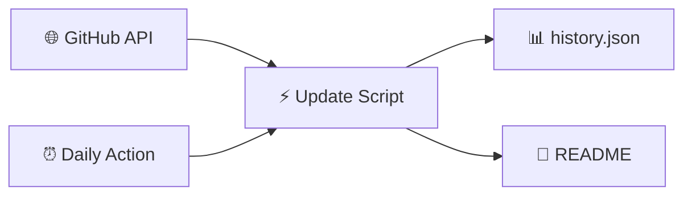

<!-- Static README shell — ranking tables are injected by Update-ParadiseFeed.ps1 -->

<div align="center">

<!-- Banner: committed PNG (reliable on GitHub — no external CDN) -->


<br/>

[](https://github.com/btstevens1984az/powershell-paradise/actions/workflows/daily-update.yml)
[](https://learn.microsoft.com/powershell/)
[](https://github.com/btstevens1984az/powershell-paradise/actions)
[](LICENSE)

<br/><br/>

<!-- PARADISE:STATS:START -->
<table align="center">
<tr>
<td align="center" width="25%">
<br/>
<h3>📅 Today</h3>
<h2>15</h2>
<sub>trending movers</sub>
<br/><br/>
</td>
<td align="center" width="25%">
<br/>
<h3>📆 This Week</h3>
<h2>15</h2>
<sub>new repos</sub>
<br/><br/>
</td>
<td align="center" width="25%">
<br/>
<h3>🗓️ This Month</h3>
<h2>15</h2>
<sub>new repos</sub>
<br/><br/>
</td>
<td align="center" width="25%">
<br/>
<h3>📈 This Year</h3>
<h2>15</h2>
<sub>new repos</sub>
<br/><br/>
</td>
</tr>
</table>
<!-- PARADISE:STATS:END -->

<br/>

<!-- PARADISE:META:START -->
<p align="center"><sub>🕐 <strong>Last refreshed:</strong> Wednesday, October 21, 2026 · 11:10 UTC · <a href="https://github.com/btstevens1984az/powershell-paradise/actions/workflows/daily-update.yml">GitHub Actions</a></sub></p>

[](https://github.com/btstevens1984az/powershell-paradise)
&nbsp;
[](https://github.com/btstevens1984az/powershell-paradise/actions)
&nbsp;
[](https://github.com/btstevens1984az/powershell-paradise)
&nbsp;
[](https://github.com/btstevens1984az/powershell-paradise)
<!-- PARADISE:META:END -->

</div>

---

## 📡 Welcome to the Paradise

> **PowerShell Paradise** is your cozy corner of GitHub for staying current — a living leaderboard that refreshes every morning with the hottest PowerShell projects, modules, and tools the community is starring right now.

<table>
<tr>
<td width="50%" valign="top">

### 🌊 What you'll find

| Window | The vibe |
|:------:|:---------|
| 🔥 **Today** | Star velocity — what's climbing *right now* |
| 📆 **Week** | Fresh repos from the last 7 days |
| 🗓️ **Month** | Standouts from the last 30 days |
| 📈 **Year** | The year's best new PowerShell repos |

</td>
<td width="50%" valign="top">

### 🧭 Jump around

| Go to | Section |
|:-----:|:--------|
| 🔥 | [Today's Top Movers](#-todays-top-movers) |
| 📆 | [This Week](#-this-weeks-top-repositories) |
| 🗓️ | [This Month](#️-this-months-top-repositories) |
| 📈 | [This Year](#-this-years-top-repositories) |
| ⚙️ | [How It Works](#️-how-it-works) |

</td>
</tr>
</table>

---

## 🔥 Today's Top Movers

[](https://github.com/btstevens1984az/powershell-paradise#-todays-top-movers)

> Repos with the biggest **star gains** since the last refresh. First run shows recently active repos instead.

<!-- PARADISE:TODAY:START -->
| # | Project | ⭐ Stars | 🍴 Forks | About | 🕐 Updated |
|:-:|---------|----------:|----------:|-------|------------|
| 🥇 |  &nbsp;**[Win11Debloat](https://github.com/Raphire/Win11Debloat)**<br/><sub><code>Raphire/Win11Debloat</code></sub> | **60.3k** &nbsp; 🚀 **+152** | 2.6k | A simple, lightweight PowerShell script that allows you to remove pre-installed apps, d…<br/> `automated`  `bloatware` | 3d ago |
| 🥈 |  &nbsp;**[reverse-skill](https://github.com/zhaoxuya520/reverse-skill)**<br/><sub><code>zhaoxuya520/reverse-skill</code></sub> | **42.8k** &nbsp; 🚀 **+87** | 6.3k | Reverse Engineering / Authorized Penetration Testing / Security Research Skill Router P… | 29d ago |
| 🥉 |  &nbsp;**[winutil](https://github.com/ChrisTitusTech/winutil)**<br/><sub><code>ChrisTitusTech/winutil</code></sub> | **64.7k** &nbsp; 🚀 **+84** | 3.8k | Chris Titus Tech's Windows Utility - Install Programs, Tweaks, Fixes, and Updates | 15h ago |
| **4** |  &nbsp;**[claude-desktop-zh-cn](https://github.com/javaht/claude-desktop-zh-cn)**<br/><sub><code>javaht/claude-desktop-zh-cn</code></sub> | **7.8k** &nbsp; 🚀 **+28** | 362 | Claude Desktop Chinese Patch (macOS & Windows & Linux) | 3d ago |
| **5** |  &nbsp;**[SpotX](https://github.com/SpotX-Official/SpotX)**<br/><sub><code>SpotX-Official/SpotX</code></sub> | **22.8k** &nbsp; 🚀 **+27** | 1.1k | SpotX patcher used for patching the desktop version of Spotify<br/> `adblock`  `spotify` | 3d ago |
| **6** |  &nbsp;**[Office-Tool](https://github.com/YerongAI/Office-Tool)**<br/><sub><code>YerongAI/Office-Tool</code></sub> | **14.6k** &nbsp; 🚀 **+10** | 1.1k | Office Tool Plus localization projects.<br/> `msoffice`  `msproject` | 2d ago |
| **7** |  &nbsp;**[psmux](https://github.com/psmux/psmux)**<br/><sub><code>psmux/psmux</code></sub> | **3.7k** &nbsp; 🚀 **+9** | 231 | Tmux on Windows Powershell - tmux for PowerShell, Windows Terminal, cmd.exe. Includes p…<br/> `cli`  `powershell` | 9h ago |
| **8** |  &nbsp;**[Sophia-Script-for-Windows](https://github.com/farag2/Sophia-Script-for-Windows)**<br/><sub><code>farag2/Sophia-Script-for-Windows</code></sub> | **9.8k** &nbsp; 🚀 **+7** | 643 | :zap: The most powerful PowerShell module for fine-tuning Windows 10 & Windows 11 on Gi…<br/> `25h2`  `26h2` | 18h ago |
| **9** |  &nbsp;**[WindowsDeveloperConfig](https://github.com/microsoft/WindowsDeveloperConfig)**<br/><sub><code>microsoft/WindowsDeveloperConfig</code></sub> | **3.2k** &nbsp; 🚀 **+7** | 221 | Automate the setup and configuration of your Windows development environment. | 5h ago |
| **10** |  &nbsp;**[flare-vm](https://github.com/mandiant/flare-vm)**<br/><sub><code>mandiant/flare-vm</code></sub> | **9.2k** &nbsp; 🚀 **+6** | 1.1k | A collection of software installations scripts for Windows systems that allows you to e…<br/> `flare`  `malware-analysis` | 14d ago |
| **11** |  &nbsp;**[Scoop](https://github.com/ScoopInstaller/Scoop)**<br/><sub><code>ScoopInstaller/Scoop</code></sub> | **24.8k** &nbsp; 🚀 **+5** | 1.5k | A command-line installer for Windows.<br/> `installer`  `powershell` | 2d ago |
| **12** |  &nbsp;**[RemoveWindowsAI](https://github.com/zoicware/RemoveWindowsAI)**<br/><sub><code>zoicware/RemoveWindowsAI</code></sub> | **13.4k** &nbsp; 🚀 **+4** | 471 | Force Remove Copilot, Recall and More in Windows 11<br/> `ai`  `ai-blocker` | 4d ago |
| **13** |  &nbsp;**[BloodHound-Legacy](https://github.com/SpecterOps/BloodHound-Legacy)**<br/><sub><code>SpecterOps/BloodHound-Legacy</code></sub> | **10.6k** &nbsp; 🚀 **+4** | 1.8k | Six Degrees of Domain Admin | 233d ago |
| **14** |  &nbsp;**[GOAD](https://github.com/Orange-Cyberdefense/GOAD)**<br/><sub><code>Orange-Cyberdefense/GOAD</code></sub> | **8.5k** &nbsp; 🚀 **+4** | 1.2k | game of active directory<br/> `active-directory`  `ansible` | 223d ago |
| **15** |  &nbsp;**[core](https://github.com/dotnet/core)**<br/><sub><code>dotnet/core</code></sub> | **22.1k** &nbsp; 🚀 **+3** | 4.9k | .NET news, announcements, release notes, and more!<br/> `dotnet`  `dotnet-core` | 6d ago |
<!-- PARADISE:TODAY:END -->

---

## 📆 This Week's Top Repositories

[](https://github.com/btstevens1984az/powershell-paradise#-this-weeks-top-repositories)

> PowerShell repos **created in the last 7 days**, ranked by total stars.

<!-- PARADISE:WEEK:START -->
| # | Project | ⭐ Stars | 🍴 Forks | About | 🕐 Updated |
|:-:|---------|----------:|----------:|-------|------------|
| 🥇 |  &nbsp;**[claude-desktop-multiple-windows-different-api](https://github.com/TonF1917/claude-desktop-multiple-windows-different-api)**<br/><sub><code>TonF1917/claude-desktop-multiple-windows-different-api</code></sub> | **403** | 17 | Multiple windows for Claude Desktop with different APIs at the same time: keep your off…<br/> `anthropic`  `api-switcher` | 2d ago |
| 🥈 |  &nbsp;**[GoogleUnlimited](https://github.com/shishir0x/GoogleUnlimited)**<br/><sub><code>shishir0x/GoogleUnlimited</code></sub> | **357** | 50 | Unlimited Google Photos auto-sync on Windows with Pixel original quality spoofing — nat…<br/> `google-photos`  `unlimited-storage` | 7h ago |
| 🥉 |  &nbsp;**[dsh-bilibili-reply](https://github.com/bronyacccxz/dsh-bilibili-reply)**<br/><sub><code>bronyacccxz/dsh-bilibili-reply</code></sub> | **109** | 5 | 让 AI 读懂你在 B 站 @ 它的视频，自动回一条带可跳转时间戳的评论。DSH / AI Agent 技能。<br/> `ai-agents`  `automation` | 1d ago |
| **4** |  &nbsp;**[clawd-usage-winwidget](https://github.com/Enhed/clawd-usage-winwidget)**<br/><sub><code>Enhed/clawd-usage-winwidget</code></sub> | **67** | 5 | Claude usage limits in a tiny Windows widget + tray icon — with pixel Clawd who reacts …<br/> `anthropic`  `claude` | 1d ago |
| **5** |  &nbsp;**[xbox-game-vault](https://github.com/skitzellez/xbox-game-vault)**<br/><sub><code>skitzellez/xbox-game-vault</code></sub> | **41** | 2 | Game Vault by Skitzelles: USB game launcher for Xbox Series X/S Dev Mode with a one-dow…<br/> `dev-mode`  `emulation` | 7h ago |
| **6** |  &nbsp;**[artcraft-skills](https://github.com/midasmatterhorn/artcraft-skills)**<br/><sub><code>midasmatterhorn/artcraft-skills</code></sub> | **30** | 3 | Agent skills (SKILL.md) for the ArtCraft Rust creative suite — evidence-verified, MCP/C…<br/> `artcraft`  `cadcraft` | 3d ago |
| **7** |  &nbsp;**[Albion-Reborn](https://github.com/DanielCoffey1/Albion-Reborn)**<br/><sub><code>DanielCoffey1/Albion-Reborn</code></sub> | **26** | 0 | Albion Reborn: a desktop launcher for the Fable trilogy, with Fable II and III integrat… | 5d ago |
| **8** |  &nbsp;**[HyperDebloat](https://github.com/KayYesR/HyperDebloat)**<br/><sub><code>KayYesR/HyperDebloat</code></sub> | **21** | 0 | Device-aware HyperOS/MIUI debloater for Xiaomi, Redmi and POCO. Rates each package from…<br/> `adb`  `debloat` | 3d ago |
| **9** |  &nbsp;**[ahr-workflow](https://github.com/hemanth17r/ahr-workflow)**<br/><sub><code>hemanth17r/ahr-workflow</code></sub> | **17** | 4 | The AHR Autonomous Engineering Workflow: 30 production skills, progressive disclosure, … | 2d ago |
| **10** |  &nbsp;**[antigravity-skills](https://github.com/MaDxCRaZY/antigravity-skills)**<br/><sub><code>MaDxCRaZY/antigravity-skills</code></sub> | **15** | 4 | Enterprise-grade extension skills for Google Antigravity: /owl, /battle, /benchmark, an… | 2d ago |
| **11** |  &nbsp;**[wsl-maint](https://github.com/tegos/wsl-maint)**<br/><sub><code>tegos/wsl-maint</code></sub> | **13** | 1 | Clean WSL2 caches, back the distro up, and give the freed space back to Windows.<br/> `backup`  `bash` | 2d ago |
| **12** |  &nbsp;**[claude-launcher-windows](https://github.com/Brayszieqw/claude-launcher-windows)**<br/><sub><code>Brayszieqw/claude-launcher-windows</code></sub> | **8** | 1 | Claude 启动助手 Windows 便携版下载与使用说明。 | 2h ago |
| **13** |  &nbsp;**[bocchi-codex-theme](https://github.com/Eltamako/bocchi-codex-theme)**<br/><sub><code>Eltamako/bocchi-codex-theme</code></sub> | **8** | 0 | 孤独摇滚／波奇 Codex 桌面动漫主题：六款壁纸、STARRY 切换、聊天与工作界面、安装与恢复。Unofficial Bocchi the Rock! anime the…<br/> `anime`  `anime-theme` | 2h ago |
| **14** |  &nbsp;**[CCNetKit](https://github.com/luckyyy852/CCNetKit)**<br/><sub><code>luckyyy852/CCNetKit</code></sub> | **7** | 0 | CCNetKit · CC护航：Claude Code 专用网络适配助手。使用自有节点，兼容 Windows/macOS，兼顾日常分流与网站中转。 | 1d ago |
| **15** |  &nbsp;**[claude-code-antigravity-bridge](https://github.com/chen941008/claude-code-antigravity-bridge)**<br/><sub><code>chen941008/claude-code-antigravity-bridge</code></sub> | **7** | 1 | Delegate tasks from Claude Code to Google Antigravity CLI (agy) in headless mode. Save …<br/> `ai-agents`  `antigravity` | 7h ago |
<!-- PARADISE:WEEK:END -->

---

## 🗓️ This Month's Top Repositories

[](https://github.com/btstevens1984az/powershell-paradise#%EF%B8%8F-this-months-top-repositories)

> PowerShell repos **created in the last 30 days**, ranked by total stars.

<!-- PARADISE:MONTH:START -->
| # | Project | ⭐ Stars | 🍴 Forks | About | 🕐 Updated |
|:-:|---------|----------:|----------:|-------|------------|
| 🥇 |  &nbsp;**[claude-desktop-multiple-windows-different-api](https://github.com/TonF1917/claude-desktop-multiple-windows-different-api)**<br/><sub><code>TonF1917/claude-desktop-multiple-windows-different-api</code></sub> | **403** | 17 | Multiple windows for Claude Desktop with different APIs at the same time: keep your off…<br/> `anthropic`  `api-switcher` | 2d ago |
| 🥈 |  &nbsp;**[GoogleUnlimited](https://github.com/shishir0x/GoogleUnlimited)**<br/><sub><code>shishir0x/GoogleUnlimited</code></sub> | **357** | 50 | Unlimited Google Photos auto-sync on Windows with Pixel original quality spoofing — nat…<br/> `google-photos`  `unlimited-storage` | 7h ago |
| 🥉 |  &nbsp;**[unreal-home-wizard](https://github.com/amirmushichge/unreal-home-wizard)**<br/><sub><code>amirmushichge/unreal-home-wizard</code></sub> | **294** | 40 | Turn room and home photographs into reviewable, walkable Unreal Engine projects with Co…<br/> `architecture`  `codex` | 27d ago |
| **4** |  &nbsp;**[max-payne-2-vr](https://github.com/evilSheep/max-payne-2-vr)**<br/><sub><code>evilSheep/max-payne-2-vr</code></sub> | **207** | 3 | Free PCVR mod for Max Payne 2 - Tested on Quest 3 and PSVR2 | 11d ago |
| **5** |  &nbsp;**[SilentAgentHub](https://github.com/SilentLake-Tech-SkillHub/SilentAgentHub)**<br/><sub><code>SilentLake-Tech-SkillHub/SilentAgentHub</code></sub> | **202** | 0 | 一站式 Coding Agent 插件：从需求、研究、设计、原型到开发、测试、发布的全流程规则、Skills 与 Hooks，助力任何 0-1 的想法 | 10d ago |
| **6** |  &nbsp;**[GPT-Niang](https://github.com/T7moris/GPT-Niang)**<br/><sub><code>T7moris/GPT-Niang</code></sub> | **183** | 33 | GPT娘额度挂件：Windows / macOS 白发龙娘桌面挂件，自动识别 Free、Go、Plus、Pro 等套餐，按实际额度窗口显示，支持单行居中、语录、按压反馈、拖动… | 22h ago |
| **7** |  &nbsp;**[dsh-bilibili-reply](https://github.com/bronyacccxz/dsh-bilibili-reply)**<br/><sub><code>bronyacccxz/dsh-bilibili-reply</code></sub> | **109** | 5 | 让 AI 读懂你在 B 站 @ 它的视频，自动回一条带可跳转时间戳的评论。DSH / AI Agent 技能。<br/> `ai-agents`  `automation` | 1d ago |
| **8** |  &nbsp;**[VK-1](https://github.com/VKmich16/VK-1)**<br/><sub><code>VKmich16/VK-1</code></sub> | **96** | 14 | DSH 余额桌宠 · Windows(PowerShell) + macOS(Swift) 双平台实现 | 7h ago |
| **9** |  &nbsp;**[SrHollow](https://github.com/ivancabrera02/SrHollow)**<br/><sub><code>ivancabrera02/SrHollow</code></sub> | **87** | 9 | — | 30d ago |
| **10** |  &nbsp;**[skate2-recompile-pc](https://github.com/christianortel/skate2-recompile-pc)**<br/><sub><code>christianortel/skate2-recompile-pc</code></sub> | **71** | 0 | Community Windows PC port of Skate 2, built with ReXGlue. Controller support, adjustabl…<br/> `cpp`  `game-preservation` | 9d ago |
| **11** |  &nbsp;**[aegis-claude](https://github.com/Soulringen/aegis-claude)**<br/><sub><code>Soulringen/aegis-claude</code></sub> | **67** | 1 | Windows reset for local Claude device identifiers. Chats stay. / Сброс локальных иденти… | 17d ago |
| **12** |  &nbsp;**[clawd-usage-winwidget](https://github.com/Enhed/clawd-usage-winwidget)**<br/><sub><code>Enhed/clawd-usage-winwidget</code></sub> | **67** | 5 | Claude usage limits in a tiny Windows widget + tray icon — with pixel Clawd who reacts …<br/> `anthropic`  `claude` | 1d ago |
| **13** |  &nbsp;**[Hoshimi](https://github.com/Enigfrank/Hoshimi)**<br/><sub><code>Enigfrank/Hoshimi</code></sub> | **59** | 18 | An unofficial game simulation server that enters "companion mode." | 3d ago |
| **14** |  &nbsp;**[dsh-rea](https://github.com/Fanqi89/dsh-rea)**<br/><sub><code>Fanqi89/dsh-rea</code></sub> | **44** | 13 | REA (Reverse Engineer Anything) MCP bridge for DeepSeek Harness — 接入 REA 逆向工具的 DSH 插件 | 3h ago |
| **15** |  &nbsp;**[xbox-game-vault](https://github.com/skitzellez/xbox-game-vault)**<br/><sub><code>skitzellez/xbox-game-vault</code></sub> | **41** | 2 | Game Vault by Skitzelles: USB game launcher for Xbox Series X/S Dev Mode with a one-dow…<br/> `dev-mode`  `emulation` | 7h ago |
<!-- PARADISE:MONTH:END -->

---

## 📈 This Year's Top Repositories

[](https://github.com/btstevens1984az/powershell-paradise#-this-years-top-repositories)

> PowerShell repos **created since January 1**, ranked by total stars.

<!-- PARADISE:YEAR:START -->
| # | Project | ⭐ Stars | 🍴 Forks | About | 🕐 Updated |
|:-:|---------|----------:|----------:|-------|------------|
| 🥇 |  &nbsp;**[reverse-skill](https://github.com/zhaoxuya520/reverse-skill)**<br/><sub><code>zhaoxuya520/reverse-skill</code></sub> | **42.8k** | 6.3k | Reverse Engineering / Authorized Penetration Testing / Security Research Skill Router P… | 29d ago |
| 🥈 |  &nbsp;**[claude-desktop-zh-cn](https://github.com/javaht/claude-desktop-zh-cn)**<br/><sub><code>javaht/claude-desktop-zh-cn</code></sub> | **7.8k** | 362 | Claude Desktop Chinese Patch (macOS & Windows & Linux) | 3d ago |
| 🥉 |  &nbsp;**[WindowsDeveloperConfig](https://github.com/microsoft/WindowsDeveloperConfig)**<br/><sub><code>microsoft/WindowsDeveloperConfig</code></sub> | **3.2k** | 221 | Automate the setup and configuration of your Windows development environment. | 5h ago |
| **4** |  &nbsp;**[cinema-dna-21x9x3](https://github.com/dacnay816y62-hub/cinema-dna-21x9x3)**<br/><sub><code>dacnay816y62-hub/cinema-dna-21x9x3</code></sub> | **1.5k** | 140 | 高级感电影画面生成 | 32d ago |
| **5** |  &nbsp;**[codex-windows-fast-patch-skill](https://github.com/chen0416ccc-cpu/codex-windows-fast-patch-skill)**<br/><sub><code>chen0416ccc-cpu/codex-windows-fast-patch-skill</code></sub> | **1.3k** | 133 | 此skills用于指导智能体在 Windows 上恢复 Codex Desktop 升级后失效的本地补丁和能力开关。（Computer Use，插件，破限，codex强制汉化… | 2d ago |
| **6** |  &nbsp;**[anti-defensive-writing](https://github.com/Kiterlin/anti-defensive-writing)**<br/><sub><code>Kiterlin/anti-defensive-writing</code></sub> | **1.2k** | 44 | Codex skill for removing defensive writing and strengthening prose.<br/> `academic-writing`  `agent-skill` | 4d ago |
| **7** |  &nbsp;**[deGDID](https://github.com/yegors/deGDID)**<br/><sub><code>yegors/deGDID</code></sub> | **1.1k** | 56 | Deletes all instances of Microsoft's GDID and prevents minting of new ones | 74d ago |
| **8** |  &nbsp;**[codex-visio-paper-figure-skill](https://github.com/pengjunchi0/codex-visio-paper-figure-skill)**<br/><sub><code>pengjunchi0/codex-visio-paper-figure-skill</code></sub> | **1.1k** | 53 | 科研绘图skill、论文绘图skill、图片转visio等可编辑格式，将生成图转化为论文可编辑图，便于作者调整绘图细节<br/> `academic-figures`  `codex` | 66d ago |
| **9** |  &nbsp;**[winutil-cn](https://github.com/yasewang1337-svg/winutil-cn)**<br/><sub><code>yasewang1337-svg/winutil-cn</code></sub> | **1.1k** | 66 | 面向 Windows 11 的中文软件管理与系统维护工具，支持 Windows 10 / 11 x64 镜像制作与默认只读的 MCP 接口。基于 Chris Titus Te…<br/> `chinese`  `chinese-localization` | 2d ago |
| **10** |  &nbsp;**[selfware.md](https://github.com/floatboatai/selfware.md)**<br/><sub><code>floatboatai/selfware.md</code></sub> | **1.1k** | 94 | — | 227d ago |
| **11** |  &nbsp;**[GrapeRoot](https://github.com/kunal12203/GrapeRoot)**<br/><sub><code>kunal12203/GrapeRoot</code></sub> | **1k** | 122 | Compounding Context for AI Coding Assistants — MCP graph engine for Claude Code, Cursor…<br/> `ai-coding`  `claude-code` | 48d ago |
| **12** |  &nbsp;**[get-shit-done-for-antigravity](https://github.com/toonight/get-shit-done-for-antigravity)**<br/><sub><code>toonight/get-shit-done-for-antigravity</code></sub> | **962** | 151 | — | 62d ago |
| **13** |  &nbsp;**[graftcode](https://github.com/grft-dev/graftcode)**<br/><sub><code>grft-dev/graftcode</code></sub> | **928** | 9 | Connect any code. Call as dependency. The official repository for Graftcode: the integr…<br/> `ai-agents`  `developer-experience` | 27d ago |
| **14** |  &nbsp;**[commands](https://github.com/GuDaStudio/commands)**<br/><sub><code>GuDaStudio/commands</code></sub> | **876** | 49 | — | 257d ago |
| **15** |  &nbsp;**[Light-Help](https://github.com/Cotton059/Light-Help)**<br/><sub><code>Cotton059/Light-Help</code></sub> | **733** | 291 | Help the audience perform some complex operations. | 2d ago |
<!-- PARADISE:YEAR:END -->

---

## ⚙️ How It Works


```mermaid
flowchart LR
    A["🌐 GitHub API"] --> B["⚡ Update Script"]
    B --> C["📊 history.json"]
    B --> D["📝 README"]
    E["⏰ Daily Action"] --> B
```

| Step | What happens |
|:----:|:-------------|
| 1️⃣ | Query GitHub for `language:powershell` repos with real activity |
| 2️⃣ | Compare star counts to yesterday's snapshot for velocity |
| 3️⃣ | Build four bubbly ranking tables — top 15 each |
| 4️⃣ | Auto-commit back to this README every morning at 06:00 UTC |

<details>
<summary><b>🛠️ Run locally</b></summary>

```powershell
$env:GITHUB_TOKEN = 'ghp_your_token'   # optional — higher API limits
./scripts/Update-ParadiseFeed.ps1
```

</details>

<details>
<summary><b>🔍 Filters applied</b></summary>

- Language: **PowerShell** · Forks excluded · Minimum **3 stars** · Top **15** per table

</details>

---

## 🌟 Why star this repo?

<table>
<tr>
<td align="center">😴<br/><b>Zero effort</b><br/><sub>Updates while you sleep</sub></td>
<td align="center">📡<br/><b>Community signal</b><br/><sub>See what builders love</sub></td>
<td align="center">🎓<br/><b>Learning radar</b><br/><sub>Find modules worth studying</sub></td>
<td align="center">🔓<br/><b>Open source</b><br/><sub>Fork &amp; adapt freely</sub></td>
</tr>
</table>

---

## 📜 License

MIT — see [LICENSE](LICENSE).

---

<div align="center">

**Built with ❤️ for the PowerShell community**

*Star this repo to get daily trending PowerShell projects in your GitHub feed.*

</div>
