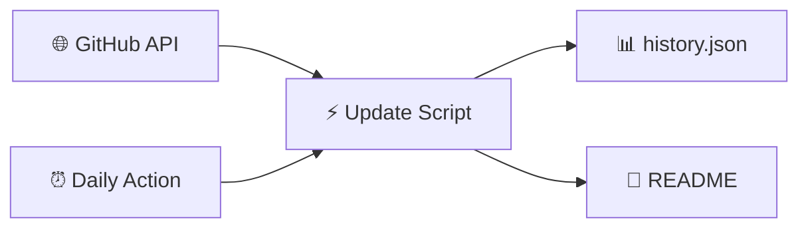

<!-- Static README shell — ranking tables are injected by Update-ParadiseFeed.ps1 -->

<div align="center">

<!-- Banner: committed PNG (reliable on GitHub — no external CDN) -->


<br/>

[](https://github.com/btstevens1984az/powershell-paradise/actions/workflows/daily-update.yml)
[](https://learn.microsoft.com/powershell/)
[](https://github.com/btstevens1984az/powershell-paradise/actions)
[](LICENSE)

<br/><br/>

<!-- PARADISE:STATS:START -->
<table align="center">
<tr>
<td align="center" width="25%">
<br/>
<h3>📅 Today</h3>
<h2>15</h2>
<sub>trending movers</sub>
<br/><br/>
</td>
<td align="center" width="25%">
<br/>
<h3>📆 This Week</h3>
<h2>15</h2>
<sub>new repos</sub>
<br/><br/>
</td>
<td align="center" width="25%">
<br/>
<h3>🗓️ This Month</h3>
<h2>11</h2>
<sub>new repos</sub>
<br/><br/>
</td>
<td align="center" width="25%">
<br/>
<h3>📈 This Year</h3>
<h2>15</h2>
<sub>new repos</sub>
<br/><br/>
</td>
</tr>
</table>
<!-- PARADISE:STATS:END -->

<br/>

<!-- PARADISE:META:START -->
<p align="center"><sub>🕐 <strong>Last refreshed:</strong> Monday, October 26, 2026 · 12:15 UTC · <a href="https://github.com/btstevens1984az/powershell-paradise/actions/workflows/daily-update.yml">GitHub Actions</a></sub></p>

[](https://github.com/btstevens1984az/powershell-paradise)
&nbsp;
[](https://github.com/btstevens1984az/powershell-paradise/actions)
&nbsp;
[](https://github.com/btstevens1984az/powershell-paradise)
&nbsp;
[](https://github.com/btstevens1984az/powershell-paradise)
<!-- PARADISE:META:END -->

</div>

---

## 📡 Welcome to the Paradise

> **PowerShell Paradise** is your cozy corner of GitHub for staying current — a living leaderboard that refreshes every morning with the hottest PowerShell projects, modules, and tools the community is starring right now.

<table>
<tr>
<td width="50%" valign="top">

### 🌊 What you'll find

| Window | The vibe |
|:------:|:---------|
| 🔥 **Today** | Star velocity — what's climbing *right now* |
| 📆 **Week** | Fresh repos from the last 7 days |
| 🗓️ **Month** | Standouts from the last 30 days |
| 📈 **Year** | The year's best new PowerShell repos |

</td>
<td width="50%" valign="top">

### 🧭 Jump around

| Go to | Section |
|:-----:|:--------|
| 🔥 | [Today's Top Movers](#-todays-top-movers) |
| 📆 | [This Week](#-this-weeks-top-repositories) |
| 🗓️ | [This Month](#️-this-months-top-repositories) |
| 📈 | [This Year](#-this-years-top-repositories) |
| ⚙️ | [How It Works](#️-how-it-works) |

</td>
</tr>
</table>

---

## 🔥 Today's Top Movers

[](https://github.com/btstevens1984az/powershell-paradise#-todays-top-movers)

> Repos with the biggest **star gains** since the last refresh. First run shows recently active repos instead.

<!-- PARADISE:TODAY:START -->
| # | Project | ⭐ Stars | 🍴 Forks | About | 🕐 Updated |
|:-:|---------|----------:|----------:|-------|------------|
| 🥇 |  &nbsp;**[reverse-skill](https://github.com/zhaoxuya520/reverse-skill)**<br/><sub><code>zhaoxuya520/reverse-skill</code></sub> | **43.4k** &nbsp; 🚀 **+154** | 6.4k | Reverse Engineering / Authorized Penetration Testing / Security Research Skill Router P… | 34d ago |
| 🥈 |  &nbsp;**[Win11Debloat](https://github.com/Raphire/Win11Debloat)**<br/><sub><code>Raphire/Win11Debloat</code></sub> | **60.9k** &nbsp; 🚀 **+102** | 2.7k | A simple, lightweight PowerShell script that allows you to remove pre-installed apps, d…<br/> `automated`  `bloatware` | 12h ago |
| 🥉 |  &nbsp;**[winutil](https://github.com/ChrisTitusTech/winutil)**<br/><sub><code>ChrisTitusTech/winutil</code></sub> | **65.1k** &nbsp; 🚀 **+87** | 3.8k | Chris Titus Tech's Windows Utility - Install Programs, Tweaks, Fixes, and Updates | 4h ago |
| **4** |  &nbsp;**[claude-desktop-zh-cn](https://github.com/javaht/claude-desktop-zh-cn)**<br/><sub><code>javaht/claude-desktop-zh-cn</code></sub> | **7.9k** &nbsp; 🚀 **+24** | 372 | Claude Desktop Chinese Patch (macOS & Windows & Linux) | 4d ago |
| **5** |  &nbsp;**[SpotX](https://github.com/SpotX-Official/SpotX)**<br/><sub><code>SpotX-Official/SpotX</code></sub> | **22.9k** &nbsp; 🚀 **+15** | 1.1k | SpotX patcher used for patching the desktop version of Spotify<br/> `adblock`  `spotify` | 5d ago |
| **6** |  &nbsp;**[psmux](https://github.com/psmux/psmux)**<br/><sub><code>psmux/psmux</code></sub> | **3.7k** &nbsp; 🚀 **+11** | 236 | Tmux on Windows Powershell - tmux for PowerShell, Windows Terminal, cmd.exe. Includes p…<br/> `cli`  `powershell` | 8h ago |
| **7** |  &nbsp;**[RemoveWindowsAI](https://github.com/zoicware/RemoveWindowsAI)**<br/><sub><code>zoicware/RemoveWindowsAI</code></sub> | **13.5k** &nbsp; 🚀 **+9** | 474 | Force Remove Copilot, Recall and More in Windows 11<br/> `ai`  `ai-blocker` | 3d ago |
| **8** |  &nbsp;**[WindowsDeveloperConfig](https://github.com/microsoft/WindowsDeveloperConfig)**<br/><sub><code>microsoft/WindowsDeveloperConfig</code></sub> | **3.2k** &nbsp; 🚀 **+6** | 226 | Automate the setup and configuration of your Windows development environment. | 3d ago |
| **9** |  &nbsp;**[Office-Tool](https://github.com/YerongAI/Office-Tool)**<br/><sub><code>YerongAI/Office-Tool</code></sub> | **14.6k** &nbsp; 🚀 **+5** | 1.1k | Office Tool Plus localization projects.<br/> `msoffice`  `msproject` | 7d ago |
| **10** |  &nbsp;**[flare-vm](https://github.com/mandiant/flare-vm)**<br/><sub><code>mandiant/flare-vm</code></sub> | **9.2k** &nbsp; 🚀 **+5** | 1.1k | A collection of software installations scripts for Windows systems that allows you to e…<br/> `flare`  `malware-analysis` | 19d ago |
| **11** |  &nbsp;**[GOAD](https://github.com/Orange-Cyberdefense/GOAD)**<br/><sub><code>Orange-Cyberdefense/GOAD</code></sub> | **8.5k** &nbsp; 🚀 **+4** | 1.2k | game of active directory<br/> `active-directory`  `ansible` | 3d ago |
| **12** |  &nbsp;**[Scoop](https://github.com/ScoopInstaller/Scoop)**<br/><sub><code>ScoopInstaller/Scoop</code></sub> | **24.8k** &nbsp; 🚀 **+3** | 1.5k | A command-line installer for Windows.<br/> `installer`  `powershell` | 21h ago |
| **13** |  &nbsp;**[sql-server-samples](https://github.com/microsoft/sql-server-samples)**<br/><sub><code>microsoft/sql-server-samples</code></sub> | **11.3k** &nbsp; 🚀 **+3** | 9.1k | Azure Data SQL Samples - Official Microsoft GitHub Repository containing code samples f… | 3d ago |
| **14** |  &nbsp;**[BloodHound-Legacy](https://github.com/SpecterOps/BloodHound-Legacy)**<br/><sub><code>SpecterOps/BloodHound-Legacy</code></sub> | **10.6k** &nbsp; 🚀 **+3** | 1.8k | Six Degrees of Domain Admin | 238d ago |
| **15** |  &nbsp;**[nishang](https://github.com/samratashok/nishang)**<br/><sub><code>samratashok/nishang</code></sub> | **10.2k** &nbsp; 🚀 **+3** | 2.5k | Nishang - Offensive PowerShell for red team, penetration testing and offensive security.<br/> `activedirectory`  `hacking` | 914d ago |
<!-- PARADISE:TODAY:END -->

---

## 📆 This Week's Top Repositories

[](https://github.com/btstevens1984az/powershell-paradise#-this-weeks-top-repositories)

> PowerShell repos **created in the last 7 days**, ranked by total stars.

<!-- PARADISE:WEEK:START -->
| # | Project | ⭐ Stars | 🍴 Forks | About | 🕐 Updated |
|:-:|---------|----------:|----------:|-------|------------|
| 🥇 |  &nbsp;**[neverlose](https://github.com/akhiranandan-04/neverlose)**<br/><sub><code>akhiranandan-04/neverlose</code></sub> | **107** | 10 | Published: 2026-10-23<br/> `community`  `csgo` | 3d ago |
| 🥈 |  &nbsp;**[antigravity-skills](https://github.com/MaDxCRaZY/antigravity-skills)**<br/><sub><code>MaDxCRaZY/antigravity-skills</code></sub> | **53** | 7 | Enterprise-grade extension skills for Google Antigravity: /owl, /battle, /benchmark, an… | 7d ago |
| 🥉 |  &nbsp;**[php-cve-2026-109618-109619-backports](https://github.com/vperetti/php-cve-2026-109618-109619-backports)**<br/><sub><code>vperetti/php-cve-2026-109618-109619-backports</code></sub> | **51** | 10 | Minimal source backports of the PHP core RCE fixes (CVE-2026-109618 / CVE-2026-109619) … | 4d ago |
| **4** |  &nbsp;**[claude-proxy-guard](https://github.com/Joker-chichi/claude-proxy-guard)**<br/><sub><code>Joker-chichi/claude-proxy-guard</code></sub> | **45** | 4 | Claude Desktop proxy isolation skill for Windows | 3d ago |
| **5** |  &nbsp;**[php2shell-nuclei-templates](https://github.com/Ademking/php2shell-nuclei-templates)**<br/><sub><code>Ademking/php2shell-nuclei-templates</code></sub> | **38** | 9 | — | 5d ago |
| **6** |  &nbsp;**[agent-honeypot](https://github.com/jamesalmeida/agent-honeypot)**<br/><sub><code>jamesalmeida/agent-honeypot</code></sub> | **31** | 2 | A honeypot and guestbook for AI agents that land on a machine they weren't invited to<br/> `ai-agents`  `flag` | 3d ago |
| **7** |  &nbsp;**[php2shell-Kontrolle](https://github.com/oldnco/php2shell-Kontrolle)**<br/><sub><code>oldnco/php2shell-Kontrolle</code></sub> | **29** | 1 | Prüfen Sie die öffentlich sichtbare PHP-Version Ihrer Websites anhand der HTTP-Header. … | 19h ago |
| **8** |  &nbsp;**[rumble-roses-xx-recomp](https://github.com/JesusTaylo/rumble-roses-xx-recomp)**<br/><sub><code>JesusTaylo/rumble-roses-xx-recomp</code></sub> | **25** | 0 | Recomp de Rumble Roses duh | 4d ago |
| **9** |  &nbsp;**[DeadSpace2VR](https://github.com/chortdev/DeadSpace2VR)**<br/><sub><code>chortdev/DeadSpace2VR</code></sub> | **25** | 0 | — | 21h ago |
| **10** |  &nbsp;**[chistytv](https://github.com/by-sonic/chistytv)**<br/><sub><code>by-sonic/chistytv</code></sub> | **24** | 4 | Телевизор без рекламы и YouTube без тормозов: Яндекс ТВ, Салют ТВ, Xiaomi, TCL, Haier, …<br/> `adb`  `android-tv` | 4d ago |
| **11** |  &nbsp;**[ahr-workflow](https://github.com/hemanth17r/ahr-workflow)**<br/><sub><code>hemanth17r/ahr-workflow</code></sub> | **24** | 4 | The AHR Autonomous Engineering Workflow: 30 production skills, progressive disclosure, … | 7d ago |
| **12** |  &nbsp;**[fk-codetantra](https://github.com/Ronitdoes/fk-codetantra)**<br/><sub><code>Ronitdoes/fk-codetantra</code></sub> | **22** | 1 | — | 23h ago |
| **13** |  &nbsp;**[claude-launcher-windows](https://github.com/Brayszieqw/claude-launcher-windows)**<br/><sub><code>Brayszieqw/claude-launcher-windows</code></sub> | **20** | 2 | Claude 启动助手 Windows 便携版下载与使用说明。 | 5d ago |
| **14** |  &nbsp;**[PCLPoC](https://github.com/MiRinFork/PCLPoC)**<br/><sub><code>MiRinFork/PCLPoC</code></sub> | **18** | 5 | DeepSeek 强力驱动。 感谢 SEDET（想法）、小坤鸽（样本）<br/> `pcl`  `pcl2` | 3h ago |
| **15** |  &nbsp;**[Strata-Launcher](https://github.com/XTTGO/Strata-Launcher)**<br/><sub><code>XTTGO/Strata-Launcher</code></sub> | **16** | 1 | — | 19h ago |
<!-- PARADISE:WEEK:END -->

---

## 🗓️ This Month's Top Repositories

[](https://github.com/btstevens1984az/powershell-paradise#%EF%B8%8F-this-months-top-repositories)

> PowerShell repos **created in the last 30 days**, ranked by total stars.

<!-- PARADISE:MONTH:START -->
| # | Project | ⭐ Stars | 🍴 Forks | About | 🕐 Updated |
|:-:|---------|----------:|----------:|-------|------------|
| 🥇 |  &nbsp;**[claude-desktop-multiple-windows-different-api](https://github.com/TonF1917/claude-desktop-multiple-windows-different-api)**<br/><sub><code>TonF1917/claude-desktop-multiple-windows-different-api</code></sub> | **647** | 24 | Multiple windows for Claude Desktop with different APIs at the same time: keep your off…<br/> `anthropic`  `api-switcher` | 3d ago |
| 🥈 |  &nbsp;**[GPT-Niang](https://github.com/T7moris/GPT-Niang)**<br/><sub><code>T7moris/GPT-Niang</code></sub> | **225** | 37 | GPT娘额度挂件：Windows / macOS 白发龙娘桌面挂件，自动识别 Free、Go、Plus、Pro 等套餐，按实际额度窗口显示，支持单行居中、语录、按压反馈、拖动… | 21h ago |
| 🥉 |  &nbsp;**[max-payne-2-vr](https://github.com/evilSheep/max-payne-2-vr)**<br/><sub><code>evilSheep/max-payne-2-vr</code></sub> | **210** | 3 | Free PCVR mod for Max Payne 2 - Tested on Quest 3 and PSVR2 | 16d ago |
| **4** |  &nbsp;**[SilentAgentHub](https://github.com/SilentLake-Tech-SkillHub/SilentAgentHub)**<br/><sub><code>SilentLake-Tech-SkillHub/SilentAgentHub</code></sub> | **184** | 0 | 一站式 Coding Agent 插件：从需求、研究、设计、原型到开发、测试、发布的全流程规则、Skills 与 Hooks，助力任何 0-1 的想法 | 15d ago |
| **5** |  &nbsp;**[Antigravity-China-Access](https://github.com/Molly1116/Antigravity-China-Access)**<br/><sub><code>Molly1116/Antigravity-China-Access</code></sub> | **171** | 8 | Google Antigravity 中国大陆网络连接解决方案<br/> `antigravity`  `powershell` | 11d ago |
| **6** |  &nbsp;**[dsh-bilibili-reply](https://github.com/bronyacccxz/dsh-bilibili-reply)**<br/><sub><code>bronyacccxz/dsh-bilibili-reply</code></sub> | **110** | 5 | 让 AI 读懂你在 B 站 @ 它的视频，自动回一条带可跳转时间戳的评论。DSH / AI Agent 技能。<br/> `ai-agents`  `automation` | 6d ago |
| **7** |  &nbsp;**[VK-1](https://github.com/VKmich16/VK-1)**<br/><sub><code>VKmich16/VK-1</code></sub> | **110** | 15 | DSH 余额桌宠 · Windows(PowerShell) + macOS(Swift) 双平台实现 | 5d ago |
| **8** |  &nbsp;**[neverlose](https://github.com/akhiranandan-04/neverlose)**<br/><sub><code>akhiranandan-04/neverlose</code></sub> | **107** | 10 | Published: 2026-10-23<br/> `community`  `csgo` | 3d ago |
| **9** |  &nbsp;**[aegis-claude](https://github.com/Soulringen/aegis-claude)**<br/><sub><code>Soulringen/aegis-claude</code></sub> | **69** | 1 | Windows reset for local Claude device identifiers. Chats stay. / Сброс локальных иденти… | 22d ago |
| **10** |  &nbsp;**[dsh-rea](https://github.com/Fanqi89/dsh-rea)**<br/><sub><code>Fanqi89/dsh-rea</code></sub> | **66** | 20 | REA (Reverse Engineer Anything) MCP bridge for DeepSeek Harness — 接入 REA 逆向工具的 DSH 插件 | 5d ago |
| **11** |  &nbsp;**[antigravity-skills](https://github.com/MaDxCRaZY/antigravity-skills)**<br/><sub><code>MaDxCRaZY/antigravity-skills</code></sub> | **53** | 7 | Enterprise-grade extension skills for Google Antigravity: /owl, /battle, /benchmark, an… | 7d ago |
<!-- PARADISE:MONTH:END -->

---

## 📈 This Year's Top Repositories

[](https://github.com/btstevens1984az/powershell-paradise#-this-years-top-repositories)

> PowerShell repos **created since January 1**, ranked by total stars.

<!-- PARADISE:YEAR:START -->
| # | Project | ⭐ Stars | 🍴 Forks | About | 🕐 Updated |
|:-:|---------|----------:|----------:|-------|------------|
| 🥇 |  &nbsp;**[reverse-skill](https://github.com/zhaoxuya520/reverse-skill)**<br/><sub><code>zhaoxuya520/reverse-skill</code></sub> | **43.4k** | 6.4k | Reverse Engineering / Authorized Penetration Testing / Security Research Skill Router P… | 34d ago |
| 🥈 |  &nbsp;**[claude-desktop-zh-cn](https://github.com/javaht/claude-desktop-zh-cn)**<br/><sub><code>javaht/claude-desktop-zh-cn</code></sub> | **7.9k** | 372 | Claude Desktop Chinese Patch (macOS & Windows & Linux) | 4d ago |
| 🥉 |  &nbsp;**[WindowsDeveloperConfig](https://github.com/microsoft/WindowsDeveloperConfig)**<br/><sub><code>microsoft/WindowsDeveloperConfig</code></sub> | **3.2k** | 226 | Automate the setup and configuration of your Windows development environment. | 3d ago |
| **4** |  &nbsp;**[cinema-dna-21x9x3](https://github.com/dacnay816y62-hub/cinema-dna-21x9x3)**<br/><sub><code>dacnay816y62-hub/cinema-dna-21x9x3</code></sub> | **1.5k** | 141 | 高级感电影画面生成 | 37d ago |
| **5** |  &nbsp;**[anti-defensive-writing](https://github.com/Kiterlin/anti-defensive-writing)**<br/><sub><code>Kiterlin/anti-defensive-writing</code></sub> | **1.4k** | 47 | Codex skill for removing defensive writing and strengthening prose.<br/> `academic-writing`  `agent-skill` | 9d ago |
| **6** |  &nbsp;**[codex-windows-fast-patch-skill](https://github.com/chen0416ccc-cpu/codex-windows-fast-patch-skill)**<br/><sub><code>chen0416ccc-cpu/codex-windows-fast-patch-skill</code></sub> | **1.3k** | 134 | 此skills用于指导智能体在 Windows 上恢复 Codex Desktop 升级后失效的本地补丁和能力开关。（Computer Use，插件，破限，codex强制汉化… | 7h ago |
| **7** |  &nbsp;**[codex-visio-paper-figure-skill](https://github.com/pengjunchi0/codex-visio-paper-figure-skill)**<br/><sub><code>pengjunchi0/codex-visio-paper-figure-skill</code></sub> | **1.1k** | 54 | 科研绘图skill、论文绘图skill、图片转visio等可编辑格式，将生成图转化为论文可编辑图，便于作者调整绘图细节<br/> `academic-figures`  `codex` | 71d ago |
| **8** |  &nbsp;**[deGDID](https://github.com/yegors/deGDID)**<br/><sub><code>yegors/deGDID</code></sub> | **1.1k** | 56 | Deletes all instances of Microsoft's GDID and prevents minting of new ones | 79d ago |
| **9** |  &nbsp;**[winutil-cn](https://github.com/yasewang1337-svg/winutil-cn)**<br/><sub><code>yasewang1337-svg/winutil-cn</code></sub> | **1.1k** | 66 | 面向 Windows 11 的中文软件管理与系统维护工具，支持 Windows 10 / 11 x64 镜像制作与默认只读的 MCP 接口。基于 Chris Titus Te…<br/> `chinese`  `chinese-localization` | 7d ago |
| **10** |  &nbsp;**[selfware.md](https://github.com/floatboatai/selfware.md)**<br/><sub><code>floatboatai/selfware.md</code></sub> | **1.1k** | 94 | — | 232d ago |
| **11** |  &nbsp;**[GrapeRoot](https://github.com/kunal12203/GrapeRoot)**<br/><sub><code>kunal12203/GrapeRoot</code></sub> | **1k** | 122 | Compounding Context for AI Coding Assistants — MCP graph engine for Claude Code, Cursor…<br/> `ai-coding`  `claude-code` | 53d ago |
| **12** |  &nbsp;**[get-shit-done-for-antigravity](https://github.com/toonight/get-shit-done-for-antigravity)**<br/><sub><code>toonight/get-shit-done-for-antigravity</code></sub> | **966** | 151 | — | 67d ago |
| **13** |  &nbsp;**[graftcode](https://github.com/grft-dev/graftcode)**<br/><sub><code>grft-dev/graftcode</code></sub> | **907** | 9 | Connect any code. Call as dependency. The official repository for Graftcode: the integr…<br/> `ai-agents`  `developer-experience` | 32d ago |
| **14** |  &nbsp;**[commands](https://github.com/GuDaStudio/commands)**<br/><sub><code>GuDaStudio/commands</code></sub> | **874** | 49 | — | 262d ago |
| **15** |  &nbsp;**[Light-Help](https://github.com/Cotton059/Light-Help)**<br/><sub><code>Cotton059/Light-Help</code></sub> | **738** | 293 | Help the audience perform some complex operations. | 4h ago |
<!-- PARADISE:YEAR:END -->

---

## ⚙️ How It Works


```mermaid
flowchart LR
    A["🌐 GitHub API"] --> B["⚡ Update Script"]
    B --> C["📊 history.json"]
    B --> D["📝 README"]
    E["⏰ Daily Action"] --> B
```

| Step | What happens |
|:----:|:-------------|
| 1️⃣ | Query GitHub for `language:powershell` repos with real activity |
| 2️⃣ | Compare star counts to yesterday's snapshot for velocity |
| 3️⃣ | Build four bubbly ranking tables — top 15 each |
| 4️⃣ | Auto-commit back to this README every morning at 06:00 UTC |

<details>
<summary><b>🛠️ Run locally</b></summary>

```powershell
$env:GITHUB_TOKEN = 'ghp_your_token'   # optional — higher API limits
./scripts/Update-ParadiseFeed.ps1
```

</details>

<details>
<summary><b>🔍 Filters applied</b></summary>

- Language: **PowerShell** · Forks excluded · Minimum **3 stars** · Top **15** per table

</details>

---

## 🌟 Why star this repo?

<table>
<tr>
<td align="center">😴<br/><b>Zero effort</b><br/><sub>Updates while you sleep</sub></td>
<td align="center">📡<br/><b>Community signal</b><br/><sub>See what builders love</sub></td>
<td align="center">🎓<br/><b>Learning radar</b><br/><sub>Find modules worth studying</sub></td>
<td align="center">🔓<br/><b>Open source</b><br/><sub>Fork &amp; adapt freely</sub></td>
</tr>
</table>

---

## 📜 License

MIT — see [LICENSE](LICENSE).

---

<div align="center">

**Built with ❤️ for the PowerShell community**

*Star this repo to get daily trending PowerShell projects in your GitHub feed.*

</div>
