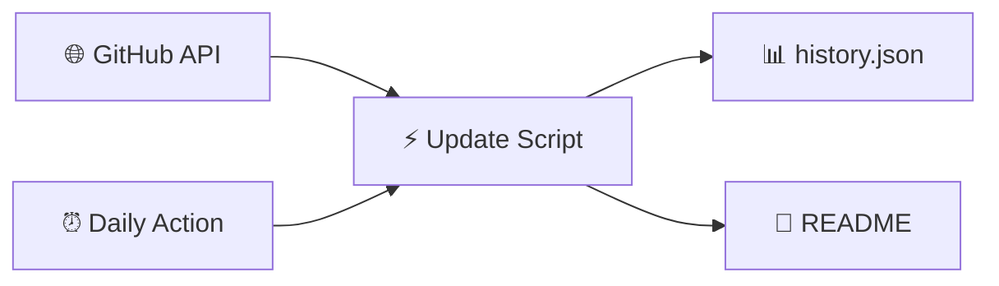

<!-- Static README shell — ranking tables are injected by Update-ParadiseFeed.ps1 -->

<div align="center">

<!-- Banner: committed PNG (reliable on GitHub — no external CDN) -->


<br/>

[](https://github.com/btstevens1984az/powershell-paradise/actions/workflows/daily-update.yml)
[](https://learn.microsoft.com/powershell/)
[](https://github.com/btstevens1984az/powershell-paradise/actions)
[](LICENSE)

<br/><br/>

<!-- PARADISE:STATS:START -->
<table align="center">
<tr>
<td align="center" width="25%">
<br/>
<h3>📅 Today</h3>
<h2>15</h2>
<sub>trending movers</sub>
<br/><br/>
</td>
<td align="center" width="25%">
<br/>
<h3>📆 This Week</h3>
<h2>15</h2>
<sub>new repos</sub>
<br/><br/>
</td>
<td align="center" width="25%">
<br/>
<h3>🗓️ This Month</h3>
<h2>15</h2>
<sub>new repos</sub>
<br/><br/>
</td>
<td align="center" width="25%">
<br/>
<h3>📈 This Year</h3>
<h2>15</h2>
<sub>new repos</sub>
<br/><br/>
</td>
</tr>
</table>
<!-- PARADISE:STATS:END -->

<br/>

<!-- PARADISE:META:START -->
<p align="center"><sub>🕐 <strong>Last refreshed:</strong> Saturday, November 14, 2026 · 12:57 UTC · <a href="https://github.com/btstevens1984az/powershell-paradise/actions/workflows/daily-update.yml">GitHub Actions</a></sub></p>

[](https://github.com/btstevens1984az/powershell-paradise)
&nbsp;
[](https://github.com/btstevens1984az/powershell-paradise/actions)
&nbsp;
[](https://github.com/btstevens1984az/powershell-paradise)
&nbsp;
[](https://github.com/btstevens1984az/powershell-paradise)
<!-- PARADISE:META:END -->

</div>

---

## 📡 Welcome to the Paradise

> **PowerShell Paradise** is your cozy corner of GitHub for staying current — a living leaderboard that refreshes every morning with the hottest PowerShell projects, modules, and tools the community is starring right now.

<table>
<tr>
<td width="50%" valign="top">

### 🌊 What you'll find

| Window | The vibe |
|:------:|:---------|
| 🔥 **Today** | Star velocity — what's climbing *right now* |
| 📆 **Week** | Fresh repos from the last 7 days |
| 🗓️ **Month** | Standouts from the last 30 days |
| 📈 **Year** | The year's best new PowerShell repos |

</td>
<td width="50%" valign="top">

### 🧭 Jump around

| Go to | Section |
|:-----:|:--------|
| 🔥 | [Today's Top Movers](#-todays-top-movers) |
| 📆 | [This Week](#-this-weeks-top-repositories) |
| 🗓️ | [This Month](#️-this-months-top-repositories) |
| 📈 | [This Year](#-this-years-top-repositories) |
| ⚙️ | [How It Works](#️-how-it-works) |

</td>
</tr>
</table>

---

## 🔥 Today's Top Movers

[](https://github.com/btstevens1984az/powershell-paradise#-todays-top-movers)

> Repos with the biggest **star gains** since the last refresh. First run shows recently active repos instead.

<!-- PARADISE:TODAY:START -->
| # | Project | ⭐ Stars | 🍴 Forks | About | 🕐 Updated |
|:-:|---------|----------:|----------:|-------|------------|
| 🥇 |  &nbsp;**[anti-defensive-writing](https://github.com/Kiterlin/anti-defensive-writing)**<br/><sub><code>Kiterlin/anti-defensive-writing</code></sub> | **2.1k** &nbsp; 🚀 **+126** | 68 | Codex skill for removing defensive writing and strengthening prose.<br/> `academic-writing`  `agent-skill` | 28d ago |
| 🥈 |  &nbsp;**[Win11Debloat](https://github.com/Raphire/Win11Debloat)**<br/><sub><code>Raphire/Win11Debloat</code></sub> | **62.6k** &nbsp; 🚀 **+85** | 2.8k | A simple, lightweight PowerShell script that allows you to remove pre-installed apps, d…<br/> `automated`  `bloatware` | 17h ago |
| 🥉 |  &nbsp;**[winutil](https://github.com/ChrisTitusTech/winutil)**<br/><sub><code>ChrisTitusTech/winutil</code></sub> | **66k** &nbsp; 🚀 **+61** | 3.9k | Chris Titus Tech's Windows Utility - Install Programs, Tweaks, Fixes, and Updates | 10h ago |
| **4** |  &nbsp;**[reverse-skill](https://github.com/zhaoxuya520/reverse-skill)**<br/><sub><code>zhaoxuya520/reverse-skill</code></sub> | **44.6k** &nbsp; 🚀 **+42** | 6.6k | Reverse Engineering / Authorized Penetration Testing / Security Research Skill Router P… | 2m ago |
| **5** |  &nbsp;**[claude-desktop-zh-cn](https://github.com/javaht/claude-desktop-zh-cn)**<br/><sub><code>javaht/claude-desktop-zh-cn</code></sub> | **8.6k** &nbsp; 🚀 **+36** | 413 | Claude Desktop Chinese Patch (macOS & Windows & Linux)<br/> `claude`  `claude-code` | 11h ago |
| **6** |  &nbsp;**[SpotX](https://github.com/SpotX-Official/SpotX)**<br/><sub><code>SpotX-Official/SpotX</code></sub> | **23.3k** &nbsp; 🚀 **+35** | 1.2k | SpotX patcher used for patching the desktop version of Spotify<br/> `adblock`  `spotify` | 12h ago |
| **7** |  &nbsp;**[Atlas](https://github.com/Atlas-OS/Atlas)**<br/><sub><code>Atlas-OS/Atlas</code></sub> | **22.1k** &nbsp; 🚀 **+10** | 778 | 🚀 An open and lightweight modification to Windows, designed to optimize performance, p…<br/> `ame-wizard`  `atlas` | 11d ago |
| **8** |  &nbsp;**[Office-Tool](https://github.com/YerongAI/Office-Tool)**<br/><sub><code>YerongAI/Office-Tool</code></sub> | **14.7k** &nbsp; 🚀 **+10** | 1.1k | Office Tool Plus localization projects.<br/> `msoffice`  `msproject` | 3d ago |
| **9** |  &nbsp;**[Sophia-Script-for-Windows](https://github.com/farag2/Sophia-Script-for-Windows)**<br/><sub><code>farag2/Sophia-Script-for-Windows</code></sub> | **10k** &nbsp; 🚀 **+7** | 647 | :zap: The most advanced PowerShell module on GitHub for fine-tuning Windows 11 & Window…<br/> `25h2`  `26h2` | 2h ago |
| **10** |  &nbsp;**[WindowsDeveloperConfig](https://github.com/microsoft/WindowsDeveloperConfig)**<br/><sub><code>microsoft/WindowsDeveloperConfig</code></sub> | **3.6k** &nbsp; 🚀 **+7** | 245 | Automate the setup and configuration of your Windows development environment. | 8d ago |
| **11** |  &nbsp;**[Flipper-Zero-BadUSB](https://github.com/I-Am-Jakoby/Flipper-Zero-BadUSB)**<br/><sub><code>I-Am-Jakoby/Flipper-Zero-BadUSB</code></sub> | **7.2k** &nbsp; 🚀 **+6** | 891 | Repository for my flipper zero badUSB payloads. Now almost entirely plug and play.<br/> `badusb`  `badusb-payloads` | 882d ago |
| **12** |  &nbsp;**[Scoop](https://github.com/ScoopInstaller/Scoop)**<br/><sub><code>ScoopInstaller/Scoop</code></sub> | **24.8k** &nbsp; 🚀 **+5** | 1.5k | A command-line installer for Windows.<br/> `installer`  `powershell` | 4d ago |
| **13** |  &nbsp;**[GOAD](https://github.com/Orange-Cyberdefense/GOAD)**<br/><sub><code>Orange-Cyberdefense/GOAD</code></sub> | **8.6k** &nbsp; 🚀 **+5** | 1.2k | game of active directory<br/> `active-directory`  `ansible` | 22d ago |
| **14** |  &nbsp;**[usbrubberducky-payloads](https://github.com/hak5/usbrubberducky-payloads)**<br/><sub><code>hak5/usbrubberducky-payloads</code></sub> | **6.2k** &nbsp; 🚀 **+4** | 1.7k | The Official USB Rubber Ducky Payload Repository<br/> `badusb`  `ducky-payloads` | 75d ago |
| **15** |  &nbsp;**[runner-images](https://github.com/actions/runner-images)**<br/><sub><code>actions/runner-images</code></sub> | **13.6k** &nbsp; 🚀 **+3** | 4k | GitHub Actions runner images | 16h ago |
<!-- PARADISE:TODAY:END -->

---

## 📆 This Week's Top Repositories

[](https://github.com/btstevens1984az/powershell-paradise#-this-weeks-top-repositories)

> PowerShell repos **created in the last 7 days**, ranked by total stars.

<!-- PARADISE:WEEK:START -->
| # | Project | ⭐ Stars | 🍴 Forks | About | 🕐 Updated |
|:-:|---------|----------:|----------:|-------|------------|
| 🥇 |  &nbsp;**[Radeon-atieclxx-SSD-Fix](https://github.com/necanditool/Radeon-atieclxx-SSD-Fix)**<br/><sub><code>necanditool/Radeon-atieclxx-SSD-Fix</code></sub> | **85** | 8 | Inoffizieller Workaround gegen das Dauerschreiben von atieclxx.exe (AMD External Events…<br/> `amd`  `atieclxx` | 2d ago |
| 🥈 |  &nbsp;**[dsh-guide-tutor](https://github.com/fahsq72lan/dsh-guide-tutor)**<br/><sub><code>fahsq72lan/dsh-guide-tutor</code></sub> | **70** | 0 | 屏幕教学助手：悬浮球 + 实时标注 + 步骤面板（DeepSeek Harness 插件） | 7h ago |
| 🥉 |  &nbsp;**[projetor-hy320-mini-otimizador](https://github.com/cavaleiro-ai/projetor-hy320-mini-otimizador)**<br/><sub><code>cavaleiro-ai/projetor-hy320-mini-otimizador</code></sub> | **42** | 4 | Deixa o projetor HY320 Mini (Android 11, Allwinner H713) mais rapido pela rede Wi-Fi co…<br/> `adb`  `allwinner-h713` | 2d ago |
| **4** |  &nbsp;**[atieclxx-fix](https://github.com/candygoogy/atieclxx-fix)**<br/><sub><code>candygoogy/atieclxx-fix</code></sub> | **38** | 2 | Stops AMD's atieclxx.exe from writing 40-55 GB a day to your SSD. AMD fixed it in Adren…<br/> `adrenalin`  `amd` | 18h ago |
| **5** |  &nbsp;**[Gameware-Cleaner](https://github.com/TG-Twilight/Gameware-Cleaner)**<br/><sub><code>TG-Twilight/Gameware-Cleaner</code></sub> | **36** | 1 | 雷神加速器优化脚本 | 26m ago |
| **6** |  &nbsp;**[ozel-uzak-masaustu](https://github.com/alexturkey/ozel-uzak-masaustu)**<br/><sub><code>alexturkey/ozel-uzak-masaustu</code></sub> | **27** | 7 | Tailscale + RustDesk ile port açmadan, kendi cihazların arasında özel uzak masaüstü. Ya…<br/> `agents-md`  `ai-agent` | 1d ago |
| **7** |  &nbsp;**[callshelf](https://github.com/emperhub/callshelf)**<br/><sub><code>emperhub/callshelf</code></sub> | **23** | 7 | — | 3d ago |
| **8** |  &nbsp;**[powerpoint-agent-skills](https://github.com/geekfujiwara/powerpoint-agent-skills)**<br/><sub><code>geekfujiwara/powerpoint-agent-skills</code></sub> | **20** | 0 | Geek's frequently used skills for a more productive Copilot in PowerPoint agent mode. 日…<br/> `agent-skills`  `microsoft-copilot` | 4d ago |
| **9** |  &nbsp;**[WinTop](https://github.com/doggy8088/WinTop)**<br/><sub><code>doggy8088/WinTop</code></sub> | **17** | 0 | Interactive full-screen TUI system & CPU monitor (top for Windows) featuring 5-minute t…<br/> `btop`  `cpu-monitor` | 2d ago |
| **10** |  &nbsp;**[ql](https://github.com/feiyuaq/ql)**<br/><sub><code>feiyuaq/ql</code></sub> | **14** | 3 | 电脑开机慢和垃圾清理工具 | 7d ago |
| **11** |  &nbsp;**[crestron-usb-arm64](https://github.com/SharptoothCode/crestron-usb-arm64)**<br/><sub><code>SharptoothCode/crestron-usb-arm64</code></sub> | **11** | 2 | Unofficial: Crestron Toolbox USB (console, program load, IR learner) on Windows on ARM … | 5d ago |
| **12** |  &nbsp;**[pc-scanner](https://github.com/1Bohdan1-rgb/pc-scanner)**<br/><sub><code>1Bohdan1-rgb/pc-scanner</code></sub> | **8** | 1 | PC Scanner — diagnose & safely repair Windows | 6d ago |
| **13** |  &nbsp;**[save-memory](https://github.com/incconutwo/save-memory)**<br/><sub><code>incconutwo/save-memory</code></sub> | **8** | 0 | Tiny Android app that launches Samsung Memory's capture screen as a real launcher app, … | 5d ago |
| **14** |  &nbsp;**[PSScriptLauncher](https://github.com/Arnaud-Ferriere/PSScriptLauncher)**<br/><sub><code>Arnaud-Ferriere/PSScriptLauncher</code></sub> | **7** | 0 | A GUI that lists the PowerShell scripts of a folder, reads their built-in help and buil…<br/> `automation`  `gui` | 12h ago |
| **15** |  &nbsp;**[zhudong-workbuddy](https://github.com/1433223qqq-wbz/zhudong-workbuddy)**<br/><sub><code>1433223qqq-wbz/zhudong-workbuddy</code></sub> | **7** | 0 | 诛冬破甲 · WorkBuddy 版 v1.5.0 —— 人格/钩子/output-style/memory/agent 五通道安装包，Windows + macOS，载荷加…<br/> `ai-agent`  `codebuddy` | 3d ago |
<!-- PARADISE:WEEK:END -->

---

## 🗓️ This Month's Top Repositories

[](https://github.com/btstevens1984az/powershell-paradise#%EF%B8%8F-this-months-top-repositories)

> PowerShell repos **created in the last 30 days**, ranked by total stars.

<!-- PARADISE:MONTH:START -->
| # | Project | ⭐ Stars | 🍴 Forks | About | 🕐 Updated |
|:-:|---------|----------:|----------:|-------|------------|
| 🥇 |  &nbsp;**[hop](https://github.com/Arjun-Ingole/hop)**<br/><sub><code>Arjun-Ingole/hop</code></sub> | **1.7k** | 59 | Install Linux next to Windows without a USB stick | 5d ago |
| 🥈 |  &nbsp;**[GoogleUnlimited](https://github.com/shishir0x/GoogleUnlimited)**<br/><sub><code>shishir0x/GoogleUnlimited</code></sub> | **412** | 61 | Unlimited Google Photos auto-sync on Windows with Pixel original quality spoofing,nativ…<br/> `google-photos`  `unlimited-storage` | 9d ago |
| 🥉 |  &nbsp;**[Antigravity-China-Access](https://github.com/Molly1116/Antigravity-China-Access)**<br/><sub><code>Molly1116/Antigravity-China-Access</code></sub> | **185** | 8 | Google Antigravity 中国大陆网络连接解决方案<br/> `antigravity`  `powershell` | 30d ago |
| **4** |  &nbsp;**[FEFW-Stable-with-60-FPS-Patch](https://github.com/TheSneakyBadger/FEFW-Stable-with-60-FPS-Patch)**<br/><sub><code>TheSneakyBadger/FEFW-Stable-with-60-FPS-Patch</code></sub> | **157** | 4 | Portable, ready-to-play Windows build of the Eden FE: Fortune’s Weave emulator fork (ba… | 2h ago |
| **5** |  &nbsp;**[kordon](https://github.com/ef1m03/kordon)**<br/><sub><code>ef1m03/kordon</code></sub> | **135** | 8 | Kill switch для приложений: замораживает Claude, ChatGPT, Cursor, Telegram и другие про…<br/> `golang`  `ipv6` | 1d ago |
| **6** |  &nbsp;**[anti-dpi-for-russia](https://github.com/igareck/anti-dpi-for-russia)**<br/><sub><code>igareck/anti-dpi-for-russia</code></sub> | **103** | 7 | Anti-DPI-софт для работы Черных Списков VPN в России / Anti-DPI-Software for restoring …<br/> `anti-censorship`  `anti-dpi` | 9d ago |
| **7** |  &nbsp;**[clawd-usage-winwidget](https://github.com/Enhed/clawd-usage-winwidget)**<br/><sub><code>Enhed/clawd-usage-winwidget</code></sub> | **91** | 11 | Claude usage limits in a tiny Windows widget + tray icon — with pixel Clawd who reacts …<br/> `anthropic`  `claude` | 11d ago |
| **8** |  &nbsp;**[Radeon-atieclxx-SSD-Fix](https://github.com/necanditool/Radeon-atieclxx-SSD-Fix)**<br/><sub><code>necanditool/Radeon-atieclxx-SSD-Fix</code></sub> | **85** | 8 | Inoffizieller Workaround gegen das Dauerschreiben von atieclxx.exe (AMD External Events…<br/> `amd`  `atieclxx` | 2d ago |
| **9** |  &nbsp;**[OpenCode-Unlimited](https://github.com/Tazmyan/OpenCode-Unlimited)**<br/><sub><code>Tazmyan/OpenCode-Unlimited</code></sub> | **84** | 24 | Bypasses OpenCode's daily free message limit. | 8d ago |
| **10** |  &nbsp;**[dsh-guide-tutor](https://github.com/fahsq72lan/dsh-guide-tutor)**<br/><sub><code>fahsq72lan/dsh-guide-tutor</code></sub> | **70** | 0 | 屏幕教学助手：悬浮球 + 实时标注 + 步骤面板（DeepSeek Harness 插件） | 7h ago |
| **11** |  &nbsp;**[DeadSpace2VR](https://github.com/chortdev/DeadSpace2VR)**<br/><sub><code>chortdev/DeadSpace2VR</code></sub> | **67** | 0 | — | 2d ago |
| **12** |  &nbsp;**[agent-honeypot](https://github.com/jamesalmeida/agent-honeypot)**<br/><sub><code>jamesalmeida/agent-honeypot</code></sub> | **64** | 9 | A honeypot and guestbook for AI agents that land on a machine they weren't invited to<br/> `ai-agents`  `flag` | 22d ago |
| **13** |  &nbsp;**[opencode-team](https://github.com/sametcelikbicak/opencode-team)**<br/><sub><code>sametcelikbicak/opencode-team</code></sub> | **63** | 9 | AI agent team that takes an idea from research to launch, built on opencode. No framewo…<br/> `agent-orchestration`  `agents` | 1d ago |
| **14** |  &nbsp;**[SteamDaddy-fork](https://github.com/Contrary-v2/SteamDaddy-fork)**<br/><sub><code>Contrary-v2/SteamDaddy-fork</code></sub> | **62** | 4 | — | 2d ago |
| **15** |  &nbsp;**[php-cve-2026-109618-109619-backports](https://github.com/vperetti/php-cve-2026-109618-109619-backports)**<br/><sub><code>vperetti/php-cve-2026-109618-109619-backports</code></sub> | **62** | 14 | Minimal source backports of the PHP core RCE fixes (CVE-2026-109618 / CVE-2026-109619) … | 23d ago |
<!-- PARADISE:MONTH:END -->

---

## 📈 This Year's Top Repositories

[](https://github.com/btstevens1984az/powershell-paradise#-this-years-top-repositories)

> PowerShell repos **created since January 1**, ranked by total stars.

<!-- PARADISE:YEAR:START -->
| # | Project | ⭐ Stars | 🍴 Forks | About | 🕐 Updated |
|:-:|---------|----------:|----------:|-------|------------|
| 🥇 |  &nbsp;**[reverse-skill](https://github.com/zhaoxuya520/reverse-skill)**<br/><sub><code>zhaoxuya520/reverse-skill</code></sub> | **44.6k** | 6.6k | Reverse Engineering / Authorized Penetration Testing / Security Research Skill Router P… | 2m ago |
| 🥈 |  &nbsp;**[claude-desktop-zh-cn](https://github.com/javaht/claude-desktop-zh-cn)**<br/><sub><code>javaht/claude-desktop-zh-cn</code></sub> | **8.6k** | 413 | Claude Desktop Chinese Patch (macOS & Windows & Linux)<br/> `claude`  `claude-code` | 11h ago |
| 🥉 |  &nbsp;**[WindowsDeveloperConfig](https://github.com/microsoft/WindowsDeveloperConfig)**<br/><sub><code>microsoft/WindowsDeveloperConfig</code></sub> | **3.6k** | 245 | Automate the setup and configuration of your Windows development environment. | 8d ago |
| **4** |  &nbsp;**[anti-defensive-writing](https://github.com/Kiterlin/anti-defensive-writing)**<br/><sub><code>Kiterlin/anti-defensive-writing</code></sub> | **2.1k** | 68 | Codex skill for removing defensive writing and strengthening prose.<br/> `academic-writing`  `agent-skill` | 28d ago |
| **5** |  &nbsp;**[hop](https://github.com/Arjun-Ingole/hop)**<br/><sub><code>Arjun-Ingole/hop</code></sub> | **1.7k** | 59 | Install Linux next to Windows without a USB stick | 5d ago |
| **6** |  &nbsp;**[cinema-dna-21x9x3](https://github.com/dacnay816y62-hub/cinema-dna-21x9x3)**<br/><sub><code>dacnay816y62-hub/cinema-dna-21x9x3</code></sub> | **1.5k** | 142 | 高级感电影画面生成 | 56d ago |
| **7** |  &nbsp;**[codex-windows-fast-patch-skill](https://github.com/chen0416ccc-cpu/codex-windows-fast-patch-skill)**<br/><sub><code>chen0416ccc-cpu/codex-windows-fast-patch-skill</code></sub> | **1.3k** | 143 | 此skills用于指导智能体在 Windows 上恢复 Codex Desktop 升级后失效的本地补丁和能力开关。（Computer Use，插件，破限，codex强制汉化… | 2h ago |
| **8** |  &nbsp;**[codex-visio-paper-figure-skill](https://github.com/pengjunchi0/codex-visio-paper-figure-skill)**<br/><sub><code>pengjunchi0/codex-visio-paper-figure-skill</code></sub> | **1.2k** | 56 | 科研绘图skill、论文绘图skill、图片转visio等可编辑格式，将生成图转化为论文可编辑图，便于作者调整绘图细节<br/> `academic-figures`  `codex` | 2d ago |
| **9** |  &nbsp;**[graftcode](https://github.com/grft-dev/graftcode)**<br/><sub><code>grft-dev/graftcode</code></sub> | **1.2k** | 9 | Connect any code. Call as dependency. The official repository for Graftcode: the integr…<br/> `ai-agents`  `developer-experience` | 51d ago |
| **10** |  &nbsp;**[deGDID](https://github.com/yegors/deGDID)**<br/><sub><code>yegors/deGDID</code></sub> | **1.1k** | 58 | Deletes all instances of Microsoft's GDID and prevents minting of new ones | 98d ago |
| **11** |  &nbsp;**[selfware.md](https://github.com/floatboatai/selfware.md)**<br/><sub><code>floatboatai/selfware.md</code></sub> | **1.1k** | 94 | — | 251d ago |
| **12** |  &nbsp;**[winutil-cn](https://github.com/yasewang1337-svg/winutil-cn)**<br/><sub><code>yasewang1337-svg/winutil-cn</code></sub> | **1.1k** | 67 | 面向 Windows 11 的中文软件管理与系统维护工具，支持 Windows 10 / 11 x64 镜像制作与默认只读的 MCP 接口。基于 Chris Titus Te…<br/> `chinese`  `chinese-localization` | 12d ago |
| **13** |  &nbsp;**[GrapeRoot](https://github.com/kunal12203/GrapeRoot)**<br/><sub><code>kunal12203/GrapeRoot</code></sub> | **1k** | 120 | Compounding Context for AI Coding Assistants — MCP graph engine for Claude Code, Cursor…<br/> `ai-coding`  `claude-code` | 72d ago |
| **14** |  &nbsp;**[claude-desktop-multiple-windows-different-api](https://github.com/TonF1917/claude-desktop-multiple-windows-different-api)**<br/><sub><code>TonF1917/claude-desktop-multiple-windows-different-api</code></sub> | **984** | 65 | Multiple windows for Claude Desktop with different APIs at the same time: keep your off…<br/> `anthropic`  `api-switcher` | 3d ago |
| **15** |  &nbsp;**[get-shit-done-for-antigravity](https://github.com/toonight/get-shit-done-for-antigravity)**<br/><sub><code>toonight/get-shit-done-for-antigravity</code></sub> | **980** | 154 | — | 86d ago |
<!-- PARADISE:YEAR:END -->

---

## ⚙️ How It Works


```mermaid
flowchart LR
    A["🌐 GitHub API"] --> B["⚡ Update Script"]
    B --> C["📊 history.json"]
    B --> D["📝 README"]
    E["⏰ Daily Action"] --> B
```

| Step | What happens |
|:----:|:-------------|
| 1️⃣ | Query GitHub for `language:powershell` repos with real activity |
| 2️⃣ | Compare star counts to yesterday's snapshot for velocity |
| 3️⃣ | Build four bubbly ranking tables — top 15 each |
| 4️⃣ | Auto-commit back to this README every morning at 06:00 UTC |

<details>
<summary><b>🛠️ Run locally</b></summary>

```powershell
$env:GITHUB_TOKEN = 'ghp_your_token'   # optional — higher API limits
./scripts/Update-ParadiseFeed.ps1
```

</details>

<details>
<summary><b>🔍 Filters applied</b></summary>

- Language: **PowerShell** · Forks excluded · Minimum **3 stars** · Top **15** per table

</details>

---

## 🌟 Why star this repo?

<table>
<tr>
<td align="center">😴<br/><b>Zero effort</b><br/><sub>Updates while you sleep</sub></td>
<td align="center">📡<br/><b>Community signal</b><br/><sub>See what builders love</sub></td>
<td align="center">🎓<br/><b>Learning radar</b><br/><sub>Find modules worth studying</sub></td>
<td align="center">🔓<br/><b>Open source</b><br/><sub>Fork &amp; adapt freely</sub></td>
</tr>
</table>

---

## 📜 License

MIT — see [LICENSE](LICENSE).

---

<div align="center">

**Built with ❤️ for the PowerShell community**

*Star this repo to get daily trending PowerShell projects in your GitHub feed.*

</div>
